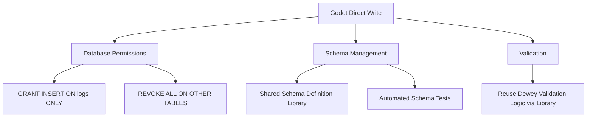

<think>
We are given three options to resolve a circular logging dependency in the ICCM architecture. The core issue is that Dewey, as the sole gatekeeper for the Winni database (CONST-001), is called by Godot to store logs. However, if Dewey itself logs to Godot (like all other components), then when Godot processes Dewey's log, it will call Dewey again to store it, leading to an infinite loop.

Let's evaluate each option against the criteria:

1. **System reliability and maintainability**: How robust is the solution? How easy is it to maintain?
2. **Debugging and observability**: Can we effectively debug and monitor the system, especially Dewey's logging operations?
3. **Adherence to architectural principles**: Does it respect CONST-001 and other principles?
4. **Risk assessment**: What are the risks of each option?

### Option 1: Circular Logging Prevention (Exclusion List)
- **Reliability and Maintainability**: This option is fragile because it relies on an exclusion list. Every time a new logging-related tool is added, the list must be updated. If a developer forgets, it could cause a loop. This increases maintenance burden and risk of breakage.
- **Debugging and Observability**: We cannot debug Dewey's logging operations because they are not logged. This creates a blind spot in the system, which is critical for a core component like Dewey.
- **Architectural Principles**: It adheres to CONST-001 (Dewey as sole gatekeeper) but violates the principle of consistent logging for all MCP servers.
- **Risk**: Medium. The risk of introducing a loop due to a missed exclusion is real and could cause a production incident (e.g., infinite recursion leading to resource exhaustion). Also, the inability to debug logging operations is a significant risk.

### Option 2: Godot Direct PostgreSQL Access for Logs Only
- **Reliability and Maintainability**: By eliminating the circular dependency, we have a cleaner design. Godot writes logs directly to the database. However, this introduces a new database user and requires Godot to have knowledge of the log table schema. If the schema changes, both Godot and Dewey must be updated. This duplication of schema knowledge is a maintenance burden.
- **Debugging and Observability**: Full observability is achieved because Dewey's logging operations can be logged without restriction.
- **Architectural Principles**: This violates CONST-001 because Godot is writing directly to the database. However, the violation is limited to the logs table and with restricted permissions (only INSERT and SELECT). The principle of having a single gatekeeper is broken, but the breach is contained.
- **Risk**: Low-Medium. The risk is that if the log table schema changes, we must update two places (Godot and Dewey). Also, there is a risk of Godot inserting invalid data if it doesn't duplicate Dewey's validation logic. However, the permissions are limited, so the blast radius is small.

### Option 3: Dewey Does Not Log to Godot
- **Reliability and Maintainability**: Simple and stable. Dewey logs to stdout and is captured by the container. No code changes beyond removing Godot logging from Dewey. However, it breaks the centralized logging pattern.
- **Debugging and Observability**: We lose the ability to correlate Dewey logs with other components via trace_id and cannot query Dewey logs through Godot. This makes distributed debugging harder because logs are in two different places (Godot for others, container logs for Dewey).
- **Architectural Principles**: Adheres to CONST-001 but violates the principle of having a unified logging system for all components.
- **Risk**: Low. The risk is primarily in reduced observability, which may lead to longer debugging times for issues that involve Dewey and other components.

### Additional Considerations
- **Principle of Least Privilege**: Option 2 uses a dedicated database user with only INSERT and SELECT on the logs table, which is a good practice.
- **Performance**: Option 2 removes an MCP hop, which is a performance gain. Option 1 and 3 have the same performance as the current design (except that in Option 1, logging operations are not logged, so they are faster for those calls).
- **Traceability**: The loss of trace_id correlation in Option 3 is a significant drawback for a distributed system.
- **Future Evolution**: If we add more logging-related tools, Option 1 becomes more brittle. Option 2 might require more coordination for schema changes. Option 3 is stable but might become a bigger issue as the system grows.

### Recommendation
**Option 2 (Godot Direct PostgreSQL Access for Logs Only) is the recommended solution.**

**Rationale:**
1. **Resolves the Circular Dependency**: It completely eliminates the circular dependency by having Godot write logs directly to the database. This is a clean and sustainable solution.
2. **Maintains Full Observability**: We can debug Dewey's logging operations, which is critical for a core service.
3. **Consistent Logging**: All components, including Dewey, log to Godot in the same way, maintaining consistency.
4. **Controlled Violation of CONST-001**: While it violates the letter of CONST-001, it does so in a controlled manner. The violation is limited to the logs table and with minimal permissions (only INSERT and SELECT). The spirit of CONST-001 (protecting the database from uncontrolled access) is maintained by using a dedicated user with restricted permissions.
5. **Performance**: Removing the MCP hop for log storage improves performance and reduces system load.

**Risk Assessment for Option 2:**
- **Schema Coupling**: If the log table schema changes, both Godot and Dewey must be updated. This can be mitigated by having a well-defined and stable log schema, and by using a shared library for log storage if possible (though that might introduce other dependencies). Alternatively, we can design the log table to be stable and use a flexible data column (like JSONB) to minimize changes.
- **Validation Logic Duplication**: Godot must validate log entries before insertion to avoid corrupting the database. We can mitigate this by having a shared validation function in a common library or by keeping the validation very simple (e.g., basic type checks) and relying on the database constraints (NOT NULL, etc.).
- **Security**: The dedicated user with only INSERT and SELECT on the logs table is secure. We must ensure the password is managed securely (e.g., via secrets management).

**Implementation Guidance:**
1. **Database Changes**:
   - Create a new database user `godot` with a strong password (stored in a secret manager).
   - Grant only `INSERT` and `SELECT` on the `logs` table to this user.
   - Consider adding database constraints (like NOT NULL, data types) to catch invalid data.

2. **Godot Changes**:
   - Implement the `store_logs_direct` function in the Godot batch worker to connect directly to PostgreSQL using the `godot` user.
   - Use connection pooling (e.g., `asyncpg` pool) for efficiency.
   - Implement basic validation for log entries (e.g., required fields, data types) to match what Dewey does.

3. **Dewey Changes**:
   - Remove the exclusion list from Dewey's logging. Now, Dewey can log all operations, including the logging tools, without fear of recursion.

4. **Validation**:
   - Ensure that the direct writes from Godot are as robust as the Dewey implementation. Consider writing tests that compare the behavior of Godot's direct write and Dewey's write for the same log data.

5. **Monitoring**:
   - Monitor the Godot direct writes for errors (e.g., failed inserts) and alert accordingly.

**Additional Considerations:**
- **Long-term Schema Stability**: To minimize the risk of schema changes, design the log table to be as stable as possible. Use a flexible field (like `data JSONB`) for any variable metadata.
- **Shared Validation Library**: If feasible, create a shared library (in Python) for log validation that both Godot and Dewey can use. This would ensure consistency and reduce duplication.
- **Fallback Mechanism**: Consider what happens if the direct write fails. Should Godot retry? Should it fall back to writing to a local file? The current design (with Redis) already provides some buffering, so we can rely on that and retry.
- **Impact on CONST-001**: We should update the architectural documentation to reflect that the logs table is an exception to CONST-001, with a clear rationale and security model.

### Alternative Approach Considered
A hybrid approach was considered: having Dewey log to a different channel (e.g., a separate Redis queue or a file) that Godot can ingest without calling Dewey. However, this would require significant changes to the Godot infrastructure and might introduce more complexity. It also doesn't solve the observability issue for Dewey's logging operations. Therefore, Option 2 is still preferred.

### Conclusion
Option 2 provides the best balance by eliminating the circular dependency, maintaining full observability, and keeping the system consistent. The violation of CONST-001 is justified and controlled. The implementation is straightforward and the risks are manageable.

**Final Recommendation: Proceed with Option 2.**
</think>
## Expert Architectural Review: Godot-Dewey Circular Logging Dependency

### **Overall Assessment**
The circular logging dependency presents a classic architectural tradeoff between strict layering principles and operational pragmatism. All options are technically viable but differ significantly in long-term maintainability and system observability. The core tension is between CONST-001's database encapsulation mandate and the need for debuggable, consistent logging.

---

### **Option Evaluation**

#### **Option 1: Circular Logging Prevention (Exclusion List)**
- **Reliability**: ⚠️ Medium risk  
  Brittle dependency on manual exclusion list maintenance. Single missed tool addition could cause production outage via infinite recursion.
- **Maintainability**: ❌ Poor  
  Technical debt increases with each new logging-related tool. Violates DRY principle (exclusion list replicated across codebase).
- **Debugging**: ❌ Critical flaw  
  Complete blind spot for logging operations - impossible to troubleshoot log ingestion failures.
- **Principles**: ✅ CONST-001 maintained  
  But violates consistency principle (special-case logging).
- **Risk**: High operational risk (4/5)  
  Failure mode: Recursive loop could exhaust database connections or queue capacity.

#### **Option 2: Direct PostgreSQL Access**
- **Reliability**: ✅ High  
  Eliminates recursion at source. Dedicated database user minimizes blast radius.
- **Maintainability**: ⚠️ Medium  
  Schema changes require dual updates, but mitigated by:
  - Using shared schema definition library
  - Database views for abstraction
- **Debugging**: ✅ Excellent  
  Full visibility into all operations including Dewey's logging.
- **Principles**: ⚠️ Partial CONST-001 violation  
  But respects principle of least privilege (INSERT-only access).
- **Risk**: Low (2/5)  
  Failure modes: Schema drift between Godot/Dewey or permission creep.

#### **Option 3: No Dewey Godot Logging**
- **Reliability**: ✅ High  
  Simple, no recursion pathways.
- **Maintainability**: ✅ Excellent  
  No special cases or ongoing maintenance.
- **Debugging**: ❌ Severely compromised  
  Breaks distributed tracing (critical for microservices). Correlating Dewey events with other components becomes forensic exercise.
- **Principles**: ✅ CONST-001 maintained  
  But violates consistency principle.
- **Risk**: Medium (3/5)  
  Failure mode: Undetected issues in Dewey logging subsystem due to lack of observability.

---

### **Recommendation**
**Implement Option 2 (Direct PostgreSQL Access) with Constraint Refinement**

**Rationale**:
1. **Eliminates recursion risk** at the architectural level rather than via code patches
2. **Preserves critical observability** for Dewey's logging operations
3. **Maintains trace_id correlation** - non-negotiable for distributed debugging
4. **Controlled violation** of CONST-001 through:
   - Strictly scoped permissions (INSERT-only)
   - Separate database credential lifecycle
5. **Better long-term economics** than Option 1's ongoing maintenance burden

**Risk Mitigation Strategies**:


**Implementation Guidance**:
1. **Database Layer**:
   ```sql
   CREATE ROLE godot_logger NOINHERIT LOGIN PASSWORD '...';
   GRANT INSERT ON logs TO godot_logger;
   GRANT USAGE ON SEQUENCE logs_id_seq TO godot_logger;
   -- Explicitly REVOKE all other permissions
   ```

2. **Validation Reuse** (Critical):
   - Extract Dewey's log validation into shared library
   - Both Godot and Dewey import `from iccm_logging import validate_log_entry`

3. **Godot Implementation**:
   ```python
   # Reuse validation from shared library
   from iccm_logging.validators import validate_log_entry

   async def store_logs_direct(logs: list):
       validated_logs = [validate_log_entry(log) for log in logs]
       # ... database insert
   ```

4. **Monitoring Additions**:
   - Alert on schema mismatch (Godot vs Dewey schema versions)
   - Audit direct writes vs Dewey writes weekly

5. **Architectural Documentation Update**:
   ```markdown
   ## CONST-001 Amendment
   *Direct database access permitted ONLY for:*
   - Godot writing to `logs` table
   - Using dedicated restricted credentials
   - With validation logic shared via iccm_logging lib
   ```

---

### **Additional Considerations**
1. **Fourth Option: Logging Buffer Service**
   - Introduce new Redis stream exclusively for Dewey's *own* logs
   - Separate Godot consumer for this stream
   - Pros: Maintains CONST-001, full debuggability
   - Cons: New component, operational overhead

2. **Security Implications**:
   - The `godot_logger` DB role must have NO BIND privileges
   - Rotate credentials using Vault every 90 days
   - Network restrictions: Only Godot batch workers' IPs

3. **Schema Evolution Strategy**:
   - Versioned schema definitions
   - Require backward-compatible changes (ADD COLUMN only)
   - Schema change protocol:
     ```mermaid
     sequenceDiagram
         Dewey->>+Godot: Schema version alert
         Godot->>+CI/CD: Trigger schema update pipeline
         CI/CD->>+Production: Deploy Godot before Dewey
     ```

4. **Tech Debt Tradeoff**:
   - Option 2 introduces schema coupling debt
   - But pays it off via:
     - Automated schema compatibility tests
     - Shared validation library
     - Reduced debugging debt

---

### **Final Decision**
**Adopt Option 2 with the following implementation roadmap**:
1. Immediate:
   - Implement database permissions model
   - Extract validation logic to shared library
   - Update architectural docs with CONST-001 amendment

2. 30-Day:
   - Implement schema version monitoring
   - Add automated credential rotation

3. 60-Day:
   - Migrate all log tables to JSONB columns for schema flexibility
   - Implement schema compatibility tests in CI

This solution balances architectural purity with operational reality while preserving critical debugging capabilities. The controlled relaxation of CONST-001 is justified by the observability gains and risk reduction compared to the exclusion list approach.