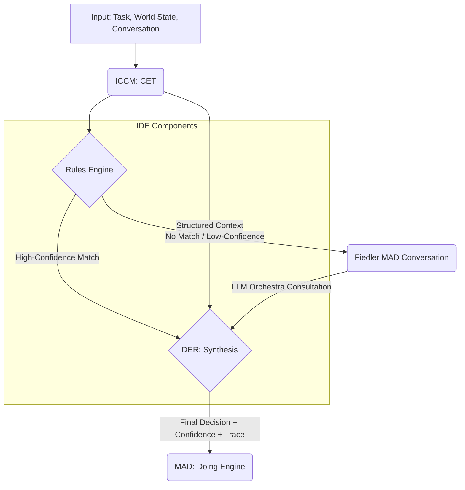

An excellent proposal from the working group. As a member of the Council of Elders, I have synthesized the provided outline into the definitive master document for the Intelligent Decision Engineering discipline. This paper establishes IDE as the second pillar of our trinity, bridging the contextual understanding of ICCM with the agentic execution of MAD.

Here is the complete synthesis.

***

# **Paper 00: Intelligent Decision Engineering (IDE)**

**Version:** 1.0 (Council Synthesis)
**Date:** 2025-10-07
**Status:** MASTER
**Repository:** Joshua/IDE
**Authored By:** Council of Elders (GPT-5, Claude Opus 4, and Council Synthesizer)

**Abstract:** This document establishes Intelligent Decision Engineering (IDE) as a formal academic and engineering discipline. IDE is concerned with the design, implementation, and verification of decision-making systems for autonomous and semi-autonomous intelligent agents. It produces two core components of the MAD (Multi-Agent Design) Thinking Engine: the **Rules Engine** for deterministic, transparent decision-making, and the **Decision Engineering Recommender (DER)** for synthesizing evidence in complex or ambiguous scenarios. By integrating symbolic AI principles with modern probabilistic models, IDE provides the architectural foundation for building agents that are not only capable but also transparent, auditable, and controllable. This paper defines the theoretical principles of IDE, specifies its core architectural components, details its integration with the ICCM (Intelligent Context and Conversation Management) and MAD disciplines, and lays out a comprehensive research and implementation roadmap. IDE completes the foundational trinity of our ecosystem: ICCM provides the *context*, IDE makes the *decision*, and MAD provides the *agent*.

---

### **Executive Summary**

1.  **Discipline Definition:** Intelligent Decision Engineering (IDE) is formally defined as the discipline responsible for the architecture of an agent's decision-making faculty. It provides the theoretical and practical frameworks for constructing hybrid reasoning systems that are transparent, auditable, and adaptable.

2.  **Core Components:** IDE contributes two critical components to the MAD Thinking Engine:
    *   **Rules Engine:** A deterministic component that applies symbolic logic, policies, and formal rules to known situations, ensuring predictability and control.
    *   **Decision Engineering Recommender (DER):** A synthesis component that evaluates outputs from the Rules Engine, structured context from the CET (Context Engineering Transformer), and, when necessary, consultations from probabilistic models (e.g., the LLM Orchestra) to produce a final, reasoned decision with an explicit confidence score.

3.  **The Trinity Completed:** IDE is the central pillar connecting context and action.
    *   **ICCM (Context):** Provides the CET, which structures and refines raw information into decision-ready context.
    *   **IDE (Decision):** Consumes this context to produce auditable, high-quality decisions.
    *   **MAD (Agent):** Assembles the complete agent, integrating the Thinking Engine (from ICCM and IDE) with a Doing Engine and State Manager.

4.  **Hybrid Architecture:** IDE's core innovation lies in its hybrid architecture, which formally separates deterministic reasoning from probabilistic synthesis. This allows MADs to operate with the speed and predictability of expert systems for routine tasks while retaining the flexibility and nuance of large language models for novel challenges.

5.  **Roadmap and Vision:** This paper establishes a hierarchical structure of 13 subsequent papers to elaborate on all facets of IDE. It also proposes a phased implementation roadmap, a comprehensive set of success metrics, and a publication strategy to establish IDE as a cornerstone discipline in the field of trustworthy AI.

---

### **1. Introduction: The Decision Problem in AI Agents**

#### **1.1 Why Decision Engineering Matters**
The proliferation of advanced AI agents has exposed a critical vulnerability in their design: the opacity of their decision-making processes. End-to-end neural network models, while powerful, often function as "black boxes," making it difficult to trace, audit, or predict their behavior. This lack of transparency is unacceptable in high-stakes domains where accountability, safety, and reliability are paramount. When an agent makes a critical error, the question "Why?" must have a definitive, verifiable answer.

Traditional symbolic AI and expert systems offered transparency but suffered from brittleness, failing to handle the ambiguity and novelty of real-world scenarios. The challenge, therefore, is not to choose between symbolic and probabilistic approaches but to synthesize them into a cohesive, principled architecture.

Decision Engineering emerges as the formal discipline dedicated to solving this problem. It treats the decision-making faculty of an agent not as an emergent property of a monolithic model, but as an engineered system composed of distinct, verifiable components. It mandates that decisions be traceable, explainable, and, where possible, deterministic.

#### **1.2 The IDE Discipline**
Intelligent Decision Engineering (IDE) is the systematic application of scientific and engineering principles to the design, construction, and operation of decision-making systems within intelligent agents.

*   **Input:** IDE components primarily consume structured, decision-ready context produced by the Context Engineering Transformer (CET) from the ICCM discipline. They also receive world state information from the agent's State Manager and the specific requirements of the current task.
*   **Process:** IDE employs a hybrid, two-stage process. First, a **Rules Engine** evaluates the context against a set of deterministic, human-authored or formally verified rules. Second, a **Decision Engineering Recommender (DER)** synthesizes the output of the Rules Engine with the broader context and, if necessary, consults probabilistic models to formulate a final recommendation.
*   **Output:** The final output is an actionable decision or recommendation, critically accompanied by a quantifiable **confidence score** and a detailed **reasoning trace**. This trace provides a complete audit trail, linking the final decision back to the specific rules, context elements, and model consultations that produced it.

#### **1.3 The Trinity of Disciplines**
IDE does not exist in isolation. It is the central, indispensable link in a trinity of disciplines that together enable the construction of robust and trustworthy Multi-Agent Design (MAD) systems.

| Discipline | Repository | Primary Output | Role in MAD Ecosystem |
| :--- | :--- | :--- | :--- |
| **ICCM** | ICCM | **CET** (Context Eng. Transformer) | **Context Engineering:** Structures raw data and conversation history into optimized, decision-ready context. Answers "What is the situation?" |
| **IDE** | Joshua | **Rules Engine + DER** | **Decision Engineering:** Consumes context to produce a transparent, auditable decision with a confidence score. Answers "What should be done?" |
| **MAD** | Joshua | **Complete Agents** | **Agent Assembly:** Integrates the Thinking Engine (CET + Rules Engine + DER + State Manager) with a Doing Engine to execute actions. Answers "How is it done?" |

This separation of concerns is fundamental. ICCM masters the problem of *understanding*, IDE masters the problem of *choosing*, and MAD masters the problem of *acting*.

#### **1.4 Document Organization**
This Paper 00 serves as the foundational charter for the IDE discipline. Section 2 outlines the theoretical principles. Section 3 provides a detailed architectural specification of the Rules Engine and DER. Section 4 proposes a hierarchical structure for all subsequent IDE papers. Sections 5, 6, and 7 detail the implementation roadmap, success metrics, and integration boundaries. Section 8 outlines a publication strategy, and Section 9 concludes by framing the key research questions that will drive the discipline forward.

---

### **2. Theoretical Foundation**

#### **2.1 Decision Engineering Principles**
The IDE discipline is founded on five core principles that must guide the design of any decision-making system within the MAD ecosystem.

1.  **Transparency:** The logic behind every decision must be inspectable. A human operator or auditing system must be able to understand the primary factors that led to a given output. This principle directly opposes the "black box" paradigm.

2.  **Auditability:** A complete, immutable reasoning trace must be generated for every significant decision. This trace must link the final action back to the specific version of the rules, the precise context from the CET, and the outputs of any probabilistic models consulted.

3.  **Controllability:** For well-understood, high-stakes scenarios, the agent's behavior must be predictable and deterministic. The Rules Engine provides this capability, acting as a set of non-negotiable guardrails on agent behavior (e.g., for safety protocols, security policies, or regulatory compliance).

4.  **Adaptability:** The system must be capable of reasoning under uncertainty and handling novel situations where deterministic rules do not apply. The DER, with its ability to consult the LLM Orchestra, provides this necessary flexibility, preventing the brittleness of purely symbolic systems.

5.  **Confidence-Awareness:** Every decision must be accompanied by an explicit, quantifiable measure of confidence. This metric is not merely a probabilistic output but a synthesized score reflecting rule certainty, model consensus, and context quality. Low-confidence decisions can trigger fallback procedures, requests for human intervention, or information-gathering sub-tasks.

#### **2.2 The Hybrid Decision Architecture**
IDE's central architectural pattern is the separation of the decision process into two distinct stages, embodied by the Rules Engine and the DER.

*   **The Rules Engine: The Realm of the Known.** This component operates on symbolic logic. It is fast, efficient, and produces predictable outputs. It is the domain of business logic, safety constraints, security policies, and standard operating procedures. Its primary function is to handle the "80%" of common, well-defined situations with perfect reliability and transparency.

*   **The DER: The Realm of the Unknown and Ambiguous.** This component is the master synthesizer. It activates when the Rules Engine yields no high-confidence match or when the situation is inherently ambiguous. The DER's role is not to replace the Rules Engine but to intelligently build upon its output (or lack thereof). It weighs evidence from multiple sources—rule partial matches, contextual clues from the CET, and expert-like intuition from the LLM Orchestra—to formulate the best possible recommendation under uncertainty.

This hybrid model provides the best of both worlds: the rigid reliability of classical expert systems and the fluid adaptability of modern neural networks.

#### **2.3 Decision Flow in the MAD Thinking Engine**
The flow of information through the IDE components is precise and ordered, ensuring a structured and auditable decision process.

**Process Steps:**

1.  **Context Engineering (ICCM):** The CET receives raw inputs and transforms them into a structured, machine-readable context object.
2.  **Deterministic Check (IDE):** The context object is passed to the Rules Engine. The engine attempts to match it against its rule set.
3.  **Branching Logic:**
    *   **Path A (Rule Match):** If a high-confidence rule or policy matches, its prescribed action is passed to the DER as a primary candidate.
    *   **Path B (No Rule Match):** If no rule matches or the matches are of low confidence, the DER is signaled to initiate a more complex synthesis process.
4.  **Probabilistic Consultation (Optional):** In Path B, the DER formulates a query and initiates a *conversation* with the Fiedler MAD to access its LLM Orchestra capability. This provides a multi-model perspective on the ambiguous situation.
5.  **Synthesis (IDE):** The DER receives all available inputs: the structured context from CET, the output from the Rules Engine (even if a "no match" signal), and the consultation results from the LLM Orchestra. It synthesizes these into a final decision, calculates a confidence score, and generates the complete reasoning trace.
6.  **Action (MAD):** The final decision package is passed to the agent's Doing Engine for execution.

#### **2.4 Relationship to Existing Decision Systems**
IDE builds upon a rich history of AI research but distinguishes itself through its specific architectural commitments within the MAD ecosystem.

*   **Classical Expert Systems (e.g., CLIPS, Drools):** IDE incorporates the strengths of these systems (transparency, symbolic reasoning) into its Rules Engine but avoids their brittleness by coupling them with the DER.
*   **Cognitive Architectures (e.g., SOAR, ACT-R):** IDE shares the goal of creating hybrid reasoning systems. However, IDE's primary innovation is the formal, explicit separation of the *context engineering* step (ICCM/CET) from the *decision engineering* step, and the explicit definition of the DER as a dedicated *synthesis* component. Furthermore, its native integration with a conversational, multi-agent framework (MAD) is unique.
*   **Modern AI (Reinforcement Learning, Neural Networks):** IDE does not replace these models; it orchestrates them. The LLM Orchestra, consulted by the DER, is the designated place for such probabilistic systems. IDE provides the structured, symbolic scaffolding that makes their use safe, controllable, and auditable.

---

### **3. Architecture Components**

#### **3.1 Rules Engine Specification**
The Rules Engine is the deterministic heart of the Thinking Engine. Its design must prioritize speed, verifiability, and clarity.

*   **Input:**
    *   `StructuredContext`: A standardized data object provided by the CET.
    *   `WorldState`: Relevant state variables from the agent's State Manager.

*   **Processing:** The engine executes a match-evaluate-act cycle against its rule base. The core logic involves pattern matching the input data against the conditions (`LHS` - Left-Hand Side) of its rules and, upon a successful match, preparing the actions (`RHS` - Right-Hand Side).

*   **Output:** A `RuleEngineOutput` object containing:
    *   `matches`: A list of matched rules, each with its own intrinsic certainty factor.
    *   `status`: An enum (`HIGH_CONFIDENCE_MATCH`, `LOW_CONFIDENCE_MATCH`, `NO_MATCH`).
    *   `trace`: A log of the rules that were evaluated and why they did or did not fire.

*   **Implementation Approaches (Answering Research Question #1):** A single rule representation is unlikely to be optimal for all MADs. IDE therefore proposes a modular design where the Rules Engine can be implemented using one of several formalisms, depending on the agent's domain:
    *   **Decision Trees/Tables:** Ideal for simple, branching logic that is easily visualizable and verifiable.
    *   **Production Rule Systems (e.g., Rete algorithm):** Suited for complex situations with many interacting rules and a need for efficient, stateful pattern matching.
    *   **Formal Logic (e.g., Datalog, Answer Set Programming):** Best for domains requiring rigorous logical inference, constraint satisfaction, and formal verification of properties like safety and termination.
    *   **Policy Engines (e.g., OPA, Cedar):** Excellent for security, authorization, and compliance-driven decisions, where policies are managed and updated independently of the agent's core logic.

The choice of implementation is a critical design decision for the MAD architect, guided by the principles of the IDE discipline.

#### **3.2 DER (Decision Engineering Recommender) Specification**
The DER is the cognitive synthesizer of the Thinking Engine. It excels at reasoning under uncertainty and integrating disparate forms of evidence.

*   **Input:**
    *   `StructuredContext` (from CET)
    *   `RuleEngineOutput` (from Rules Engine)
    *   `WorldState` (from State Manager)
    *   `TaskRequirements`
    *   `LLMOrchestraConsultation` (optional, from Fiedler MAD)

*   **Processing (Answering Research Question #2):** The DER's core algorithm is a process of evidence synthesis.
    1.  **Triage:** It first examines the `RuleEngineOutput.status`. If `HIGH_CONFIDENCE_MATCH`, it gives strong preference to the rule's prescribed action, using other inputs mainly for validation and trace generation.
    2.  **Hypothesis Generation:** If the status is `NO_MATCH` or `LOW_CONFIDENCE_MATCH`, the DER generates a set of candidate decisions. These can be sourced from partial rule matches, heuristics, or a preliminary query to the LLM Orchestra.
    3.  **Evidence Fusion:** For each hypothesis, the DER gathers and weighs supporting and refuting evidence from all its inputs. This is the synthesis step. A potential algorithm could be a Bayesian network or a weighted scoring model that combines rule certainty, LLM vote distribution, and contextual relevance.
    4.  **Confidence Calculation (Answering Research Question #3):** A final confidence score (0.0 to 1.0) is computed. This score is not a simple probability but a calibrated metric reflecting the overall quality and coherence of the evidence. For example: `Confidence = f(RuleCertainty, LLMConsensus, ContextFreshness, TaskClarity)`. Calibration is performed by comparing predicted confidence with the actual success rate of decisions over time.

*   **Output:** A `FinalDecision` object containing:
    *   `recommendedAction`: The chosen action or response.
    *   `confidenceScore`: The calculated confidence score.
    *   `reasoningTrace`: A structured, human-readable explanation of the decision, citing the specific evidence used.
    *   `fallbackOptions`: A list of alternative actions if the confidence score is below a predefined threshold.

#### **3.3 Integration with CET (ICCM)**
The boundary between ICCM and IDE is a formal data contract.
*   CET's responsibility is to provide a clean, well-structured, and predictable `StructuredContext` object. The schema of this object is the API.
*   IDE's components rely on this schema. The Rules Engine's patterns and the DER's synthesis logic are written against this stable representation of the world.
*   A feedback loop exists: If the DER consistently finds the context insufficient for high-confidence decisions in certain situations, this signals a need to refine the CET's transformation logic within the ICCM discipline.

#### **3.4 Integration with LLM Orchestra (Fiedler MAD)**
The DER's interaction with the Fiedler MAD is a formal *conversation*, not a simple function call.
*   **Trigger:** The conversation is initiated only when the DER's internal synthesis process fails to reach a high-confidence conclusion based on rules and existing context.
*   **Protocol:** The DER sends a `ConsultationRequest` message containing the ambiguous context and a specific question. Fiedler replies with a `ConsultationResponse` containing the synthesized outputs from multiple LLMs, including their agreements, disagreements, and individual rationales.
*   **Role:** The LLM Orchestra serves as a panel of probabilistic experts, not as the final decider. The DER retains ultimate authority, responsible for synthesizing the orchestra's "opinions" with the hard constraints from the Rules Engine. This ensures that even probabilistic reasoning is bounded by deterministic safeguards.

---

### **4. Hierarchical Paper Structure**

To fully elaborate the IDE discipline, a hierarchical series of papers is proposed. This structure ensures a logical progression from foundational principles to advanced applications. (Answering Research Question #7)

**Act 1: Foundations**
*   **Paper 01: The IDE Primary.** Expands this document, providing a comprehensive overview of the discipline, its principles, and its place in the trinity.
*   **Paper 02: Rules Engine Architectures and Formalisms.** A deep dive into the implementation choices for the Rules Engine, comparing production systems, logic programming, and policy engines with performance benchmarks.

**Act 2: Decision Synthesis and Reasoning**
*   **Paper 03: The Decision Engineering Recommender (DER).** A complete specification of the DER, including reference algorithms for evidence synthesis and hypothesis generation.
*   **Paper 04: Hybrid Reasoning Patterns.** Catalogs common patterns for integrating rule-based and model-based reasoning, such as "Rules as Validators," "Rules as Generators," and "Rules for Exception Handling."
*   **Paper 05: Confidence Quantification and Calibration.** Details methodologies for calculating and calibrating the `confidenceScore`, ensuring it is a reliable predictor of decision success.

**Act 3: Integration and Ecosystem**
*   **Paper 06: The CET-IDE Interface.** Formally defines the data contract and interaction protocols between the Context Engineering Transformer and the IDE components.
*   **Paper 07: LLM Orchestra Consultation Protocols.** Specifies the conversational patterns and data structures for interaction between the DER and the Fiedler MAD.

**Act 4: Advanced Topics and Future Directions**
*   **Paper 08: Learning and Rule Refinement.** Explores mechanisms for learning new rules or refining existing ones based on the outcomes of DER decisions, addressing the challenge of safe, online adaptation. (Answering Research Question #4)
*   **Paper 09: Multi-Agent Decision Coordination.** Defines protocols for groups of MADs to make consistent and coherent decisions, covering topics like consensus algorithms and distributed decision-making. (Answering Research Question #5)
*   **Paper 10: Formal Verification in IDE Systems.** Investigates the application of formal methods to prove safety, liveness, and security properties of the Rules Engine, particularly for high-stakes applications. (Answering Research Question #6)

**Act 5: Production and Operations**
*   **Paper 11: Observability for Decision Systems.** Defines the metrics, logs, and traces required for effective monitoring, debugging, and auditing of IDE components in production.
*   **Paper 12: Performance Optimization for Real-Time IDE.** Addresses the challenges of ensuring low-latency decision-making in time-critical applications.
*   **Paper 13: IDE for Explainable AI (XAI).** Details how the `reasoningTrace` generated by the DER can be used to produce human-centric explanations for agent behavior.

---

### **5. Implementation Roadmap**

The implementation of IDE components will proceed in three phases, validated through their integration into the Hopper and Grace Full MADs.

#### **Phase 1: Foundation (Target: First-generation Hopper/Grace)**
*   **Deliverable 1:** A baseline Rules Engine using a simple but robust formalism (e.g., Decision Trees or a lightweight production rule system).
*   **Deliverable 2:** A foundational DER that can process Rule Engine output and initiate conversations with the LLM Orchestra for fallback reasoning.
*   **Deliverable 3:** Basic confidence scoring and reasoning trace generation.
*   **Validation:** Successful integration into the Hopper and Grace Thinking Engines, demonstrating the complete CET -> IDE -> Doing Engine flow for a set of benchmark tasks.

#### **Phase 2: Refinement and Learning**
*   **Deliverable 1:** An enhanced Rules Engine with support for more complex formalisms and initial tooling for formal verification.
*   **Deliverable 2:** A more sophisticated DER with advanced evidence synthesis algorithms and a calibrated confidence model.
*   **Deliverable 3:** Implementation of a feedback loop for offline rule refinement, allowing human architects to improve the Rules Engine based on analysis of DER decisions (Paper 08).

#### **Phase 3: Advanced Capabilities and Scaling**
*   **Deliverable 1:** Protocols for multi-agent decision coordination (Paper 09), enabling Hopper and Grace to collaborate on complex tasks.
*   **Deliverable 2:** High-performance, low-latency versions of the IDE components for real-time applications (Paper 12).
*   **Deliverable 3:** Mature observability and explainability tooling for production monitoring (Papers 11, 13).

---

### **6. Success Metrics**

The success of the IDE discipline will be measured by a balanced scorecard of technical, auditability, and system-level metrics.

#### **6.1 Technical Metrics**
*   **Decision Accuracy:** The percentage of decisions that achieve the desired outcome, measured against domain-specific benchmarks.
*   **Decision Latency:** The end-to-end time from receiving context from the CET to outputting a final decision.
*   **Rule Coverage:** The percentage of decisions handled with high confidence by the Rules Engine alone. A high coverage indicates a mature and predictable system.
*   **LLM Orchestra Invocation Rate:** The percentage of decisions that require consultation with Fiedler. A decreasing rate over time for a stable domain suggests successful rule learning/authoring.
*   **Confidence Calibration Error:** The difference between the average confidence score and the actual accuracy of decisions, measured across confidence bins.

#### **6.2 Auditability and Trust Metrics**
*   **Trace Completeness:** The percentage of decisions for which a full, verifiable reasoning trace is successfully generated.
*   **Explanation Quality Score:** Human evaluation of the clarity and usefulness of the generated reasoning traces.
*   **Decision Reproducibility:** The ability to produce the exact same decision given the identical context and state (critical for deterministic paths).

#### **6.3 System Integration Metrics**
*   **CET-IDE Schema Adherence:** The rate of successful parsing of context from CET, indicating the stability of the interface.
*   **Decision-to-Action Success Rate:** The percentage of IDE-produced decisions that are successfully executed by the MAD's Doing Engine.
*   **Fallback Rate:** The percentage of decisions where the DER's confidence is below the action threshold, indicating the system's ability to recognize its own limitations.

---

### **7. Relationship to ICCM and MAD**

#### **7.1 ICCM → IDE Boundary**
The relationship is that of a specialized producer to a specialized consumer.
*   **ICCM Produces:** A clean, structured, and semantically rich `StructuredContext` object via the CET.
*   **IDE Consumes:** This context as the primary fuel for its decision-making processes.
*   **The Interface:** The schema of the `StructuredContext` object is the formal contract. This allows the disciplines to evolve independently, provided the contract is honored.

#### **7.2 IDE → MAD Boundary**
The relationship is that of a component supplier to a system integrator.
*   **IDE Produces:** The core reasoning components of the Thinking Engine: the Rules Engine and the DER.
*   **MAD Consumes:** These components and assembles them with the CET (from ICCM), a State Manager, and a Doing Engine to create a complete, functional agent.
*   **The Interface:** The schema of the `FinalDecision` object is the formal contract.

#### **7.3 The Complete MAD Thinking Engine**
The Thinking Engine of a Full MAD is the synthesis of these efforts. It is not a monolithic block but an assembly of specialized components from distinct disciplines.

**MAD Thinking Engine = CET (from ICCM) + Rules Engine (from IDE) + DER (from IDE) + State Manager (from MAD)**

This composite architecture is the cornerstone of the entire MAD ecosystem, enabling agents that can perceive, reason, and decide in a structured, transparent, and robust manner.

---

### **8. Publication Strategy**

#### **8.1 Venue Targeting**
To establish IDE as a serious academic discipline, we will target top-tier conferences and journals, tailoring submissions to the venue's focus:
*   **Core AI and Reasoning:** AAAI, IJCAI, KR
*   **Planning and Decision Systems:** ICAPS, AAMAS
*   **AI Safety, Ethics, and Interpretability:** SafeAI, FAccT, XAI workshops
*   **Software Engineering and Architecture:** ICSE, FSE (for papers on the formal specification and verification of IDE components)

#### **8.2 Timeline**
*   **Year 0:** Publication of this Paper 00 and the core "Act 1" papers (01, 02).
*   **Year 1:** Publication of "Act 2" and "Act 3" papers, detailing the DER and integration protocols.
*   **Year 2 and beyond:** Publication of "Act 4" and "Act 5" papers on advanced topics, driven by findings from the Hopper and Grace implementations.

#### **8.3 Open Source Strategy**
*   **Reference Implementations:** All core IDE components will have open-source reference implementations in the Joshua repository.
*   **Benchmarks:** We will develop and release standardized benchmark suites for evaluating the performance and auditability of IDE systems (Answering Research Question #9).
*   **Case Studies:** The Hopper and Grace MADs will serve as premier, open-source case studies demonstrating the real-world application and benefits of the IDE approach.

---

### **9. Research Questions and Open Problems**
This paper establishes the foundations of IDE, but it also opens a rich field of inquiry. The following questions represent the discipline's forward-looking research agenda.

1.  **Optimal Rule Formalism:** While we propose a modular approach, is there a hybrid rule representation that offers the best balance of performance, expressiveness, and verifiability for general-purpose MADs?
2.  **Advanced Synthesis Algorithms:** What are the most effective and computationally tractable algorithms for the DER to synthesize evidence from symbolic, probabilistic, and contextual sources? How can causal inference be integrated?
3.  **Confidence Calibration in Dynamic Environments:** How can we ensure that confidence scores remain well-calibrated as the agent's environment and the underlying language models drift over time?
4.  **Safe Online Rule Learning:** What reinforcement learning or other online learning frameworks can enable a MAD to safely learn and adapt its internal rules from experience without risking catastrophic failures or value drift?
5.  **Scalable Multi-Agent Decision-Making:** Beyond simple protocols, what formalisms (e.g., game theory, mechanism design) are needed to guarantee optimal and consistent collective decisions among a large number of interacting MADs?
6.  **Compositional Verification:** How can we develop techniques to formally verify properties of the composite system (CET + Rules Engine + DER), not just the Rules Engine in isolation?
7.  **Real-World Applicability and Domain Adaptation:** What are the primary domains that stand to benefit most from IDE's structured approach (e.g., finance, healthcare, robotics)? What domain-specific adaptations are necessary? (Answering Research Question #10)
8.  **Cognitive Cost of Transparency:** Is there a fundamental trade-off between decision-making performance (speed/accuracy) and the generation of high-quality, human-readable reasoning traces? How can we optimize this trade-off?
9.  **Novel Validation Strategies:** Beyond standard benchmarks, what novel validation strategies (e.g., adversarial testing, simulation-based verification) are needed to fully stress-test the safety and robustness of IDE-based agents?
10. **The Human-in-the-Loop:** What are the optimal interfaces and interaction patterns for a human to supervise, override, or collaborate with an IDE-driven agent, particularly in low-confidence scenarios?

---

### **10. Conclusion**

Intelligent Decision Engineering is not merely a new set of tools, but a new philosophy for building intelligent agents. It asserts that true intelligence is inseparable from reasoned, justifiable choice. By providing a formal architecture for hybrid, auditable, and confidence-aware decision-making, IDE moves beyond the dichotomy of brittle symbolic systems and opaque neural networks.

With the establishment of this discipline, we complete the foundational trinity of our ecosystem. ICCM provides the perceptual foundation of context. MAD provides the physical or digital embodiment for action. And IDE provides the cognitive core—the bridge between perception and action, the faculty of reason itself. The principles and architectures laid out in this document provide a clear path toward the creation of agents that are not only powerful and autonomous but also trustworthy, transparent, and aligned with human values.

---

### **Appendix: Terminology Reference**

*   **Conversation:** Communication between MADs (not "service call" or "API request").
*   **Capability:** What a MAD provides to others (not "service" or "function").
*   **Half-MAD:** MAD with a minimal Thinking Engine (e.g., Fiedler, Dewey).
*   **Full MAD:** An agent with a complete Thinking Engine (CET + Rules Engine + DER + State Manager) and a Doing Engine (e.g., Hopper, Grace).
*   **CET:** Context Engineering Transformer (primary output of the ICCM discipline).
*   **DER:** Decision Engineering Recommender (synthesis component from the IDE discipline).
*   **LLM Orchestra:** The multi-model consultation capability provided by the Fiedler MAD.
*   **Rules Engine:** The deterministic decision component from the IDE discipline.
*   **State Manager:** The memory and world model component within the MAD architecture.
*   **Thinking Engine:** The cognitive core of a MAD, composed of CET, Rules Engine, DER, and State Manager.
*   **Doing Engine:** The domain-specific execution component of a MAD.
