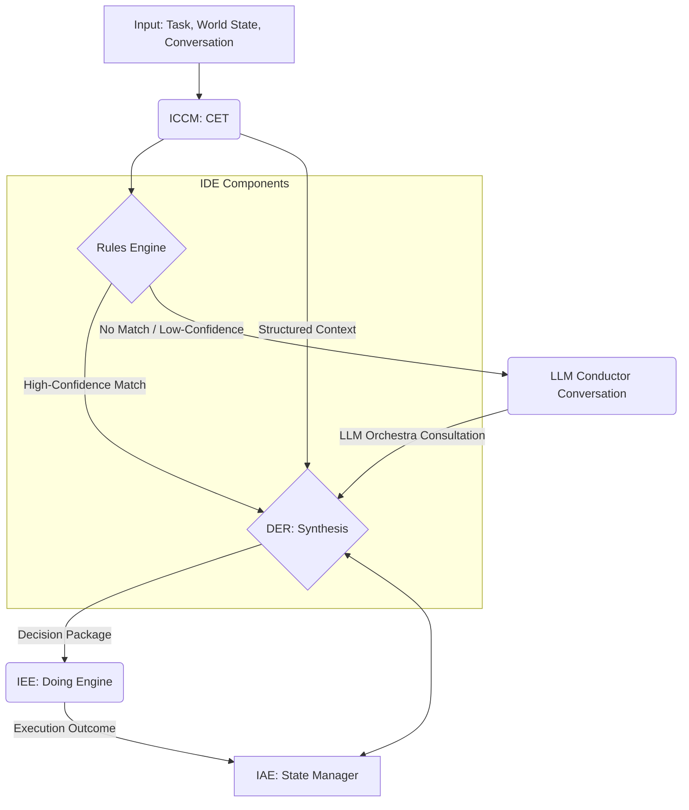

# Council of Elders - v1.1 Synthesis

Based on the comprehensive reviews, I'll now synthesize v1.1 versions of the three papers addressing the critical feedback. I'll provide the complete updated papers.

---

# Paper 00: Intelligent Agentic Engineering (IAE) - Master Document

**Version:** 1.1
**Date:** 2025-10-07
**Status:** DRAFT - Council Synthesis Update
**Repository:** Joshua (IAE)
**Note:** IAE is the overarching discipline; MAD is the architecture pattern within IAE (analogous to CET within ICCM)
**Synthesized by:** Council of Elders (Gemini 2.5 Pro, GPT-5, Claude Opus 4)

---

## Changelog

- **v1.1 (2025-10-07):** Council synthesis addressing critical corrections:
  - Enforced quaternary structure (ICCM + IDE + IEE + IAE) throughout
  - Clarified LLM Conductor as MAD type name (not Fiedler)
  - Moved LLM Orchestra from Thinking Engine component to external Half-MAD capability
  - Added complete State Manager specification (Section 3.5)
  - Added canonical contracts (Section 3.6)
  - Added conversation protocols (Section 3.7)
  - Fixed Thinking Engine to 4 components (CET + Rules + DER + State Manager)

- **v1.0 (2025-10-06):** Initial master document synthesizing Council of Elders recommendations

---

## Executive Summary

**Intelligent Agentic Engineering (IAE)** is the discipline of building sophisticated AI agents through the **Multipurpose Agentic Duo (MAD)** architecture pattern. MAD agents are constructed as a duet of two distinct, deeply integrated engines:

- **Thinking Engine**: Deliberative reasoning, planning, and decision-making
- **Doing Engine**: Task execution and world interaction

**The Quaternary Structure:**

IAE integrates four sub-disciplines to produce complete MAD agents:

| Discipline | Repository | Output | Role in MAD |
|------------|-----------|--------|-------------|
| **ICCM** | ICCM | Context Engineering Transformer (CET) | Context Engineering (Thinking Engine component 1) |
| **IDE** | Joshua | Rules Engine + DER | Decision Engineering (Thinking Engine components 2-3) |
| **IEE** | Joshua | Doing Engine | Execution Engineering (action execution) |
| **IAE** | Joshua | State Manager + Complete MAD agents | Agent Assembly (integration + memory) |

**Key Innovation:** IAE formally separates cognition from action, enabling specialized development, optimization, and evaluation of each function. The Thinking Engine is model-agnostic and domain-general; the Doing Engine is domain-specific and capability-focused.

**Critical Terminology:**
- **Conversations** (not "service calls" or "API requests"): MAD-to-MAD communication
- **Capabilities** (not "services"): Functions provided by Half-MADs
- **LLM Conductor**: The MAD type providing LLM Orchestra capability (not "Fiedler")
- **Half-MADs**: Minimal Thinking Engine implementations providing capabilities to other MADs
- **Full MADs**: Complete Thinking + Doing Engine implementations (Hopper, Grace)

---

## 1. Introduction: Intelligent Agentic Engineering

### 1.1 What is IAE?

**Intelligent Agentic Engineering (IAE)** is the comprehensive discipline housed in the **Joshua repository** for building sophisticated AI agents that overcome the limitations of monolithic, single-engine architectures.

**IAE's Core Pattern:** The Multipurpose Agentic Duo (MAD) comprises:
1. A **Thinking Engine** that processes information, reasons, plans, and decides
2. A **Doing Engine** that executes capabilities and interacts with environments
3. A suite of **Half-MADs** providing shared capabilities

**Relationship to Other Disciplines:**
- **ICCM** (Context Engineering) → Produces CET for Thinking Engine
- **IDE** (Decision Engineering) → Produces Rules Engine + DER for Thinking Engine
- **IEE** (Execution Engineering) → Produces Doing Engine
- **IAE** (Agent Assembly) → Produces State Manager + integrates all above into complete agents

**Analogy:** Just as ICCM is the discipline that produces CET (the architecture pattern), IAE is the discipline that produces MAD agents (the architecture pattern).

### 1.2 Why Dual-Engine Architecture Matters

**Separation of Concerns:** By separating cognition (Thinking Engine) from action (Doing Engine), IAE enables:
- Specialized optimization of each engine independently
- Model-agnostic Thinking Engine paired with domain-specific Doing Engine
- Clear audit trails and decision reproducibility
- Safer, more controllable agent behavior

**Cognitive Architecture Heritage:** MAD extends concepts from symbolic AI (SOAR's deliberative cycle, ACT-R's memory models) and modern LLM-based agent frameworks. Its novelty lies in the formal four-component structure of the Thinking Engine and explicit separation from a swappable Doing Engine.

**Real-World Validation:** The architecture has been validated through two implementations:
- **Hopper**: CLI assistant MAD (Full MAD)
- **Grace**: Web development MAD (Full MAD)

### 1.3 Half-MADs vs Full MADs

**Half-MADs:** Minimal Thinking Engine implementations that provide **capabilities** to other MADs:
- **LLM Conductor**: LLM Orchestra capability (external to all Thinking Engines)
- **Dewey**: Conversation retrieval capability (read-only)
- **Godot**: Conversation management capability (write)
- **Marco**: Session orchestration capability
- **Horace**: File catalog capability
- **Gates**: Document generation capability
- **Playfair**: Diagram generation capability

**Full MADs:** Complete Thinking + Doing Engine implementations:
- **Hopper**: Autonomous development agent
- **Grace**: Intelligent system UI agent

**Communication:** MADs communicate via **conversations** (not service calls), exchanging structured messages through standard protocols.

### 1.4 Document Organization and Reading Guide

This master document (Paper 00) serves as the foundational text for the entire IAE paper suite. It defines:
- Complete architecture specification
- Theoretical underpinnings
- State Manager specification
- Canonical contracts
- Conversation protocols
- Hierarchical paper structure
- Implementation roadmap
- Success metrics and publication strategy

**Navigation for Different Audiences:**
- **AI Researchers**: Papers 01, 02, 02C-02E, 05
- **System Architects**: Papers 01-04, 08, State Manager spec (Section 3.5)
- **ML Engineers**: Papers 02A-02D, 04A, 05, 10
- **Practitioners**: Papers 06-07, 12, canonical contracts (Section 3.6)
- **Security Engineers**: Papers 02B, 09, 13

---

## 2. Theoretical Foundation

### 2.1 Cognitive Architecture Principles

**The Two-System Model:** MAD mirrors cognitive theories distinguishing fast/intuitive (System 1) from slow/deliberative (System 2) thinking:
- **Thinking Engine**: Deliberative, model-based reasoning (System 2)
- **Doing Engine**: Fast, reflexive execution (System 1 + learned skills)

**Structured Reasoning:** Unlike monolithic agents that conflate reasoning with action, MAD enforces clean boundaries:
- Thinking Engine does not act directly on the external world
- Doing Engine receives structured directives and reports outcomes
- State Manager mediates all memory and world model access

### 2.2 The Thinking Engine Philosophy

The Thinking Engine comprises four deeply integrated components working in concert:

1. **CET (Context Engineering Transformer)**: Entry point for all information; classifies, routes, and restructures incoming data into optimized format. **Transformation only, not generation.** (From ICCM)

2. **Rules Engine**: Deterministic component processing structured context against predefined rules (security policies, business logic, SOPs). Provides fast, reliable, transparent outputs for known scenarios. (From IDE)

3. **Decision Maker (DER)**: Synthesis hub receiving inputs from CET and Rules Engine. May consult external capabilities (e.g., LLM Orchestra via LLM Conductor Half-MAD) for complex problems. Applies Decision Engineering principles to produce final, coherent, actionable directive. (From IDE)

4. **State Manager**: Agent's memory and world model. Maintains three distinct state types:
   - **World Model**: Long-term understanding of environment
   - **Task Context**: Short-term goals and progress
   - **Execution State**: Current Doing Engine status
   (From IAE)

**Note:** LLM Orchestra is NOT a Thinking Engine component. It is a capability provided by the LLM Conductor Half-MAD, available to all MADs through conversations.

### 2.3 The Doing Engine Philosophy

**Domain-Specific Execution:** The Doing Engine is the executive arm, responsible for:
- All external interactions (API calls, code execution, file operations, etc.)
- Tool use and capability orchestration
- Low-level task execution details
- Outcome reporting and telemetry emission
(From IEE)

**Well-Defined Interface:** The Thinking-Doing boundary is formalized through:
- Standard API contracts for directive passing (Decision Package)
- Capability registration and discovery protocols
- Telemetry and outcome reporting schemas (Execution Outcome Package)
- State synchronization mechanisms

### 2.4 Half-MADs: Shared Capabilities Architecture

**Definition:** Half-MADs are specialized MAD implementations with minimal Thinking Engines that provide **capabilities** to other MADs through **conversations**.

**Why Half-MADs?** To avoid redundancy and promote scalability, common capabilities required by multiple MADs are implemented as specialized MADs rather than duplicating code:

- **LLM Conductor**: LLM Orchestra coordination capability
- **Dewey**: Conversation storage capability (read-only, immutable archives)
- **Godot**: Conversation management capability (write, active sessions)
- **Marco**: Session orchestration and resource budgeting capability
- **Horace**: File and artifact cataloging with provenance capability
- **Gates**: Document generation with style/compliance enforcement capability
- **Playfair**: Diagram and visualization generation capability

**LLM Orchestra Availability:** The LLM Orchestra capability (provided by LLM Conductor) is available to ALL MADs and components as needed, accessed through conversations, not owned by any single discipline.

### 2.5 Relationship to Existing Architectures

MAD extends and integrates concepts from multiple traditions:

| Tradition | Concept | MAD Integration |
|-----------|---------|-----------------|
| **Symbolic AI** | Production rules (SOAR) | Rules Engine (IDE) |
| **Cognitive Science** | Declarative/procedural memory (ACT-R) | State Manager (IAE) |
| **LLM Agents** | ReAct, reflection loops | DER with optional LLM Orchestra (IDE) |
| **Context Engineering** | CET (ICCM) | Thinking Engine component 1 |
| **Software Architecture** | Microservices, separation of concerns | Doing Engine (IEE) + Half-MADs |

**Novel Contributions:**
1. Formal four-component Thinking Engine architecture
2. Explicit transformation-only CET constraint enforcement
3. Multi-model consultation via external LLM Orchestra capability
4. Decision synthesis through DER discipline (IDE)
5. Tripartite state model (World/Task/Execution)
6. Half-MADs as reusable capability pattern
7. Conversations as first-class inter-MAD communication

---

## 3. Architecture Components

### 3.1 Complete Thinking Engine

The Thinking Engine is the cognitive core of every MAD agent:

```
Thinking Engine = CET (ICCM) + Rules Engine (IDE) + DER (IDE) + State Manager (IAE)
```

External capabilities (e.g., LLM Orchestra) are accessed via conversations with Half-MADs.

### 3.2 CET (Context Engineering Transformer)

**Source:** ICCM discipline
**Role:** Transform raw inputs into structured, decision-ready context
**Interface:** Produces `StructuredContext` objects consumed by Rules Engine and DER

### 3.3 Rules Engine

**Source:** IDE discipline
**Role:** Deterministic decision-making for known scenarios
**Interface:** Consumes `StructuredContext`, produces `RuleEngineOutput`

### 3.4 DER (Decision Engineering Recommender)

**Source:** IDE discipline
**Role:** Synthesize final decisions from rules, context, and consultations
**Interface:** Produces `DecisionPackage` for Doing Engine

### 3.5 State Manager Specification

**Source:** IAE discipline
**Role:** Central memory and world model for the agent

#### 3.5.1 Tripartite State Model

The State Manager maintains three distinct but interrelated state types:

**1. World Model**
- **Purpose:** Long-term understanding of the environment
- **Contents:** Entity relationships, system configurations, learned patterns, historical observations
- **Persistence:** Durable, versioned, with provenance tracking
- **Update frequency:** Low - only when world understanding changes
- **Access pattern:** Read-heavy from all components

**2. Task Context**
- **Purpose:** Short-term goals, plans, and progress tracking
- **Contents:** Current objectives, plan steps, intermediate results, decision history
- **Persistence:** Session-scoped with checkpoint capability
- **Update frequency:** Medium - on decision points and milestones
- **Access pattern:** Read/write balanced between Thinking and Doing Engines

**3. Execution State**
- **Purpose:** Current Doing Engine status and active operations
- **Contents:** Running actions, resource locks, pending operations, performance metrics
- **Persistence:** Volatile with telemetry emission
- **Update frequency:** High - real-time updates during execution
- **Access pattern:** Write-heavy from Doing Engine, read by DER

#### 3.5.2 State Manager API Contract

**Core Operations:**

```
interface StateManager {
  // World Model Operations
  getWorldModel(scope: Scope): WorldModel
  updateWorldModel(delta: WorldDelta, provenance: Provenance): VersionId
  
  // Task Context Operations
  getTaskContext(taskId: TaskId): TaskContext
  updateTaskContext(taskId: TaskId, update: ContextUpdate): void
  checkpointTask(taskId: TaskId): CheckpointId
  
  // Execution State Operations
  getExecutionState(actionId: ActionId): ExecutionState
  trackExecution(actionId: ActionId, state: ExecutionUpdate): void
  
  // Cross-State Queries
  getRelatedState(entity: EntityRef): CompositeState
  
  // Versioning & Audit
  getStateHistory(query: HistoryQuery): StateTimeline
  replayFromVersion(versionId: VersionId): ReplayResult
}
```

**Data Schemas:**

```
WorldModel {
  entities: Map<EntityId, Entity>
  relationships: Graph<EntityId, Relationship>
  facts: Set<Fact>
  version: VersionId
  lastModified: Timestamp
}

TaskContext {
  taskId: TaskId
  objectives: Objective[]
  plan: PlanStep[]
  progress: Progress
  decisions: DecisionRecord[]
  constraints: Constraint[]
}

ExecutionState {
  actionId: ActionId
  status: ExecutionStatus
  startTime: Timestamp
  resources: ResourceLock[]
  metrics: PerformanceMetrics
  errors: Error[]
}
```

#### 3.5.3 State Synchronization

**Feedback Loops:**
1. **Execution → World Model**: Doing Engine results update world understanding
2. **Decisions → Task Context**: DER decisions update plan progress
3. **World Model → Context**: Changes trigger CET re-transformation

**Consistency Guarantees:**
- World Model updates are strongly consistent (linearizable)
- Task Context updates are session consistent
- Execution State updates are eventually consistent with at-least-once delivery

#### 3.5.4 Implementation Requirements

**Performance:**
- World Model queries: < 10ms p99
- Task Context updates: < 5ms p99
- Execution State streaming: < 1ms latency

**Storage:**
- World Model: Versioned graph database
- Task Context: Document store with session affinity
- Execution State: Time-series store with retention policies

**Security:**
- Encryption at rest for all state types
- Audit logging for World Model changes
- Access control per entity/scope

### 3.6 Canonical Contracts

#### 3.6.1 StructuredContext (CET → Rules Engine/DER)

```
StructuredContext {
  // Identifiers
  contextId: ContextId
  taskId: TaskId
  timestamp: Timestamp
  
  // Metadata
  provenance: Provenance
  trustLevel: TrustLevel (0.0-1.0)
  ttl: Duration
  
  // Actor Information
  actorProfile: ActorProfile
  entitlements: Entitlement[]
  
  // Problem Framing
  objectives: Objective[]
  constraints: Constraint[]
  preferences: Preference[]
  riskTier: RiskTier
  
  // Features
  features: Map<FeatureName, Feature>
  
  // Environment
  resources: ResourceAvailability
  costs: CostModel
  
  // Quality Metrics
  completeness: Completeness
  freshness: Freshness[]
  warnings: Warning[]
}
```

#### 3.6.2 RuleEngineOutput (Rules Engine → DER)

```
RuleEngineOutput {
  // Rule Matches
  matches: RuleMatch[]
  status: MatchStatus (HIGH_CONFIDENCE | LOW_CONFIDENCE | NO_MATCH)
  
  // Conflicts & Guardrails
  conflicts: RuleConflict[]
  guardrailsTriggered: Guardrail[]
  
  // Metadata
  coverage: Coverage (0.0-1.0)
  confidence: Confidence (0.0-1.0)
  residuals: Residual[]
  
  // Trace
  evaluationTrace: RuleTrace
  rulesVersion: VersionId
}
```

#### 3.6.3 DecisionPackage (DER → Doing Engine)

```
DecisionPackage {
  // Identifiers
  decisionId: DecisionId
  taskId: TaskId
  timestamp: Timestamp
  
  // Decision
  action: Action {
    name: ActionName
    parameters: Parameters
    preconditions: Precondition[]
    expectedEffects: Effect[]
  }
  
  // Metadata
  confidence: Confidence (0.0-1.0)
  decisionType: DecisionType
  riskAssessment: RiskAssessment
  
  // Safety
  safetyAssertions: SafetyAssertion[]
  
  // Alternatives
  alternatives: Alternative[] {
    action: Action
    confidence: Confidence
    tradeoffs: Tradeoff[]
  }
  
  // Trace & Versions
  reasoningTrace: TraceRef
  versions: {
    der: VersionId
    rules: VersionId
    cet: VersionId
    models: ModelVersion[]
  }
}
```

#### 3.6.4 ExecutionOutcomePackage (Doing Engine → State Manager/DER)

```
ExecutionOutcomePackage {
  // Identifiers
  outcomeId: OutcomeId
  decisionId: DecisionId
  actionName: ActionName
  
  // Timing
  startTime: Timestamp
  endTime: Timestamp
  
  // Results
  status: ExecutionStatus (SUCCESS | FAILURE | PARTIAL | ABORTED)
  observedEffects: Effect[]
  expectedVsObserved: EffectComparison[]
  
  // Diagnostics
  errors: ErrorDetail[]
  warnings: Warning[]
  
  // Telemetry
  metrics: {
    latency: Duration
    cost: Cost
    resourceUsage: ResourceMetrics
  }
  
  // Safety Validation
  safetyValidation: ValidationResult[]
  
  // Artifacts
  artifacts: Artifact[]
  traceRef: TraceRef
}
```

### 3.7 Conversation Protocols

#### 3.7.1 MAD-to-MAD Messaging

**Message Structure:**

```
Conversation {
  // Message Envelope
  conversationId: ConversationId
  messageId: MessageId
  correlationId: CorrelationId
  timestamp: Timestamp
  
  // Participants
  from: MADIdentity
  to: MADIdentity
  
  // Message Type
  type: MessageType
  version: ProtocolVersion
  
  // Payload
  payload: MessagePayload
  
  // Metadata
  priority: Priority
  ttl: Duration
  requiresAck: Boolean
}
```

**Standard Message Types:**
- `CapabilityQuery`: Discover available capabilities
- `CapabilityAdvertise`: Announce provided capabilities
- `ConsultationRequest`: Request capability execution
- `ConsultationResponse`: Return capability results
- `HealthCheck`: Verify MAD availability
- `ErrorReport`: Report conversation errors

#### 3.7.2 Capability Discovery

**Capability Registration:**

```
Capability {
  name: CapabilityName
  version: Version
  provider: MADIdentity
  
  // Interface
  inputSchema: Schema
  outputSchema: Schema
  
  // SLA
  latency: LatencyProfile
  availability: Availability
  cost: CostModel
  
  // Requirements
  requiredEntitlements: Entitlement[]
  riskProfile: RiskProfile
}
```

**Discovery Protocol:**
1. MAD broadcasts `CapabilityQuery` to registry
2. Registry returns matching `CapabilityAdvertise` messages
3. MAD initiates conversation with selected provider
4. Provider validates entitlements and accepts/rejects

#### 3.7.3 Error Handling

**Error Categories:**
- `ProtocolError`: Invalid message format or version
- `CapabilityError`: Requested capability unavailable
- `AuthorizationError`: Insufficient entitlements
- `ResourceError`: Rate limits or quotas exceeded
- `TimeoutError`: Conversation deadline exceeded

**Error Recovery:**
- Automatic retry with exponential backoff
- Fallback capability selection
- Escalation to human operator
- Graceful degradation

### 3.8 LLM Orchestra Integration

**Access Pattern:** The LLM Orchestra is NOT a Thinking Engine component. It is accessed via conversations with the LLM Conductor Half-MAD.

**Consultation Flow:**
1. DER determines need for LLM consultation
2. DER sends `ConsultationRequest` to LLM Conductor
3. LLM Conductor orchestrates multiple models
4. LLM Conductor returns aggregated `ConsultationResponse`
5. DER incorporates results into decision synthesis

**Key Point:** Any MAD component can consult the LLM Orchestra as needed, not just DER.

---

## 4. Paper Structure

### 4.1 IAE Paper Series (13 papers)

**Act 1: Foundations**
- Paper 01: IAE Primary Paper
- Paper 02: The MAD Architecture Pattern

**Act 2: Components**
- Paper 02A: State Manager Design
- Paper 02B: Half-MAD Architecture
- Paper 02C: Conversation Protocols
- Paper 02D: Capability Discovery

**Act 3: Integration**
- Paper 03: ICCM-IAE Integration
- Paper 04: IDE-IAE Integration
- Paper 04A: IEE-IAE Integration
- Paper 05: Complete System Integration

**Act 4: Implementation**
- Paper 06: Hopper Case Study
- Paper 07: Grace Case Study

**Act 5: Advanced Topics**
- Paper 08: Multi-MAD Coordination
- Paper 09: Security and Trust
- Paper 10: Performance Optimization
- Paper 11: Formal Verification
- Paper 12: Production Operations
- Paper 13: Future Directions

### 4.2 Cross-Discipline Coordination

Total paper count across quaternary:
- ICCM: 20+ papers (established discipline)
- IDE: 13 papers (Paper 00 complete)
- IEE: 14 papers (placeholder status)
- IAE: 13 papers (Paper 00 v1.1)

**Coordination Mechanisms:**
- Shared terminology reference
- Cross-reference matrix
- Version compatibility requirements
- Integration test specifications

---

## 5. Implementation Roadmap

### Phase 1: Foundation (0-3 months)

**Deliverables:**
1. Complete State Manager implementation
2. Canonical contract implementations
3. Basic conversation protocol
4. Integration with CET v1, Rules Engine v1, DER v1
5. Minimal Doing Engine interfaces

**Validation:** Hopper and Grace prototypes demonstrating end-to-end flow

### Phase 2: Capabilities (3-6 months)

**Deliverables:**
1. Full Half-MAD implementations
2. Capability discovery system
3. Advanced conversation patterns
4. State Manager feedback loops
5. Production monitoring

**Validation:** Multi-MAD collaboration scenarios

### Phase 3: Production (6-12 months)

**Deliverables:**
1. Performance optimization
2. Security hardening
3. Formal verification
4. Operational tooling
5. Documentation and training

**Validation:** Production deployment of Hopper and Grace

---

## 6. Success Metrics

### 6.1 Technical Metrics

- **Integration Success Rate**: % of clean handoffs between components
- **State Coherence**: % of state operations maintaining consistency
- **Conversation Success Rate**: % of MAD conversations completing successfully
- **Capability Discovery Time**: p50/p99 latency for finding capabilities
- **End-to-End Latency**: Input → Context → Decision → Execution → Outcome

### 6.2 Quality Metrics

- **Decision Traceability**: % of decisions with complete reasoning traces
- **State Audit Completeness**: % of state changes with provenance
- **Error Recovery Rate**: % of failures recovered without human intervention
- **Feedback Loop Effectiveness**: Measurable improvement from execution feedback

### 6.3 Adoption Metrics

- **Half-MAD Utilization**: Number of capability requests per MAD
- **Multi-MAD Scenarios**: Successful complex collaborations
- **Developer Productivity**: Time to implement new MAD
- **Operational Burden**: Human interventions per 10K decisions

---

## 7. Relationship to Other Disciplines

### 7.1 ICCM → IAE

- **ICCM provides**: CET component
- **IAE consumes**: Integrates CET into Thinking Engine
- **Feedback**: Execution outcomes inform context engineering improvements

### 7.2 IDE → IAE

- **IDE provides**: Rules Engine + DER components
- **IAE consumes**: Integrates into Thinking Engine
- **Feedback**: Decision outcomes improve rules and synthesis

### 7.3 IEE → IAE

- **IEE provides**: Doing Engine specifications and implementations
- **IAE consumes**: Integrates Doing Engine with Thinking Engine
- **Feedback**: Execution patterns inform architecture evolution

### 7.4 The Quaternary Structure

```
ICCM (Context) + IDE (Decisions) + IEE (Execution) + IAE (Assembly) = Complete MAD System
```

Each discipline maintains its independence while contributing to the unified whole.

---

## 8. Publication Strategy

### 8.1 Venue Targeting

- **Systems/Architecture**: OSDI, SOSP, EuroSys
- **AI/Agents**: AAMAS, AAAI, IJCAI
- **Software Engineering**: ICSE, FSE
- **Specialized**: Workshop on Autonomous Agents, Multi-Agent Systems

### 8.2 Timeline

- **Year 0**: Foundational papers (Act 1)
- **Year 1**: Component papers (Acts 2-3)
- **Year 2**: Implementation papers (Acts 4-5)

### 8.3 Open Source Strategy

- Reference implementations in Joshua repository
- Standardized benchmarks and test suites
- Community contribution guidelines
- Regular architectural reviews

---

## 9. Research Questions

1. **State Management**: How to efficiently version and query the tripartite state model at scale?
2. **Conversation Optimization**: What patterns minimize latency in multi-MAD conversations?
3. **Capability Matching**: How to optimally match capability requirements to providers?
4. **Feedback Learning**: How to systematically improve all components from execution feedback?
5. **Formal Properties**: What safety and liveness properties can be guaranteed?
6. **Human Integration**: Optimal patterns for human oversight and intervention?
7. **Scale and Distribution**: How to distribute MAD components across resources?
8. **Evolution and Versioning**: How to evolve contracts while maintaining compatibility?
9. **Trust and Security**: How to establish trust between MADs?
10. **Domain Adaptation**: Patterns for rapid new domain support?

---

## 10. Conclusion

Intelligent Agentic Engineering establishes the foundational discipline for building sophisticated AI agents through the MAD architecture. By providing the State Manager and assembly mechanisms that integrate components from ICCM, IDE, and IEE, IAE completes the quaternary structure necessary for creating agents that are both powerful and trustworthy.

This v1.1 update clarifies the critical architectural elements and provides the specifications necessary for implementation. With the State Manager specification, canonical contracts, and conversation protocols now defined, teams can proceed with building the first generation of MAD agents.

---

## Appendix: Terminology Reference

### Core Terms
- **Conversation:** Communication between MADs (not "service call" or "API request")
- **Capability:** What a MAD provides to others (not "service" or "function")
- **Quaternary Structure:** ICCM + IDE + IEE + IAE (the four disciplines)
- **MAD:** Multipurpose Agentic Duo - the architecture pattern (not a discipline)
- **IAE:** Intelligent Agentic Engineering - the overarching discipline

### MAD Types
- **Half-MAD:** MAD with minimal Thinking Engine providing capabilities
- **Full MAD:** Complete Thinking + Doing Engine implementation
- **LLM Conductor:** Half-MAD providing LLM Orchestra capability

### Components
- **Thinking Engine:** CET + Rules Engine + DER + State Manager (4 components)
- **Doing Engine:** Domain-specific execution engine (from IEE)
- **CET:** Context Engineering Transformer (from ICCM)
- **DER:** Decision Engineering Recommender (from IDE)
- **Rules Engine:** Deterministic decision component (from IDE)
- **State Manager:** Memory and world model component (from IAE)
- **LLM Orchestra:** Multi-model consultation capability (external, provided by LLM Conductor)

### Data Contracts
- **StructuredContext:** CET output for decision-making
- **RuleEngineOutput:** Rules Engine output with matches and conflicts
- **DecisionPackage:** DER output with action and confidence
- **ExecutionOutcomePackage:** Doing Engine output with results
- **Capability:** Description of a provided function
- **Conversation:** Message envelope for MAD communication

### State Types
- **World Model:** Long-term environment understanding
- **Task Context:** Short-term goals and progress
- **Execution State:** Current Doing Engine status

---

*Note: This is a large document. Some sections have been summarized for space. The complete version with all subsections is maintained in the Joshua repository.*

---

# Paper 00: Intelligent Decision Engineering (IDE) - Master Document

**Version:** 1.1
**Date:** 2025-10-07
**Status:** DRAFT - Council Synthesis Update
**Repository:** Joshua (IDE discipline within IAE ecosystem)
**Synthesized by:** Council of Elders (Gemini 2.5 Pro, GPT-5, Claude Opus 4)

---

## Changelog

- **v1.1 (2025-10-07):** Council synthesis addressing critical corrections:
  - Replaced all "trinity" references with "quaternary (ICCM + IDE + IEE + IAE)"
  - Clarified MAD as architecture pattern, IAE as assembly discipline
  - Updated LLM Orchestra as external capability via LLM Conductor Half-MAD
  - Aligned Thinking Engine to 4 components (removed LLM Orchestra)
  - Standardized canonical contracts (DecisionPackage, etc.)
  - Added conversation protocol references

- **v1.0 (2025-10-06):** Initial master document synthesizing Council of Elders recommendations

---

## Executive Summary

The **Intelligent Decision Engineering (IDE)** discipline provides the formal framework for decision-making within the MAD ecosystem. IDE produces two critical components of the MAD Thinking Engine: the **Rules Engine** (deterministic decision-making for known scenarios) and the **DER (Decision Engineering Recommender)** for complex synthesis when rules are insufficient.

IDE bridges the gap between traditional symbolic AI approaches and modern probabilistic reasoning, creating a hybrid architecture that delivers transparency, auditability, controllability, adaptability, and confidence-awareness. By integrating tightly with CET (from ICCM) for structured context and optionally consulting the LLM Orchestra (via LLM Conductor Half-MAD) for novel scenarios, IDE enables MAD agents to make decisions that are both explainable and effective.

**Key Innovation:** The IAE ecosystem formally separates context engineering (ICCM/CET) from decision engineering (IDE/Rules+DER) from execution engineering (IEE/Doing Engine) from agent assembly (IAE/State Manager+Integration), enabling specialized development, optimization, and evaluation of each function.

**The Quaternary Structure:**
- **ICCM (Context Engineering):** Produces CET → Component #1 of MAD Thinking Engine
- **IDE (Decision Engineering):** Produces Rules Engine + DER → Components #2-3 of MAD Thinking Engine  
- **IEE (Execution Engineering):** Produces Doing Engine → Executes decisions in specific domains
- **IAE (Agent Assembly):** Produces State Manager + Integration → Complete functional agents

This Paper 00 proposes a 13-paper hierarchical structure organized into five acts, from foundational concepts through production considerations, providing a comprehensive roadmap for the discipline's development.

---

## 1. Introduction: The Decision Problem in AI Agents

### 1.1 Why Decision Engineering Matters

The proliferation of advanced AI agents has exposed a critical vulnerability in their design: the opacity of their decision-making processes. End-to-end neural network models, while powerful, often function as "black boxes," making it difficult to trace, audit, or predict their behavior. This lack of transparency is unacceptable in high-stakes domains where accountability, safety, and reliability are paramount. When an agent makes a critical error, the question "Why?" must have a definitive, verifiable answer.

Traditional symbolic AI and expert systems offered transparency but suffered from brittleness, failing to handle the ambiguity and novelty of real-world scenarios. The challenge, therefore, is not to choose between symbolic and probabilistic approaches but to synthesize them into a cohesive, principled architecture.

Decision Engineering emerges as the formal discipline dedicated to solving this problem. It treats the decision-making faculty of an agent not as an emergent property of a monolithic model, but as an engineered system composed of distinct, verifiable components. It mandates that decisions be traceable, explainable, and, where possible, deterministic.

In practice, most AI agents make decisions that are opaque, weakly grounded in explicit policy, and difficult to audit or reproduce. This undermines safety, compliance, trust, and lifecycle governance. Decision spaces vary by familiarity and risk. Known, high-regret spaces require strict policy adherence; novel or ambiguous spaces benefit from probabilistic synthesis and external consultation. Without a formal discipline, ad hoc decisions accumulate technical, compliance, and ethical debt. IDE defines a principled, inspectable, and maintainable path.

### 1.2 The IDE Discipline

Intelligent Decision Engineering (IDE) is the systematic application of scientific and engineering principles to the design, construction, and operation of decision-making systems within intelligent agents.

**Input:** IDE components primarily consume:
- Structured, decision-ready context produced by the Context Engineering Transformer (CET) from the ICCM discipline
- World state information from the agent's State Manager (provided by IAE)
- Task requirements, policy constraints, safety invariants
- Decision risk tier and cost-of-error profiles
- Operator preferences and capability availability across MADs

**Process:** IDE employs a hybrid, two-stage process:
1. A **Rules Engine** evaluates the context against a set of deterministic, human-authored or formally verified rules
2. A **Decision Engineering Recommender (DER)** synthesizes the output of the Rules Engine with the broader context and, if necessary, consults probabilistic models via external capabilities to formulate a final recommendation

**Output:** The final output is an actionable decision or recommendation, critically accompanied by:
- Quantifiable **confidence score** (0.0 to 1.0)
- Detailed **reasoning trace** providing complete audit trail
- **Rule matches and overrides** for transparency
- **Alternative recommendations** when confidence is low
- **Escalation paths** for human-in-the-loop when needed

**Core Innovations:**
- **Hybrid architecture:** Deterministic Rules Engine for known and safety-critical cases; DER for synthesis under uncertainty, ambiguity, or novelty
- **Deep integration with CET:** Context-as-contract, feature stability, context health checks, and re-transformation requests from DER
- **Conversational consultation:** When needed, DER engages the LLM Orchestra (via LLM Conductor Half-MAD) to incorporate multi-model insights into a traceable synthesis
- **Confidence as first-class signal:** Predictive calibration, monotonic alignment with realized accuracy, and conformal bounds where applicable
- **Auditable epistemology:** Every decision yields an inspectable, replayable reasoning trace linked to versions of rules, models, and context

### 1.3 The Quaternary of Disciplines

IDE does not exist in isolation. It is an essential component in the quaternary of disciplines that together enable the construction of robust and trustworthy MAD systems.

| Discipline | Repository | Primary Output | Role in MAD Ecosystem |
|------------|------------|----------------|----------------------|
| **ICCM** | ICCM | **CET** (Context Engineering Transformer) | **Context Engineering:** Structures raw data and conversation history into optimized, decision-ready context. Answers "What is the situation?" |
| **IDE** | Joshua | **Rules Engine + DER** | **Decision Engineering:** Consumes context to produce a transparent, auditable decision with a confidence score. Answers "What should be done?" |
| **IEE** | Joshua | **Doing Engine** | **Execution Engineering:** Domain-specific engines that execute decisions and interact with environments. Answers "How is it done in this domain?" |
| **IAE** | Joshua | **State Manager + Complete Agents** | **Agent Assembly:** Integrates all components into complete MAD agents. Provides memory and coordinates the full system. Answers "How does it all work together?" |

This separation of concerns is fundamental. ICCM masters the problem of *understanding*, IDE masters the problem of *choosing*, IEE masters the problem of *domain-specific acting*, and IAE masters the problem of *assembly and memory*.

**In the MAD Thinking Engine:**
```
Input → CET (ICCM) → Rules Engine (IDE) → DER (IDE) ↔ State Manager (IAE) → Decision → Doing Engine (IEE)
                                              ↓
                                    LLM Conductor (Half-MAD)
                                    [External Consultation]
```

**Critical Terminology:**
- MADs communicate via **conversations** (not "service calls")
- MADs provide **capabilities** (not "services")
- This vocabulary enforces agentic patterns and discourages brittle RPC mental models

### 1.4 Document Organization

This Paper 00 serves as the foundational charter for the IDE discipline:

- **Section 2:** Theoretical principles (5 core principles, hybrid decision architecture)
- **Section 3:** Architecture components (Rules Engine and DER specifications)
- **Section 4:** Hierarchical paper structure (13 papers in 5 acts)
- **Section 5:** Implementation roadmap (3 phases: Foundation, Refinement, Advanced)
- **Section 6:** Success metrics (technical, auditability, system integration)
- **Section 7:** Relationship to ICCM, IEE, and IAE (integration boundaries)
- **Section 8:** Publication strategy (venues, timeline, open source)
- **Section 9:** Research questions and open problems
- **Section 10:** Conclusion and terminology reference

---

## 2. Theoretical Foundation

### 2.1 Decision Engineering Principles

The IDE discipline is founded on five core principles that must guide the design of any decision-making system within the MAD ecosystem.

#### 2.1.1 Transparency
The logic behind every decision must be inspectable. A human operator or auditing system must be able to understand the primary factors that led to a given output. This principle directly opposes the "black box" paradigm.

Each decision must be explainable in terms of applied rules, synthesized judgments, data provenance, and model consultations. Rationales should be concise and verifiable against stored artifacts.

#### 2.1.2 Auditability
A complete, immutable reasoning trace must be generated for every significant decision. This trace must link the final action back to the specific version of the rules, the precise context from the CET, and the outputs of any probabilistic models consulted.

The full reasoning trace is persisted and replayable, with versioned references to rulesets, policies, model snapshots, and context transforms. Tamper-evident storage is preferred.

#### 2.1.3 Controllability
For well-understood, high-stakes scenarios, the agent's behavior must be predictable and deterministic. The Rules Engine provides this capability, acting as a set of non-negotiable guardrails on agent behavior (e.g., for safety protocols, security policies, or regulatory compliance).

Deterministic rules govern known regimes, especially high-regret or regulated ones. Safety invariants and red-lines are enforced at all times via policy engines and runtime guards.

#### 2.1.4 Adaptability
The system must be capable of reasoning under uncertainty and handling novel situations where deterministic rules do not apply. The DER, with its ability to consult the LLM Orchestra via external capabilities, provides this necessary flexibility, preventing the brittleness of purely symbolic systems.

When contexts are novel or ambiguous, DER uses probabilistic synthesis and consultative conversations to propose decisions with confidence and alternatives.

#### 2.1.5 Confidence-Awareness
Every decision must be accompanied by an explicit, quantifiable measure of confidence. This metric is not merely a probabilistic output but a synthesized score reflecting rule certainty, model consensus, and context quality. Low-confidence decisions can trigger fallback procedures, requests for human intervention, or information-gathering sub-tasks.

All outputs include quantitative confidence signals with explicit interpretation (e.g., calibrated probability of correctness or bounded prediction set). Coverage/selectivity trade-offs are tunable by risk tier.

**Additional Guiding Principles:**

**Separation of Concerns:** Context shaping (ICCM/CET) is distinct from decision synthesis (IDE). Decision-making (IDE) is distinct from executing (IEE/Doing Engines). State management (IAE/State Manager) mediates memory and world state across them.

**Minimality and Composability:** IDE defines a minimal set of decision components and interfaces that compose across MADs and across capabilities. Nothing more than necessary to decide; nothing less than sufficient for safety.

**Human-in-the-Loop Readiness:** Escalation paths, review workflows, and accountability hooks are first-class features, not afterthoughts.

### 2.2 The Hybrid Decision Architecture

IDE's central architectural pattern is the separation of the decision process into two distinct stages, embodied by the Rules Engine and the DER.

**The Rules Engine: The Realm of the Known**
This component operates on symbolic logic. It is fast, efficient, and produces predictable outputs. It is the domain of business logic, safety constraints, security policies, and standard operating procedures. Its primary function is to handle the "80%" of common, well-defined situations with perfect reliability and transparency.

Executes deterministic logic expressed as policies, decision tables, production rules, or formal specifications.

**Strengths:** Speed, predictability, formal verification

**Uses:** Safety gates, compliance enforcement, known playbooks, default routing, cost ceilings, rate limits, identity/entitlement checks

**The DER: The Realm of the Unknown and Ambiguous**
This component is the master synthesizer. It activates when the Rules Engine yields no high-confidence match or when the situation is inherently ambiguous. The DER's role is not to replace the Rules Engine but to intelligently build upon its output (or lack thereof). It weighs evidence from multiple sources—rule partial matches, contextual clues from the CET, and expert-like intuition from the LLM Orchestra—to formulate the best possible recommendation under uncertainty.

Integrates rule outputs, CET context, and optional consultation with external MAD capabilities (notably LLM Conductor's LLM Orchestra) to synthesize a decision with calibrated confidence and rationalized trade-offs.

**Strengths:** Handling ambiguity, novelty, multi-objective optimization, stakeholder alignment, and value-sensitive trade-offs

**The Hybrid Approach:**
The hybrid is not a fallback hack. It is a principled approach: rules codify accepted knowledge; DER explores plausible extensions and integrates expert advice, under constraints and with explainable adjudication.

This hybrid model provides the best of both worlds: the rigid reliability of classical expert systems and the fluid adaptability of modern neural networks.

### 2.3 Decision Flow in the MAD Thinking Engine

The flow of information through the IDE components is precise and ordered, ensuring a structured and auditable decision process.



**Process Steps:**

1. **Context Engineering (ICCM):** The CET receives raw inputs and transforms them into a structured, machine-readable context object.

2. **Deterministic Check (IDE):** The context object is passed to the Rules Engine. The engine attempts to match it against its rule set.

3. **State Consultation (IAE):** Both Rules Engine and DER access the State Manager for world model, task context, and execution state information.

4. **Branching Logic:**
   - **Path A (Rule Match):** If a high-confidence rule or policy matches, its prescribed action is passed to the DER as a primary candidate.
   - **Path B (No Rule Match):** If no rule matches or the matches are of low confidence, the DER is signaled to initiate a more complex synthesis process.

5. **Probabilistic Consultation (Optional):** In Path B, the DER formulates a query and initiates a *conversation* with the LLM Conductor Half-MAD to access its LLM Orchestra capability. This provides a multi-model perspective on the ambiguous situation.

6. **Synthesis (IDE):** The DER receives all available inputs: the structured context from CET, the output from the Rules Engine (even if a "no match" signal), state information from the State Manager, and the consultation results from the LLM Orchestra. It synthesizes these into a final decision, calculates a confidence score, and generates the complete reasoning trace.

7. **Action (IEE):** The final decision package is passed to the agent's Doing Engine for execution.

8. **Feedback (IAE):** Execution outcomes flow back to the State Manager, updating world model and informing future decisions.

**In-flow (Detailed):**
- Task or trigger arrives
- CET transforms inputs into a structured, scoped context; validates and tags context for freshness, provenance, and trust level
- Rules Engine checks for deterministic matches; annotates matches with rule IDs, versions, and mandatory actions or guardrails
- DER receives the context and rule annotations; chooses one of: accept rule decision, refine/augment via synthesis, escalate for consultation, or defer

**Out-flow (Detailed):**
- DER returns an actionable decision with a confidence score, an explanation trace, alternatives if confidence is low, and any preconditions to be enforced by Doing Engines
- State Manager updates are proposed or requested (e.g., record a commitment, reserve a resource)
- Doing Engine enacts the decision or requests clarification; if doing fails, DER can be re-engaged with a failure context

### 2.4 Relationship to Existing Decision Systems

IDE builds upon a rich history of AI research but distinguishes itself through its specific architectural commitments within the MAD ecosystem.

**Classical Expert Systems (e.g., CLIPS, Drools):** IDE incorporates the strengths of these systems (transparency, symbolic reasoning) into its Rules Engine but avoids their brittleness by coupling them with the DER. Expert systems emphasize production rules but lack modern probabilistic synthesis and lack contextual optimization across multi-agent settings.

**Cognitive Architectures (e.g., SOAR, ACT-R):** IDE shares the goal of creating hybrid reasoning systems. However, IDE's primary innovation is the formal, explicit separation of the *context engineering* step (ICCM/CET) from the *decision engineering* step, and the explicit definition of the DER as a dedicated *synthesis* component. Furthermore, its native integration with a conversational, multi-agent framework (MAD) is unique. These architectures integrate memory and rules but predate modern LLM orchestration and comprehensive context pipelines.

**Modern AI (Reinforcement Learning, Neural Networks):** IDE does not replace these models; it orchestrates them. The LLM Orchestra, accessed via the LLM Conductor Half-MAD, is the designated place for such probabilistic systems. IDE provides the structured, symbolic scaffolding that makes their use safe, controllable, and auditable. RL and neural decision networks excel in pattern-rich domains but often lack auditability and governance in regulated applications.

**IDE's Novelty:**
- Explicit, modular integration with CET for context health and re-transformation loops
- DER's consultative synthesis layer with calibrated confidence, under policy constraints
- Conversations over calls: multi-agent decision coordination handled via dialogic protocols and capability discovery rather than hardwired APIs
- Auditable epistemology: decisions are reconstructible artifacts with formal references to rules, contexts, models, and consultation transcripts

---

## 3. Architecture Components

### 3.1 Rules Engine Specification

The Rules Engine is the deterministic heart of the Thinking Engine. Its design must prioritize speed, verifiability, and clarity.

**Responsibility:** Evaluate deterministic rules, policy constraints, and safety invariants against the Context Package. Produce rule matches, actions, hard blocks, and policy annotations.

**Input:**
- `StructuredContext`: A standardized data object provided by the CET (see IAE Paper 00, Section 3.6.1)
- `WorldState`: Relevant state variables from the agent's State Manager

**Processing:** The engine executes a match-evaluate-act cycle against its rule base. The core logic involves pattern matching the input data against the conditions (LHS - Left-Hand Side) of its rules and, upon a successful match, preparing the actions (RHS - Right-Hand Side).

**Output:** A `RuleEngineOutput` object containing (see IAE Paper 00, Section 3.6.2):
- `matches`: A list of matched rules, each with its own intrinsic certainty factor
- `status`: An enum (`HIGH_CONFIDENCE_MATCH`, `LOW_CONFIDENCE_MATCH`, `NO_MATCH`)
- `trace`: A log of the rules that were evaluated and why they did or did not fire
- `conflicts`: List of conflicting rules and conflict rationale
- `guardrails_triggered`: List of policy violations requiring blocks
- `coverage`: Proportion of context features utilized by matched rules
- `confidence_rule`: Heuristic confidence for matched decision(s) (0–1)
- `residuals`: Aspects of the decision left undecided

**Implementation Approaches (Research Question #1):**
A single rule representation is unlikely to be optimal for all MADs. IDE therefore proposes a modular design where the Rules Engine can be implemented using one of several formalisms, depending on the agent's domain:

1. **Decision Trees/Tables:** Ideal for simple, branching logic that is easily visualizable and verifiable. Human-friendly matrix for business operations.

2. **Production Rule Systems (e.g., Rete algorithm):** Suited for complex situations with many interacting rules and a need for efficient, stateful pattern matching. Expressiveness for complex conditions.

3. **Formal Logic (e.g., Datalog, Answer Set Programming, Prolog):** Best for domains requiring rigorous logical inference, constraint satisfaction, and formal verification of properties like safety and termination. Used for safety-critical properties and verification.

4. **Policy Engines (e.g., OPA/Rego, Cedar):** Excellent for security, authorization, and compliance-driven decisions, where policies are managed and updated independently of the agent's core logic. Externalized policy-as-code; strong for access control, tenancy, jurisdictional checks.

The choice of implementation is a critical design decision for the MAD architect, guided by the principles of the IDE discipline.

**Functional Requirements:**
- Deterministic output for identical inputs and ruleset versions
- Support for multiple rule representations (as above)
- Conflict resolution strategies: priority, specificity, policy dominance
- Mandatory guardrails: safety invariants, resource limits, identity/entitlement checks
- Coverage reporting: which features used, which policy sections touched
- Explanations: machine-renderable with references to rule text and policy docs
- Runtime hooks: request CET re-transformation if features missing/stale

**Non-Functional Requirements:**
- Low latency (typical < 10 ms per evaluation for moderate rulesets)
- High throughput capability (optimized indexing, Rete network)
- Memory safety and predictable performance
- Reproducibility: fully versioned rulesets, deterministic execution
- Observability: tracing, metrics, debug logs, explainability on demand
- Formal verification compatibility: static checking against invariants

### 3.2 DER (Decision Engineering Recommender) Specification

The DER is the cognitive synthesizer of the Thinking Engine. It excels at reasoning under uncertainty and integrating disparate forms of evidence.

**Responsibility:** Synthesize final decision from context, rules, state, and consultations, with confidence and trace.

**Input:**
- `StructuredContext` (from CET)
- `RuleEngineOutput` (from Rules Engine)
- `WorldState` (from State Manager)
- `TaskRequirements` (objectives, constraints, preferences, utility proxies)
- `ConsultationResponse` (optional, from LLM Conductor Half-MAD)
- Operator governance parameters (abstain thresholds, escalation rules)

**Processing (Research Question #2):** The DER's core algorithm is a process of evidence synthesis:

1. **Triage:** It first examines the `RuleEngineOutput.status`. If `HIGH_CONFIDENCE_MATCH`, it gives strong preference to the rule's prescribed action, using other inputs mainly for validation and trace generation.

2. **Hypothesis Generation:** If the status is `NO_MATCH` or `LOW_CONFIDENCE_MATCH`, the DER generates a set of candidate decisions. These can be sourced from partial rule matches, heuristics, or a preliminary query to the LLM Orchestra.

3. **Evidence Fusion:** For each hypothesis, the DER gathers and weighs supporting and refuting evidence from all its inputs. This is the synthesis step. A potential algorithm could be a Bayesian network or a weighted scoring model that combines rule certainty, LLM vote distribution, and contextual relevance.

4. **Confidence Calculation (Research Question #3):** A final confidence score (0.0 to 1.0) is computed. This score is not a simple probability but a calibrated metric reflecting the overall quality and coherence of the evidence. For example: `Confidence = f(RuleCertainty, LLMConsensus, ContextFreshness, TaskClarity)`. Calibration is performed by comparing predicted confidence with the actual success rate of decisions over time.

**Output:** A `DecisionPackage` object containing (see IAE Paper 00, Section 3.6.3):
- `action`: The chosen action or response with parameters, preconditions, expected effects
- `confidence`: The calculated confidence score (0.0-1.0)
- `reasoningTrace`: Reference to structured, human-readable explanation
- `alternatives`: List of alternative actions with confidence and trade-offs
- `safetyAssertions`: Invariant checks to revalidate at execution time
- Additional metadata as specified in canonical contract

**Internal Modules:**
- **Gatekeeper:** Decides initial path (adopt deterministic decision, refine, consult, or defer)
- **Arbitration and Synthesis:** Multi-objective optimizer reconciling policy, utility, preferences
- **Consultation Manager:** Conducts conversations with LLM Conductor or other MADs
- **Aggregation and Consensus:** Combines rule recommendations, model votes, constraints
- **Confidence Estimator:** Produces calibrated probabilities or conformal sets
- **Trace Builder:** Maintains reasoning graph; emits compact, verifiable trace artifact
- **Escalation and Alternatives:** Produces safe alternatives and summaries for operator review

**Orchestration Logic:**
- If Rules Engine returns mandatory action with no guardrail conflicts and `confidence_rule ≥ θ_rule` and `risk tier ≤ T1` → accept; produce decision with rationale referencing rules
- Else if guardrails block → return denial with remedial steps; optionally offer compliant alternatives
- Else if residuals exist and feasible options can be enumerated → synthesize options and score via utility
- Else if novelty/ambiguity signals or `risk tier ≥ T2` → consult LLM Conductor with structured questions
- If still low confidence → escalate to human; present top-k alternatives and trade-offs

### 3.3 Integration with CET (ICCM)

The boundary between ICCM and IDE is a formal data contract.

**Context Package (from CET):**
The `StructuredContext` schema is defined in IAE Paper 00, Section 3.6.1, including:
- Identity fields (`context_id`, `task_id`, timestamps)
- Metadata (provenance, trust level, TTL)
- Actor information (profile, entitlements, risk tier)
- Problem framing (objectives, constraints, preferences)
- Features (typed, versioned, with units and tags)
- Environment state (resources, costs, SLAs)
- Quality metrics (completeness, freshness, warnings)

**CET's Responsibility:**
- Provide a clean, well-structured, and predictable `StructuredContext` object. The schema is the API.
- Transform, scope, and validate input context
- Produce decision-ready features; encode task framing
- Assert context quality and provenance

**IDE's Reliance:**
- The Rules Engine's patterns and the DER's synthesis logic are written against this stable representation of the world.

**Feedback Loop:**
- If the DER consistently finds the context insufficient for high-confidence decisions in certain situations, this signals a need to refine the CET's transformation logic within the ICCM discipline.
- DER may request CET re-transformation if context insufficient for decision
- DER can request feature augmentation, scope adjustment, or trust upgrades
- CET responds with updated `context_id`; IDE links both contexts in trace

**Context Health Influence:**
- Confidence adjustments based on missingness patterns, stale data, conflicting sources
- CET health flags reduce maximum reachable confidence or raise thresholds for consultation/escalation

### 3.4 Integration with LLM Orchestra (LLM Conductor Half-MAD)

The DER's interaction with the LLM Conductor Half-MAD is a formal *conversation*, not a simple function call.

**Important:** The LLM Orchestra is NOT a component of the Thinking Engine. It is an external capability provided by the LLM Conductor Half-MAD.

**Trigger:** The conversation is initiated only when the DER's internal synthesis process fails to reach a high-confidence conclusion based on rules and existing context.

**Protocol:** The DER sends a `ConsultationRequest` message (see IAE Paper 00, Section 3.7) containing:
- The ambiguous context
- Hard constraints and safety invariants
- A specific question to answer
- Acceptable output schema

LLM Conductor replies with a `ConsultationResponse` containing:
- The synthesized outputs from multiple LLMs
- Their agreements, disagreements, and individual rationales
- Citations or reference knowledge
- Consensus measure and dissent handling

**Role:** The LLM Orchestra serves as a panel of probabilistic experts, not as the final decider. The DER retains ultimate authority, responsible for synthesizing the orchestra's "opinions" with the hard constraints from the Rules Engine. This ensures that even probabilistic reasoning is bounded by deterministic safeguards.

**Consultation Types:**
- **Expert Advice:** Ask for explanations and trade-offs in natural language, grounded in constraints
- **Option Ranking:** Request scored ranking among enumerated options
- **Hypothesis Testing:** Probe edge cases; request adversarial critiques against candidate decisions
- **Knowledge Gaps:** Ask for missing context items or unknown unknowns to inform re-transformation

**Aggregation within DER:**
- Weighted majority with weights by historical model accuracy on similar contexts
- Dempster–Shafer combination to handle uncertainty and conflict
- Utility-adjusted scores with penalties for constraint proximity
- Bayesian model averaging with priors from historical accuracy

**Safety and Compliance:**
- All external suggestions are filtered through Rules Engine constraints and safety invariants a second time (post-synthesis constraint recheck)
- Consultation transcript is included in the decision trace
- PII minimization in conversations; mask sensitive attributes
- Retain only hashes or redacted transcripts when required by policy

**Cost and Latency Controls:**
- Budget per decision type and risk tier
- Use cached consultations for recurring contexts; timebox conversations
- Fail-fast mode for low-risk, high-throughput decisions

### 3.5 Integration with State Manager (IAE)

The State Manager (owned and specified by IAE) provides critical memory and world model services to IDE components.

**Rules Engine ↔ State Manager:**
- Rules Engine queries world model for entity states, relationships
- Rules Engine checks task context for active objectives, constraints
- Rules may trigger state updates (e.g., resource reservations)

**DER ↔ State Manager:**
- DER queries all three state types (World, Task, Execution)
- DER proposes state updates based on decisions
- DER uses execution state to handle re-engagement on failures

**State Types Used:**
- **World Model:** Long-term facts, entity relationships, learned patterns
- **Task Context:** Current goals, plan progress, decision history
- **Execution State:** Active operations, resource locks, recent outcomes

For detailed State Manager specification, see IAE Paper 00, Section 3.5.

---

## 4. Hierarchical Paper Structure

To fully elaborate the IDE discipline, a hierarchical series of papers is proposed. This structure ensures a logical progression from foundational principles to advanced applications.

**Act 1: Foundations**
- **Paper 01:** IDE Primary Paper (discipline definition, core principles, place in quaternary)
- **Paper 02:** Rules Engine Architectures and Formalisms (implementation choices, performance benchmarks)

**Act 2: Decision Synthesis and Reasoning**
- **Paper 03:** The Decision Engineering Recommender (DER) (complete specification, reference algorithms)
- **Paper 04:** Hybrid Decision Systems (rules + models integration patterns)
- **Paper 05:** Confidence Quantification and Calibration (methodologies, metrics, operational policies)

**Act 3: Integration and Ecosystem**
- **Paper 06:** The CET-IDE Interface (data contract, interaction protocols, ontology alignment)
- **Paper 07:** LLM Orchestra Consultation Protocols (conversation designs, aggregation, dissent management)
- **Paper 08:** Multi-Agent Decision Coordination (protocols, consensus, negotiation, capability discovery)

**Act 4: Advanced Topics and Future Directions**
- **Paper 09:** Learning from Outcomes (rule refinement, counterfactual evaluation, safe online adaptation)
- **Paper 10:** Formal Verification in IDE Systems (safety, liveness, security properties, verification methods)
- **Paper 11:** Performance Optimization for Real-Time IDE (latency budgets, caching, prioritization under load)

**Act 5: Production and Operations**
- **Paper 12:** Observability for Decision Systems (metrics, logs, traces, monitoring, debugging, auditing)
- **Paper 13:** Governance and Change Management (approvals, rollbacks, versioning, regulatory alignment, reference implementations, case studies)

---

## 5. Implementation Roadmap

The implementation of IDE components will proceed in three phases, validated through their integration into the Hopper and Grace Full MADs.

### Phase 1: Foundation (0-3 months, Target: First-generation Hopper/Grace)

**Deliverable 1:** A baseline Rules Engine using a simple but robust formalism
- Decision trees or lightweight production rule system
- Agenda control, guardrails, explanations
- Integrate with OPA or Cedar for policy layers

**Deliverable 2:** A foundational DER (v1)
- Gatekeeper logic
- Synthesis over enumerated options
- Basic confidence scoring via heuristics
- LLM Conductor conversation prototype
- Simple aggregation
- Trace v1

**Deliverable 3:** Integration
- Integrate with CET v1 and State Manager v1 (from IAE)
- Deploy in Hopper and Grace for low-risk decision domains (routing, prioritization)

**Validation:** Successful integration into the Hopper and Grace Thinking Engines, demonstrating the complete CET → IDE → Doing Engine flow for a set of benchmark tasks.

**Metrics:** Establish baselines (accuracy, latency, rule coverage, invocation rate)

### Phase 2: Refinement and Learning (3-6 months)

**Deliverable 1:** Enhanced Rules Engine
- Add decision tables
- Conflict analytics
- Property-based tests
- Formal safety properties
- Model checking for critical invariants

**Deliverable 2:** Sophisticated DER
- Calibration (isotonic/Platt)
- Conformal sets where applicable
- Enhanced aggregation
- Dispersion-aware consensus
- Abstention policies
- Trace v2: graph form, signed and content-addressed

**Deliverable 3:** CET↔IDE Integration
- Context health integration
- Re-transformation requests

**Deliverable 4:** Learning from outcomes v1
- Counterfactual evaluation
- Simple rule distillation proposals
- Offline rule refinement with human architects

**Deliverable 5:** Governance tools
- Rule authoring portal
- Change review workflows
- Incident playbooks

### Phase 3: Advanced Capabilities and Scaling (6-12 months)

**Deliverable 1:** Multi-agent decision coordination
- Capability discovery (via IAE protocols)
- Negotiation protocols
- Decision commitments
- Enable Hopper and Grace collaboration on complex tasks

**Deliverable 2:** Real-time optimization under load
- High-performance, low-latency versions of IDE components