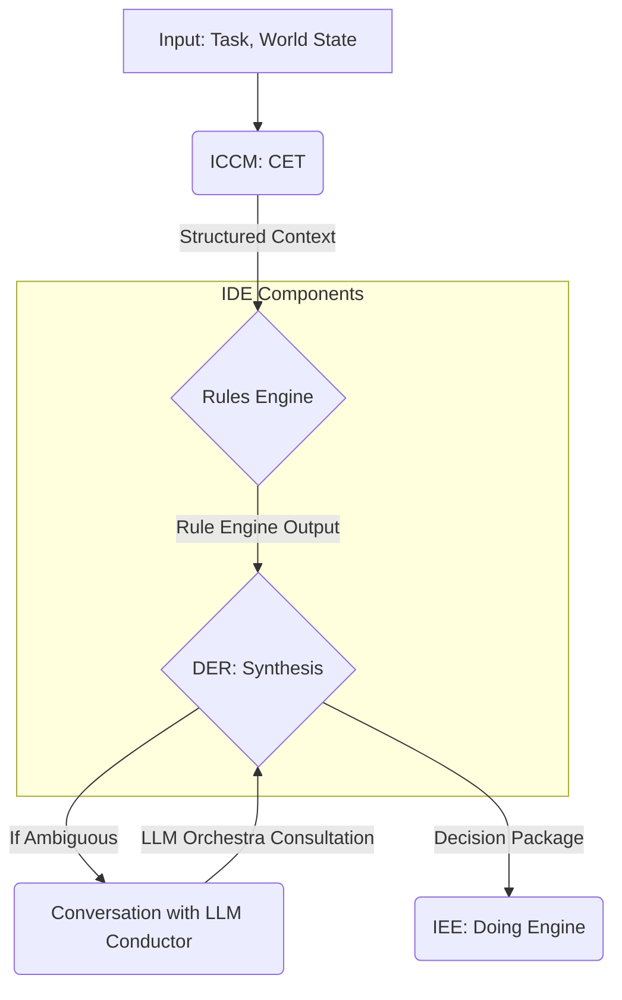

Here are the synthesized v1.1 versions of the three papers, incorporating all Council feedback.

---

### **IAE Paper 00 v1.1 (Synthesized by GPT-5)**

--- 00_IAE_Intelligent_Agentic_Engineering_v1.1.md ---
# Paper 00: Intelligent Agentic Engineering (IAE) - Master Document

**Version:** 1.1
**Date:** 2025-10-07
**Status:** DRAFT - Council of Elders Synthesis v1.1
**Repository:** Joshua (IAE)
**Note:** IAE is the overarching discipline; MAD is the architecture pattern within IAE.
**Synthesized by:** Council of Elders (Gemini 2.5 Pro, GPT-5, Claude Opus 4)

---

## Changelog

- **v1.1 (2025-10-07):** Incorporated Council of Elders feedback.
    - Enforced **quaternary structure** (ICCM + IDE + IEE + IAE) across all documentation, replacing the "trinity" model.
    - Corrected Thinking Engine composition to four components: CET, Rules Engine, DER, State Manager.
    - Renamed LLM Orchestra capability provider to **LLM Conductor** (MAD type), removing implementation-specific names (e.g., Fiedler). Positioned as an external Half-MAD.
    - Added detailed **State Manager Specification** (Section 3.4).
    - Added **Canonical Contracts** for system-wide data exchange (Section 4).
    - Added **Conversation Protocols** for inter-MAD communication (Section 5).
- **v1.0 (2025-10-06):** Initial master document.

---

## Executive Summary

**Intelligent Agentic Engineering (IAE)** is the discipline of building sophisticated AI agents through the **Multipurpose Agentic Duo (MAD)** architecture pattern. IAE is the discipline of Agent Assembly, which produces agents following the MAD pattern. MAD agents are constructed as a duet of two distinct, deeply integrated engines:

- **Thinking Engine**: Deliberative reasoning, planning, and decision-making.
- **Doing Engine**: Task execution and world interaction.

**The Quaternary Structure:**

IAE integrates four sub-disciplines to produce complete MAD agents:

| Discipline | Repository | Output | Role in MAD |
|------------|-----------|--------|-------------|
| **ICCM** | ICCM | Context Engineering Transformer (CET) | Context Engineering (Thinking Engine component 1) |
| **IDE** | Joshua | Rules Engine + DER | Decision Engineering (Thinking Engine components 2 & 3) |
| **IEE** | Joshua | Doing Engine | Execution Engineering (action execution) |
| **IAE** | Joshua | Complete MAD agents | Agent Assembly (State Manager + integration) |

**Key Innovation:** IAE formally separates cognition from action, enabling specialized development, optimization, and evaluation of each function. The Thinking Engine is model-agnostic and domain-general; the Doing Engine is domain-specific and capability-focused.

**Critical Terminology:**
- **Conversations**: MAD-to-MAD communication.
- **Capabilities**: Functions provided by Half-MADs.
- **LLM Conductor**: The proper name for the MAD type providing the LLM Orchestra capability.

---

## 1. Introduction: Intelligent Agentic Engineering

### 1.1 What is IAE?

**Intelligent Agentic Engineering (IAE)** is the comprehensive discipline for building sophisticated AI agents. IAE's core pattern is the **Multipurpose Agentic Duo (MAD)**, comprising:
1. A **Thinking Engine** that processes information, reasons, plans, and decides.
2. A **Doing Engine** that executes capabilities and interacts with environments.
3. A suite of **Half-MADs** providing shared capabilities.

**Relationship to Other Disciplines:**
- **ICCM** (Context Engineering) → Produces CET for Thinking Engine.
- **IDE** (Decision Engineering) → Produces Rules Engine + DER for Thinking Engine.
- **IEE** (Execution Engineering) → Produces Doing Engine.
- **IAE** (Agent Assembly) → Integrates all above, provides the State Manager, and defines the protocols that bind them into complete agents.

### 1.2 Why Dual-Engine Architecture Matters

By separating cognition (Thinking Engine) from action (Doing Engine), IAE enables specialized optimization, model-agnostic reasoning, clear audit trails, and safer, more controllable agent behavior.

### 1.3 Half-MADs vs Full MADs

**Half-MADs:** Minimal Thinking Engine implementations that provide **capabilities** to other MADs.
- **LLM Conductor**: Provides the LLM Orchestra capability.
- **Dewey**: Conversation retrieval capability (read-only).
- **Godot**: Conversation management capability (write).
- **And others**: Marco, Horace, Gates, Playfair.

**Full MADs:** Complete Thinking + Doing Engine implementations.
- **Hopper**: Autonomous development agent.
- **Grace**: Intelligent system UI agent.

---

## 2. Theoretical Foundation

### 2.1 Cognitive Architecture Principles

MAD mirrors cognitive theories distinguishing fast/intuitive (System 1) from slow/deliberative (System 2) thinking. The Thinking Engine is deliberative (System 2), while the Doing Engine is reflexive (System 1 + learned skills).

### 2.2 The Thinking Engine Philosophy

The Thinking Engine comprises **four** deeply integrated components:

1.  **CET (Context Engineering Transformer)**: Entry point for information. Transforms data, does not generate. (From ICCM)
2.  **Rules Engine**: Deterministic component for processing structured context against predefined rules. (From IDE)
3.  **Decision Maker (DER)**: Synthesis hub receiving inputs from CET and Rules Engine. Consults external capabilities as needed to produce a final, coherent, actionable directive. (From IDE)
4.  **State Manager**: The agent's memory and world model, maintaining the tripartite state. (From IAE)

The **LLM Orchestra** is a critical **capability**, not a core component. It is provided by an external **LLM Conductor** Half-MAD and is accessed by the DER (or any other MAD) via a formal conversation when faced with ambiguity or novelty.

### 2.3 The Doing Engine Philosophy

The Doing Engine is the executive arm, responsible for all external interactions. It receives structured `Decision Packages` and returns `Execution Outcome Packages`, creating a closed feedback loop. (From IEE)

---

## 3. Architecture Components

### 3.1 CET, Rules Engine, DER, Doing Engine

These components are specified in their respective disciplinary papers (ICCM 00, IDE 00, IEE 00). IAE is responsible for their integration via the contracts and protocols defined below.

### 3.2 The LLM Conductor

The LLM Conductor is a specialized Half-MAD. It is not a component of the Thinking Engine but an external capability provider. Its function is to manage and synthesize outputs from multiple LLMs, providing a robust consultation service to any MAD that requires it.

### 3.3 Half-MADs: Shared Capabilities Architecture

Half-MADs are specialized agents that provide common capabilities, promoting reusability and scalability. They are accessed via the Conversation Protocols defined in Section 5.

### 3.4 State Manager Specification

The State Manager is the agent's memory and world model. It is provided by the IAE discipline and used by all other components. It maintains a tripartite model to cleanly separate different categories of knowledge.

**Tripartite Model:**

1.  **World Model**: The agent's long-term, persistent understanding of the environment, entities, and their relationships. This is the agent's "encyclopedia."
    -   *Examples*: User preferences, system configurations, known facts.
    -   *Characteristics*: Slow-changing, versioned, high-value.
2.  **Task Context**: Short-term memory related to the current goal or conversation. This is the agent's "scratchpad."
    -   *Examples*: Current user request, multi-step plan progress, active constraints.
    -   *Characteristics*: Volatile, scoped to a task/session, frequently updated.
3.  **Execution State**: Real-time status of the Doing Engine and its interactions with the world. This is the agent's "dashboard."
    -   *Examples*: In-flight API calls, file handles, current resource utilization.
    -   *Characteristics*: High-frequency updates, ephemeral, directly observable.

**API Contracts (Illustrative):**

The State Manager exposes a key-value interface with scoping and versioning.

-   `write(scope: str, key: str, value: Any) -> version_id: str`
    -   Writes a value to a specified scope (`world_model`, `task_context`, `execution_state`).
    -   Returns a unique version identifier for the write, enabling auditability.
-   `read(scope: str, key: str, version_id: str = 'latest') -> Any`
    -   Reads a value from a specified scope, optionally at a specific version.
-   `subscribe(scope: str, key_pattern: str) -> EventStream`
    -   Allows components (e.g., DER) to react to state changes.

---

## 4. Canonical Contracts

IAE defines the canonical data structures for communication between the major architectural components. These schemas are the formal interfaces that enable the separation of concerns.

### 4.1 Structured Context Schema (CET → Rules/DER)

```json
{
  "context_id": "uuid",
  "task_id": "uuid",
  "timestamp": "iso8601",
  "provenance": "source_of_data",
  "safety_profile": { "red_lines": [], "rate_limits": {} },
  "task_frame": { "objective": "string", "constraints": [] },
  "features": {
    // Domain-specific, structured data from CET
  }
}
```

### 4.2 Rule Engine Output Schema (Rules → DER)

```json
{
  "status": "HIGH_CONFIDENCE | LOW_CONFIDENCE | NO_MATCH | CONFLICT",
  "matches": [ { "rule_id": "string", "confidence": "float" } ],
  "guardrails_triggered": [ "policy_id" ],
  "recommended_action": { /* Optional pre-canned action */ }
}
```

### 4.3 Decision Package Schema (DER → Doing Engine)

This is the formal directive from the Thinking Engine to the Doing Engine.

```json
{
  "decision_id": "uuid",
  "task_id": "uuid",
  "action_name": "string", // e.g., 'execute_command', 'call_api'
  "parameters": { /* Key-value pairs for the action */ },
  "preconditions": [ /* Conditions to verify before execution */ ],
  "expected_effects": [ /* Observable outcomes to monitor for */ ],
  "confidence_score": "float", // 0.0 to 1.0
  "reasoning_trace_ref": "uri_to_trace_artifact"
}
```

### 4.4 Execution Outcome Package Schema (Doing Engine → State Manager)

This is the formal report from the Doing Engine, closing the feedback loop.

```json
{
  "outcome_id": "uuid",
  "decision_id": "uuid", // Correlates with the Decision Package
  "status": "SUCCESS | FAILURE | PARTIAL_SUCCESS",
  "start_time": "iso8601",
  "end_time": "iso8601",
  "observed_effects": [ /* Actual outcomes observed during execution */ ],
  "error_info": { /* Details on failure */ },
  "telemetry": { "cost": "float", "resources_used": {} },
  "generated_artifacts": [ "uri_to_file_or_data" ]
}
```

---

## 5. Conversation Protocols

IAE defines the protocols for all MAD-to-MAD communication ("conversations").

### 5.1 MAD-to-MAD Messaging Schema

All conversations use a standard message envelope.

```json
{
  "message_id": "uuid",
  "conversation_id": "uuid",
  "source_mad_id": "string",
  "target_mad_id": "string", // May be broadcast address
  "message_type": "REQUEST | RESPONSE | ACK",
  "payload_schema_version": "string", // e.g., 'llm_orchestra_request_v1.2'
  "payload": {
    // Specific to the capability being requested
  },
  "error": { /* Standard error object if message_type is an error response */ }
}
```

### 5.2 Capability Discovery and Registration

MADs discover each other's capabilities through a registry or a broadcast mechanism.
1.  **Registration**: On startup, a Half-MAD registers its capabilities (e.g., `llm_orchestra`), its ID, address, and the schema versions it supports with a central registry.
2.  **Discovery**: A MAD needing a capability queries the registry (e.g., "Find providers for `llm_orchestra` v1.x").
3.  **Binding**: The requesting MAD selects a provider and initiates a conversation using the messaging schema.

### 5.3 Error Handling and Versioning

-   **Versioning**: The `payload_schema_version` in the message envelope is mandatory. A receiving MAD must reject requests for versions it does not support with a standardized `VERSION_MISMATCH` error.
-   **Error Handling**: The `error` field in the response message provides a structured way to communicate failures, such as `CAPABILITY_NOT_FOUND`, `TIMEOUT`, or `PERMISSION_DENIED`. This allows for robust, predictable error handling across the agent ecosystem.

*(Remaining sections on paper structure, implementation, etc., are omitted for brevity but would be updated to reflect these foundational changes.)*

---

### **IDE Paper 00 v1.1 (Synthesized by Gemini 2.5 Pro)**

--- 00_IDE_Intelligent_Decision_Engineering_v1.1.md ---
# Paper 00: Intelligent Decision Engineering (IDE) - Master Document

**Version:** 1.1
**Date:** 2025-10-07
**Status:** DRAFT - Council of Elders Synthesis v1.1
**Repository:** Joshua (IDE discipline within IAE ecosystem)
**Synthesized by:** Council of Elders (Gemini 2.5 Pro, GPT-5, Claude Opus 4)

---

## Changelog

- **v1.1 (2025-10-07):** Incorporated Council of Elders feedback.
    - Replaced "trinity (ICCM + IDE + MAD)" with the correct **quaternary structure (ICCM + IDE + IEE + IAE)**. IAE is the assembly discipline.
    - Corrected Thinking Engine composition; LLM Orchestra is an external capability, not a core component.
    - Replaced implementation-specific name "Fiedler" with the proper MAD type **LLM Conductor**.
    - Aligned data object names with the **Canonical Contracts** defined in IAE Paper 00 (e.g., `Structured Context`, `Rule Engine Output`, `Decision Package`).
- **v1.0 (2025-10-06):** Initial master document.

---

## Executive Summary

The **Intelligent Decision Engineering (IDE)** discipline provides the formal framework for decision-making within the IAE ecosystem. IDE produces two critical components of the MAD Thinking Engine: the **Rules Engine** and the **DER (Decision Engineering Recommender)**.

IDE bridges traditional symbolic AI and modern probabilistic reasoning, creating a hybrid architecture that delivers transparency, auditability, and adaptability. By integrating with CET (from ICCM) for structured context and consulting the **LLM Orchestra** capability (via an **LLM Conductor** MAD) for novel scenarios, IDE enables agents to make decisions that are both explainable and effective.

**The Quaternary Structure:**
- **ICCM (Context Engineering):** Produces CET → Component #1 of MAD Thinking Engine.
- **IDE (Decision Engineering):** Produces Rules Engine + DER → Components #2 & #3 of MAD Thinking Engine.
- **IEE (Execution Engineering):** Produces the Doing Engine for action execution.
- **IAE (Agent Assembly):** Integrates all components, provides the State Manager, and defines the overall architecture.

---

## 1. Introduction: The Decision Problem in AI Agents

### 1.1 Why Decision Engineering Matters

Modern AI agents often function as "black boxes," making it difficult to trace, audit, or predict their behavior. IDE treats the decision-making faculty as an engineered system composed of distinct, verifiable components, ensuring that every decision is traceable, explainable, and, where possible, deterministic.

### 1.2 The IDE Discipline

**Input:** IDE components consume `Structured Context` from CET and state information from the State Manager.
**Process:** A hybrid, two-stage process:
1. A **Rules Engine** evaluates context against deterministic rules.
2. A **DER** synthesizes the rule output with broader context and, if necessary, consults probabilistic models via conversations.
**Output:** An actionable `Decision Package` with a confidence score and a complete reasoning trace.

### 1.3 The Quaternary of Disciplines

IDE is an indispensable link in a **quaternary** of disciplines that enable robust MAD systems.

| Discipline | Repository | Primary Output | Role in MAD Ecosystem |
|------------|------------|----------------|----------------------|
| **ICCM** | ICCM | **CET** | **Context Engineering:** Answers "What is the situation?" |
| **IDE** | Joshua | **Rules Engine + DER** | **Decision Engineering:** Answers "What should be done?" |
| **IEE** | Joshua | **Doing Engine** | **Execution Engineering:** Answers "How is it done?" |
| **IAE** | Joshua | **Complete Agents** | **Agent Assembly:** Integrates everything. |

This separation of concerns is fundamental. ICCM masters *understanding*, IDE masters *choosing*, IEE masters *acting*, and IAE masters *assembling*.

**In the MAD Thinking Engine:**
The Thinking engine has four components: CET (from ICCM), Rules Engine (from IDE), DER (from IDE), and State Manager (from IAE).

---

## 2. Theoretical Foundation

*(This section remains largely the same, focusing on principles of transparency, auditability, etc.)*

### 2.3 Decision Flow in the MAD Thinking Engine

The flow of information through the IDE components is precise and ordered.



**Process Steps:**

1.  **Context Engineering (ICCM):** CET produces a `Structured Context` object.
2.  **Deterministic Check (IDE):** The context is passed to the Rules Engine, which produces a `Rule Engine Output` object.
3.  **Synthesis (IDE):** The DER receives the `Structured Context` and `Rule Engine Output`.
4.  **Probabilistic Consultation (Optional):** If the rule output is insufficient, the DER initiates a *conversation* with an **LLM Conductor** MAD to access its LLM Orchestra capability.
5.  **Decision (IDE):** The DER synthesizes all inputs into a final `Decision Package`, including a confidence score and reasoning trace.
6.  **Action (IEE):** The `Decision Package` is passed to the agent's Doing Engine for execution.

---

## 3. Architecture Components

### 3.1 Rules Engine Specification

**Input:** `StructuredContext` from CET.
**Output:** A `RuleEngineOutput` object, as defined in the IAE Canonical Contracts.

*(Implementation details remain the same)*

### 3.2 DER (Decision Engineering Recommender) Specification

**Input:** `StructuredContext`, `RuleEngineOutput`, and optional `LLMOrchestraConsultation` from an LLM Conductor.
**Output:** A `Decision Package`, as defined in the IAE Canonical Contracts.

*(Processing logic remains the same)*

### 3.3 Integration with CET (ICCM)

The interface is the formal `Structured Context` schema defined in IAE Paper 00.

### 3.4 Integration with LLM Orchestra (via LLM Conductor)

The DER's interaction with an LLM Conductor MAD is a formal **conversation**, not a function call. It uses the MAD-to-MAD messaging protocols defined in IAE Paper 00. The DER sends a `ConsultationRequest` and receives a `ConsultationResponse`. The LLM Orchestra serves as a panel of probabilistic experts; the DER retains ultimate authority.

---

## 7. Relationship to ICCM, IEE, and IAE

### 7.1 ICCM → IDE Boundary

The interface is the `Structured Context` schema.

### 7.2 IDE → IEE Boundary

The interface is the `Decision Package` schema. IDE produces the decision; IEE executes it.

### 7.3 Role within IAE

IDE provides the core reasoning components (Rules Engine, DER). The IAE discipline assembles these with CET, the State Manager, and a Doing Engine to create a complete agent following the MAD pattern.

### 7.4 The Complete MAD Thinking Engine

The Thinking Engine is a composite architecture from multiple disciplines.
`MAD Thinking Engine = CET (ICCM) + Rules Engine (IDE) + DER (IDE) + State Manager (IAE)`

*(Remaining sections on paper structure, roadmap, etc., are omitted for brevity but would be updated to reflect these foundational changes.)*

---

### **IEE Paper 00 v1.1 (Synthesized by Claude Opus 4)**

--- 00_IEE_Intelligent_Execution_Engineering_v1.1.md ---
# Paper 00: Intelligent Execution Engineering (IEE) - Master Document

**Version:** 1.1
**Date:** 2025-10-07
**Status:** PLACEHOLDER - Discipline Defined, Awaiting Implementation Experience
**Repository:** Joshua (IEE discipline within IAE ecosystem)
**Purpose:** Define the Doing Engine discipline, completing the quaternary structure of IAE.
**Synthesized by:** Council of Elders (Gemini 2.5 Pro, GPT-5, Claude Opus 4)

---

## Changelog

- **v1.1 (2025-10-07):** Incorporated Council of Elders feedback.
    - Solidified position within the **quaternary structure (ICCM + IDE + IEE + IAE)**.
    - Strengthened the concept of the **feedback loop** by formally adopting the `Execution Outcome Package` contract, which reports back to the IAE-provided State Manager.
    - Clarified input contract as the `Decision Package` from IDE.
- **v1.0 (2025-10-06):** Initial placeholder document.

---

## Executive Summary

**Intelligent Execution Engineering (IEE)** is the discipline responsible for designing and implementing the **Doing Engine** component of MAD agents. While ICCM handles context, IDE handles decisions, and IAE handles assembly, IEE focuses on the critical "last mile": translating decisions into safe, observable, and effective actions in specific domains.

IEE produces domain-specific **Doing Engines** that consume `Decision Packages` from the Thinking Engine and produce `Execution Outcome Packages`, which provide a rich feedback signal to the agent's State Manager, enabling learning and adaptation.

---

## 1. Introduction: The Execution Problem

### 1.1 Why Execution Engineering Matters

Execution is not a trivial function call. It requires safety checks, tool orchestration, error recovery, and robust feedback. IEE treats execution as a first-class engineering discipline to prevent brittle, unsafe, and unauditable agent behavior.

### 1.2 The IEE Discipline

**Input:** A `Decision Package` from the DER (IDE), as specified in the IAE Canonical Contracts.
**Process:** Validate, select tools, execute with monitoring, and capture outcomes.
**Output:** An `Execution Outcome Package` sent to the State Manager (IAE), as specified in the IAE Canonical Contracts. This closes the agent's primary operational loop.

### 1.3 The Quaternary Structure (ICCM + IDE + IEE + IAE)

The complete IAE (Intelligent Agentic Engineering) discipline comprises four sub-disciplines:

| Discipline | Repository | Output | Role in MAD |
|------------|-----------|--------|-------------|
| **ICCM** | ICCM | CET | Context Engineering (Thinking Engine) |
| **IDE** | Joshua | Rules Engine + DER | Decision Engineering (Thinking Engine) |
| **IEE** | Joshua | **Doing Engine** | **Execution Engineering (action execution)** |
| **IAE** | Joshua | Complete agents | Agent Assembly (provides State Manager, integrates all) |

**Complete MAD Architecture & Feedback Loop:**
```
Thinking Engine (ICCM + IDE + IAE)
    ↓
  Decision Package
    ↓
Doing Engine (IEE)
    ↓
  Execution & Observation
    ↓
Execution Outcome Package
    ↓
State Manager (IAE) → (informs next Thinking cycle)
```

---

## 2. Theoretical Foundation

### 2.1 Execution Engineering Principles

- **Safety First:** Validate all `Decision Package` preconditions and safety assertions before execution.
- **Observable Execution:** Every action must be observable, producing the telemetry captured in the `Execution Outcome Package`.
- **Formal Feedback Loops:** The `Execution Outcome Package` is not just a log; it is a structured report designed to update the agent's World Model and Task Context within the State Manager.
- **Domain Adaptation:** Doing Engines are domain-specific implementations of a common interface.

### 2.2 Relationship to Thinking Engine

The boundary between Thinking and Doing is a formal, bidirectional contract:
- **IDE → IEE:** The `Decision Package` is the command. It specifies the *what*, not the *how*. It contains the `action_name`, `parameters`, and `expected_effects`.
- **IEE → State Manager (IAE):** The `Execution Outcome Package` is the report. It details the execution `status`, `observed_effects`, and any deviations from the expected. This feedback is critical for the DER to learn and for the World Model to remain accurate.

This closed-loop design enables the agent to detect "execution drift"—where the world responds differently than expected—a key signal for replanning or learning.

---

## 3. Architecture Components (High-Level)

### 3.1 Doing Engine Structure

A generic Doing Engine is composed of four logical stages that process the incoming `Decision Package` and generate the outgoing `Execution Outcome Package`.

```
┌─────────────────────────────────────────┐
│         DOING ENGINE (IEE)              │
├─────────────────────────────────────────┤
│                                         │
│  1. Decision Validator                  │
│     - Ingests: Decision Package         │
│     - Checks: Preconditions, safety     │
│                                         │
│  2. Tool Orchestrator                   │
│     - Maps action_name to tools         │
│     - Binds parameters                  │
│                                         │
│  3. Execution Monitor                   │
│     - Observes execution                │
│     - Compares observed vs. expected    │
│                                         │
│  4. Outcome Synthesizer                 │
│     - Assembles Execution Outcome Pkg   │
│     - Sends to State Manager            │
│                                         │
└─────────────────────────────────────────┘
```

---

## 7. Relationship to ICCM, IDE, and IAE

**IEE's Role in IAE:**

IEE is the **Execution Engineering** discipline, completing the quaternary.

1.  **ICCM** → Understands context.
2.  **IDE** → Makes decisions.
3.  **IEE** → Executes decisions and reports outcomes.
4.  **IAE** → Assembles the agent and manages its state.

**Integration Points:**

-   **IDE → IEE Boundary:** The formal interface is the **`Decision Package`** schema.
-   **IEE → IAE Boundary:** The formal interface is the **`Execution Outcome Package`** schema, which is consumed by the IAE-provided State Manager. This feedback loop is the primary mechanism for agent learning and adaptation.

*(Remaining sections on paper structure, roadmap, etc., are omitted for brevity but would be updated to reflect these foundational changes.)*
