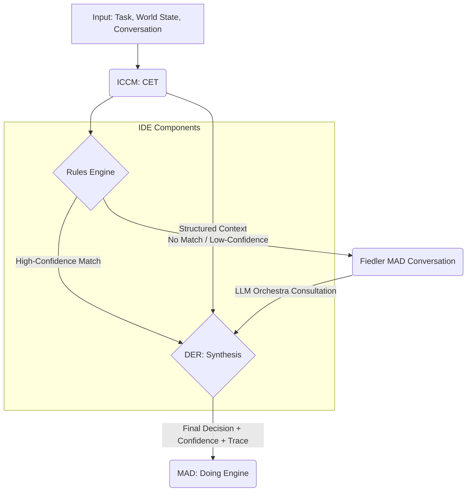

# Paper 00: Intelligent Decision Engineering (IDE) - Master Document

**Version:** 1.0
**Date:** 2025-10-06
**Status:** DRAFT - Council of Elders Synthesis
**Repository:** Joshua (IDE discipline within MAD ecosystem)
**Synthesized by:** Council of Elders (Gemini 2.5 Pro, GPT-5, Claude Opus 4)

---

## Changelog

- **v1.0 (2025-10-06):** Initial master document synthesizing Council of Elders recommendations. Establishes the Intelligent Decision Engineering discipline, completing the trinity (ICCM + IDE + MAD) by defining the Rules Engine and DER components of the MAD Thinking Engine.

---

## Executive Summary

The **Intelligent Decision Engineering (IDE)** discipline provides the formal framework for decision-making within the MAD ecosystem. IDE produces two critical components of the MAD Thinking Engine: the **Rules Engine** (deterministic decision-making for known scenarios) and the **DER (Decision Engineering Recommender)** for complex synthesis when rules are insufficient.

IDE bridges the gap between traditional symbolic AI approaches and modern probabilistic reasoning, creating a hybrid architecture that delivers transparency, auditability, controllability, adaptability, and confidence-awareness. By integrating tightly with CET (from ICCM) for structured context and optionally consulting the LLM Orchestra (via Fiedler MAD) for novel scenarios, IDE enables MAD agents to make decisions that are both explainable and effective.

**Key Innovation:** The MAD ecosystem formally separates context engineering (ICCM/CET) from decision engineering (IDE/Rules+DER) from agent assembly (MAD), enabling specialized development, optimization, and evaluation of each function.

**The Trinity Completed:**
- **ICCM (Context Engineering):** Produces CET → Component #1 of MAD Thinking Engine
- **IDE (Decision Engineering):** Produces Rules Engine + DER → Components #2-3 of MAD Thinking Engine
- **MAD (Agent Assembly):** Integrates CET + Rules + DER + State Manager (Thinking Engine) with Doing Engine

This Paper 00 proposes a 13-paper hierarchical structure organized into five acts, from foundational concepts through production considerations, providing a comprehensive roadmap for the discipline's development.

---

## 1. Introduction: The Decision Problem in AI Agents

### 1.1 Why Decision Engineering Matters

The proliferation of advanced AI agents has exposed a critical vulnerability in their design: the opacity of their decision-making processes. End-to-end neural network models, while powerful, often function as "black boxes," making it difficult to trace, audit, or predict their behavior. This lack of transparency is unacceptable in high-stakes domains where accountability, safety, and reliability are paramount. When an agent makes a critical error, the question "Why?" must have a definitive, verifiable answer.

Traditional symbolic AI and expert systems offered transparency but suffered from brittleness, failing to handle the ambiguity and novelty of real-world scenarios. The challenge, therefore, is not to choose between symbolic and probabilistic approaches but to synthesize them into a cohesive, principled architecture.

Decision Engineering emerges as the formal discipline dedicated to solving this problem. It treats the decision-making faculty of an agent not as an emergent property of a monolithic model, but as an engineered system composed of distinct, verifiable components. It mandates that decisions be traceable, explainable, and, where possible, deterministic.

In practice, most AI agents make decisions that are opaque, weakly grounded in explicit policy, and difficult to audit or reproduce. This undermines safety, compliance, trust, and lifecycle governance. Decision spaces vary by familiarity and risk. Known, high-regret spaces require strict policy adherence; novel or ambiguous spaces benefit from probabilistic synthesis and external consultation. Without a formal discipline, ad hoc decisions accumulate technical, compliance, and ethical debt. IDE defines a principled, inspectable, and maintainable path.

### 1.2 The IDE Discipline

Intelligent Decision Engineering (IDE) is the systematic application of scientific and engineering principles to the design, construction, and operation of decision-making systems within intelligent agents.

**Input:** IDE components primarily consume:
- Structured, decision-ready context produced by the Context Engineering Transformer (CET) from the ICCM discipline
- World state information from the agent's State Manager
- Task requirements, policy constraints, safety invariants
- Decision risk tier and cost-of-error profiles
- Operator preferences and capability availability across MADs

**Process:** IDE employs a hybrid, two-stage process:
1. A **Rules Engine** evaluates the context against a set of deterministic, human-authored or formally verified rules
2. A **Decision Engineering Recommender (DER)** synthesizes the output of the Rules Engine with the broader context and, if necessary, consults probabilistic models to formulate a final recommendation

**Output:** The final output is an actionable decision or recommendation, critically accompanied by:
- Quantifiable **confidence score** (0.0 to 1.0)
- Detailed **reasoning trace** providing complete audit trail
- **Rule matches and overrides** for transparency
- **Alternative recommendations** when confidence is low
- **Escalation paths** for human-in-the-loop when needed

**Core Innovations:**
- **Hybrid architecture:** Deterministic Rules Engine for known and safety-critical cases; DER for synthesis under uncertainty, ambiguity, or novelty
- **Deep integration with CET:** Context-as-contract, feature stability, context health checks, and re-transformation requests from DER
- **Conversational consultation:** When needed, DER engages the LLM Orchestra (Fiedler MAD) to incorporate multi-model insights into a traceable synthesis
- **Confidence as first-class signal:** Predictive calibration, monotonic alignment with realized accuracy, and conformal bounds where applicable
- **Auditable epistemology:** Every decision yields an inspectable, replayable reasoning trace linked to versions of rules, models, and context

### 1.3 The Trinity of Disciplines

IDE does not exist in isolation. It is the central, indispensable link in a trinity of disciplines that together enable the construction of robust and trustworthy MAD systems.

| Discipline | Repository | Primary Output | Role in MAD Ecosystem |
|------------|------------|----------------|----------------------|
| **ICCM** | ICCM | **CET** (Context Engineering Transformer) | **Context Engineering:** Structures raw data and conversation history into optimized, decision-ready context. Answers "What is the situation?" |
| **IDE** | Joshua | **Rules Engine + DER** | **Decision Engineering:** Consumes context to produce a transparent, auditable decision with a confidence score. Answers "What should be done?" |
| **MAD** | Joshua | **Complete Agents** | **Agent Assembly:** Integrates the Thinking Engine (CET + Rules Engine + DER + State Manager) with a Doing Engine to execute actions. Answers "How is it done?" |

This separation of concerns is fundamental. ICCM masters the problem of *understanding*, IDE masters the problem of *choosing*, and MAD masters the problem of *acting*.

**In the MAD Thinking Engine:**
```
Input → CET (ICCM) → Rules Engine (IDE) → DER (IDE) → State Manager interactions → Decision → Doing Engine
```

**Critical Terminology:**
- MADs communicate via **conversations** (not "service calls")
- MADs provide **capabilities** (not "services")
- This vocabulary enforces agentic patterns and discourages brittle RPC mental models

### 1.4 Document Organization

This Paper 00 serves as the foundational charter for the IDE discipline:

- **Section 2:** Theoretical principles (5 core principles, hybrid decision architecture)
- **Section 3:** Architecture components (Rules Engine and DER specifications)
- **Section 4:** Hierarchical paper structure (13 papers in 5 acts)
- **Section 5:** Implementation roadmap (3 phases: Foundation, Refinement, Advanced)
- **Section 6:** Success metrics (technical, auditability, system integration)
- **Section 7:** Relationship to ICCM and MAD (integration boundaries)
- **Section 8:** Publication strategy (venues, timeline, open source)
- **Section 9:** Research questions and open problems
- **Section 10:** Conclusion and terminology reference

---

## 2. Theoretical Foundation

### 2.1 Decision Engineering Principles

The IDE discipline is founded on five core principles that must guide the design of any decision-making system within the MAD ecosystem.

#### 2.1.1 Transparency
The logic behind every decision must be inspectable. A human operator or auditing system must be able to understand the primary factors that led to a given output. This principle directly opposes the "black box" paradigm.

Each decision must be explainable in terms of applied rules, synthesized judgments, data provenance, and model consultations. Rationales should be concise and verifiable against stored artifacts.

#### 2.1.2 Auditability
A complete, immutable reasoning trace must be generated for every significant decision. This trace must link the final action back to the specific version of the rules, the precise context from the CET, and the outputs of any probabilistic models consulted.

The full reasoning trace is persisted and replayable, with versioned references to rulesets, policies, model snapshots, and context transforms. Tamper-evident storage is preferred.

#### 2.1.3 Controllability
For well-understood, high-stakes scenarios, the agent's behavior must be predictable and deterministic. The Rules Engine provides this capability, acting as a set of non-negotiable guardrails on agent behavior (e.g., for safety protocols, security policies, or regulatory compliance).

Deterministic rules govern known regimes, especially high-regret or regulated ones. Safety invariants and red-lines are enforced at all times via policy engines and runtime guards.

#### 2.1.4 Adaptability
The system must be capable of reasoning under uncertainty and handling novel situations where deterministic rules do not apply. The DER, with its ability to consult the LLM Orchestra, provides this necessary flexibility, preventing the brittleness of purely symbolic systems.

When contexts are novel or ambiguous, DER uses probabilistic synthesis and consultative conversations to propose decisions with confidence and alternatives.

#### 2.1.5 Confidence-Awareness
Every decision must be accompanied by an explicit, quantifiable measure of confidence. This metric is not merely a probabilistic output but a synthesized score reflecting rule certainty, model consensus, and context quality. Low-confidence decisions can trigger fallback procedures, requests for human intervention, or information-gathering sub-tasks.

All outputs include quantitative confidence signals with explicit interpretation (e.g., calibrated probability of correctness or bounded prediction set). Coverage/selectivity trade-offs are tunable by risk tier.

**Additional Guiding Principles:**

**Separation of Concerns:** Context shaping (ICCM/CET) is distinct from decision synthesis (IDE). Decision-making (IDE) is distinct from behaving (Doing Engines). State Manager mediates memory and world state across them.

**Minimality and Composability:** IDE defines a minimal set of decision components and interfaces that compose across MADs and across capabilities. Nothing more than necessary to decide; nothing less than sufficient for safety.

**Human-in-the-Loop Readiness:** Escalation paths, review workflows, and accountability hooks are first-class features, not afterthoughts.

### 2.2 The Hybrid Decision Architecture

IDE's central architectural pattern is the separation of the decision process into two distinct stages, embodied by the Rules Engine and the DER.

**The Rules Engine: The Realm of the Known**
This component operates on symbolic logic. It is fast, efficient, and produces predictable outputs. It is the domain of business logic, safety constraints, security policies, and standard operating procedures. Its primary function is to handle the "80%" of common, well-defined situations with perfect reliability and transparency.

Executes deterministic logic expressed as policies, decision tables, production rules, or formal specifications.

**Strengths:** Speed, predictability, formal verification

**Uses:** Safety gates, compliance enforcement, known playbooks, default routing, cost ceilings, rate limits, identity/entitlement checks

**The DER: The Realm of the Unknown and Ambiguous**
This component is the master synthesizer. It activates when the Rules Engine yields no high-confidence match or when the situation is inherently ambiguous. The DER's role is not to replace the Rules Engine but to intelligently build upon its output (or lack thereof). It weighs evidence from multiple sources—rule partial matches, contextual clues from the CET, and expert-like intuition from the LLM Orchestra—to formulate the best possible recommendation under uncertainty.

Integrates rule outputs, CET context, and optional consultation with external MAD capabilities (notably Fiedler's LLM Orchestra) to synthesize a decision with calibrated confidence and rationalized trade-offs.

**Strengths:** Handling ambiguity, novelty, multi-objective optimization, stakeholder alignment, and value-sensitive trade-offs

**The Hybrid Approach:**
The hybrid is not a fallback hack. It is a principled approach: rules codify accepted knowledge; DER explores plausible extensions and integrates expert advice, under constraints and with explainable adjudication.

This hybrid model provides the best of both worlds: the rigid reliability of classical expert systems and the fluid adaptability of modern neural networks.

### 2.3 Decision Flow in the MAD Thinking Engine

The flow of information through the IDE components is precise and ordered, ensuring a structured and auditable decision process.



**Process Steps:**

1. **Context Engineering (ICCM):** The CET receives raw inputs and transforms them into a structured, machine-readable context object.

2. **Deterministic Check (IDE):** The context object is passed to the Rules Engine. The engine attempts to match it against its rule set.

3. **Branching Logic:**
   - **Path A (Rule Match):** If a high-confidence rule or policy matches, its prescribed action is passed to the DER as a primary candidate.
   - **Path B (No Rule Match):** If no rule matches or the matches are of low confidence, the DER is signaled to initiate a more complex synthesis process.

4. **Probabilistic Consultation (Optional):** In Path B, the DER formulates a query and initiates a *conversation* with the Fiedler MAD to access its LLM Orchestra capability. This provides a multi-model perspective on the ambiguous situation.

5. **Synthesis (IDE):** The DER receives all available inputs: the structured context from CET, the output from the Rules Engine (even if a "no match" signal), and the consultation results from the LLM Orchestra. It synthesizes these into a final decision, calculates a confidence score, and generates the complete reasoning trace.

6. **Action (MAD):** The final decision package is passed to the agent's Doing Engine for execution.

**In-flow (Detailed):**
- Task or trigger arrives
- CET transforms inputs into a structured, scoped context; validates and tags context for freshness, provenance, and trust level
- Rules Engine checks for deterministic matches; annotates matches with rule IDs, versions, and mandatory actions or guardrails
- DER receives the context and rule annotations; chooses one of: accept rule decision, refine/augment via synthesis, escalate for consultation, or defer

**Out-flow (Detailed):**
- DER returns an actionable decision with a confidence score, an explanation trace, alternatives if confidence is low, and any preconditions to be enforced by Doing Engines
- State Manager updates are proposed or requested (e.g., record a commitment, reserve a resource)
- Doing Engine enacts the decision or requests clarification; if doing fails, DER can be re-engaged with a failure context

### 2.4 Relationship to Existing Decision Systems

IDE builds upon a rich history of AI research but distinguishes itself through its specific architectural commitments within the MAD ecosystem.

**Classical Expert Systems (e.g., CLIPS, Drools):** IDE incorporates the strengths of these systems (transparency, symbolic reasoning) into its Rules Engine but avoids their brittleness by coupling them with the DER. Expert systems emphasize production rules but lack modern probabilistic synthesis and lack contextual optimization across multi-agent settings.

**Cognitive Architectures (e.g., SOAR, ACT-R):** IDE shares the goal of creating hybrid reasoning systems. However, IDE's primary innovation is the formal, explicit separation of the *context engineering* step (ICCM/CET) from the *decision engineering* step, and the explicit definition of the DER as a dedicated *synthesis* component. Furthermore, its native integration with a conversational, multi-agent framework (MAD) is unique. These architectures integrate memory and rules but predate modern LLM orchestration and comprehensive context pipelines.

**Modern AI (Reinforcement Learning, Neural Networks):** IDE does not replace these models; it orchestrates them. The LLM Orchestra, consulted by the DER, is the designated place for such probabilistic systems. IDE provides the structured, symbolic scaffolding that makes their use safe, controllable, and auditable. RL and neural decision networks excel in pattern-rich domains but often lack auditability and governance in regulated applications.

**IDE's Novelty:**
- Explicit, modular integration with CET for context health and re-transformation loops
- DER's consultative synthesis layer with calibrated confidence, under policy constraints
- Conversations over calls: multi-agent decision coordination handled via dialogic protocols and capability discovery rather than hardwired APIs
- Auditable epistemology: decisions are reconstructible artifacts with formal references to rules, contexts, models, and consultation transcripts

---

## 3. Architecture Components

### 3.1 Rules Engine Specification

The Rules Engine is the deterministic heart of the Thinking Engine. Its design must prioritize speed, verifiability, and clarity.

**Responsibility:** Evaluate deterministic rules, policy constraints, and safety invariants against the Context Package. Produce rule matches, actions, hard blocks, and policy annotations.

**Input:**
- `StructuredContext`: A standardized data object provided by the CET
- `WorldState`: Relevant state variables from the agent's State Manager

**Processing:** The engine executes a match-evaluate-act cycle against its rule base. The core logic involves pattern matching the input data against the conditions (LHS - Left-Hand Side) of its rules and, upon a successful match, preparing the actions (RHS - Right-Hand Side).

**Output:** A `RuleEngineOutput` object containing:
- `matches`: A list of matched rules, each with its own intrinsic certainty factor
- `status`: An enum (`HIGH_CONFIDENCE_MATCH`, `LOW_CONFIDENCE_MATCH`, `NO_MATCH`)
- `trace`: A log of the rules that were evaluated and why they did or did not fire
- `conflicts`: List of conflicting rules and conflict rationale
- `guardrails_triggered`: List of policy violations requiring blocks
- `coverage`: Proportion of context features utilized by matched rules
- `confidence_rule`: Heuristic confidence for matched decision(s) (0–1)
- `residuals`: Aspects of the decision left undecided

**Implementation Approaches (Research Question #1):**
A single rule representation is unlikely to be optimal for all MADs. IDE therefore proposes a modular design where the Rules Engine can be implemented using one of several formalisms, depending on the agent's domain:

1. **Decision Trees/Tables:** Ideal for simple, branching logic that is easily visualizable and verifiable. Human-friendly matrix for business operations.

2. **Production Rule Systems (e.g., Rete algorithm):** Suited for complex situations with many interacting rules and a need for efficient, stateful pattern matching. Expressiveness for complex conditions.

3. **Formal Logic (e.g., Datalog, Answer Set Programming, Prolog):** Best for domains requiring rigorous logical inference, constraint satisfaction, and formal verification of properties like safety and termination. Used for safety-critical properties and verification.

4. **Policy Engines (e.g., OPA/Rego, Cedar):** Excellent for security, authorization, and compliance-driven decisions, where policies are managed and updated independently of the agent's core logic. Externalized policy-as-code; strong for access control, tenancy, jurisdictional checks.

The choice of implementation is a critical design decision for the MAD architect, guided by the principles of the IDE discipline.

**Functional Requirements:**
- Deterministic output for identical inputs and ruleset versions
- Support for multiple rule representations (as above)
- Conflict resolution strategies: priority, specificity, policy dominance
- Mandatory guardrails: safety invariants, resource limits, identity/entitlement checks
- Coverage reporting: which features used, which policy sections touched
- Explanations: machine-renderable with references to rule text and policy docs
- Runtime hooks: request CET re-transformation if features missing/stale

**Non-Functional Requirements:**
- Low latency (typical < 10 ms per evaluation for moderate rulesets)
- High throughput capability (optimized indexing, Rete network)
- Memory safety and predictable performance
- Reproducibility: fully versioned rulesets, deterministic execution
- Observability: tracing, metrics, debug logs, explainability on demand
- Formal verification compatibility: static checking against invariants

### 3.2 DER (Decision Engineering Recommender) Specification

The DER is the cognitive synthesizer of the Thinking Engine. It excels at reasoning under uncertainty and integrating disparate forms of evidence.

**Responsibility:** Synthesize final decision from context, rules, state, and consultations, with confidence and trace.

**Input:**
- `StructuredContext` (from CET)
- `RuleEngineOutput` (from Rules Engine)
- `WorldState` (from State Manager)
- `TaskRequirements` (objectives, constraints, preferences, utility proxies)
- `LLMOrchestraConsultation` (optional, from Fiedler MAD)
- Operator governance parameters (abstain thresholds, escalation rules)

**Processing (Research Question #2):** The DER's core algorithm is a process of evidence synthesis:

1. **Triage:** It first examines the `RuleEngineOutput.status`. If `HIGH_CONFIDENCE_MATCH`, it gives strong preference to the rule's prescribed action, using other inputs mainly for validation and trace generation.

2. **Hypothesis Generation:** If the status is `NO_MATCH` or `LOW_CONFIDENCE_MATCH`, the DER generates a set of candidate decisions. These can be sourced from partial rule matches, heuristics, or a preliminary query to the LLM Orchestra.

3. **Evidence Fusion:** For each hypothesis, the DER gathers and weighs supporting and refuting evidence from all its inputs. This is the synthesis step. A potential algorithm could be a Bayesian network or a weighted scoring model that combines rule certainty, LLM vote distribution, and contextual relevance.

4. **Confidence Calculation (Research Question #3):** A final confidence score (0.0 to 1.0) is computed. This score is not a simple probability but a calibrated metric reflecting the overall quality and coherence of the evidence. For example: `Confidence = f(RuleCertainty, LLMConsensus, ContextFreshness, TaskClarity)`. Calibration is performed by comparing predicted confidence with the actual success rate of decisions over time.

**Output:** A `FinalDecision` object containing:
- `recommendedAction`: The chosen action or response
- `confidenceScore`: The calculated confidence score (0.0-1.0)
- `reasoningTrace`: A structured, human-readable explanation of the decision, citing the specific evidence used
- `fallbackOptions`: A list of alternative actions if the confidence score is below a predefined threshold
- `decision_id`, `task_id`, `timestamp`, `decision_type` (choose/plan/route/approve/deny/etc.)
- `selected_action`: Name, parameters, preconditions, expected effects
- `trace_ref`: Pointer to Decision Trace artifact (hash, storage URI)
- `alternatives`: List with expected utility, confidence, and trade-off notes
- `safety_assertions`: Invariant checks to revalidate at execution time
- `consultation_digest`: Topics consulted, consensus measure, dissent handling
- `DER_version`, `Rules_version_set`, `CET_version`, `models_used`

**Internal Modules:**
- **Gatekeeper:** Decides initial path (adopt deterministic decision, refine, consult, or defer)
- **Arbitration and Synthesis:** Multi-objective optimizer reconciling policy, utility, preferences
- **Consultation Manager:** Conducts conversations with Fiedler (LLM Orchestra) or other MADs
- **Aggregation and Consensus:** Combines rule recommendations, model votes, constraints
- **Confidence Estimator:** Produces calibrated probabilities or conformal sets
- **Trace Builder:** Maintains reasoning graph; emits compact, verifiable trace artifact
- **Escalation and Alternatives:** Produces safe alternatives and summaries for operator review

**Orchestration Logic:**
- If Rules Engine returns mandatory action with no guardrail conflicts and `confidence_rule ≥ θ_rule` and `risk tier ≤ T1` → accept; produce decision with rationale referencing rules
- Else if guardrails block → return denial with remedial steps; optionally offer compliant alternatives
- Else if residuals exist and feasible options can be enumerated → synthesize options and score via utility
- Else if novelty/ambiguity signals or `risk tier ≥ T2` → consult Fiedler (LLM Orchestra) with structured questions
- If still low confidence → escalate to human; present top-k alternatives and trade-offs

### 3.3 Integration with CET (ICCM)

The boundary between ICCM and IDE is a formal data contract.

**Context Package (from CET):**
- Fields (illustrative, extensible):
  - `context_id`, `task_id`, `created_at`, `ttl`, `provenance`, `trust_level`
  - `actor_profile`, `entitlements`, `risk_tier`, `jurisdiction`
  - `problem_frame`: objective(s), constraints, preferences, utility proxies
  - `features`: typed, versioned, with units and ontological tags
  - `environment`: resources, load, cost windows, SLAs
  - `safety_profile`: red-lines, rate limits, exposure budgets
  - `health`: completeness, freshness, inferred anomalies, warnings

**CET's Responsibility:**
- Provide a clean, well-structured, and predictable `StructuredContext` object. The schema of this object is the API.
- Transform, scope, and validate input context
- Produce decision-ready features; encode task framing
- Assert context quality and provenance

**IDE's Reliance:**
- The Rules Engine's patterns and the DER's synthesis logic are written against this stable representation of the world.

**Feedback Loop:**
- If the DER consistently finds the context insufficient for high-confidence decisions in certain situations, this signals a need to refine the CET's transformation logic within the ICCM discipline.
- DER may request CET re-transformation if context insufficient for decision
- DER can request feature augmentation, scope adjustment, or trust upgrades
- CET responds with updated `context_id`; IDE links both contexts in trace

**Context Health Influence:**
- Confidence adjustments based on missingness patterns, stale data, conflicting sources
- CET health flags reduce maximum reachable confidence or raise thresholds for consultation/escalation

### 3.4 Integration with LLM Orchestra (Fiedler MAD)

The DER's interaction with the Fiedler MAD is a formal *conversation*, not a simple function call.

**Trigger:** The conversation is initiated only when the DER's internal synthesis process fails to reach a high-confidence conclusion based on rules and existing context.

**Protocol:** The DER sends a `ConsultationRequest` message containing:
- The ambiguous context
- Hard constraints and safety invariants
- A specific question to answer
- Acceptable output schema

Fiedler replies with a `ConsultationResponse` containing:
- The synthesized outputs from multiple LLMs
- Their agreements, disagreements, and individual rationales
- Citations or reference knowledge
- Consensus measure and dissent handling

**Role:** The LLM Orchestra serves as a panel of probabilistic experts, not as the final decider. The DER retains ultimate authority, responsible for synthesizing the orchestra's "opinions" with the hard constraints from the Rules Engine. This ensures that even probabilistic reasoning is bounded by deterministic safeguards.

**Consultation Types:**
- **Expert Advice:** Ask for explanations and trade-offs in natural language, grounded in constraints
- **Option Ranking:** Request scored ranking among enumerated options
- **Hypothesis Testing:** Probe edge cases; request adversarial critiques against candidate decisions
- **Knowledge Gaps:** Ask for missing context items or unknown unknowns to inform re-transformation

**Aggregation within DER:**
- Weighted majority with weights by historical model accuracy on similar contexts
- Dempster–Shafer combination to handle uncertainty and conflict
- Utility-adjusted scores with penalties for constraint proximity
- Bayesian model averaging with priors from historical accuracy

**Safety and Compliance:**
- All external suggestions are filtered through Rules Engine constraints and safety invariants a second time (post-synthesis constraint recheck)
- Consultation transcript is included in the decision trace
- PII minimization in conversations; mask sensitive attributes
- Retain only hashes or redacted transcripts when required by policy

**Cost and Latency Controls:**
- Budget per decision type and risk tier
- Use cached consultations for recurring contexts; timebox conversations
- Fail-fast mode for low-risk, high-throughput decisions

---

## 4. Hierarchical Paper Structure

To fully elaborate the IDE discipline, a hierarchical series of papers is proposed. This structure ensures a logical progression from foundational principles to advanced applications.

**Act 1: Foundations**
- **Paper 01:** IDE Primary Paper (discipline definition, core principles, place in trinity)
- **Paper 02:** Rules Engine Architectures and Formalisms (implementation choices, performance benchmarks)

**Act 2: Decision Synthesis and Reasoning**
- **Paper 03:** The Decision Engineering Recommender (DER) (complete specification, reference algorithms)
- **Paper 04:** Hybrid Decision Systems (rules + models integration patterns)
- **Paper 05:** Confidence Quantification and Calibration (methodologies, metrics, operational policies)

**Act 3: Integration and Ecosystem**
- **Paper 06:** The CET-IDE Interface (data contract, interaction protocols, ontology alignment)
- **Paper 07:** LLM Orchestra Consultation Protocols (conversation designs, aggregation, dissent management)
- **Paper 08:** Multi-Agent Decision Coordination (protocols, consensus, negotiation, capability discovery)

**Act 4: Advanced Topics and Future Directions**
- **Paper 09:** Learning from Outcomes (rule refinement, counterfactual evaluation, safe online adaptation)
- **Paper 10:** Formal Verification in IDE Systems (safety, liveness, security properties, verification methods)
- **Paper 11:** Performance Optimization for Real-Time IDE (latency budgets, caching, prioritization under load)

**Act 5: Production and Operations**
- **Paper 12:** Observability for Decision Systems (metrics, logs, traces, monitoring, debugging, auditing)
- **Paper 13:** Governance and Change Management (approvals, rollbacks, versioning, regulatory alignment, reference implementations, case studies)

---

## 5. Implementation Roadmap

The implementation of IDE components will proceed in three phases, validated through their integration into the Hopper and Grace Full MADs.

### Phase 1: Foundation (0-3 months, Target: First-generation Hopper/Grace)

**Deliverable 1:** A baseline Rules Engine using a simple but robust formalism
- Decision trees or lightweight production rule system
- Agenda control, guardrails, explanations
- Integrate with OPA or Cedar for policy layers

**Deliverable 2:** A foundational DER (v1)
- Gatekeeper logic
- Synthesis over enumerated options
- Basic confidence scoring via heuristics
- Fiedler conversation prototype
- Simple aggregation
- Trace v1

**Deliverable 3:** Integration
- Integrate with CET v1 and State Manager v1
- Deploy in Hopper and Grace for low-risk decision domains (routing, prioritization)

**Validation:** Successful integration into the Hopper and Grace Thinking Engines, demonstrating the complete CET → IDE → Doing Engine flow for a set of benchmark tasks.

**Metrics:** Establish baselines (accuracy, latency, rule coverage, invocation rate)

### Phase 2: Refinement and Learning (3-6 months)

**Deliverable 1:** Enhanced Rules Engine
- Add decision trees
- Conflict analytics
- Property-based tests
- Formal safety properties
- Model checking for critical invariants

**Deliverable 2:** Sophisticated DER
- Calibration (isotonic/Platt)
- Conformal sets where applicable
- Enhanced aggregation
- Dispersion-aware consensus
- Abstention policies
- Trace v2: graph form, signed and content-addressed

**Deliverable 3:** CET↔IDE Integration
- Context health integration
- Re-transformation requests

**Deliverable 4:** Learning from outcomes v1
- Counterfactual evaluation
- Simple rule distillation proposals
- Offline rule refinement with human architects

**Deliverable 5:** Governance tools
- Rule authoring portal
- Change review workflows
- Incident playbooks

### Phase 3: Advanced Capabilities and Scaling (6-12 months)

**Deliverable 1:** Multi-agent decision coordination
- Capability discovery
- Negotiation protocols
- Decision commitments
- Enable Hopper and Grace collaboration on complex tasks

**Deliverable 2:** Real-time optimization under load
- High-performance, low-latency versions of IDE components
- Adaptive rate limits
- Cost-aware consultation
- Caching strategies

**Deliverable 3:** Safety and compliance
- Safety case templates
- Red-team harness
- Runtime monitors
- Broaden to higher-risk domains with human-in-the-loop gating

**Deliverable 4:** Mature observability and explainability
- Production monitoring tooling
- Decision dashboards
- SLOs and incident response

---

## 6. Success Metrics

The success of the IDE discipline will be measured by a balanced scorecard of technical, auditability, and system-level metrics.

### 6.1 Technical Metrics

**Decision Accuracy:** The percentage of decisions that achieve the desired outcome, measured against domain-specific benchmarks or ground truth.

**Decision Latency:** The end-to-end time from receiving context from the CET to outputting a final decision (p50/p95 budgets by tier).

**Rule Coverage:** The percentage of decisions handled with high confidence by the Rules Engine alone. A high coverage indicates a mature and predictable system.

**LLM Orchestra Invocation Rate:** The percentage of decisions that require consultation with Fiedler. A decreasing rate over time for a stable domain suggests successful rule learning/authoring.

**Confidence Calibration Error:** The difference between the average confidence score and the actual accuracy of decisions, measured across confidence bins. ECE (Expected Calibration Error), Brier score, reliability curves.

**Selective Prediction:** Coverage vs. risk curves; abstention rate and outcomes.

### 6.2 Auditability and Trust Metrics

**Trace Completeness:** The percentage of decisions for which a full, verifiable reasoning trace is successfully generated. Missing artifacts rate.

**Explanation Quality Score:** Human evaluation of the clarity and usefulness of the generated reasoning traces (human-rated clarity scores, time-to-understanding).

**Decision Reproducibility:** The ability to produce the exact same decision given the identical context and state (critical for deterministic paths). Deterministic replays success rate; variance explainers.

### 6.3 System Integration Metrics

**CET-IDE Schema Adherence:** The rate of successful parsing of context from CET, indicating the stability of the interface (schema mismatches, context health influence on decisions, re-transformation efficacy).

**Decision-to-Action Success Rate:** The percentage of IDE-produced decisions that are successfully executed by the MAD's Doing Engine (postconditions met rate).

**Fallback Rate:** The percentage of decisions where the DER's confidence is below the action threshold, indicating the system's ability to recognize its own limitations.

**Multi-MAD Overhead:** Conversation counts, durations, and cost budgets adherence.

### 6.4 Calibration and Validation Methodology

- Offline backtesting with logged contexts and outcomes
- Prospective A/B tests with shadow DER and alternative rulesets
- Conformal validation for set-based decisions; measured coverage vs. target

---

## 7. Relationship to ICCM and MAD

### 7.1 ICCM → IDE Boundary

The relationship is that of a specialized producer to a specialized consumer.

**ICCM Produces:** A clean, structured, and semantically rich `StructuredContext` object via the CET.

**IDE Consumes:** This context as the primary fuel for its decision-making processes.

**The Interface:** The schema of the `StructuredContext` object is the formal contract. This allows the disciplines to evolve independently, provided the contract is honored. Context-as-contract with feature stability and schema versioning.

**Integration Mechanisms:**
- CET outputs structured context; IDE consumes context for decision-making
- Clear interface: Context schema specification
- Feedback loop: Decision outcomes inform future CET context engineering

### 7.2 IDE → MAD Boundary

The relationship is that of a component supplier to a system integrator.

**IDE Produces:** The core reasoning components of the Thinking Engine: the Rules Engine and the DER.

**MAD Consumes:** These components and assembles them with the CET (from ICCM), a State Manager, and a Doing Engine to create a complete, functional agent.

**The Interface:** The schema of the `FinalDecision` object is the formal contract. Decision output schema with action, confidence, rationale, trace, and alternatives.

**Integration Mechanisms:**
- IDE produces Thinking Engine components (Rules Engine + DER)
- MAD assembles complete agent (adds CET, State Manager, Doing Engine)
- State Manager mediates memory and world state
- Doing Engine executes decisions with safeguards; reports outcomes for learning

### 7.3 The Complete MAD Thinking Engine

The Thinking Engine of a Full MAD is the synthesis of these efforts. It is not a monolithic block but an assembly of specialized components from distinct disciplines.

```
MAD Thinking Engine = CET (from ICCM) + Rules Engine (from IDE) + DER (from IDE) + State Manager (from MAD)
```

This composite architecture is the cornerstone of the entire MAD ecosystem, enabling agents that can perceive, reason, and decide in a structured, transparent, and robust manner.

---

## 8. Publication Strategy

### 8.1 Venue Targeting

To establish IDE as a serious academic discipline, we will target top-tier conferences and journals, tailoring submissions to the venue's focus:

**Core AI and Reasoning:** AAAI, IJCAI, KR
**Planning and Decision Systems:** ICAPS, AAMAS
**AI Safety, Ethics, and Interpretability:** SafeAI, FAccT, XAI workshops
**Software Engineering and Architecture:** ICSE, FSE (for papers on formal specification and verification of IDE components)
**MLOps and Systems:** MLSys, SREcon (for production case studies)

### 8.2 Timeline

**Year 0 (Council synthesis):** Publication of this Paper 00 and the core "Act 1" papers (01, 02)
**Year 1 (6 months):** Publication of "Act 2" papers (03-05) detailing DER and confidence quantification
**Year 1-2 (12 months):** Publication of "Act 3" papers (06-08) on integration protocols and multi-agent coordination
**Year 2+ (18 months):** Publication of "Act 4" and "Act 5" papers on advanced topics and production, driven by findings from the Hopper and Grace implementations

### 8.3 Open Source Strategy

**Reference Implementations:** All core IDE components will have open-source reference implementations in the Joshua repository with permissive license.

**Benchmarks:** We will develop and release standardized benchmark suites for evaluating the performance and auditability of IDE systems.

**Case Studies:** The Hopper and Grace MADs will serve as premier, open-source case studies demonstrating the real-world application and benefits of the IDE approach. Living case studies with redacted traces and metrics.

**Integration Examples:** Integration examples with ICCM CET and MAD runtime.

**Community Contributions:** Rule libraries, calibration recipes, trace inspectors, authoring tools.

---

## 9. Research Questions and Open Problems

This paper establishes the foundations of IDE, but it also opens a rich field of inquiry. The following questions represent the discipline's forward-looking research agenda.

1. **Rules Engine Design:** What hybrid of decision tables, production rules, and policy engines yields the best clarity, performance, and verifiability in MAD contexts? What rule representation is most suitable for MAD Thinking Engines?

2. **DER Architecture:** How should DER balance rule outputs vs LLM Orchestra consultation? What synthesis algorithm is optimal? What gating criteria work best between deterministic adoption, synthesis, and consultation by risk tier and decision type?

3. **Confidence Scoring:** How to quantify decision confidence in hybrid systems? How to achieve practically calibrated confidence across heterogeneous decision types? Calibration approaches? When do conformal methods provide superior guarantees?

4. **Learning Mechanisms:** Should rules be manually authored or learned from outcomes? If learned, what approach? What pipeline best distills stable rules from DER traces and outcomes? How to prevent overfitting and maintain policy compliance? How to perform counterfactual evaluation safely?

5. **Multi-Agent Decisions:** When multiple MADs must coordinate decisions, what protocol ensures consistency? Which conversation protocols ensure efficiency and fairness? How to encode and enforce cross-agent safety invariants and resolve conflicts?

6. **Formal Verification:** Can we formally verify that Rules Engine satisfies safety properties? Which formal methods scale to real-world rulesets with temporal and deontic constraints? How to integrate model checking into CI without undue burden? How to develop techniques for compositional verification of the composite system (CET + Rules Engine + DER)?

7. **Paper Structure:** Is the proposed 13-paper structure appropriate? Should it be condensed or expanded? Should advanced topics be merged/split after initial feedback from Hopper/Grace deployments?

8. **Novel Contributions:** What makes IDE novel vs existing decision systems (expert systems, hybrid AI, etc.)? How to empirically demonstrate IDE's unique impact on auditability, calibration, and governance?

9. **Validation Strategy:** Beyond Hopper/Grace, what experiments/benchmarks validate IDE approach? Establish benchmarks and open datasets for decision engineering (e.g., policy-rich MLOps approvals, multi-objective routing, compliance-heavy triage). What novel validation strategies (adversarial testing, simulation-based verification)?

10. **Real-World Applicability:** What domains benefit most from IDE decision engineering? Which domains with regulatory constraints benefit first? What operator training and governance patterns are needed for adoption? What domain-specific adaptations are necessary?

11. **Cognitive Cost of Transparency:** Is there a fundamental trade-off between decision-making performance (speed/accuracy) and the generation of high-quality, human-readable reasoning traces? How to optimize this trade-off?

12. **The Human-in-the-Loop:** What are the optimal interfaces and interaction patterns for a human to supervise, override, or collaborate with an IDE-driven agent, particularly in low-confidence scenarios?

---

## 10. Conclusion

Intelligent Decision Engineering is not merely a new set of tools, but a new philosophy for building intelligent agents. It asserts that true intelligence is inseparable from reasoned, justifiable choice. By providing a formal architecture for hybrid, auditable, and confidence-aware decision-making, IDE moves beyond the dichotomy of brittle symbolic systems and opaque neural networks.

With the establishment of this discipline, we complete the foundational trinity of our ecosystem:

- **ICCM** provides the perceptual foundation of context
- **IDE** provides the cognitive core—the bridge between perception and action, the faculty of reason itself
- **MAD** provides the physical or digital embodiment for action

The principles and architectures laid out in this document provide a clear path toward the creation of agents that are not only powerful and autonomous but also trustworthy, transparent, and aligned with human values.

IDE formalizes decision-making as a discipline that is transparent, auditable, controllable, adaptive, and confident. It delivers the Rules Engine and DER components that complete the MAD Thinking Engine when combined with CET (from ICCM) and State Manager. The hybrid architecture—deterministic where it must be, probabilistic where it should be—anchors safety and agility within the same system.

---

## Appendix: Terminology Reference

- **Conversation:** Communication between MADs (not "service call" or "API request")
- **Capability:** What a MAD provides to others (not "service" or "function")
- **Half-MAD:** MAD with minimal Thinking Engine (current: Fiedler, Dewey, Godot, Marco, Horace, Gates, Playfair)
- **Full MAD:** Complete Thinking + Doing Engine (Hopper, Grace being built)
- **CET:** Context Engineering Transformer (from ICCM)
- **DER:** Decision Engineering Recommender (from IDE)
- **LLM Orchestra:** Multi-model consultation capability provided by Fiedler MAD
- **Rules Engine:** Deterministic decision component (from IDE)
- **State Manager:** Memory and world model component (MAD architecture)
- **Thinking Engine:** CET + Rules Engine + DER + State Manager
- **Doing Engine:** Domain-specific execution engine
- **MAD:** Multipurpose Agentic Duo - conversational agent with Thinking and Doing Engines
- **Structured Context:** Standardized data object from CET for decision-making
- **Rule Decision Package:** Output from Rules Engine with matches, conflicts, confidence
- **Decision Package:** Final output from DER with action, confidence, trace, alternatives
- **Reasoning Trace:** Complete audit trail linking decision to rules, context, models, consultations
- **Confidence Score:** Calibrated metric (0.0-1.0) reflecting decision quality and evidence coherence
