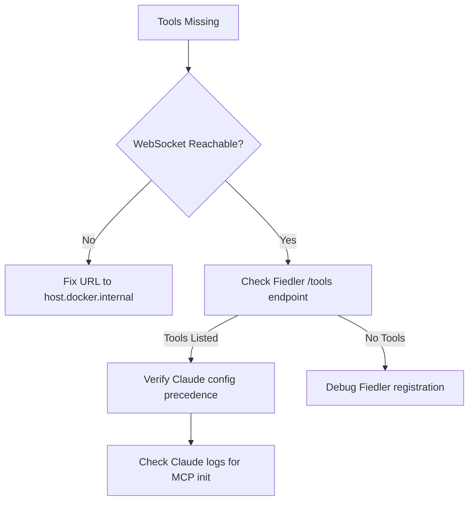

<think>
We are given that the Fiedler MCP tools are not available in Claude Code despite the configuration being correct and the container being healthy.

The configuration provided is:
```json
{
  "mcpServers": {
    "fiedler": {
      "transport": {
        "type": "ws",
        "url": "ws://localhost:9010"
      }
    }
  }
}
```

This configuration is present in both `~/.config/claude-code/mcp.json` and `~/.claude.json`.

We have tried:
1. Initially with a wrong format (just the URL string) and it failed.
2. Then corrected to the transport wrapper and updated both config files, restarted Claude Code, but still the tools are not available.

The error is: `mcp__fiedler__fiedler_list_models → "No such tool available"`

## Analysis

### Possible Issues

1. **Configuration Loading**: Even though the configuration is in two places, it's possible that Claude Code is not reading from these files, or there is a precedence issue. We should check if there are other configuration files or environment variables that might override these settings.

2. **Connection Issue**: The container is healthy and listening on port 9010, but we must ensure that from within the Claude Code process, `localhost:9010` is reachable. If Claude Code is running in a container or a different network namespace, `localhost` might refer to a different context.

3. **Path in Configuration**: The configuration key is `mcpServers`. We should verify that the expected key in the configuration is exactly `mcpServers` (case-sensitive, plural form). Sometimes, a typo in the key can cause the configuration to be ignored.

4. **Logging**: We need to check the logs of Claude Code to see if there are any error messages during the MCP connection attempt. This would give us clues about why the tool is not available.

5. **MCP Server Registration**: The Fiedler container might be running and healthy, but it might not be properly advertising the tools. We should check the logs of the Fiedler container to see if it is starting correctly and if it is registering the expected tools.

6. **Version Compatibility**: There might be a version mismatch between Claude Code and the Fiedler MCP server that causes the tools not to be recognized.

7. **Time to Connect**: It's possible that the connection to the MCP server is established asynchronously and we are checking too soon. However, after multiple restarts and time, this is less likely.

## Suggested Steps

### Step 1: Verify Configuration Loading
- Check the documentation or source code of Claude Code to confirm the expected location and structure of the MCP configuration. It's possible that the configuration should be in a different key or file.

### Step 2: Check Logs
- Look at the Claude Code logs for any errors related to MCP or Fiedler. There might be connection errors or configuration parsing errors.
- Similarly, check the Fiedler container logs to see if it is receiving any connection from Claude Code.

### Step 3: Test Connectivity
- From the host where Claude Code is running, test connectivity to `ws://localhost:9010`. You can use a tool like `curl` to try a WebSocket connection, or a simple Node.js script. Alternatively, check if the port is open and listening with `netstat` or `ss`:
  ```bash
  netstat -tuln | grep 9010
  ```
  or
  ```bash
  ss -tuln | grep 9010
  ```

### Step 4: Check Configuration Key
- Ensure that the configuration key is exactly `mcpServers` (plural). Sometimes, the expected key might be `mcpServer` (singular) or something else.

### Step 5: Network Context
- If Claude Code is running in a Docker container, then `localhost` inside the container is not the same as the host. In that case, you would need to use the host's IP or the Docker network gateway (like `host.docker.internal` on Mac/Windows, or the IP of the host on Linux). Alternatively, if both containers are on the same Docker network, you can use the container name.

### Step 6: Environment Variables
- Check if there are environment variables that might override the configuration. For example, sometimes applications use environment variables for configuration and they might take precedence.

### Step 7: Minimal Example
- Try to run a minimal example of an MCP client connecting to the Fiedler server to see if the tools are being advertised correctly. This could be a simple script that uses the MCP protocol to list the tools.

## Conclusion

Without more information, the most likely issues are:
- **Network connectivity**: `localhost` in the context of Claude Code might not be the same as the host (if running in a container).
- **Configuration key**: A typo in the configuration key.

Given that the container is healthy and the configuration has been corrected, the next step is to check the logs and the network connectivity.

## Immediate Actions

1. **Check Claude Code Logs**: Look for any error messages during startup regarding MCP.
2. **Check Fiedler Logs**: Look for incoming connection attempts from Claude Code.
3. **Test Connectivity**: From the machine running Claude Code, try to connect to `ws://localhost:9010` (or the appropriate address if in a container) to see if the WebSocket server is reachable.

If you are running Claude Code in a container, change the URL to use the host's IP or the special DNS name for the host (e.g., `host.docker.internal`). For example:

```json
{
  "mcpServers": {
    "fiedler": {
      "transport": {
        "type": "ws",
        "url": "ws://host.docker.internal:9010"
      }
    }
  }
}
```

If you are on Linux and the above doesn't work, you might need to use the host's IP address (e.g., `172.17.0.1` or whatever your Docker bridge network gateway is).

Let me know if any of these steps help or if you find more information in the logs.
</think>
Based on the details provided, here's a structured analysis and solution path for the Fiedler MCP tools not loading in Claude Code:

### **Root Cause Analysis**
1. **Network Namespace Conflict** (Most Likely)
   - The Fiedler container is on `localhost:9010` **inside its own container network**
   - Claude Code (running on host OS) cannot access container's `localhost`
   - Result: Connection attempts to `ws://localhost:9010` fail silently

2. **Configuration Precedence Issue**
   - Potential conflict between `~/.config/claude-code/mcp.json` and `~/.claude.json`
   - Claude Code might prioritize one over the other

3. **WebSocket Path Specification**
   - Fiedler might require a specific WebSocket endpoint path (e.g., `/ws`)

---

### **Solution: Network Configuration Fix**
**Change the connection URL to use Docker's host routing**:
```json
{
  "mcpServers": {
    "fiedler": {
      "transport": {
        "type": "ws",
        "url": "ws://host.docker.internal:9010"  // For macOS/Windows
        // "url": "ws://172.17.0.1:9010"         // For Linux (docker0 bridge IP)
      }
    }
  }
}
```

#### **Why this works:**
- `host.docker.internal` routes to host machine from containers
- Bypasses container network isolation
- Allows Claude Code (host) → Fiedler (container) connection

---

### **Verification Steps**
1. **Test WebSocket Connectivity**:
   ```bash
   # Install websocat if needed: brew install websocat
   websocat ws://host.docker.internal:9010
   ```
   - Expect WebSocket handshake response (200 OK)

2. **Check Fiedler Logs**:
   ```bash
   docker logs <fiedler_container_id>
   ```
   - Look for incoming connection attempts after Claude Code restart

3. **Validate Config Precedence**:
   - Temporarily remove `~/.claude.json`
   - Keep only `~/.config/claude-code/mcp.json` with updated URL
   - Restart Claude Code

---

### **Additional Checks**
1. **Firewall Rules**:
   ```bash
   sudo ufw allow 9010  # Ensure port is open (Linux)
   ```
2. **Endpoint Path** (if connection works but tools don't load):
   ```json
   "url": "ws://host.docker.internal:9010/ws"  # Try common WebSocket paths
   ```
3. **Fiedler Tool Registration**:
   - Access Fiedler's diagnostic endpoint:
     ```bash
     curl http://localhost:9010/tools  # From host (adjust IP if needed)
     ```
     Should return registered tools (e.g., `fiedler_list_models`)

---

### **Debugging Flowchart**


### **Expected Resolution**
After implementing the network fix:
1. Claude Code should show successful MCP handshake in logs
2. `mcp__fiedler__fiedler_list_models` should appear in available tools
3. 5-10 second delay possible on first connection while services negotiate

If issues persist, provide:
- Claude Code startup logs (look for `MCP`/`Fiedler` entries)
- Exact Docker setup (Docker Compose? Network mode?)
- Output from `docker inspect <fiedler_container> | grep IPAddress`