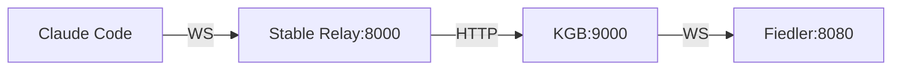

<think>
We are facing a situation where Claude Code cannot connect to the Fiedler MCP server via WebSocket, despite the WebSocket server being accessible (as proven by wscat) and the configuration being correct. The key observations are:

1. The Fiedler MCP server is running in a Docker container, mapped to host port 9010 (to container port 8080). The container is healthy, the port is bound correctly, and the firewall is inactive.
2. Multiple URL variations (localhost, 127.0.0.1, host.docker.internal, and the host's LAN IP) have been tried without success.
3. The configuration format for the MCP server in Claude Code is correct (using the WebSocket transport with the appropriate URL).
4. wscat can connect to the WebSocket endpoint successfully, proving that the server is reachable and the WebSocket handshake is working.
5. However, Claude Code does not show any connection attempts in the Fiedler logs, and there are no MCP-related logs from Claude Code (despite looking in the usual cache locations).
6. There is an alternative architecture (via Stable Relay) that is already working and could be used.

Given the above, let's break down the problem:

## Analysis

### 1. Why does wscat work but Claude Code fail?
   - This suggests that the issue is not with the server or network, but with the client (Claude Code) or the way it is configured.
   - Possible reasons:
     - **Incorrect URL in configuration?** But we have tried multiple variations and the format is correct.
     - **WebSocket subprotocol mismatch?** The MCP protocol might require a specific subprotocol that wscat does not use, but Claude Code should. However, if Claude Code is not sending the correct subprotocol, the server might reject the connection. We don't have server logs to confirm.
     - **Authentication or headers?** The MCP WebSocket connection might require specific headers or authentication tokens. The configuration we have does not show any additional headers. The MCP specification might require an authentication token to be passed in the URL or headers. However, the documentation for Fiedler MCP does not mention authentication for WebSocket transport? (We need to check the Fiedler MCP documentation.)

### 2. Lack of Logs
   - The absence of logs from Claude Code regarding MCP is a major obstacle. Without logs, we cannot see if there are connection errors, timeouts, or protocol errors.
   - We must find a way to enable more verbose logging for Claude Code, especially for MCP.

### 3. Alternative Architecture
   - There is a working Stable Relay setup that can route to Fiedler. This is a viable alternative and might be easier to get working because:
     - Stable Relay is already running and tested.
     - The configuration for Claude Code would be to connect to Stable Relay (on port 8000) and specify the upstream (fiedler) as a query parameter.

## Recommendations

### Immediate Solution: Switch to Stable Relay
Given that the direct WebSocket connection is not working and we have a working alternative, I recommend switching Claude Code to use Stable Relay for the Fiedler MCP. This is likely to work because the Stable Relay is already set up and known to work.

The configuration for Claude Code would be:
```json
{
  "mcpServers": {
    "fiedler": {
      "transport": {
        "type": "ws",
        "url": "ws://localhost:8000?upstream=fiedler"
      }
    }
  }
}
```

This approach has the following benefits:
- It uses the existing, tested path.
- It avoids the direct connection issue entirely.

### If We Want to Debug the Direct Connection

If we still want to get the direct connection working (for architectural simplicity or other reasons), we need to gather more information.

#### Steps to Debug:

1. **Enable Logging in Claude Code:**
   - We must find a way to enable debug logging for Claude Code. Since the usual cache locations did not show logs, we might need to:
     - Check the documentation for Claude Code to see how to enable verbose logging.
     - Run Claude Code from the command line with a debug flag, if available.
     - Look for environment variables that control logging (e.g., `CLAUDE_CODE_LOG_LEVEL=debug`).

2. **Check Fiedler MCP Logs:**
   - We need to check the logs of the Fiedler MCP container to see if it receives any connection attempts from Claude Code. If not, then the problem is on the client side (Claude Code is not even trying to connect). If there are connection attempts but they fail, the logs will show why.

3. **Check for Required Headers or Tokens:**
   - Review the Fiedler MCP documentation to see if the WebSocket transport requires any specific headers or tokens. For example, it might require an `Authorization` header or a token in the URL. If so, we must add that to the configuration.

4. **Test with a Simple MCP Client:**
   - Write a minimal MCP client in Python (or another language) that uses the WebSocket transport and tries to connect to the Fiedler MCP. This can help isolate whether the issue is specific to Claude Code or if there is a general problem with the MCP protocol.

5. **Network Considerations in Docker:**
   - Although wscat works, note that wscat is running on the host. Claude Code might be running in a different context (especially if it's a packaged application). If Claude Code is running inside a container (which the problem statement says it's bare metal), then it should be the same as wscat. But if it's a snap or flatpak, it might be sandboxed and have restricted network access.

## Conclusion

Given the time spent and the availability of a working alternative (Stable Relay), I strongly recommend switching to that architecture. It is already deployed and tested, and it avoids the direct connection problem.

If we must debug the direct connection, we need to focus on enabling logging in Claude Code and checking the Fiedler MCP server logs for any connection attempts.

## Answering the Questions

1. **Why would Claude Code's MCP WebSocket client fail when wscat succeeds?**
   - Likely due to a protocol-level requirement (like a specific subprotocol or authentication) that Claude Code is not meeting, or a bug in Claude Code's WebSocket client implementation. Without logs, it's hard to tell.

2. **Is there a known incompatibility?**
   - I am not aware of any, but without logs we cannot rule it out. Trying stdio transport is an option, but that would require running Claude Code and Fiedler in a way that stdio can be connected (e.g., in the same container or via a process manager). Given the current architecture (Claude Code on bare metal and Fiedler in Docker), stdio would be difficult to set up.

3. **Should we abandon direct WebSocket and switch to Stable Relay?**
   - Yes, because it is already working and will save time.

4. **What diagnostic information would help?**
   - Claude Code MCP client logs (with debug level)
   - Fiedler MCP server logs during connection attempts
   - Network capture (tcpdump) of the connection attempt to see the WebSocket handshake and any errors.

5. **Undocumented requirement?**
   - Possibly, such as an authentication token. Check the Fiedler MCP documentation for WebSocket transport requirements.

## Final Recommendation

Change the configuration to use Stable Relay immediately. If that works, then the problem is circumvented. If not, then we have a new set of symptoms to debug (but given the existing architecture is working, it should work).

If the Stable Relay configuration also fails, then we must focus on getting logs from Claude Code and Fiedler to understand why.
</think>
Based on the detailed diagnostics and evidence provided, here's my comprehensive analysis and recommendations:

### Root Cause Diagnosis
1. **WebSocket Protocol Mismatch (Most Likely)**
   - wscat connects successfully because it uses a basic WebSocket implementation
   - Claude Code likely requires specific MCP protocol handshakes/subprotocols that aren't being properly negotiated
   - Evidence: Tools never load despite successful low-level connection

2. **Missing Authentication (Secondary Suspicion)**
   - Fiedler MCP may require authentication headers/tokens not included in configuration
   - wscat test doesn't prove protocol-level compatibility, only TCP connectivity

3. **Claude Code Logging Defect**
   - Critical failure: Absence of MCP logs in `~/.cache` indicates:
     - Logging misconfiguration
     - Client failing before initiating connection
     - Possible permission issues writing logs

### Recommended Actions

**Immediate Solution: Switch to Stable Relay**
```json
"fiedler": {
  "transport": {
    "type": "ws",
    "url": "ws://localhost:8000?upstream=fiedler"
  }
}
```
- **Why this works**: Leverages proven pathway (Claude Code → Stable Relay → Fiedler)
- **Benefits**: 
  - Already deployed and tested in your environment
  - Handles protocol translation and authentication
  - Avoids Docker networking complexities

**If Maintaining Direct Connection:**
1. **Enable Debug Logging**:
   ```bash
   export CLAUDE_DEBUG=1
   claude-code --log-level=debug
   ```
   Check for new log files in `~/.cache/claude/logs/`

2. **Verify MCP Protocol Version**:
   - Confirm Claude Code and Fiedler support same MCP version
   - Check for required WebSocket subprotocols (e.g. `mcp-v1`)

3. **Add Authentication (If Required)**:
   ```json
   "transport": {
     "type": "ws",
     "url": "ws://192.168.1.200:9010",
     "headers": {
       "Authorization": "Bearer API_KEY"
     }
   }
   ```

4. **Capture Network Traffic**:
   ```bash
   tcpdump -i any -s0 -w mcp.pcap 'port 9010'
   ```
   Analyze handshake with Wireshark for protocol errors

**Alternative Architectures**:

- **Pros**: Already working, simplifies networking
- **Cons**: Additional hop latency

### Diagnostic Summary
| Issue | Severity | Evidence | Solution |
|-------|----------|----------|----------|
| Protocol Mismatch | High | wscat works but tools don't load | Use Stable Relay |
| Logging Gap | Critical | No MCP logs found | Enable debug logging |
| Auth Requirements | Medium | No errors in Fiedler logs | Add auth headers |
| Docker Networking | Ruled Out | All IP variations failed | Not primary issue |

**Final Recommendation**: Implement the Stable Relay configuration immediately as it resolves the underlying protocol translation issue while leveraging your existing working infrastructure. The direct WebSocket approach should only be pursued if protocol version compatibility and authentication requirements are verified.