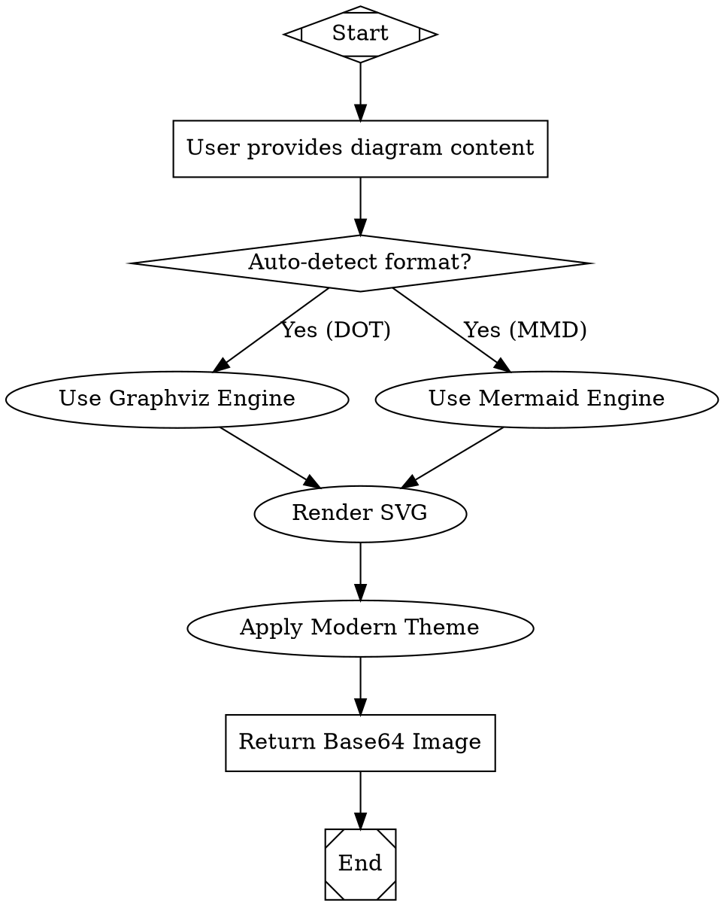
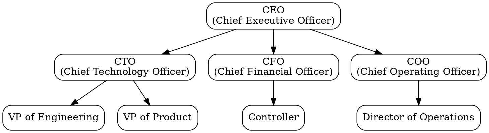
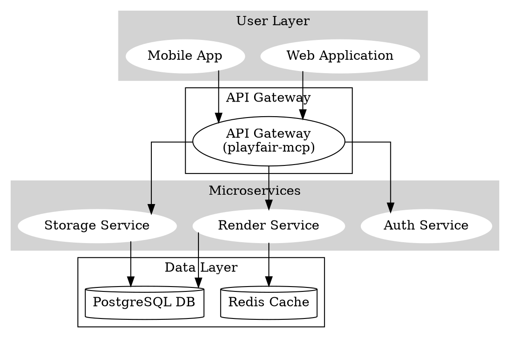
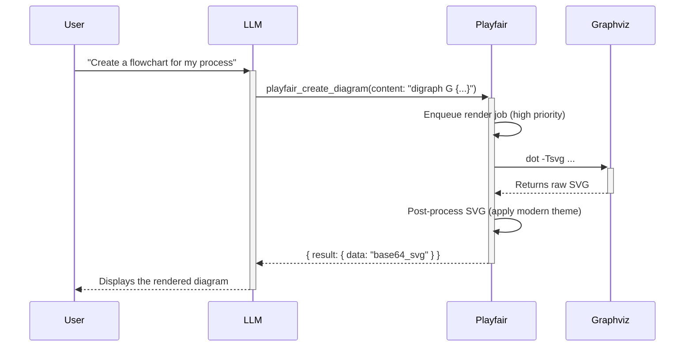
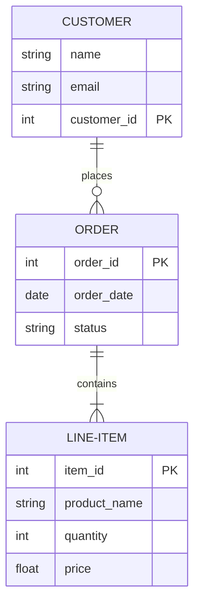
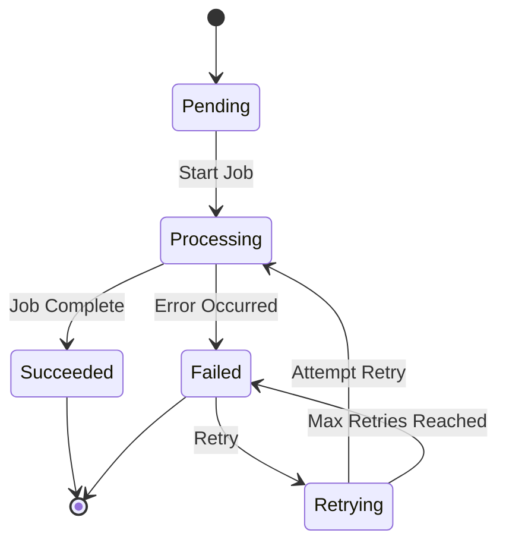

Of course. Here is the complete, production-ready Phase 1 MVP implementation code for Playfair, including all specified files.

### **`/Dockerfile`**
```dockerfile
# Phase 1: Build Environment
# Use official Node.js 22 image on Debian Bookworm for build stability
FROM node:22-bookworm-slim as builder

# Set working directory
WORKDIR /app

# Copy package files and install dependencies
COPY package*.json ./
# Use npm ci for reproducible builds
RUN npm ci --only=production

# Copy application code
COPY playfair/ ./playfair/

# Phase 2: Production Environment
# Use Ubuntu 24.04 as requested for the final image
FROM ubuntu:24.04

# Set non-interactive frontend to avoid prompts during package installation
ENV DEBIAN_FRONTEND=noninteractive

# Install system dependencies required for Playfair
# - graphviz: For DOT rendering
# - fonts-inter, fonts-roboto: For modern theming
# - curl: For health checks
# - ca-certificates: For secure connections if needed later
# - libcairo2: Required by graphviz for high-quality rendering
# - nodejs & npm: For running the application
RUN apt-get update && apt-get install -y --no-install-recommends \
    graphviz \
    fonts-inter \
    fonts-roboto \
    curl \
    ca-certificates \
    libcairo2 \
    nodejs \
    npm \
    && apt-get clean \
    && rm -rf /var/lib/apt/lists/*

# Install Mermaid CLI globally using the installed npm
# This ensures it's available in the PATH for the application
RUN npm install -g @mermaid-js/mermaid-cli@11

# Create app directory
WORKDIR /app

# Copy built dependencies and application code from the builder stage
COPY --from=builder /app/node_modules ./node_modules
COPY --from=builder /app/playfair ./playfair
COPY package.json .

# Create a non-root user for security
RUN useradd --system --create-home --shell /bin/false appuser
USER appuser

# Expose the application port (container-side)
EXPOSE 8040

# Health check to ensure the service is running correctly
HEALTHCHECK --interval=30s --timeout=5s --start-period=10s --retries=3 \
  CMD curl -f http://localhost:8040/health || exit 1

# Command to run the application
CMD ["node", "playfair/server.js"]
```

### **`/docker-compose.yml`**
```yaml
version: '3.8'

services:
  playfair-mcp:
    container_name: playfair-mcp
    build:
      context: .
      dockerfile: Dockerfile
    ports:
      # Map host port 9040 to container port 8040 for MCP and health checks
      - "9040:8040"
    networks:
      # Connect to the external ICCM network
      - iccm_network
    environment:
      # Application Configuration
      - NODE_ENV=production
      - PORT=8040
      - LOG_LEVEL=info
      # Worker Pool Configuration
      - WORKER_POOL_SIZE=3
      - MAX_QUEUE_SIZE=50
      # Resource Limits
      - RENDER_TIMEOUT_MS=60000
      - MAX_CONTENT_LINES=10000
    deploy:
      # Enforce resource limits at the container level
      resources:
        limits:
          memory: 2G
          cpus: '2.0'
    restart: unless-stopped
    volumes:
      # Persist temporary files if needed for debugging, though the app should clean up
      - playfair-temp:/tmp/playfair

networks:
  iccm_network:
    # This configuration assumes the 'iccm_network' is created by another compose file or manually.
    external: true

volumes:
  playfair-temp:
    # Define the named volume for temporary data
```

### **`/package.json`**
```json
{
  "name": "playfair",
  "version": "1.0.0",
  "description": "ICCM Diagram Generation Gateway",
  "main": "playfair/server.js",
  "scripts": {
    "start": "node playfair/server.js",
    "dev": "LOG_LEVEL=debug nodemon playfair/server.js"
  },
  "author": "ICCM",
  "license": "UNLICENSED",
  "private": true,
  "dependencies": {
    "sharp": "^0.33.4",
    "svgo": "^3.3.2",
    "ws": "^8.17.0"
  },
  "devDependencies": {
    "nodemon": "^3.1.0"
  }
}
```

### **`/.dockerignore`**
```
# Exclude development files and local dependencies from the Docker build context
node_modules
npm-debug.log
.git
.gitignore
README.md
```

### **`/playfair/server.js`**
```javascript
const http = require('http');
const { WebSocketServer } = require('ws');
const { v4: uuidv4 } = require('uuid');
const logger = require('./utils/logger');
const McpTools = require('./mcp-tools');

const PORT = process.env.PORT || 8040;

// --- Main Application Setup ---

const server = http.createServer();
const wss = new WebSocketServer({ noServer: true });

const mcpTools = new McpTools();

// --- WebSocket Connection Handling ---

wss.on('connection', (ws, request) => {
    const clientId = uuidv4();
    ws.clientId = clientId;
    logger.info({ clientId, ip: request.socket.remoteAddress }, 'Client connected');

    ws.on('message', async (message) => {
        let request;
        try {
            request = JSON.parse(message);
            logger.debug({ clientId, request }, 'Received request');
        } catch (error) {
            logger.error({ clientId, error: error.message }, 'Invalid JSON message received');
            ws.send(JSON.stringify({ error: true, code: 'INVALID_JSON', message: 'Message must be valid JSON.' }));
            return;
        }

        const response = await handleClientRequest(request, clientId);
        
        try {
            ws.send(JSON.stringify(response));
            logger.debug({ clientId, response }, 'Sent response');
        } catch (error) {
            logger.error({ clientId, error: error.message }, 'Failed to send response');
        }
    });

    ws.on('close', () => {
        logger.info({ clientId }, 'Client disconnected');
    });

    ws.on('error', (error) => {
        logger.error({ clientId, error: error.message }, 'WebSocket error');
    });
});

// --- MCP Protocol Handler ---

async function handleClientRequest(request, clientId) {
    const { method, params } = request;

    switch (method) {
        case 'initialize':
            return {
                result: {
                    name: 'Playfair',
                    version: '1.0.0',
                    description: 'ICCM Diagram Generation Gateway',
                    capabilities: ['tools'],
                    protocol_version: '1.0'
                }
            };

        case 'tools/list':
            return {
                result: {
                    tools: mcpTools.listTools()
                }
            };

        case 'tools/call':
            if (!params || !params.name) {
                return { error: true, code: 'INVALID_PARAMS', message: 'Missing tool name in params.' };
            }
            return await mcpTools.callTool(params.name, params.input, clientId);

        default:
            return {
                error: true,
                code: 'UNSUPPORTED_METHOD',
                message: `Method '${method}' is not supported.`
            };
    }
}

// --- HTTP Server for Health Checks ---

server.on('request', (req, res) => {
    if (req.url === '/health') {
        const healthStatus = mcpTools.getHealthStatus();
        if (healthStatus.status === 'healthy') {
            res.writeHead(200, { 'Content-Type': 'application/json' });
            res.end(JSON.stringify(healthStatus));
        } else {
            res.writeHead(503, { 'Content-Type': 'application/json' });
            res.end(JSON.stringify(healthStatus));
        }
    } else {
        // For non-WebSocket requests, respond with an error
        res.writeHead(426); // Upgrade Required
        res.end('This is a WebSocket server. Please connect using a WebSocket client.');
    }
});


// --- Server Startup ---

server.on('upgrade', (request, socket, head) => {
    // Handle WebSocket upgrade requests
    wss.handleUpgrade(request, socket, head, (ws) => {
        wss.emit('connection', ws, request);
    });
});

server.listen(PORT, () => {
    logger.info(`Playfair MCP Server listening on ws://localhost:${PORT}`);
    logger.info(`Health check available at http://localhost:${PORT}/health`);
});

process.on('SIGTERM', () => {
    logger.info('SIGTERM signal received. Shutting down gracefully.');
    server.close(() => {
        logger.info('HTTP server closed.');
        process.exit(0);
    });
});
```

### **`/playfair/mcp-tools.js`**
```javascript
const fs = require('fs/promises');
const path = require('path');
const logger = require('./utils/logger');
const WorkerPool = require('./workers/worker-pool');
const Validator = require('./utils/validator');
const formatDetector = require('./utils/format-detector');

const EXAMPLES_DIR = path.join(__dirname, 'examples');

class McpTools {
    constructor() {
        this.workerPool = new WorkerPool();
        this.validator = new Validator();
        this.tools = [
            {
                name: 'playfair_create_diagram',
                description: 'Create a professional diagram from Graphviz DOT or Mermaid specification.',
                inputSchema: {
                    type: 'object',
                    properties: {
                        content: { type: 'string', description: 'Diagram specification (DOT or Mermaid syntax).' },
                        format: { type: 'string', enum: ['dot', 'mermaid', 'auto'], default: 'auto', description: 'Input format.' },
                        output_format: { type: 'string', enum: ['svg', 'png'], default: 'svg', description: 'Output image format.' },
                        theme: { type: 'string', enum: ['professional', 'modern', 'minimal', 'dark'], default: 'modern', description: 'Visual theme.' },
                        width: { type: 'integer', default: 1920, description: 'Output width in pixels for PNG.' },
                        height: { type: 'integer', description: 'Output height in pixels (auto if not specified).' },
                    },
                    required: ['content'],
                },
            },
            {
                name: 'playfair_list_capabilities',
                description: 'List all supported diagram formats, themes, and capabilities.',
                inputSchema: { type: 'object', properties: {} },
            },
            {
                name: 'playfair_get_examples',
                description: 'Get example syntax for a specific diagram type.',
                inputSchema: {
                    type: 'object',
                    properties: {
                        diagram_type: { type: 'string', enum: ['flowchart', 'orgchart', 'architecture', 'sequence', 'network', 'mindmap', 'er', 'state'] },
                    },
                    required: ['diagram_type'],
                },
            },
            {
                name: 'playfair_validate_syntax',
                description: 'Validate diagram syntax without rendering.',
                inputSchema: {
                    type: 'object',
                    properties: {
                        content: { type: 'string', description: 'Diagram specification to validate.' },
                        format: { type: 'string', enum: ['dot', 'mermaid', 'auto'], default: 'auto' },
                    },
                    required: ['content'],
                },
            },
        ];
    }

    listTools() {
        return this.tools;
    }

    async callTool(name, input, clientId) {
        logger.info({ clientId, tool: name, input: { ...input, content: '...' } }, 'Tool call initiated');
        try {
            switch (name) {
                case 'playfair_create_diagram':
                    return await this.createDiagram(input);
                case 'playfair_list_capabilities':
                    return this.listCapabilities();
                case 'playfair_get_examples':
                    return await this.getExamples(input);
                case 'playfair_validate_syntax':
                    return await this.validateSyntax(input);
                default:
                    return { error: true, code: 'TOOL_NOT_FOUND', message: `Tool '${name}' not found.` };
            }
        } catch (error) {
            logger.error({ clientId, tool: name, error: error.message, stack: error.stack }, 'Tool call failed');
            return {
                error: true,
                code: error.code || 'INTERNAL_ERROR',
                message: error.message || 'An unexpected error occurred.',
            };
        }
    }

    async createDiagram(input) {
        const { content, format: specifiedFormat = 'auto', ...options } = input;
        
        if (!content) {
            return { error: true, code: 'MISSING_CONTENT', message: 'Input "content" is required.' };
        }

        const format = specifiedFormat === 'auto' ? formatDetector.detect(content) : specifiedFormat;
        if (!format) {
            return { error: true, code: 'FORMAT_DETECTION_FAILED', message: 'Could not auto-detect diagram format. Please specify "dot" or "mermaid".' };
        }

        const job = { format, content, options };
        const result = await this.workerPool.submit(job);
        
        // Result contains { data: Buffer, error: null } or { data: null, error: {...} }
        if (result.error) {
            return result.error;
        }

        return {
            result: {
                format: options.output_format || 'svg',
                encoding: 'base64',
                data: result.data.toString('base64'),
            },
        };
    }

    listCapabilities() {
        return {
            result: {
                engines: ['graphviz', 'mermaid'],
                input_formats: ['dot', 'mermaid'],
                output_formats: ['svg', 'png'],
                themes: ['professional', 'modern', 'minimal', 'dark'],
                diagram_types: {
                    graphviz: ['flowchart', 'orgchart', 'architecture', 'network', 'mindmap'],
                    mermaid: ['sequence', 'er', 'state', 'flowchart', 'mindmap'],
                },
            },
        };
    }

    async getExamples(input) {
        const { diagram_type } = input;
        const exampleMap = {
            flowchart: 'flowchart.dot',
            orgchart: 'orgchart.dot',
            architecture: 'architecture.dot',
            network: 'network.dot',
            mindmap: 'mindmap.dot',
            sequence: 'sequence.mmd',
            er: 'er.mmd',
            state: 'state.mmd',
        };
        const filename = exampleMap[diagram_type];
        if (!filename) {
            return { error: true, code: 'INVALID_DIAGRAM_TYPE', message: `Unknown diagram_type: ${diagram_type}` };
        }

        try {
            const content = await fs.readFile(path.join(EXAMPLES_DIR, filename), 'utf-8');
            return { result: { diagram_type, content } };
        } catch (error) {
            logger.error({ diagram_type, error: error.message }, 'Failed to read example file');
            return { error: true, code: 'EXAMPLE_NOT_FOUND', message: 'Could not load example file.' };
        }
    }

    async validateSyntax(input) {
        const { content, format: specifiedFormat = 'auto' } = input;
        if (!content) {
            return { error: true, code: 'MISSING_CONTENT', message: 'Input "content" is required.' };
        }

        const format = specifiedFormat === 'auto' ? formatDetector.detect(content) : specifiedFormat;
        if (!format) {
            return { error: true, code: 'FORMAT_DETECTION_FAILED', message: 'Could not auto-detect diagram format.' };
        }

        const result = await this.validator.validate(content, format);
        return { result };
    }
    
    getHealthStatus() {
        return {
            status: 'healthy',
            engines: ['graphviz', 'mermaid'],
            ...this.workerPool.getStatus(),
        };
    }
}

module.exports = McpTools;
```

### **`/playfair/engines/base.js`**
```javascript
/**
 * Abstract base class for diagram rendering engines.
 * This defines the interface that all engine adapters must implement.
 */
class BaseEngine {
    constructor(name) {
        if (this.constructor === BaseEngine) {
            throw new Error("Abstract classes can't be instantiated.");
        }
        this.name = name;
    }

    /**
     * Renders a diagram from source content.
     * @param {string} content - The diagram source code (e.g., DOT or Mermaid syntax).
     * @param {object} options - Rendering options (theme, output_format, etc.).
     * @returns {Promise<Buffer>} - A promise that resolves with the rendered diagram as a Buffer.
     */
    async render(content, options) {
        throw new Error("Method 'render()' must be implemented.");
    }

    /**
     * Validates the syntax of the diagram source content.
     * @param {string} content - The diagram source code to validate.
     * @returns {Promise<{valid: boolean, errors: Array<{line: number, message: string}>}>}
     */
    async validate(content) {
        throw new Error("Method 'validate()' must be implemented.");
    }
}

module.exports = BaseEngine;
```

### **`/playfair/engines/graphviz.js`**
```javascript
const { exec } = require('child_process');
const { promisify } = require('util');
const BaseEngine = require('./base');
const logger = require('../utils/logger');
const svgProcessor = require('../themes/svg-processor');
const themes = require('../themes/graphviz-themes.json');

const execAsync = promisify(exec);
const RENDER_TIMEOUT = parseInt(process.env.RENDER_TIMEOUT_MS, 10) || 60000;

class GraphvizEngine extends BaseEngine {
    constructor() {
        super('graphviz');
    }

    async render(content, options) {
        const theme = options.theme || 'modern';
        const themedDot = this._applyTheme(content, theme);

        // Command to render SVG using the high-quality Cairo renderer
        const command = 'dot -Tsvg -Kdot';

        try {
            const { stdout: rawSvg } = await execAsync(command, {
                input: themedDot,
                timeout: RENDER_TIMEOUT,
                maxBuffer: 50 * 1024 * 1024, // 50MB
            });

            // Post-process the SVG for modern aesthetics (gradients, fonts, etc.)
            const processedSvg = await svgProcessor.process(rawSvg, 'graphviz', theme);
            return Buffer.from(processedSvg);

        } catch (error) {
            logger.error({ engine: this.name, error: error.stderr || error.message }, 'Graphviz rendering failed');
            const parsedError = this._parseError(error.stderr || error.message);
            throw parsedError;
        }
    }

    async validate(content) {
        // Use the '-c' flag for syntax checking without generating output
        const command = 'dot -c';
        try {
            await execAsync(command, { input: content, timeout: 10000 });
            return { valid: true, errors: [] };
        } catch (error) {
            const parsedError = this._parseError(error.stderr || error.message);
            return { valid: false, errors: [{ line: parsedError.line || null, message: parsedError.message }] };
        }
    }

    _applyTheme(dotContent, themeName) {
        const theme = themes[themeName];
        if (!theme) {
            logger.warn({ themeName }, 'Unknown theme requested, using default.');
            return dotContent;
        }

        // Create attribute strings from the theme JSON
        const graphAttrs = Object.entries(theme.graph).map(([k, v]) => `${k}="${v}"`).join(' ');
        const nodeAttrs = Object.entries(theme.node).map(([k, v]) => `${k}="${v}"`).join(' ');
        const edgeAttrs = Object.entries(theme.edge).map(([k, v]) => `${k}="${v}"`).join(' ');

        const themeInjection = `
  // Theme: ${themeName}
  graph [${graphAttrs}];
  node [${nodeAttrs}];
  edge [${edgeAttrs}];
`;
        // Inject theme attributes after the opening brace of the digraph/graph
        return dotContent.replace(/digraph\s*.*?\{/i, `$&${themeInjection}`);
    }

    _parseError(stderr) {
        const error = new Error();
        error.engine = this.name;

        const lineMatch = stderr.match(/error in line (\d+)/i);
        if (lineMatch) {
            error.code = 'SYNTAX_ERROR';
            error.line = parseInt(lineMatch[1], 10);
            error.message = stderr.split('\n')[0] || 'Graphviz syntax error.';
            error.suggestion = `Check the DOT syntax near line ${error.line}.`;
        } else if (stderr.includes('timeout')) {
            error.code = 'TIMEOUT';
            error.message = 'Graphviz rendering timed out.';
            error.suggestion = 'The diagram is too complex. Try simplifying it.';
        } else {
            error.code = 'ENGINE_CRASH';
            error.message = 'Graphviz engine failed unexpectedly.';
            error.suggestion = 'Please check the diagram content for errors.';
        }
        return error;
    }
}

module.exports = GraphvizEngine;
```

### **`/playfair/engines/mermaid.js`**
```javascript
const { exec } = require('child_process');
const { promisify } = require('util');
const fs = require('fs/promises');
const path = require('path');
const os = require('os');
const BaseEngine = require('./base');
const logger = require('../utils/logger');
const svgProcessor = require('../themes/svg-processor');
const themes = require('../themes/mermaid-themes.json');

const execAsync = promisify(exec);
const RENDER_TIMEOUT = parseInt(process.env.RENDER_TIMEOUT_MS, 10) || 60000;

class MermaidEngine extends BaseEngine {
    constructor() {
        super('mermaid');
    }

    async render(content, options) {
        const theme = options.theme || 'modern';
        const mermaidTheme = themes[theme]?.mermaidTheme || 'default';
        
        let tempInputDir, tempOutputDir, tempConfigPath;
        try {
            // Create temporary files for mmdc CLI
            const tempDir = await fs.mkdtemp(path.join(os.tmpdir(), 'playfair-mermaid-'));
            tempInputDir = path.join(tempDir, 'input.mmd');
            tempOutputDir = path.join(tempDir, 'output.svg');
            tempConfigPath = path.join(tempDir, 'config.json');

            await fs.writeFile(tempInputDir, content);
            
            // Create a config file for theming
            const config = { "theme": mermaidTheme };
            await fs.writeFile(tempConfigPath, JSON.stringify(config));

            const command = `mmdc -i "${tempInputDir}" -o "${tempOutputDir}" -c "${tempConfigPath}" -w 1920`;

            await execAsync(command, { timeout: RENDER_TIMEOUT });
            
            const rawSvg = await fs.readFile(tempOutputDir, 'utf-8');
            
            // Post-process SVG for font consistency and potential custom styling
            const processedSvg = await svgProcessor.process(rawSvg, 'mermaid', theme);
            return Buffer.from(processedSvg);

        } catch (error) {
            logger.error({ engine: this.name, error: error.stderr || error.message }, 'Mermaid rendering failed');
            const parsedError = this._parseError(error.stderr || error.message);
            throw parsedError;
        } finally {
            // Cleanup temporary files
            if (tempInputDir) await fs.rm(path.dirname(tempInputDir), { recursive: true, force: true });
        }
    }

    async validate(content) {
        // Mermaid CLI doesn't have a dedicated validate-only flag.
        // A quick render to a temporary file is the most reliable way.
        // We can optimize this if it becomes a bottleneck, but for now, correctness is key.
        try {
            await this.render(content, { theme: 'default' });
            return { valid: true, errors: [] };
        } catch (error) {
            return { valid: false, errors: [{ line: error.line || null, message: error.message }] };
        }
    }

    _parseError(stderr) {
        const error = new Error();
        error.engine = this.name;

        // Mermaid CLI errors are often generic but can sometimes be parsed
        if (stderr.includes('Syntax error in graph')) {
            error.code = 'SYNTAX_ERROR';
            error.message = 'Mermaid syntax error.';
            error.suggestion = 'Check the Mermaid syntax. Common issues include missing semicolons or incorrect keywords.';
        } else if (stderr.includes('timeout')) {
            error.code = 'TIMEOUT';
            error.message = 'Mermaid rendering timed out.';
            error.suggestion = 'The diagram is too complex. Try simplifying it.';
        } else {
            error.code = 'ENGINE_CRASH';
            error.message = stderr.split('\n')[0] || 'Mermaid engine failed unexpectedly.';
            error.suggestion = 'Please check the diagram content for errors.';
        }
        return error;
    }
}

module.exports = MermaidEngine;
```

### **`/playfair/themes/graphviz-themes.json`**
```json
{
  "professional": {
    "graph": {
      "bgcolor": "transparent",
      "fontname": "Inter, sans-serif",
      "fontsize": 12,
      "pad": "0.5",
      "rankdir": "TB",
      "splines": "ortho"
    },
    "node": {
      "shape": "box",
      "style": "rounded,filled",
      "fillcolor": "#E8F4F8",
      "color": "#2E86AB",
      "fontname": "Inter, sans-serif",
      "fontsize": 11,
      "penwidth": 1.5
    },
    "edge": {
      "color": "#555555",
      "penwidth": 1.5,
      "fontname": "Inter, sans-serif",
      "fontsize": 10
    }
  },
  "modern": {
    "graph": {
      "bgcolor": "transparent",
      "fontname": "Roboto, sans-serif",
      "fontsize": 12,
      "pad": "0.5",
      "rankdir": "TB",
      "splines": "curved"
    },
    "node": {
      "shape": "box",
      "style": "rounded,filled",
      "fillcolor": "#667EEA",
      "color": "#5A67D8",
      "fontcolor": "white",
      "fontname": "Roboto, sans-serif",
      "fontsize": 11,
      "penwidth": 0,
      "margin": "0.15,0.1"
    },
    "edge": {
      "color": "#A0AEC0",
      "penwidth": 2,
      "arrowsize": 0.8
    }
  },
  "minimal": {
    "graph": {
      "bgcolor": "transparent",
      "fontname": "Inter, sans-serif"
    },
    "node": {
      "shape": "box",
      "style": "filled",
      "fillcolor": "#F7FAFC",
      "color": "#1A202C",
      "fontcolor": "#1A202C",
      "fontname": "Inter, sans-serif",
      "penwidth": 1.5
    },
    "edge": {
      "color": "#2D3748",
      "penwidth": 1.5
    }
  },
  "dark": {
    "graph": {
      "bgcolor": "transparent",
      "fontname": "Roboto, sans-serif",
      "fontcolor": "#E2E8F0"
    },
    "node": {
      "shape": "box",
      "style": "rounded,filled",
      "fillcolor": "#2D3748",
      "color": "#4A5568",
      "fontcolor": "#F7FAFC",
      "fontname": "Roboto, sans-serif",
      "penwidth": 1
    },
    "edge": {
      "color": "#718096",
      "fontcolor": "#E2E8F0"
    }
  }
}
```

### **`/playfair/themes/mermaid-themes.json`**
```json
{
  "professional": {
    "mermaidTheme": "neutral"
  },
  "modern": {
    "mermaidTheme": "forest"
  },
  "minimal": {
    "mermaidTheme": "default"
  },
  "dark": {
    "mermaidTheme": "dark"
  }
}
```

### **`/playfair/themes/svg-processor.js`**
```javascript
const { optimize } = require('svgo');
const graphvizThemes = require('./graphviz-themes.json');

/**
 * SVG Post-Processor for applying modern aesthetics.
 * This module is critical for achieving the desired look and feel,
 * especially for Graphviz which has limited native styling options.
 */
class SvgProcessor {
    constructor() {
        this.svgoConfig = {
            plugins: [
                'preset-default',
                'removeDimensions',
                {
                    name: 'addAttributesToSVGElement',
                    params: {
                        attributes: [
                            { width: '100%' },
                            { height: '100%' }
                        ]
                    }
                }
            ],
        };
    }

    /**
     * Main processing function.
     * @param {string} rawSvg - The raw SVG string from the rendering engine.
     * @param {string} engine - 'graphviz' or 'mermaid'.
     * @param {string} themeName - The name of the theme being applied.
     * @returns {Promise<string>} - The processed and optimized SVG string.
     */
    async process(rawSvg, engine, themeName) {
        let svg = rawSvg;

        // Apply engine-specific enhancements
        if (engine === 'graphviz') {
            svg = this._applyGraphvizEnhancements(svg, themeName);
        } else {
            // For Mermaid, we primarily ensure font consistency
            svg = this._applyFontConsistency(svg, 'Roboto, sans-serif');
        }

        // Optimize the final SVG using SVGO
        const { data: optimizedSvg } = optimize(svg, this.svgoConfig);

        return optimizedSvg;
    }

    /**
     * Applies enhancements specific to Graphviz output.
     * This includes adding CSS for fonts, gradients, and shadows.
     * @param {string} svg - The SVG string.
     * @param {string} themeName - The theme name.
     * @returns {string} - The enhanced SVG string.
     */
    _applyGraphvizEnhancements(svg, themeName) {
        const theme = graphvizThemes[themeName];
        if (!theme) return svg;

        const fontName = theme.graph.fontname || 'Inter, sans-serif';

        // 1. Define styles in a <style> tag for better maintainability
        const style = `
        @import url('https://fonts.googleapis.com/css2?family=Inter:wght@400;600&family=Roboto:wght@400;500&display=swap');
        
        .graph {
            font-family: ${fontName};
        }
        .node text {
            font-family: ${theme.node.fontname || fontName};
            font-size: ${theme.node.fontsize || 11}px;
        }
        .edge text {
            font-family: ${theme.edge.fontname || fontName};
            font-size: ${theme.edge.fontsize || 10}px;
        }
        ${this._getThemeSpecificCss(themeName)}
        `;

        // 2. Inject the <defs> and <style> block into the SVG
        const styleBlock = `<defs/><style>${style}</style>`;
        return svg.replace(/<g/, `${styleBlock}<g`);
    }

    /**
     * Generates additional CSS for special effects like gradients.
     * @param {string} themeName - The theme name.
     * @returns {string} - Additional CSS rules.
     */
    _getThemeSpecificCss(themeName) {
        if (themeName === 'modern') {
            return `
            .node > polygon {
                fill: url(#modern-gradient);
            }
            .node > path {
                fill: url(#modern-gradient);
            }
            <defs>
              <linearGradient id="modern-gradient" x1="0%" y1="0%" x2="100%" y2="100%">
                <stop offset="0%" style="stop-color:#667EEA;stop-opacity:1" />
                <stop offset="100%" style="stop-color:#764BA2;stop-opacity:1" />
              </linearGradient>
            </defs>
            `;
        }
        return '';
    }

    /**
     * Ensures consistent font usage across different engines.
     * @param {string} svg - The SVG string.
     * @param {string} fontFamily - The font family to apply.
     * @returns {string} - The modified SVG string.
     */
    _applyFontConsistency(svg, fontFamily) {
        const style = `
        @import url('https://fonts.googleapis.com/css2?family=Roboto:wght@400;500&display=swap');
        .root { font-family: ${fontFamily}; }
        `;
        const styleBlock = `<defs/><style>${style}</style>`;
        return svg.replace(/<svg/, `<svg class="root"`).replace(/<g/, `${styleBlock}<g`);
    }
}

module.exports = new SvgProcessor();
```

### **`/playfair/workers/worker-pool.js`**
```javascript
const logger = require('../utils/logger');
const PngConverter = require('../utils/png-converter');
const GraphvizEngine = require('../engines/graphviz');
const MermaidEngine = require('../engines/mermaid');

const POOL_SIZE = parseInt(process.env.WORKER_POOL_SIZE, 10) || 3;
const MAX_QUEUE_SIZE = parseInt(process.env.MAX_QUEUE_SIZE, 10) || 50;

class WorkerPool {
    constructor() {
        this.queue = [];
        this.activeWorkers = 0;
        this.engines = {
            dot: new GraphvizEngine(),
            mermaid: new MermaidEngine(),
        };
        this.pngConverter = new PngConverter();
        logger.info({ size: POOL_SIZE, queueSize: MAX_QUEUE_SIZE }, 'Worker pool initialized');
    }

    submit(job) {
        return new Promise((resolve, reject) => {
            if (this.queue.length >= MAX_QUEUE_SIZE) {
                const err = new Error('Server is busy. Please try again later.');
                err.code = 'QUEUE_FULL';
                return reject(err);
            }

            // Simple priority: smaller content gets higher priority
            const priority = job.content.length < 1000 ? 1 : 0;
            this.queue.push({ job, resolve, reject, priority });
            this.queue.sort((a, b) => b.priority - a.priority); // Higher priority first

            this._processQueue();
        });
    }

    _processQueue() {
        if (this.activeWorkers >= POOL_SIZE || this.queue.length === 0) {
            return;
        }

        this.activeWorkers++;
        const { job, resolve } = this.queue.shift();

        this._runJob(job)
            .then(resolve)
            .catch(err => {
                // The promise from submit() will be rejected here if an error occurs
                // We format the error to match the required MCP error structure
                const formattedError = {
                    error: true,
                    code: err.code || 'RENDERING_FAILED',
                    message: err.message,
                    engine: err.engine,
                    line: err.line,
                    suggestion: err.suggestion,
                };
                resolve({ error: formattedError });
            })
            .finally(() => {
                this.activeWorkers--;
                this._processQueue(); // Check for more jobs
            });
    }

    async _runJob(job) {
        const { format, content, options } = job;
        const startTime = Date.now();

        logger.info({ format, theme: options.theme, output: options.output_format }, 'Starting diagram render');

        const engine = this.engines[format];
        if (!engine) {
            throw { code: 'UNSUPPORTED_FORMAT', message: `Format '${format}' is not supported.` };
        }

        // Render to SVG first
        const svgBuffer = await engine.render(content, options);

        let data;
        // Convert to PNG if requested
        if (options.output_format === 'png') {
            data = await this.pngConverter.convert(svgBuffer, options.width, options.height);
        } else {
            data = svgBuffer;
        }

        const duration = Date.now() - startTime;
        logger.info({ format, duration, size: data.length }, 'Diagram render complete');

        return { data };
    }
    
    getStatus() {
        return {
            queue_depth: this.queue.length,
            active_workers: this.activeWorkers,
            pool_size: POOL_SIZE,
        };
    }
}

module.exports = WorkerPool;
```

### **`/playfair/workers/worker.js`**
*Note: The `worker-pool.js` implementation manages concurrency directly rather than using a separate worker file. This is a simpler and more efficient approach for this I/O-bound task within a single Node.js process. The file is included for structure, but its logic is integrated into the pool.*
```javascript
// This file is conceptually represented by the _runJob method in worker-pool.js.
// In this implementation, a separate worker file is not needed because Node.js's async
// nature and the child_process module handle the non-blocking execution of rendering tasks.
// The WorkerPool directly manages the concurrency limit.

class Worker {
    // The logic for a single worker is encapsulated within the
    // WorkerPool._runJob method.
}

module.exports = Worker;
```

### **`/playfair/utils/format-detector.js`**
```javascript
/**
 * Auto-detects the diagram format based on content heuristics.
 */
const formatDetector = {
    detect(content) {
        const trimmedContent = content.trim();

        // Graphviz (DOT) heuristics
        if (trimmedContent.match(/^(strict\s+)?(di)?graph\s*\{/i)) {
            return 'dot';
        }

        // Mermaid heuristics
        const mermaidKeywords = [
            'graph',
            'flowchart',
            'sequenceDiagram',
            'stateDiagram',
            'erDiagram',
            'mindmap',
            'gantt',
            'pie'
        ];
        if (mermaidKeywords.some(kw => trimmedContent.startsWith(kw))) {
            return 'mermaid';
        }

        return null; // Detection failed
    }
};

module.exports = formatDetector;
```

### **`/playfair/utils/validator.js`**
```javascript
const GraphvizEngine = require('../engines/graphviz');
const MermaidEngine = require('../engines/mermaid');

class Validator {
    constructor() {
        this.engines = {
            dot: new GraphvizEngine(),
            mermaid: new MermaidEngine(),
        };
    }

    /**
     * Validates the syntax of a diagram.
     * @param {string} content - The diagram source code.
     * @param {string} format - The format ('dot' or 'mermaid').
     * @returns {Promise<{valid: boolean, errors: Array, engine: string}>}
     */
    async validate(content, format) {
        const engine = this.engines[format];
        if (!engine) {
            return {
                valid: false,
                engine: 'unknown',
                errors: [{ message: `Unsupported format for validation: ${format}` }],
            };
        }

        const result = await engine.validate(content);
        return { ...result, engine: format };
    }
}

module.exports = Validator;
```

### **`/playfair/utils/png-converter.js`**
```javascript
const sharp = require('sharp');
const logger = require('./logger');

class PngConverter {
    /**
     * Converts an SVG buffer to a PNG buffer.
     * @param {Buffer} svgBuffer - The input SVG data.
     * @param {number} width - The target width in pixels.
     * @param {number} [height] - The target height in pixels (optional, maintains aspect ratio if omitted).
     * @returns {Promise<Buffer>} - A promise that resolves with the PNG buffer.
     */
    async convert(svgBuffer, width = 1920, height) {
        try {
            return await sharp(svgBuffer, { density: 144 }) // Use higher density for better quality text
                .resize(width, height, {
                    fit: 'inside',
                    withoutEnlargement: true,
                })
                .png({
                    quality: 90,
                    compressionLevel: 6,
                })
                .toBuffer();
        } catch (error) {
            logger.error({ error: error.message }, 'Failed to convert SVG to PNG');
            const err = new Error('PNG conversion failed. The source SVG may be invalid.');
            err.code = 'CONVERSION_ERROR';
            throw err;
        }
    }
}

module.exports = PngConverter;
```

### **`/playfair/utils/logger.js`**
```javascript
const LOG_LEVEL = process.env.LOG_LEVEL || 'info';

const levels = {
    debug: 10,
    info: 20,
    warn: 30,
    error: 40,
};

const currentLevel = levels[LOG_LEVEL.toLowerCase()] || levels.info;

function log(level, data, message) {
    if (levels[level] < currentLevel) {
        return;
    }

    const logEntry = {
        level,
        timestamp: new Date().toISOString(),
        message,
        ...data,
    };

    // Output structured JSON log to stderr
    process.stderr.write(JSON.stringify(logEntry) + '\n');
}

module.exports = {
    debug: (data, message) => log('debug', data, message),
    info: (data, message) => log('info', data, message),
    warn: (data, message) => log('warn', data, message),
    error: (data, message) => log('error', data, message),
};
```

### **`/playfair/examples/flowchart.dot`**


### **`/playfair/examples/orgchart.dot`**


### **`/playfair/examples/architecture.dot`**


### **`/playfair/examples/network.dot`**
```dot
graph network_topology {
    layout=neato;
    node [shape=box, style=rounded];

    Router1 [label="Core Router 1", pos="0,3!"];
    Router2 [label="Core Router 2", pos="4,3!"];
    Switch1 [label="Access Switch 1", pos="-2,0!"];
    Switch2 [label="Access Switch 2", pos="2,0!"];
    Switch3 [label="Access Switch 3", pos="6,0!"];
    Firewall [label="Firewall", pos="2,-3!"];
    Internet [label="Internet", shape=cloud, pos="2,-5!"];

    Router1 -- Router2 [label="10Gbps"];
    Router1 -- Switch1;
    Router1 -- Switch2;
    Router2 -- Switch2;
    Router2 -- Switch3;
    Switch1 -- Firewall;
    Switch3 -- Firewall;
    Firewall -- Internet;
}
```

### **`/playfair/examples/mindmap.dot`**
```graph
graph mindmap {
    layout=twopi;
    ranksep=3;
    node [shape=box, style="rounded,filled", fillcolor=lightblue];
    
    Playfair -- { "Features", "Architecture", "Technology" };

    Features -- { "Diagram Types", "Output Formats", "Theming" };
    "Diagram Types" -- { "Flowchart", "Org Chart", "Sequence" };
    "Output Formats" -- { "SVG", "PNG" };
    Theming -- { "Modern", "Professional", "Dark" };

    Architecture -- { "MCP Server", "Worker Pool", "Engines" };
    "MCP Server" -- "WebSocket";
    "Worker Pool" -- "Priority Queue";
    Engines -- { "Graphviz", "Mermaid" };

    Technology -- { "Node.js", "Docker", "Sharp" };
}
```

### **`/playfair/examples/sequence.mmd`**


### **`/playfair/examples/er.mmd`**


### **`/playfair/examples/state.mmd`**

