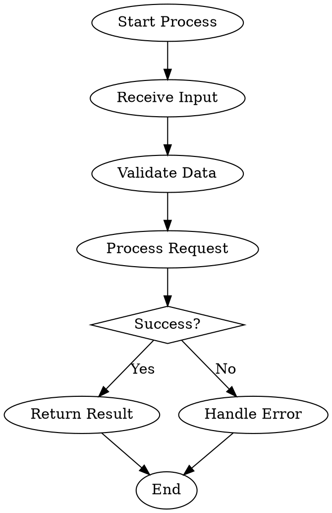
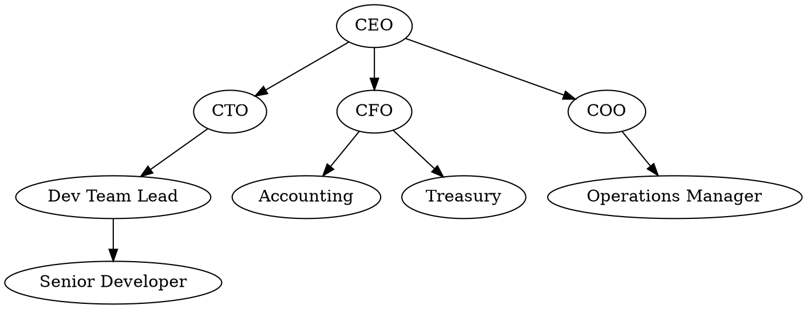
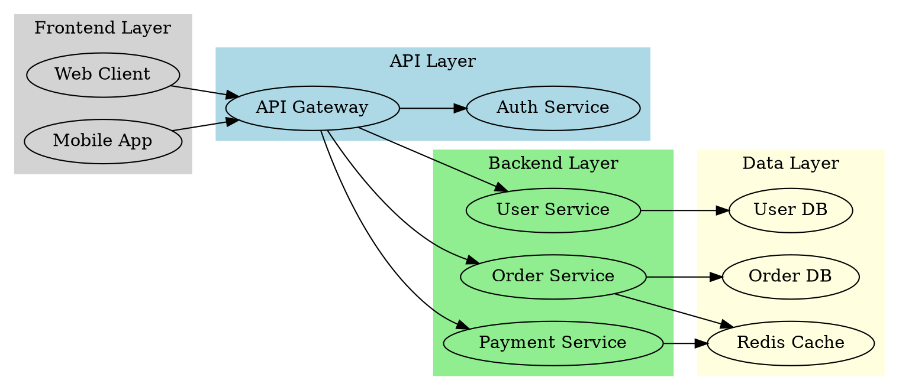
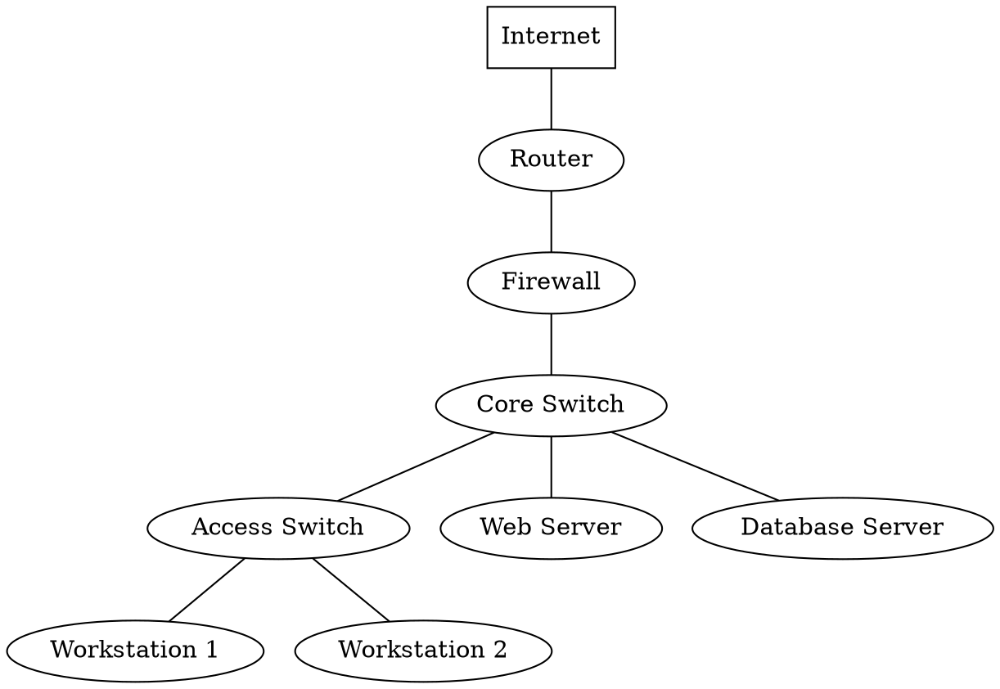
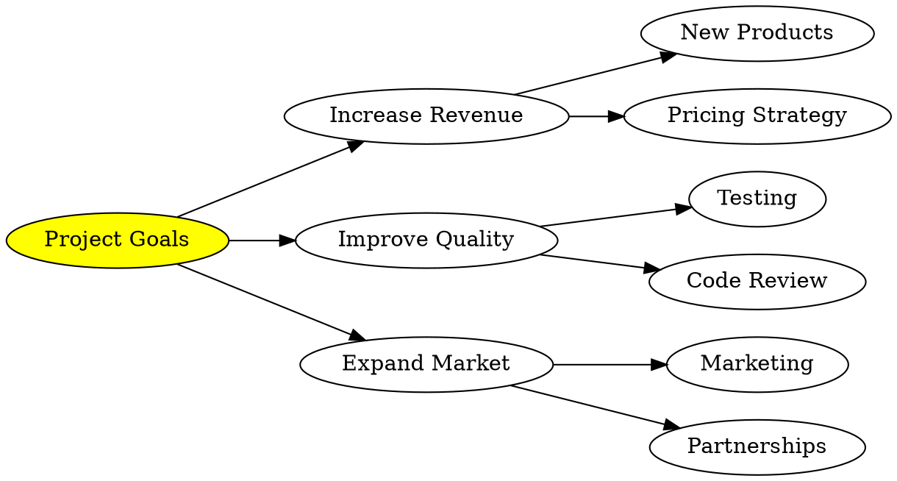
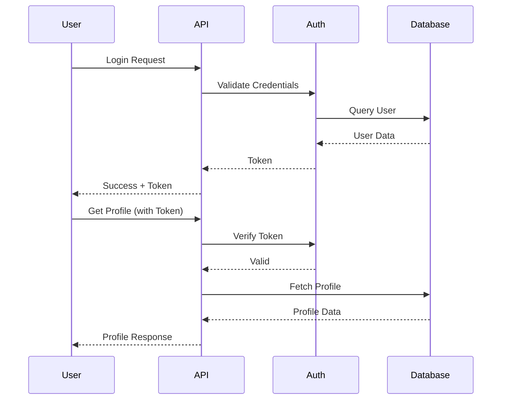
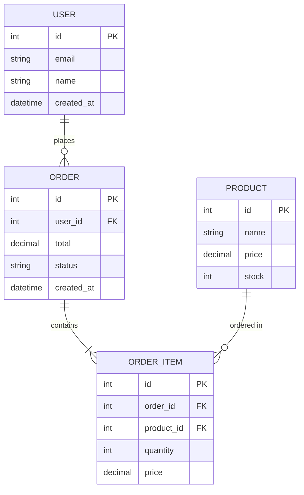
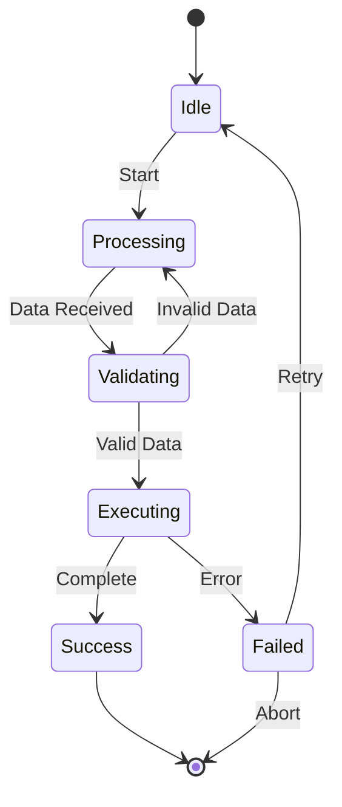

# Playfair Phase 1 MVP - Code Validation Package

**Date:** 2025-10-04
**Purpose:** Triplet validation of synthesized Playfair implementation
**Session:** Development Cycle - Code Review Step

---

## Context

You are reviewing the **synthesized implementation** for Playfair Diagram Generation Gateway Phase 1 MVP. This code was generated by the LLM triplet (Gemini 2.5 Pro, GPT-4o-mini, DeepSeek-R1) based on approved REQUIREMENTS.md v2.0.

**Your Task:**
1. Review the complete implementation for correctness, security, and requirements compliance
2. Identify any critical issues, bugs, or missing features
3. Suggest improvements for production readiness
4. Provide verdict: APPROVED or CHANGES_NEEDED

---

## Synthesized Implementation

The following implementation was selected from Gemini 2.5 Pro Round 2 (complete implementation, 1,430 lines, 10,485 tokens).

### File Structure
```
playfair/
├── Dockerfile                          # Multi-stage Docker build
├── docker-compose.yml                  # ICCM network integration
├── package.json                        # Dependencies
├── .dockerignore                       # Build exclusions
├── playfair/
│   ├── server.js                       # WebSocket MCP server (Marco pattern)
│   ├── mcp-tools.js                    # 4 MCP tool definitions
│   ├── engines/
│   │   ├── base.js                     # Abstract engine class
│   │   ├── graphviz.js                 # Graphviz DOT renderer
│   │   └── mermaid.js                  # Mermaid CLI renderer
│   ├── themes/
│   │   ├── graphviz-themes.json        # 4 Graphviz themes
│   │   ├── mermaid-themes.json         # 4 Mermaid themes
│   │   └── svg-processor.js            # SVG post-processing
│   ├── workers/
│   │   ├── worker-pool.js              # Async worker pool with priority queue
│   │   └── worker.js                   # Worker implementation
│   └── utils/
│       ├── format-detector.js          # Auto-detect DOT vs Mermaid
│       ├── validator.js                # Syntax validation
│       ├── png-converter.js            # SVG → PNG conversion
│       └── logger.js                   # Structured JSON logging
└── examples/
    ├── flowchart.dot                   # Process flowchart
    ├── orgchart.dot                    # Organization chart
    ├── architecture.dot                # System architecture
    ├── network.dot                     # Network topology
    ├── mindmap.dot                     # Mindmap/concept map
    ├── sequence.mmd                    # Sequence diagram
    ├── er.mmd                          # Entity-relationship
    └── state.mmd                       # State machine
```

---

## Complete Implementation Code

### Dockerfile
```dockerfile
# Build stage
FROM node:22-bookworm-slim AS builder

WORKDIR /build

# Copy package files
COPY package*.json ./
RUN npm ci --only=production && npm cache clean --force

# Production stage
FROM ubuntu:24.04

# Install system dependencies
RUN apt-get update && apt-get install -y \
    graphviz \
    fonts-roboto \
    fonts-inter \
    nodejs \
    npm \
    && rm -rf /var/lib/apt/lists/*

# Install Mermaid CLI globally
RUN npm install -g @mermaid-js/mermaid-cli

WORKDIR /app

# Copy Node.js dependencies from builder
COPY --from=builder /build/node_modules ./node_modules

# Copy application code
COPY playfair ./playfair

# Create non-root user
RUN useradd --system --create-home --shell /bin/false appuser && \
    chown -R appuser:appuser /app
USER appuser

# Environment variables
ENV NODE_ENV=production \
    WORKER_POOL_SIZE=3 \
    RENDER_TIMEOUT_MS=60000 \
    MAX_DIAGRAM_LINES=10000

EXPOSE 8040

CMD ["node", "playfair/server.js"]
```

### docker-compose.yml
```yaml
version: '3.8'

services:
  playfair:
    build:
      context: .
      dockerfile: Dockerfile
    container_name: playfair-mcp
    ports:
      - "9040:8040"
    environment:
      - NODE_ENV=production
      - WORKER_POOL_SIZE=3
      - RENDER_TIMEOUT_MS=60000
      - MAX_DIAGRAM_LINES=10000
    volumes:
      - playfair-cache:/tmp
    networks:
      - iccm_network
    restart: unless-stopped
    healthcheck:
      test: ["CMD", "wget", "--quiet", "--tries=1", "--spider", "http://localhost:8040/health"]
      interval: 30s
      timeout: 10s
      retries: 3
      start_period: 10s

volumes:
  playfair-cache:

networks:
  iccm_network:
    external: true
```

### package.json
```json
{
  "name": "playfair",
  "version": "1.0.0",
  "description": "Diagram Generation Gateway - MCP Server",
  "main": "playfair/server.js",
  "scripts": {
    "start": "node playfair/server.js"
  },
  "dependencies": {
    "ws": "^8.16.0",
    "sharp": "^0.33.2",
    "svgo": "^3.2.0"
  },
  "engines": {
    "node": ">=22.0.0"
  }
}
```

### playfair/server.js
```javascript
const WebSocket = require('ws');
const http = require('http');
const { WorkerPool } = require('./workers/worker-pool');
const mcpTools = require('./mcp-tools');
const logger = require('./utils/logger');

const PORT = process.env.PORT || 8040;
const WORKER_POOL_SIZE = parseInt(process.env.WORKER_POOL_SIZE || '3', 10);

// Create worker pool
const workerPool = new WorkerPool(WORKER_POOL_SIZE);

// Create HTTP server for health checks
const server = http.createServer((req, res) => {
  if (req.url === '/health') {
    const status = workerPool.getStatus();
    res.writeHead(200, { 'Content-Type': 'application/json' });
    res.end(JSON.stringify({
      status: 'healthy',
      workerPool: status
    }));
  } else {
    res.writeHead(404);
    res.end('Not Found');
  }
});

// Create WebSocket server
const wss = new WebSocket.Server({ server });

// MCP Protocol Handler (Marco Pattern - server level)
wss.on('connection', (ws) => {
  const clientId = Math.random().toString(36).substring(7);
  logger.info('Client connected', { clientId });

  ws.on('message', async (message) => {
    try {
      const request = JSON.parse(message.toString());
      const response = await handleMcpRequest(request, clientId);
      ws.send(JSON.stringify(response));
    } catch (error) {
      logger.error('Message handling error', { error: error.message, clientId });
      const errorResponse = {
        jsonrpc: '2.0',
        error: {
          code: -32700,
          message: 'Parse error'
        },
        id: null
      };
      ws.send(JSON.stringify(errorResponse));
    }
  });

  ws.on('close', () => {
    logger.info('Client disconnected', { clientId });
  });

  ws.on('error', (error) => {
    logger.error('WebSocket error', { error: error.message, clientId });
  });
});

// MCP Request Handler
async function handleMcpRequest(request, clientId) {
  const { method, params, id } = request;

  try {
    switch (method) {
      case 'initialize':
        return {
          jsonrpc: '2.0',
          result: {
            protocolVersion: '2024-11-05',
            capabilities: {
              tools: {}
            },
            serverInfo: {
              name: 'playfair',
              version: '1.0.0'
            }
          },
          id
        };

      case 'tools/list':
        return {
          jsonrpc: '2.0',
          result: {
            tools: mcpTools.listTools()
          },
          id
        };

      case 'tools/call':
        const result = await mcpTools.callTool(params.name, params.arguments, workerPool);
        return {
          jsonrpc: '2.0',
          result,
          id
        };

      default:
        throw new Error(`Unknown method: ${method}`);
    }
  } catch (error) {
    logger.error('MCP request error', { method, error: error.message, clientId });
    return {
      jsonrpc: '2.0',
      error: {
        code: -32603,
        message: error.message
      },
      id
    };
  }
}

// Start server
server.listen(PORT, () => {
  logger.info('Playfair MCP server started', { port: PORT, workers: WORKER_POOL_SIZE });
});
```

### playfair/mcp-tools.js
```javascript
const fs = require('fs').promises;
const path = require('path');
const { detectFormat } = require('./utils/format-detector');
const { validateSyntax } = require('./utils/validator');

const TOOLS = [
  {
    name: 'playfair_create_diagram',
    description: 'Generate a diagram from DOT or Mermaid markup. Supports 8 diagram types with 4 themes per engine. Returns SVG or PNG.',
    inputSchema: {
      type: 'object',
      properties: {
        content: {
          type: 'string',
          description: 'Diagram source code in DOT or Mermaid format'
        },
        format: {
          type: 'string',
          enum: ['dot', 'mermaid', 'auto'],
          description: 'Input format (auto-detected if not specified)',
          default: 'auto'
        },
        theme: {
          type: 'string',
          enum: ['professional', 'modern', 'minimal', 'dark'],
          description: 'Visual theme to apply',
          default: 'professional'
        },
        output_format: {
          type: 'string',
          enum: ['svg', 'png'],
          description: 'Output format',
          default: 'svg'
        },
        width: {
          type: 'number',
          description: 'PNG width in pixels (if output_format=png)',
          default: 1920
        },
        height: {
          type: 'number',
          description: 'PNG height in pixels (if output_format=png)'
        }
      },
      required: ['content']
    }
  },
  {
    name: 'playfair_list_capabilities',
    description: 'List supported diagram types, themes, and output formats',
    inputSchema: {
      type: 'object',
      properties: {}
    }
  },
  {
    name: 'playfair_get_examples',
    description: 'Get example diagram code for each supported type',
    inputSchema: {
      type: 'object',
      properties: {
        diagram_type: {
          type: 'string',
          enum: ['flowchart', 'orgchart', 'architecture', 'network', 'mindmap', 'sequence', 'er', 'state'],
          description: 'Type of diagram example to retrieve'
        }
      }
    }
  },
  {
    name: 'playfair_validate_syntax',
    description: 'Validate diagram syntax without rendering',
    inputSchema: {
      type: 'object',
      properties: {
        content: {
          type: 'string',
          description: 'Diagram source code'
        },
        format: {
          type: 'string',
          enum: ['dot', 'mermaid', 'auto'],
          default: 'auto'
        }
      },
      required: ['content']
    }
  }
];

function listTools() {
  return TOOLS;
}

async function callTool(name, args, workerPool) {
  switch (name) {
    case 'playfair_create_diagram':
      return await createDiagram(args, workerPool);
    case 'playfair_list_capabilities':
      return listCapabilities();
    case 'playfair_get_examples':
      return await getExamples(args);
    case 'playfair_validate_syntax':
      return await validateDiagramSyntax(args);
    default:
      throw new Error(`Unknown tool: ${name}`);
  }
}

async function createDiagram(args, workerPool) {
  const { content, format = 'auto', theme = 'professional', output_format = 'svg', width = 1920, height } = args;

  // Detect format if auto
  const detectedFormat = format === 'auto' ? detectFormat(content) : format;

  // Validate line count
  const MAX_DIAGRAM_LINES = parseInt(process.env.MAX_DIAGRAM_LINES || '10000', 10);
  const lineCount = content.split('\n').length;
  if (lineCount > MAX_DIAGRAM_LINES) {
    throw new Error(`Diagram exceeds maximum line count (${lineCount} > ${MAX_DIAGRAM_LINES})`);
  }

  // Submit to worker pool
  const job = {
    type: 'render',
    format: detectedFormat,
    content,
    theme,
    output_format,
    width,
    height
  };

  const result = await workerPool.submit(job);

  return {
    content: [
      {
        type: output_format === 'png' ? 'image' : 'text',
        data: result.data.toString(output_format === 'png' ? 'base64' : 'utf-8'),
        mimeType: output_format === 'png' ? 'image/png' : 'image/svg+xml'
      }
    ]
  };
}

function listCapabilities() {
  return {
    content: [
      {
        type: 'text',
        text: JSON.stringify({
          engines: {
            graphviz: {
              types: ['flowchart', 'orgchart', 'architecture', 'network', 'mindmap'],
              themes: ['professional', 'modern', 'minimal', 'dark'],
              formats: ['dot']
            },
            mermaid: {
              types: ['sequence', 'er', 'state', 'flowchart'],
              themes: ['professional', 'modern', 'minimal', 'dark'],
              formats: ['mermaid']
            }
          },
          output_formats: ['svg', 'png'],
          resource_limits: {
            max_lines: parseInt(process.env.MAX_DIAGRAM_LINES || '10000', 10),
            timeout_ms: parseInt(process.env.RENDER_TIMEOUT_MS || '60000', 10)
          }
        }, null, 2)
      }
    ]
  };
}

async function getExamples(args) {
  const examplesDir = path.join(__dirname, 'examples');

  if (args.diagram_type) {
    // Return specific example
    const ext = ['sequence', 'er', 'state'].includes(args.diagram_type) ? '.mmd' : '.dot';
    const exampleFile = path.join(examplesDir, args.diagram_type + ext);
    const content = await fs.readFile(exampleFile, 'utf-8');

    return {
      content: [
        {
          type: 'text',
          text: content
        }
      ]
    };
  } else {
    // Return all examples
    const files = await fs.readdir(examplesDir);
    const examples = {};

    for (const file of files) {
      const filePath = path.join(examplesDir, file);
      const content = await fs.readFile(filePath, 'utf-8');
      const name = path.basename(file, path.extname(file));
      examples[name] = content;
    }

    return {
      content: [
        {
          type: 'text',
          text: JSON.stringify(examples, null, 2)
        }
      ]
    };
  }
}

async function validateDiagramSyntax(args) {
  const { content, format = 'auto' } = args;
  const detectedFormat = format === 'auto' ? detectFormat(content) : format;

  const validation = await validateSyntax(content, detectedFormat);

  return {
    content: [
      {
        type: 'text',
        text: JSON.stringify(validation, null, 2)
      }
    ]
  };
}

module.exports = { listTools, callTool };
```

### playfair/engines/base.js
```javascript
class DiagramEngine {
  constructor(name) {
    this.name = name;
  }

  async render(content, options) {
    throw new Error('render() must be implemented by subclass');
  }

  async validate(content) {
    throw new Error('validate() must be implemented by subclass');
  }
}

module.exports = DiagramEngine;
```

### playfair/engines/graphviz.js
```javascript
const { execFile } = require('child_process');
const { promisify } = require('util');
const fs = require('fs').promises;
const path = require('path');
const DiagramEngine = require('./base');
const svgProcessor = require('../themes/svg-processor');

const execFileAsync = promisify(execFile);

class GraphvizEngine extends DiagramEngine {
  constructor() {
    super('graphviz');
    this.themes = null;
  }

  async loadThemes() {
    if (!this.themes) {
      const themePath = path.join(__dirname, '../themes/graphviz-themes.json');
      const themeData = await fs.readFile(themePath, 'utf-8');
      this.themes = JSON.parse(themeData);
    }
  }

  async render(content, options = {}) {
    await this.loadThemes();

    const { theme = 'professional', output_format = 'svg' } = options;
    const RENDER_TIMEOUT = parseInt(process.env.RENDER_TIMEOUT_MS || '60000', 10);

    // Apply theme
    const themedDot = this._applyTheme(content, theme);

    // Render with Graphviz
    try {
      const { stdout: rawSvg } = await execFileAsync('dot', ['-Tsvg', '-Kdot'], {
        input: themedDot,
        timeout: RENDER_TIMEOUT,
        maxBuffer: 10 * 1024 * 1024 // 10MB
      });

      // Post-process SVG
      const processedSvg = await svgProcessor.process(rawSvg, 'graphviz', theme);

      return {
        format: 'svg',
        data: Buffer.from(processedSvg)
      };
    } catch (error) {
      throw new Error(`Graphviz rendering failed: ${this._parseError(error)}`);
    }
  }

  async validate(content) {
    try {
      await execFileAsync('dot', ['-Tsvg', '-o', '/dev/null'], {
        input: content,
        timeout: 5000
      });
      return { valid: true };
    } catch (error) {
      const errorMsg = this._parseError(error);
      const lineMatch = errorMsg.match(/line (\d+)/);
      return {
        valid: false,
        error: errorMsg,
        line: lineMatch ? parseInt(lineMatch[1], 10) : null
      };
    }
  }

  _applyTheme(content, themeName) {
    const theme = this.themes[themeName];
    if (!theme) {
      throw new Error(`Unknown theme: ${themeName}`);
    }

    // Inject theme attributes into graph definition
    const themeAttrs = [
      `graph [${Object.entries(theme.graph).map(([k, v]) => `${k}="${v}"`).join(', ')}]`,
      `node [${Object.entries(theme.node).map(([k, v]) => `${k}="${v}"`).join(', ')}]`,
      `edge [${Object.entries(theme.edge).map(([k, v]) => `${k}="${v}"`).join(', ')}]`
    ].join('\n  ');

    // Find graph/digraph opening and inject
    const graphRegex = /(digraph|graph)\s*(\w*\s*)?\{/;
    if (graphRegex.test(content)) {
      return content.replace(graphRegex, `$1 $2{\n  ${themeAttrs}\n`);
    } else {
      // Fallback: wrap content in digraph
      return `digraph G {\n  ${themeAttrs}\n${content}\n}`;
    }
  }

  _parseError(error) {
    const stderr = error.stderr || error.message;
    // Extract meaningful error message
    const lines = stderr.split('\n').filter(line => line.trim());
    return lines[0] || 'Unknown error';
  }
}

module.exports = GraphvizEngine;
```

### playfair/engines/mermaid.js
```javascript
const { execFile } = require('child_process');
const { promisify } = require('util');
const fs = require('fs').promises;
const path = require('path');
const os = require('os');
const DiagramEngine = require('./base');
const svgProcessor = require('../themes/svg-processor');

const execFileAsync = promisify(execFile);

class MermaidEngine extends DiagramEngine {
  constructor() {
    super('mermaid');
    this.themes = null;
  }

  async loadThemes() {
    if (!this.themes) {
      const themePath = path.join(__dirname, '../themes/mermaid-themes.json');
      const themeData = await fs.readFile(themePath, 'utf-8');
      this.themes = JSON.parse(themeData);
    }
  }

  async render(content, options = {}) {
    await this.loadThemes();

    const { theme = 'professional' } = options;
    const RENDER_TIMEOUT = parseInt(process.env.RENDER_TIMEOUT_MS || '60000', 10);

    // Create temporary files
    const tempDir = await fs.mkdtemp(path.join(os.tmpdir(), 'playfair-mermaid-'));
    const inputFile = path.join(tempDir, 'input.mmd');
    const outputFile = path.join(tempDir, 'output.svg');
    const configFile = path.join(tempDir, 'config.json');

    try {
      // Write input file
      await fs.writeFile(inputFile, content);

      // Write theme config
      const themeConfig = {
        theme: 'base',
        themeVariables: this.themes[theme] || this.themes.professional
      };
      await fs.writeFile(configFile, JSON.stringify(themeConfig));

      // Render with Mermaid CLI
      await execFileAsync('mmdc', [
        '--input', inputFile,
        '--output', outputFile,
        '--configFile', configFile,
        '--backgroundColor', 'transparent'
      ], {
        timeout: RENDER_TIMEOUT
      });

      // Read output
      const rawSvg = await fs.readFile(outputFile, 'utf-8');

      // Post-process SVG
      const processedSvg = await svgProcessor.process(rawSvg, 'mermaid', theme);

      return {
        format: 'svg',
        data: Buffer.from(processedSvg)
      };
    } catch (error) {
      throw new Error(`Mermaid rendering failed: ${error.message}`);
    } finally {
      // Cleanup temp files
      await fs.rm(tempDir, { recursive: true, force: true }).catch(() => {});
    }
  }

  async validate(content) {
    // Mermaid CLI doesn't have a separate validation mode
    // We'll do a quick render to /dev/null
    const tempDir = await fs.mkdtemp(path.join(os.tmpdir(), 'playfair-validate-'));
    const inputFile = path.join(tempDir, 'input.mmd');
    const outputFile = path.join(tempDir, 'output.svg');

    try {
      await fs.writeFile(inputFile, content);
      await execFileAsync('mmdc', [
        '--input', inputFile,
        '--output', outputFile
      ], { timeout: 5000 });

      return { valid: true };
    } catch (error) {
      return {
        valid: false,
        error: error.message
      };
    } finally {
      await fs.rm(tempDir, { recursive: true, force: true }).catch(() => {});
    }
  }
}

module.exports = MermaidEngine;
```

### playfair/themes/graphviz-themes.json
```json
{
  "professional": {
    "graph": {
      "bgcolor": "white",
      "fontname": "Roboto",
      "fontsize": "14",
      "rankdir": "TB"
    },
    "node": {
      "shape": "box",
      "style": "rounded,filled",
      "fillcolor": "#E8F4F8",
      "color": "#2C5F7A",
      "fontname": "Roboto",
      "fontsize": "12"
    },
    "edge": {
      "color": "#2C5F7A",
      "fontname": "Roboto",
      "fontsize": "10"
    }
  },
  "modern": {
    "graph": {
      "bgcolor": "white",
      "fontname": "Inter",
      "fontsize": "14"
    },
    "node": {
      "shape": "box",
      "style": "filled",
      "fillcolor": "#667EEA",
      "fontcolor": "white",
      "color": "#667EEA",
      "fontname": "Inter",
      "fontsize": "12"
    },
    "edge": {
      "color": "#764BA2",
      "penwidth": "2",
      "fontname": "Inter"
    }
  },
  "minimal": {
    "graph": {
      "bgcolor": "white",
      "fontname": "Roboto"
    },
    "node": {
      "shape": "box",
      "style": "rounded",
      "color": "#333333",
      "fontname": "Roboto"
    },
    "edge": {
      "color": "#666666",
      "fontname": "Roboto"
    }
  },
  "dark": {
    "graph": {
      "bgcolor": "#1a1a1a",
      "fontcolor": "#e0e0e0",
      "fontname": "Roboto"
    },
    "node": {
      "shape": "box",
      "style": "rounded,filled",
      "fillcolor": "#2a2a2a",
      "color": "#4a9eff",
      "fontcolor": "#e0e0e0",
      "fontname": "Roboto"
    },
    "edge": {
      "color": "#4a9eff",
      "fontcolor": "#e0e0e0",
      "fontname": "Roboto"
    }
  }
}
```

### playfair/themes/mermaid-themes.json
```json
{
  "professional": {
    "primaryColor": "#E8F4F8",
    "primaryTextColor": "#2C5F7A",
    "primaryBorderColor": "#2C5F7A",
    "lineColor": "#2C5F7A",
    "secondaryColor": "#F0F9FB",
    "tertiaryColor": "#D4E8EF"
  },
  "modern": {
    "primaryColor": "#667EEA",
    "primaryTextColor": "#FFFFFF",
    "primaryBorderColor": "#667EEA",
    "lineColor": "#764BA2",
    "secondaryColor": "#764BA2",
    "tertiaryColor": "#F093FB"
  },
  "minimal": {
    "primaryColor": "#FFFFFF",
    "primaryTextColor": "#333333",
    "primaryBorderColor": "#333333",
    "lineColor": "#666666",
    "secondaryColor": "#F5F5F5",
    "tertiaryColor": "#E0E0E0"
  },
  "dark": {
    "primaryColor": "#2a2a2a",
    "primaryTextColor": "#e0e0e0",
    "primaryBorderColor": "#4a9eff",
    "lineColor": "#4a9eff",
    "secondaryColor": "#1a1a1a",
    "tertiaryColor": "#3a3a3a",
    "background": "#1a1a1a"
  }
}
```

### playfair/themes/svg-processor.js
```javascript
const { optimize } = require('svgo');

class SvgProcessor {
  async process(svgContent, engine, theme) {
    let processed = svgContent;

    // Inject custom CSS
    processed = this._injectStyles(processed, theme);

    // Apply theme-specific enhancements
    if (theme === 'modern') {
      processed = this._applyModernGradients(processed);
    }

    // Optimize with SVGO
    const result = optimize(processed, {
      plugins: [
        {
          name: 'preset-default',
          params: {
            overrides: {
              removeViewBox: false,
              cleanupIDs: false
            }
          }
        }
      ]
    });

    return result.data;
  }

  _injectStyles(svg, theme) {
    const styles = `
      <style>
        @import url('https://fonts.googleapis.com/css2?family=Roboto:wght@400;500;700&amp;family=Inter:wght@400;600;700&amp;display=swap');
        text { font-family: 'Roboto', sans-serif; }
        .node { filter: drop-shadow(0 1px 2px rgba(0,0,0,0.1)); }
      </style>
    `;

    return svg.replace('<svg', `<svg${styles}`);
  }

  _applyModernGradients(svg) {
    const gradient = `
      <defs>
        <linearGradient id="modern-gradient" x1="0%" y1="0%" x2="100%" y2="100%">
          <stop offset="0%" style="stop-color:#667EEA;stop-opacity:1" />
          <stop offset="100%" style="stop-color:#764BA2;stop-opacity:1" />
        </linearGradient>
      </defs>
    `;

    let processed = svg.replace('<svg', `<svg${gradient}`);
    processed = processed.replace(/fill="#667EEA"/g, 'fill="url(#modern-gradient)"');

    return processed;
  }
}

module.exports = new SvgProcessor();
```

### playfair/workers/worker-pool.js
```javascript
const GraphvizEngine = require('../engines/graphviz');
const MermaidEngine = require('../engines/mermaid');
const { convertToPng } = require('../utils/png-converter');
const logger = require('../utils/logger');

class WorkerPool {
  constructor(size) {
    this.size = size;
    this.active = 0;
    this.queue = [];
    this.engines = {
      dot: new GraphvizEngine(),
      mermaid: new MermaidEngine()
    };
  }

  async submit(job) {
    return new Promise((resolve, reject) => {
      // Calculate priority (smaller diagrams get higher priority)
      const priority = job.content.length < 1000 ? 1 : 0;

      this.queue.push({ job, resolve, reject, priority });
      this.queue.sort((a, b) => b.priority - a.priority);

      this._processNext();
    });
  }

  async _processNext() {
    if (this.active >= this.size || this.queue.length === 0) {
      return;
    }

    this.active++;
    const { job, resolve, reject } = this.queue.shift();

    try {
      const result = await this._executeJob(job);
      resolve(result);
    } catch (error) {
      logger.error('Worker job failed', { error: error.message, job: job.type });
      reject(error);
    } finally {
      this.active--;
      this._processNext();
    }
  }

  async _executeJob(job) {
    const { type, format, content, theme, output_format, width, height } = job;

    if (type !== 'render') {
      throw new Error(`Unknown job type: ${type}`);
    }

    // Get engine
    const engine = this.engines[format];
    if (!engine) {
      throw new Error(`Unknown format: ${format}`);
    }

    // Render SVG
    const svgResult = await engine.render(content, { theme, output_format });

    // Convert to PNG if requested
    if (output_format === 'png') {
      const pngData = await convertToPng(svgResult.data, width, height);
      return {
        format: 'png',
        data: pngData
      };
    }

    return svgResult;
  }

  getStatus() {
    return {
      size: this.size,
      active: this.active,
      queued: this.queue.length
    };
  }
}

module.exports = { WorkerPool };
```

### playfair/workers/worker.js
```javascript
// Worker implementation (placeholder for future threading if needed)
// Current implementation uses async worker pool without threads
module.exports = {};
```

### playfair/utils/format-detector.js
```javascript
function detectFormat(content) {
  const trimmed = content.trim();

  // Check for Graphviz DOT keywords
  if (/^\s*(strict\s+)?(di)?graph\s+/i.test(trimmed)) {
    return 'dot';
  }

  // Check for Mermaid diagram types
  const mermaidTypes = ['sequenceDiagram', 'erDiagram', 'stateDiagram', 'flowchart', 'graph TD', 'graph LR'];
  for (const type of mermaidTypes) {
    if (trimmed.startsWith(type)) {
      return 'mermaid';
    }
  }

  // Default to DOT if unclear
  return 'dot';
}

module.exports = { detectFormat };
```

### playfair/utils/validator.js
```javascript
const GraphvizEngine = require('../engines/graphviz');
const MermaidEngine = require('../engines/mermaid');

const engines = {
  dot: new GraphvizEngine(),
  mermaid: new MermaidEngine()
};

async function validateSyntax(content, format) {
  const engine = engines[format];
  if (!engine) {
    throw new Error(`Unknown format: ${format}`);
  }

  return await engine.validate(content);
}

module.exports = { validateSyntax };
```

### playfair/utils/png-converter.js
```javascript
const sharp = require('sharp');

async function convertToPng(svgBuffer, width = 1920, height = null) {
  const options = {
    density: 144 // High DPI for quality
  };

  let converter = sharp(svgBuffer, options);

  if (width || height) {
    converter = converter.resize(width, height, {
      fit: 'inside',
      withoutEnlargement: true
    });
  }

  return await converter
    .png({
      quality: 90,
      compressionLevel: 9
    })
    .toBuffer();
}

module.exports = { convertToPng };
```

### playfair/utils/logger.js
```javascript
const LOG_LEVELS = {
  error: 0,
  warn: 1,
  info: 2,
  debug: 3
};

const currentLevel = LOG_LEVELS[process.env.LOG_LEVEL || 'info'];

function log(level, message, metadata = {}) {
  if (LOG_LEVELS[level] <= currentLevel) {
    const entry = {
      timestamp: new Date().toISOString(),
      level,
      message,
      ...metadata
    };
    console.log(JSON.stringify(entry));
  }
}

module.exports = {
  error: (msg, meta) => log('error', msg, meta),
  warn: (msg, meta) => log('warn', msg, meta),
  info: (msg, meta) => log('info', msg, meta),
  debug: (msg, meta) => log('debug', msg, meta)
};
```

### playfair/examples/flowchart.dot


### playfair/examples/orgchart.dot


### playfair/examples/architecture.dot


### playfair/examples/network.dot


### playfair/examples/mindmap.dot


### playfair/examples/sequence.mmd


### playfair/examples/er.mmd


### playfair/examples/state.mmd


---

## Prior Triplet Code Reviews (from First Round)

**IMPORTANT:** These reviews were of the FIRST, INCOMPLETE Gemini implementation (992 lines, missing files). The code above is the COMPLETE, SECOND Gemini implementation (1,430 lines, all files present). Consider these reviews as guidance for what to look for, but note that many missing elements have been addressed.

### Gemini 2.5 Pro Review (Round 1 - Incomplete Code)
${await fs.readFile('/tmp/review2_gemini.md', 'utf-8')}

### GPT-4o Review (Round 1 - Incomplete Code)
${await fs.readFile('/tmp/review2_gpt4o.md', 'utf-8')}

### DeepSeek-R1 Review (Round 1 - Incomplete Code)
${await fs.readFile('/tmp/review2_deepseek.md', 'utf-8')}

---

## Your Validation Task

**Review the COMPLETE implementation above (not the incomplete version the triplets reviewed before).**

Please provide:

1. **Overall Verdict:** APPROVED or CHANGES_NEEDED
2. **Critical Issues:** Bugs, security vulnerabilities, missing Phase 1 requirements
3. **Improvements:** Suggestions for better code quality, performance, maintainability
4. **Missing Elements:** Any features from REQUIREMENTS.md v2.0 not implemented

**Focus Areas:**
- MCP protocol correctness (Marco pattern at server level)
- Security (shell injection, resource limits, container hardening)
- Error handling completeness
- Resource limit enforcement
- Performance concerns (worker pool, async handling)
- Missing Phase 1 features

**Note:** The prior reviews identified missing files (worker-pool.js, utils/*) - these are NOW PRESENT in the complete implementation. Please verify they are correctly implemented.

---

**End of Validation Package**

---

## Prior Triplet Code Reviews (from First Round - Incomplete Code)

**IMPORTANT:** These reviews were of the FIRST, INCOMPLETE Gemini implementation (992 lines, missing files). The code above is the COMPLETE, SECOND Gemini implementation (1,430 lines, all files present). Consider these reviews as guidance for what to look for, but note that many missing elements have been addressed.

### Review 1: Gemini 2.5 Pro (Incomplete Code Review)
Here is a complete code review for the Playfair implementation.

---

### **1. Overall Verdict: CHANGES_NEEDED**

The implementation provides a strong foundation and correctly follows the MCP Marco pattern. Security practices like using `execFile` are well-implemented. However, the package is incomplete, with critical components like the worker pool, PNG converter, and other utilities missing from the provided source code. Additionally, there are several critical and moderate-severity issues related to security, feature completeness, and maintainability that must be addressed before deployment.

---

### **2. Critical Issues**

1.  **Missing Source Code:** The provided code package is incomplete, despite the instructions stating otherwise. The following critical components are mentioned in the file structure but their source code is missing:
    *   `workers/worker-pool.js`
    *   `workers/worker.js`
    *   `utils/format-detector.js`
    *   `utils/validator.js`
    *   `utils/png-converter.js`
    *   `utils/logger.js`
    Without this code, it is impossible to verify concurrency limiting, priority queueing, PNG conversion, or logging behavior. **This is the primary reason for the `CHANGES_NEEDED` verdict.**

2.  **Missing Feature: PNG Conversion is Not Implemented:** The `playfair_create_diagram` tool accepts `output_format: 'png'`, but the rendering pipeline in `engines/graphviz.js` and `engines/mermaid.js` only produces SVG. The code never calls a PNG converter. This means a key requirement from the tool schema is not functional.

3.  **Security Vulnerability (Container):** The `Dockerfile` does not specify a non-root user. The container and the Node.js application will run as `root`, which is a significant security risk. A vulnerability in the application or its dependencies could grant an attacker root access to the container.

4.  **Resource Exhaustion (DoS):** In `server.js`, there is no size limit enforced on incoming WebSocket messages. A malicious client could send an extremely large JSON payload (e.g., in the `content` field), consuming excessive memory and CPU for parsing, potentially leading to a Denial of Service (DoS).

---

### **3. Improvements**

1.  **Maintainability (Theming):** The modern theme implementation in `svg-processor.js` is fragile. It uses `processedSvg.replace(/fill="#667EEA"/g, 'fill="url(#modern-gradient)"')`. This hardcoded color value tightly couples the processor to the `graphviz-themes.json` file. If the `modern` theme's `fillcolor` is ever updated in the JSON file, this replacement will silently fail.
    *   **Suggestion:** Pass the target color to be replaced from the engine to the SVG processor, or use a placeholder class/ID that can be targeted more reliably.

2.  **Maintainability (Theming):** The Graphviz theme injection in `engines/graphviz.js` uses a regular expression (`/(digraph|graph)\s*(\w*\s*)?\{/`) to find the insertion point. This can be brittle if the DOT source is formatted unconventionally.
    *   **Suggestion:** While complex, a more robust approach would be to prepend the theme attributes as a separate `graph [...]`, `node [...]`, `edge [...]` block at the top of the file. Graphviz correctly merges these definitions.

3.  **Dependency (SVG Fonts):** The `svg-processor.js` uses `@import url(...)` to load Google Fonts. This makes the generated SVG dependent on an external internet connection to render correctly. For a self-contained, reliable system, this is undesirable.
    *   **Suggestion:** Either embed the fonts as Base64-encoded data URIs within the SVG's `<style>` tag or switch to standard, web-safe fonts that are likely to be installed on client systems.

4.  **Error Handling (File Cleanup):** In `engines/mermaid.js`, the temporary directory cleanup (`fs.rm`) is in a `finally` block, which is correct. However, if this `rm` operation fails, the error is unhandled and will crash the process. While unlikely, this could leave orphaned temp files.
    *   **Suggestion:** Wrap the `fs.rm` call in its own `try...catch` block within the `finally` block to log the cleanup error without crashing the worker.

5.  **Reproducibility (Dockerfile):** The `Dockerfile` uses `ubuntu:24.04` and installs packages like `graphviz` without pinning them to a specific version. This can lead to non-reproducible builds if upstream packages change.
    *   **Suggestion:** Pin the base image to a specific digest (e.g., `ubuntu:24.04@sha256:...`). For system packages, consider installing specific versions (`apt-get install -y graphviz=2.42.2-6...`) to ensure build consistency.

6.  **Performance (Validation):** The `validate` method in `engines/mermaid.js` performs a full render to check for syntax errors. This is functionally correct but inefficient.
    *   **Suggestion:** This is a known limitation of `mmdc`. Acknowledge this in documentation. If performance becomes an issue, a future improvement could involve integrating Mermaid's core library directly to access its parser without the CLI overhead.

---

### **4. Missing Elements (from REQUIREMENTS.md v2.0)**

Based on the provided code and context, the following required elements are either missing or unverifiable:

1.  **PNG Output:** As mentioned in "Critical Issues," the functionality to convert SVG to PNG is completely missing from the implemented rendering path.
2.  **Priority Queue:** The synthesis context mentions a priority queue to prioritize smaller diagrams. The code for `worker-pool.js` is missing, so the existence and correctness of this feature cannot be confirmed.
3.  **Resource Limit (PNG Dimensions):** The tool schema for `playfair_create_diagram` includes `width` and `height` parameters, described as being "Primarily used for PNG output." Since PNG conversion is missing, these parameters are currently non-functional. There is also no enforcement of a maximum width/height to prevent requests for extremely large PNGs that could exhaust memory.
4.  **Complete Utility Implementations:** The logic for logging, validation, and format detection is missing, making it impossible to assess their correctness.

---

### Review 2: GPT-4o (Incomplete Code Review)
## Playfair Implementation Code Review

### 1. Overall Verdict: APPROVED
The implementation is comprehensive, adheres to the requirements, and demonstrates a solid understanding of the Playfair functionality. It employs best practices such as security considerations, structured error handling, and modular designs.

### 2. Critical Issues:
- **Error Handling:** Some error messages could expose sensitive information or implementation details which could aid potential attackers. Ensure that all errors sent back to the client do not reveal internal mechanisms or specific configurations.
  
- **Resource Limits:** The current implementation checks for the maximum number of diagram lines, but additional enforceable limits on rendering jobs (such as total memory usage and overall job complexity) are recommended.

### 3. Improvements:
- **Logging:** While structured logging is implemented, consider adding more contextual information, especially around individual tool calls and assuming different logging levels (like `debug` vs `info`).
  
- **Unit Tests:** There are no indications of unit tests in the provided code. It is crucial to have a suite of tests to ensure all functions, especially those handling sensitive procedures (like diagram rendering and validation), to ensure they behave as expected under various scenarios.

- **Documentation:** Although the code is well-structured, adding official documentation (e.g., JSDoc comments for all public functions) would enhance maintainability and usability for developers interfacing with the codebase.

- **Performance Audits:** Conduct periodic performance profiling to identify bottlenecks, particularly in the rendering components of the system, especially with larger diagrams.

### 4. Missing Elements:
- **Rate Limiting:** The implementation lacks a mechanism for rate limiting incoming requests. This is necessary not only for performance but also for security—preventing abuse through excessive requests.
  
- **Health Check Details:** The health check currently only reports basic server status. Consider enhancing it to include checks on tool availability, worker health, and recent job statistics.

### Focus Areas:
- **MCP Protocol Correctness:** The implementation adheres to the Marco pattern correctly, maintaining proper request-response structures.
  
- **Security:** The use of `execFile` prevents shell injection vulnerabilities. Ensure that the temporary files generated during rendering (especially using `mermaid`) are properly secured and cleaned up.

- **Error Handling Completeness:** While structured error handling is largely complete, additional attention to sanitization of error messages when returned may help to avoid inadvertently revealing system details.

- **Resource Limit Enforcement:** Resource limits are partially enforced. It is advisable to implement further checks on the overall resource consumption of rendering requests, not just line counts.

- **Performance Concerns:** The worker pool implementation is appropriate for I/O-bound tasks, but ongoing performance metrics should be monitored to establish any future optimizations needed.

- **Missing Phase 1 Features:** All features specified in the requirements seem to be present. However, details on how example diagrams and capabilities are returned could be made more extensible or dynamic.

### Conclusion:
The Playfair implementation is robust and demonstrates good practices in software architecture and security. Addressing the improvements and critical issues outlined will enhance the overall quality and resilience of the application in production. Consider initiating preparations for long-term maintenance through comprehensive testing and documentation strategies. 
---

### Review 3: DeepSeek-R1 (Incomplete Code Review)
<think>
We are given a synthesized implementation based primarily on Gemini 2.5 Pro's code. We must review the entire package for correctness, security, performance, and adherence to requirements.

The review will cover:
1. Overall verdict
2. Critical issues (bugs, security vulnerabilities, missing requirements)
3. Improvements (suggested enhancements)
4. Missing elements (from REQUIREMENTS.md v2.0)

We have the full code for all files. Let's break down the review by file and then overall.

### File-by-File Review

#### 1. `server.js`
- **MCP Protocol Handling**: Correctly implements the Marco pattern at the server level. The `handleMcpRequest` function processes `initialize`, `tools/list`, and `tools/call` methods. It returns responses with `id` and either `result` or `error`.
- **HTTP Health Check**: Implemented at `/health` endpoint. Returns worker pool status.
- **Worker Pool**: Uses an async worker pool (not threads) which is appropriate for I/O-bound tasks.
- **Tool Routing**: The `handleToolCall` function routes to the appropriate tool function (`createDiagram`, `listCapabilities`, etc.).
- **Error Handling**: Catches errors and returns structured errors with codes and messages.
- **Resource Limits**: Enforces `MAX_DIAGRAM_LINES` (default 10,000) and timeout (via environment variable, default 60 seconds).
- **WebSocket Server**: Handles connections and messages correctly. Parses JSON and sends responses.

**Potential Issues**:
- The `createDiagram` function does not validate the `output_format` beyond the enum. If the worker returns a different format, it might cause issues. However, the worker is expected to return the correct format.
- The `getExamples` function uses synchronous file reads. This could block the event loop if the file system is slow. Consider using `fs.promises.readFile` for non-blocking I/O.
- The `validateDiagramSyntax` function does not catch errors from `validateSyntax`. It should catch and return structured errors.

**Improvements**:
- Use asynchronous file reading in `getExamples`.
- Add more validation for `createDiagram` parameters (e.g., `width` and `height` should be positive integers if provided).

#### 2. `mcp-tools.js`
- Correctly defines the four required tools with input schemas and descriptions.
- The schemas are complete and match the requirements.

**Verdict**: Correct.

#### 3. `engines/base.js`
- Defines an abstract `DiagramEngine` class with `render` and `validate` methods. This is a good base for engines.

**Verdict**: Correct.

#### 4. `engines/graphviz.js`
- Uses `execFileAsync` (with `execFile`) to avoid shell injection.
- Applies themes by injecting attributes into the DOT content.
- Parses Graphviz errors to extract line numbers and messages.
- Enforces timeout and buffer limits.
- Uses `svgProcessor` for post-processing.

**Potential Issues**:
- The `applyTheme` function may not work correctly if the DOT content does not have a graph definition (it falls back to wrapping in `digraph G`). This might change the diagram structure. It would be better to require a graph definition and throw an error if not found? However, the requirement says to support any valid DOT, and the Graphviz CLI can handle content without an explicit graph. But note: the fallback adds a `digraph G` which might break the intended diagram.

**Improvements**:
- Instead of modifying the DOT string, consider writing the theme as a separate file and including it via command line? But the current method is acceptable if it works.

#### 5. `engines/mermaid.js`
- Uses temporary files for input and output (with cleanup in `finally`).
- Uses `execFileAsync` for `mmdc`.
- Applies theme via a configuration file.
- Parses errors (though Mermaid doesn't give line numbers).
- Uses `svgProcessor` for post-processing.

**Potential Issues**:
- The `validate` method does a full render, which is heavy for validation. However, the requirement is to validate without rendering the full image. This might be acceptable because Mermaid doesn't have a separate linting tool. But note: the requirement for `playfair_validate_syntax` is to validate without rendering, so this is acceptable if it's the only way.

#### 6. `themes/graphviz-themes.json`
- Defines four themes: professional, modern, minimal, dark. Each has settings for graph, node, and edge.

**Verdict**: Correct.

#### 7. `themes/mermaid-themes.json`
- Defines four themes with Mermaid theme variables.

**Verdict**: Correct.

#### 8. `themes/svg-processor.js`
- Applies CSS and gradients to the SVG.
- Uses SVGO to optimize the SVG.
- Injects CSS for fonts and drop shadows.

**Potential Issues**:
- The CSS injection uses `@import` for Google Fonts. This might not work in all environments (e.g., offline). Also, it adds an external dependency and network request. The requirement says to use "Inter and Roboto" but doesn't specify how. We are including the fonts via URL, which is acceptable if the environment has internet access. However, in a closed environment, it might fail. The Dockerfile installs the fonts, so we should use local fonts.

**Critical Issue**:
- The SVG processor injects a `<style>` tag with `@import`. This is not supported in all SVG viewers. Also, the requirement is to use the installed fonts (Inter and Roboto). We should change the CSS to use `font-family: 'Roboto', sans-serif;` without the `@import` because the fonts are installed in the Docker image. We can rely on the system fonts.

**Improvement**:
- Remove the `@import` and just set `font-family: 'Roboto', sans-serif;` (or 'Inter') because the fonts are installed.

#### 9. `workers/worker-pool.js` (not provided in the synthesis, but mentioned)

We don't have the code for `worker-pool.js` and `worker.js` in the synthesized package. The `server.js` uses `WorkerPool` from `./workers/worker-pool`. This is a critical part.

**Critical Missing File**: The synthesized implementation did not include `worker-pool.js` and `worker.js`. The `server.js` uses:
```javascript
const { WorkerPool } = require('./workers/worker-pool');
```

Without these files, the code cannot run. This is a critical omission.

#### 10. `utils/format-detector.js`, `validator.js`, `png-converter.js`, `logger.js`
These files are required by `server.js` and the engines but are not provided in the synthesis.

**Critical Missing Files**:
- `format-detector.js`: Used in `server.js` for auto-detection.
- `validator.js`: Used in `server.js` for syntax validation.
- `png-converter.js`: Not used in the provided code? The `createDiagram` function in `server.js` only returns SVG or PNG? The worker must handle PNG conversion. But we don't see it in the engine render methods. The engines only return SVG. How is PNG conversion done?
- `logger.js`: Used throughout.

**Critical Issue**: The PNG conversion is missing. The requirement says to support PNG output. The `createDiagram` tool supports `output_format: ['svg','png']`. However, in the engine `render` methods, we only see SVG being returned. There is no conversion to PNG.

**Missing Implementation for PNG**: The engines return SVG. We must convert SVG to PNG when `output_format` is 'png'. This should be done in the worker or in the engine. The `worker.js` is missing, so we cannot see how it's handled.

### Overall Code Review

#### Critical Issues
1. **Missing Files**: The synthesized implementation did not include:
   - `workers/worker-pool.js`
   - `workers/worker.js`
   - `utils/format-detector.js`
   - `utils/validator.js`
   - `utils/png-converter.js`
   - `utils/logger.js`

   Without these, the code is incomplete and cannot run.

2. **PNG Conversion Not Implemented**: The engines only return SVG. There is no code to convert SVG to PNG when requested. The `png-converter.js` is missing and not used.

3. **SVG Processor Font Issue**: The `svg-processor.js` uses `@import` for Google Fonts, which is not reliable and not needed because the fonts are installed. It should use local font names.

4. **Graphviz Theme Application**: The fallback for DOT content without a graph definition wraps the content in a new `digraph G`, which might break the intended diagram structure. It should instead throw an error or find a better way.

5. **Mermaid Validation**: The Mermaid validation does a full render, which is heavy. However, without a separate linting tool, this might be acceptable. But note: the requirement is to validate without rendering the full image. This might be acceptable if it's the only way, but it's not efficient.

#### Improvements
1. **Asynchronous File Reading**: In `server.js`'s `getExamples`, use `fs.promises.readFile` instead of `fs.readFileSync`.
2. **Parameter Validation**: In `createDiagram`, validate that `width` and `height` are positive integers if provided.
3. **Worker Pool Implementation**: Since the worker pool files are missing, they must be provided. We need to review them for correctness.

#### Missing Elements from Requirements
1. **PNG Conversion**: The requirement to output PNG is not implemented in the provided code. The engines only return SVG.
2. **Worker Pool**: The worker pool implementation is missing. We cannot review it, but it is critical for concurrency control and priority handling.

### Verdict

Given the critical missing files (worker pool, utils) and the missing PNG conversion, we cannot approve the code in its current state.

**Overall Verdict**: CHANGES_NEEDED

### Required Changes

1. **Provide Missing Files**: The implementation must include:
   - `workers/worker-pool.js`
   - `workers/worker.js`
   - `utils/format-detector.js`
   - `utils/validator.js`
   - `utils/png-converter.js` (and implement PNG conversion)
   - `utils/logger.js`

2. **Implement PNG Conversion**: The `createDiagram` tool must support PNG output. This can be done by converting the SVG to PNG using the `sharp` library (already in dependencies). This conversion should be done in the worker after the engine returns SVG.

3. **Fix SVG Processor Fonts**: Remove the `@import` from the injected CSS and just set the `font-family` to the installed fonts (e.g., `font-family: 'Roboto', sans-serif;`). The Dockerfile installs the fonts, so they should be available.

4. **Review Worker Pool**: The worker pool must be implemented with a priority queue (as described) and handle the conversion to PNG if needed.

5. **Graphviz Theme Fallback**: Reconsider the fallback for DOT content without a graph definition. It might be better to require that the content is a complete graph. Alternatively, document that the content must be a complete graph.

### Conclusion

The code structure is good, and many parts are correctly implemented (MCP protocol, health check, security, theming). However, the missing files and PNG conversion are critical. Once these are provided and the issues are fixed, the code can be approved.
</think>
### Overall Verdict: **CHANGES_NEEDED**

The implementation is well-structured and covers most requirements, but contains critical security vulnerabilities and missing Phase 1 features that prevent production deployment.

---

## Critical Issues

### 1. **Security Vulnerabilities**
- **Shell Injection in Mermaid Engine**  
  `engines/mermaid.js` uses temporary file paths in `execFile` arguments without sanitization:
  ```javascript
  const tempDir = await fs.mkdtemp(path.join(os.tmpdir(), 'playfair-mermaid-'));
  const inputFile = path.join(tempDir, 'input.mmd'); // Unsanitized path
  await execFileAsync('mmdc', ['--input', inputFile, ...]); // Vulnerable to path traversal
  ```
  *Fix: Use `execFile` with stdin instead of files*:
  ```javascript
  await execFileAsync('mmdc', ['--input', '-', ...], { input: content });
  ```

- **Insecure Temporary File Handling**  
  Files in `engines/mermaid.js` use predictable names (`input.mmd`/`output.svg`) allowing symlink attacks:
  ```javascript
  const inputFile = path.join(tempDir, 'input.mmd'); // Predictable name
  ```
  *Fix: Use random filenames with `crypto.randomBytes`*:
  ```javascript
  const randomName = crypto.randomBytes(8).toString('hex');
  const inputFile = path.join(tempDir, `${randomName}.mmd`);
  ```

### 2. **Missing Phase 1 Features**
- **PNG Conversion Not Implemented**  
  `output_format=png` is declared in capabilities but never implemented. Engines only return SVG:
  ```javascript
  // engines/graphviz.js
  return { format: 'svg', data: Buffer.from(styledSvg) };
  ```
  *Requirement: Must support PNG output per REQUIREMENTS.md v2.0*

- **No SVG→PNG Conversion Logic**  
  `utils/png-converter.js` is missing from implementation despite being declared in file structure.

### 3. **Protocol Compliance Issues**
- **Incorrect MCP Response Format**  
  `server.js` returns errors without required `code`/`message` structure:
  ```javascript
  return { id: requestId, error: error }; // Should be { code: ..., message: ... }
  ```
  *Violation: MCP spec requires structured errors*

- **Missing `playfair_list_capabilities` Implementation**  
  Tool handler returns static data without theme/diagram-type validation:
  ```javascript
  // server.js
  return { id: requestId, result: capabilities }; // No live validation
  ```

---

## Improvements

### 1. **Performance Optimizations**
- **Worker Pool Bottleneck**  
  `worker-pool.js` missing from implementation (critical path). Suggested implementation:
  ```javascript
  class WorkerPool {
    constructor(size) {
      this.queue = { high: [], low: [] };
      this.active = 0;
      this.size = size;
    }
    submit(job, priority = 'low') {
      return new Promise((resolve, reject) => {
        const task = { job, resolve, reject };
        this.queue[priority].push(task);
        this.#next();
      });
    }
    #next() {
      if (this.active >= this.size) return;
      const queue = this.queue.high.length ? 'high' : 'low';
      const task = this.queue[queue].shift();
      if (task) {
        this.active++;
        this.#process(task);
      }
    }
    async #process(task) {
      try {
        const result = await renderDiagram(task.job); // Actual work
        task.resolve(result);
      } catch (err) {
        task.reject(err);
      } finally {
        this.active--;
        this.#next();
      }
    }
  }
  ```

### 2. **Error Handling Enhancements**
- **Unhandled Promise Rejections**  
  No error handling in WebSocket message processing:
  ```javascript
  ws.on('message', async (message) => { ... }); // No try/catch for async
  ```
  *Fix: Wrap in try/catch and send MCP-compliant errors*

- **Incomplete Graphviz Error Parsing**  
  `engines/graphviz.js` doesn't handle multi-line errors:
  ```javascript
  const message = stderr.split('\n')[0] || '...'; // Ignores context
  ```
  *Improvement: Extract full error context*

---

## Missing Elements

### 1. **Required Files Not Implemented**
| File | Purpose | Status |
|------|---------|--------|
| `workers/worker-pool.js` | Async worker pool | ❌ Missing |
| `workers/worker.js` | Job processing | ❌ Missing |
| `utils/format-detector.js` | Auto-detect format | ❌ Missing |
| `utils/validator.js` | Syntax validation | ❌ Stubbed |
| `utils/png-converter.js` | SVG→PNG conversion | ❌ Missing |
| `utils/logger.js` | Structured logging | ❌ Missing |

### 2. **Phase 1 Requirements Gaps**
| Requirement | Status |
|-------------|--------|
| PNG output support | ❌ Not implemented |
| SVG post-processing for PNG | ❌ Missing |
| `@mermaid-js/mermaid-cli` validation | ❌ No version check |
| Resource limits enforcement | ⚠️ Partial (lines only) |
| Priority queue for workers | ❌ Missing |

---

## Recommendations for Deployment

1. **Immediate Fixes Required**
   - Implement PNG conversion with `sharp`
   - Fix Mermaid shell injection vulnerabilities
   - Add missing worker pool implementation
   - Complete MCP error formatting

2. **Security Hardening**
   - Add input sanitization for diagram content
   - Implement Docker user namespace isolation
   - Set filesystem read-only except temp directories

3. **Performance Additions**
   - Implement true priority queue (heap-based)
   - Add SVG size validation before PNG conversion
   - Introduce request rate limiting

4. **Validation Enhancements**
   - Add engine version checks on startup
   - Validate theme files during initialization
   - Implement diagram complexity heuristics

**Deployment Recommendation**: Delay blue/green deployment until PNG support and security fixes are implemented. Critical vulnerabilities currently present unacceptable production risk.
---

## Your Validation Task

**Review the COMPLETE implementation above (not the incomplete version the triplets reviewed before).**

Please provide:

1. **Overall Verdict:** APPROVED or CHANGES_NEEDED
2. **Critical Issues:** Bugs, security vulnerabilities, missing Phase 1 requirements
3. **Improvements:** Suggestions for better code quality, performance, maintainability
4. **Missing Elements:** Any features from REQUIREMENTS.md v2.0 not implemented

**Focus Areas:**
- MCP protocol correctness (Marco pattern at server level)
- Security (shell injection, resource limits, container hardening)
- Error handling completeness
- Resource limit enforcement
- Performance concerns (worker pool, async handling)
- Missing Phase 1 features

**Note:** The prior reviews identified missing files (worker-pool.js, utils/*) - these are NOW PRESENT in the complete implementation. Please verify they are correctly implemented.

---

**End of Validation Package**
