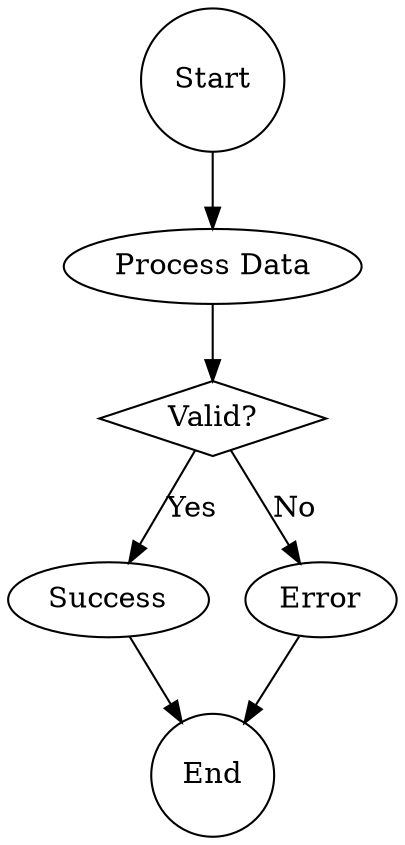
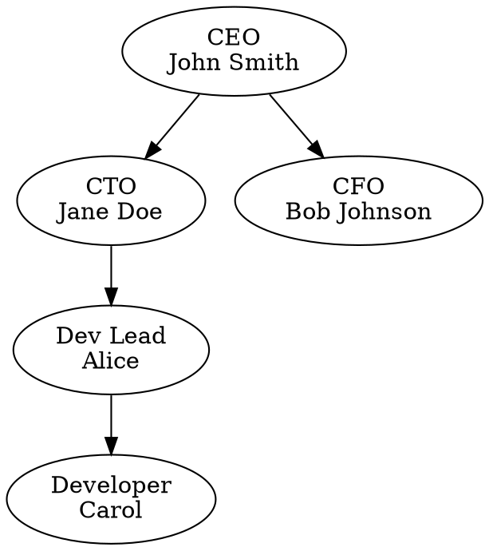
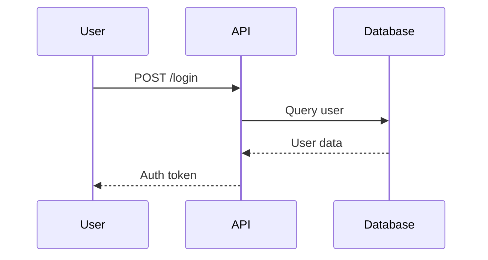

# Playfair Code Generation Package

**Request:** Generate complete Phase 1 implementation code for Playfair Diagram Generation Gateway

**Date:** 2025-10-04

---

## Context

You are being asked to generate production-ready code for Playfair, the ICCM Diagram Generation Gateway. The requirements have been approved by unanimous triplet consensus (v2.0).

**Your task:** Generate complete, production-ready implementation code including:
- WebSocket MCP server
- Graphviz and Mermaid engine adapters
- Modern theming system (4 themes)
- Worker pool with priority queue
- All 4 MCP tools
- Complete file structure

---

## 1. Approved Requirements (REQUIREMENTS.md v2.0)

**Note:** Full requirements document is attached below. Key highlights:

### Component Specifications
- **Name:** Playfair
- **Type:** Diagram Generation Gateway
- **Protocol:** WebSocket MCP Server
- **Port:** 9040 (host) / 8040 (container)
- **Container:** Docker (Ubuntu 24.04 + Node.js 22)

### Rendering Engines (100% Permissive Licenses)
- **Graphviz v9+** (EPL-1.0) - Professional graph layouts
- **Mermaid CLI v11+** (MIT) - Modern diagram syntax

### Diagram Types (8 total)
1. Flowcharts (Graphviz, Mermaid)
2. Organizational charts (Graphviz)
3. Architecture diagrams (Graphviz)
4. Sequence diagrams (Mermaid)
5. Network diagrams (Graphviz)
6. Mind maps (Graphviz, Mermaid)
7. ER diagrams (Mermaid)
8. State diagrams (Mermaid)

### Output Formats
- SVG (default, base64-encoded)
- PNG (Phase 1, 1920px @ 2x DPI)
- PDF (Phase 2 - not in this code generation)

### Themes (4 total)
- Professional (corporate clean)
- Modern (vibrant gradients)
- Minimal (monochrome)
- Dark (high contrast)

### Performance Requirements
- Simple diagrams (<20 elements): <2s
- Medium diagrams (20-100 elements): <5s
- Complex diagrams (100-500 elements): <15s
- Timeout: 60s maximum
- Worker pool: 2-3 parallel workers with priority queue

### MCP Tools (4 total)
1. `playfair_create_diagram` - Primary diagram creation
2. `playfair_list_capabilities` - List supported formats/themes
3. `playfair_get_examples` - Get example syntax
4. `playfair_validate_syntax` - Validate without rendering

---

## 2. Architecture Context (General Architecture.PNG)

**Playfair's Position in ICCM:**

[SEE ARCHITECTURE PNG ATTACHED BELOW]

**Integration Points:**
- **Input:** MCP tool calls from any LLM via MCP Relay
- **Output:** Base64-encoded SVG/PNG diagrams
- **Logging:** Optional routing through KGB
- **Storage:** Optional storage in Dewey/Winni

**Critical Pattern (from Marco implementation):**
- Implement MCP protocol layer at Playfair level
- Handle `initialize`, `tools/list`, `tools/call` before routing to rendering engines
- Do NOT forward MCP protocol methods to subprocesses
- Rendering engines are internal workers, not MCP servers

---

## 3. Reference Implementations

### Marco Pattern (WebSocket MCP Server)
Location: `/mnt/projects/ICCM/marco/server.js`

**Key patterns to follow:**
```javascript
// 1. MCP protocol handler at server level
function handleClientRequest(request) {
  if (request.method === 'initialize') {
    return { /* server info */ };
  }
  if (request.method === 'tools/list') {
    return { tools: [...] };
  }
  if (request.method === 'tools/call') {
    // Route to appropriate handler
  }
}

// 2. Internal subprocess (Playwright in Marco, rendering engines in Playfair)
// Subprocess does NOT receive MCP protocol methods
// Server handles protocol, subprocess does work

// 3. Health check on same port as WebSocket
app.on('request', (req, res) => {
  if (req.url === '/health') {
    res.writeHead(200);
    res.end(JSON.stringify({ status: 'healthy' }));
  }
});
```

### Fiedler Pattern (Tool Definitions)
Location: `/mnt/projects/ICCM/fiedler/fiedler/mcp_server.py`

**Key patterns:**
- Comprehensive tool schemas with input validation
- Structured error responses
- Resource limits and timeouts

---

## 4. File Structure to Generate

```
/mnt/projects/ICCM/playfair/
├── Dockerfile                          # Container definition
├── docker-compose.yml                  # Docker Compose config
├── package.json                        # Node.js dependencies
├── .dockerignore                       # Build exclusions
└── playfair/
    ├── server.js                      # Main WebSocket MCP server (CRITICAL)
    ├── engines/
    │   ├── base.js                    # Abstract engine interface
    │   ├── graphviz.js                # Graphviz adapter
    │   └── mermaid.js                 # Mermaid adapter
    ├── themes/
    │   ├── graphviz-themes.json       # Graphviz theme definitions
    │   ├── mermaid-themes.json        # Mermaid theme definitions
    │   └── svg-processor.js           # SVG post-processing
    ├── workers/
    │   ├── worker-pool.js             # Worker pool manager
    │   └── worker.js                  # Worker implementation
    ├── utils/
    │   ├── format-detector.js         # Auto-detect DOT vs Mermaid
    │   ├── validator.js               # Syntax validation
    │   ├── png-converter.js           # SVG → PNG conversion
    │   └── logger.js                  # Structured logging
    └── examples/
        ├── flowchart.dot              # Example flowchart
        ├── orgchart.dot               # Example orgchart
        ├── architecture.dot           # Example architecture
        ├── network.dot                # Example network
        ├── mindmap.dot                # Example mindmap
        ├── sequence.mmd               # Example sequence
        ├── er.mmd                     # Example ER
        └── state.mmd                  # Example state
```

---

## 5. Code Generation Requirements

### Critical Requirements

1. **MCP Protocol Compliance:**
   - Handle `initialize`, `tools/list`, `tools/call` at server level
   - Return proper MCP response format
   - Do NOT forward protocol methods to rendering engines

2. **Error Handling:**
   - Structured error responses per requirements:
     ```json
     {
       "error": true,
       "code": "SYNTAX_ERROR|TIMEOUT|RESOURCE_LIMIT|ENGINE_CRASH",
       "message": "Human-readable description",
       "engine": "graphviz|mermaid",
       "line": 42,
       "suggestion": "Helpful fix suggestion"
     }
     ```

3. **Resource Limits:**
   - Max diagram size: 10,000 lines
   - Max output dimensions: 10,000 x 10,000 pixels
   - Timeout: 60 seconds per request
   - Worker pool: 2-3 workers max

4. **Modern Theming (Per Triplet Consensus):**
   - Graphviz: Cairo renderer + SVG post-processing
   - CSS gradients, shadows, rounded corners
   - Web fonts (Inter, Roboto)
   - Competitive with D2 aesthetics

5. **Dependencies (All Permissive Licenses):**
   ```json
   {
     "dependencies": {
       "ws": "^8.17.0",        // WebSocket (MIT)
       "sharp": "^0.33.0",     // PNG conversion (Apache-2.0)
       "svgo": "^3.0.0"        // SVG optimization (MIT)
     }
   }
   ```

---

## 6. Testing Checklist

Your implementation should pass these tests:

### MCP Protocol Tests
- ✅ `initialize` returns server info and capabilities
- ✅ `tools/list` returns all 4 tools with schemas
- ✅ `tools/call` executes tool and returns result

### Rendering Tests
- ✅ Simple flowchart (5 nodes) renders in <2s
- ✅ All 8 diagram types render correctly
- ✅ All 4 themes apply correctly
- ✅ Both SVG and PNG output work

### Performance Tests
- ✅ Worker pool handles 10 concurrent requests
- ✅ Small diagrams prioritized over large ones
- ✅ 60s timeout enforced

### Error Handling Tests
- ✅ Invalid syntax returns structured error
- ✅ Timeout returns TIMEOUT error code
- ✅ Resource limit returns RESOURCE_LIMIT error

---

## 7. Deliverable Format

Please provide:

1. **All source code files** with complete implementation
2. **Comments** explaining key design decisions
3. **Dockerfile and docker-compose.yml** ready for deployment
4. **Example diagrams** for all 8 types
5. **Any assumptions or design choices** you made

---

## ATTACHMENTS

### Attachment 1: REQUIREMENTS.md v2.0 (Full Document)

[FULL REQUIREMENTS DOCUMENT INCLUDED - SEE ORIGINAL FILE]

### Attachment 2: Architecture PNG

[ARCHITECTURE DIAGRAM INCLUDED - SEE ORIGINAL FILE]

---

## REQUEST SUMMARY

Generate complete, production-ready Phase 1 implementation code for Playfair following:
- Approved REQUIREMENTS.md v2.0
- Marco MCP pattern (protocol at server level)
- Modern theming strategy (Graphviz + Mermaid + post-processing)
- All 8 diagram types, 4 themes, SVG/PNG output
- Worker pool with priority queue
- Structured error handling
- Resource limits and timeouts

**Timeline context:** This is Phase 1 MVP (1-2 weeks) - focus on core functionality, not advanced features.

Please provide complete, deployable code.
# Playfair Diagram Generation Gateway - Requirements Specification

**Version:** 2.0 (Revised after Triplet Review)
**Date:** 2025-10-04
**Status:** Revised - Incorporating Triplet Feedback
**Component:** Playfair - Diagram Generation Gateway

---

## REVISION SUMMARY (v1.0 → v2.0)

**Changes Based on Triplet Consensus:**
1. ✅ **Removed D2 (MPL-2.0)** - Replaced with Graphviz + Mermaid + modern theming
2. ✅ **Removed Excalidraw** - Deferred due to headless browser complexity
3. ✅ **Simplified API** - Removed `diagram_type` parameter (ambiguity issue)
4. ✅ **Added PNG to Phase 1** - Critical for presentations
5. ✅ **Added parallel rendering** - 2-3 worker pool instead of pure FIFO
6. ✅ **Modern aesthetic solution** - Graphviz themes + CSS post-processing
7. ✅ **Realistic timeline** - Phase 1 = 1-2 weeks (not 2-3 days)

---

## 1. Executive Summary

### 1.1 Purpose

Playfair is the ICCM Diagram Generation Gateway that addresses a critical limitation in current LLM capabilities: while LLMs excel at generating text and understanding user intent, they produce poor-quality visual diagrams. Playfair bridges this gap by accepting structured diagram descriptions from LLMs and rendering professional, presentation-quality diagrams using modern styling applied to proven open-source engines.

### 1.2 Problem Statement

**Current State:**
- LLMs can describe flowcharts, org charts, architecture diagrams, etc.
- LLMs can only output text-based diagram formats (Mermaid, PlantUML, ASCII art)
- Text-based diagram renderers produce mediocre visual quality
- Users need professional, presentation-ready diagrams for business/technical communication

**Gap:**
No service in ICCM architecture provides high-quality diagram generation from LLM descriptions with modern aesthetics.

**Solution:**
Playfair transforms LLM descriptions into beautiful, publication-ready diagrams by:
1. Using battle-tested rendering engines (Graphviz, Mermaid)
2. Applying modern visual themes and CSS styling
3. Post-processing for clean, professional output
4. Supporting multiple output formats (SVG, PNG, PDF)

### 1.3 Scope

**Phase 1 - Core Diagram Types:**
- Flowcharts (process flows, decision trees)
- Organizational charts (hierarchies, reporting structures)
- Architecture diagrams (system components, relationships)
- Sequence diagrams (interactions, message flows)
- Network diagrams (topology, connections)
- Mind maps (concept relationships)
- ER diagrams (entity relationships)
- State diagrams (state machines, transitions)

**Phase 1 - Rendering Engines (All Permissive Licenses):**
- **Graphviz** (EPL-1.0) - Professional graph layouts with modern theming
- **Mermaid** (MIT) - Clean, modern diagram syntax with built-in themes

**Modern Aesthetic Strategy:**
- Graphviz: Use `cairo` renderer + modern color schemes + rounded edges
- Mermaid: Built-in modern themes (forest, dark, neutral)
- SVG post-processing: Apply CSS for gradients, shadows, modern fonts
- Custom themes: Corporate, modern, minimal, dark mode

**Out of Scope (Phase 1):**
- Data visualization charts (bar, line, pie) - different use case
- 3D diagrams
- Animation/interactive diagrams
- Real-time collaborative editing
- Diagram version control
- Hand-drawn aesthetic (deferred to Phase 2)

---

## 2. Architecture

### 2.1 Component Role

**Name:** Playfair
**Type:** Diagram Generation Gateway
**Container:** Docker (Node.js 22)
**Protocol:** WebSocket MCP Server
**Port:** 9040 (host) / 8040 (container)
**Network:** iccm_network (Docker bridge)

### 2.2 System Context (per Architecture PNG)

**Position in ICCM Architecture:**
```
┌─────────────────────────────────────────────────────────────┐
│  Container - Diagramming                                    │
│  ┌───────────┐                                              │
│  │ Playfair  │ ← WebSocket MCP (port 9040)                  │
│  └───────────┘                                              │
└─────────────────────────────────────────────────────────────┘
           ↑
           │ MCP WebSocket
           │
┌──────────┴─────────────────────────────────────────────────┐
│  Container - Claude Code                                    │
│  ┌─────────────┐                                           │
│  │ MCP Relay   │                                           │
│  └─────────────┘                                           │
└────────────────────────────────────────────────────────────┘
           ↑
           │
┌──────────┴─────────────────────────────────────────────────┐
│  LLM (via Fiedler)                                          │
│  - Generates diagram specifications                         │
│  - Calls playfair_create_diagram                            │
│  - Receives SVG/PNG output                                  │
└─────────────────────────────────────────────────────────────┘

Optional Integration:
  Playfair → KGB (logging) → Dewey (storage) → Winni (database)
```

**Integration Points:**
- **Input:** MCP tool calls from any LLM via MCP Relay
- **Output:** SVG, PNG, PDF diagrams (base64-encoded)
- **Logging:** Optional routing through KGB for conversation logging
- **Storage:** Optional storage in Dewey/Winni for diagram retrieval

### 2.3 Technology Stack

**Container Base:**
- Ubuntu 24.04
- Node.js 22.x (primary runtime)
- Multi-stage build for minimal image size

**Rendering Engines (All Permissive Licenses):**
- **Graphviz** (v9+) - EPL-1.0 ✅ - Professional graph layouts
- **Mermaid CLI** (v11+) - MIT ✅ - Modern diagram syntax

**Modern Aesthetic Components:**
- **Cairo renderer** (Graphviz) - High-quality SVG output
- **Modern color palettes** - Corporate blues, tech grays, vibrant accents
- **Web fonts** - Inter, Roboto, Source Sans Pro
- **SVG post-processing** - CSS gradients, shadows, rounded corners
- **Theme library** - Professional, modern, minimal, dark themes

**Supporting Libraries:**
- WebSocket server: `ws` (MIT)
- Image processing: `sharp` (Apache-2.0) - SVG → PNG conversion
- SVG manipulation: `svgo` (MIT) - Optimization and theming
- PDF generation: `svg2pdf` (MIT) - SVG → PDF conversion

**License Compliance:**
- EPL-1.0 (Graphviz) ✅ Permissive
- MIT (Mermaid, ws, svgo, svg2pdf) ✅ Permissive
- Apache-2.0 (sharp) ✅ Permissive
- **NO copyleft dependencies** ✅

---

## 3. Functional Requirements

### 3.1 MCP Protocol Implementation

**Required MCP Methods:**

1. **initialize**
   - Returns server info and capabilities
   - Declares tools capability

2. **tools/list**
   - Returns list of diagram generation tools
   - Each tool has schema for input format, output format, styling

3. **tools/call**
   - Executes diagram generation
   - Routes to appropriate rendering engine
   - Returns diagram (base64-encoded)

### 3.2 Core Tools (Phase 1)

**Tool: `playfair_create_diagram`** (Revised API)
```json
{
  "name": "playfair_create_diagram",
  "description": "Create a professional diagram from Graphviz DOT or Mermaid specification",
  "inputSchema": {
    "type": "object",
    "properties": {
      "content": {
        "type": "string",
        "description": "Diagram specification (DOT syntax for Graphviz or Mermaid syntax)"
      },
      "format": {
        "type": "string",
        "enum": ["dot", "mermaid", "auto"],
        "default": "auto",
        "description": "Input format (auto-detect if not specified)"
      },
      "output_format": {
        "type": "string",
        "enum": ["svg", "png", "pdf"],
        "default": "svg",
        "description": "Output image format"
      },
      "theme": {
        "type": "string",
        "enum": ["professional", "modern", "minimal", "dark"],
        "default": "modern",
        "description": "Visual theme"
      },
      "width": {
        "type": "integer",
        "default": 1920,
        "description": "Output width in pixels (for PNG/PDF)"
      },
      "height": {
        "type": "integer",
        "description": "Output height in pixels (auto if not specified)"
      },
      "title": {
        "type": "string",
        "description": "Optional diagram title"
      }
    },
    "required": ["content"]
  }
}
```

**Key API Changes:**
- ❌ **Removed `diagram_type`** - Was redundant with `format` (per Gemini feedback)
- ✅ **Simplified to `format`** - Engine selection based solely on syntax
- ✅ **Changed `style` → `theme`** - More accurate terminology

**Tool: `playfair_list_capabilities`** (Renamed)
```json
{
  "name": "playfair_list_capabilities",
  "description": "List all supported diagram formats, themes, and capabilities",
  "inputSchema": {
    "type": "object",
    "properties": {}
  }
}
```

**Tool: `playfair_get_examples`**
```json
{
  "name": "playfair_get_examples",
  "description": "Get example syntax for specific diagram types",
  "inputSchema": {
    "type": "object",
    "properties": {
      "diagram_type": {
        "type": "string",
        "enum": ["flowchart", "orgchart", "architecture", "sequence", "network", "mindmap", "er", "state"]
      },
      "format": {
        "type": "string",
        "enum": ["dot", "mermaid"],
        "description": "Which format's examples to show"
      }
    },
    "required": ["diagram_type"]
  }
}
```

**Tool: `playfair_validate_syntax`**
```json
{
  "name": "playfair_validate_syntax",
  "description": "Validate diagram syntax without rendering",
  "inputSchema": {
    "type": "object",
    "properties": {
      "content": {
        "type": "string",
        "description": "Diagram specification to validate"
      },
      "format": {
        "type": "string",
        "enum": ["dot", "mermaid", "auto"]
      }
    },
    "required": ["content"]
  }
}
```

### 3.3 Diagram Type Coverage

**Graphviz (DOT) Handles:**
- Flowcharts - Process flows, decision trees
- Organizational charts - Hierarchies via `rankdir=TB`
- Architecture diagrams - Component layouts
- Network diagrams - Topology, infrastructure
- Mind maps - Radial layout via `twopi` engine

**Mermaid Handles:**
- Sequence diagrams - `sequenceDiagram` syntax
- ER diagrams - `erDiagram` syntax
- State diagrams - `stateDiagram-v2` syntax
- Flowcharts - `flowchart` syntax (alternative to Graphviz)
- Mind maps - `mindmap` syntax (alternative)

**Engine Selection Logic:**
1. User specifies `format: "dot"` → Graphviz
2. User specifies `format: "mermaid"` → Mermaid
3. User specifies `format: "auto"` → Detect from content:
   - Starts with `digraph`, `graph`, `strict` → Graphviz
   - Starts with `sequenceDiagram`, `erDiagram`, `stateDiagram`, `flowchart`, `mindmap` → Mermaid
   - Otherwise → Error with helpful message

### 3.4 Modern Aesthetic Implementation

**Graphviz Theming Strategy:**

**Professional Theme:**
```dot
graph [
  bgcolor="white",
  fontname="Inter",
  fontsize=12,
  pad=0.5,
  rankdir=TB
]
node [
  shape=box,
  style="rounded,filled",
  fillcolor="#E8F4F8",
  color="#2E86AB",
  fontname="Inter",
  fontsize=11,
  penwidth=2
]
edge [
  color="#555555",
  penwidth=1.5,
  fontname="Inter",
  fontsize=10
]
```

**Modern Theme:**
```dot
graph [
  bgcolor="#FAFAFA",
  fontname="Roboto",
  fontsize=12
]
node [
  shape=box,
  style="rounded,filled",
  fillcolor="#667EEA:#764BA2",  // Gradient (via SVG post-processing)
  color="#4A5568",
  fontcolor="white",
  fontname="Roboto",
  penwidth=0
]
edge [
  color="#CBD5E0",
  penwidth=2,
  arrowsize=0.8
]
```

**Dark Theme:**
```dot
graph [
  bgcolor="#1A202C",
  fontname="Roboto Mono",
  fontcolor="white"
]
node [
  shape=box,
  style="rounded,filled",
  fillcolor="#2D3748",
  color="#4A5568",
  fontcolor="#F7FAFC",
  penwidth=1
]
edge [
  color="#718096",
  fontcolor="#E2E8F0"
]
```

**Mermaid Theming:**
- Built-in themes: `default`, `forest`, `dark`, `neutral`
- Custom CSS injection for branded colors
- Font family overrides

**SVG Post-Processing Pipeline:**
1. Render base SVG with Graphviz/Mermaid
2. Parse SVG DOM
3. Apply theme-specific CSS:
   - Replace solid fills with gradients
   - Add drop shadows to nodes
   - Adjust font weights and sizes
   - Apply rounded corner overrides
4. Optimize with `svgo`
5. Embed web fonts
6. Return styled SVG

### 3.5 Output Formats

**SVG (Default):**
- Scalable, web-friendly
- Embeddable in HTML
- Editable in vector editors
- Base64-encoded for immediate use
- Includes embedded fonts for portability

**PNG (Phase 1):**
- Raster image for presentations
- High resolution (default 1920px width, 2x DPI)
- Configurable dimensions
- Base64-encoded
- **Critical for PowerPoint/Google Slides** (per triplet feedback)

**PDF (Phase 2):**
- Print-ready, publication quality
- Vector-based (from SVG)
- Embeddable in documents
- File path returned

---

## 4. Non-Functional Requirements

### 4.1 Performance

**Rendering Speed:**
- Simple diagrams (<20 elements): <2 seconds
- Medium diagrams (20-100 elements): <5 seconds
- Complex diagrams (100-500 elements): <15 seconds
- Timeout: 60 seconds maximum (increased from 30s per DeepSeek feedback)

**Resource Limits:**
- Memory: 2GB container limit
- CPU: 2 cores
- Disk: 1GB for temporary files (auto-cleanup)

**Concurrency (Revised per Triplet Feedback):**
- **Phase 1: Worker pool with 2-3 parallel workers** (not pure FIFO)
- Lightweight request queue with priority scheduling
- Per-engine memory limits (512MB/process)
- Request prioritization: Small diagrams (<50 elements) jump queue

**Why Worker Pool?**
- Prevents single 60s complex diagram from blocking 50 fast requests
- Better resource utilization than pure FIFO
- Simpler than unlimited parallel (avoids OOM)

### 4.2 Reliability

**Error Handling (Structured per Triplet Feedback):**
```json
{
  "error": true,
  "code": "SYNTAX_ERROR" | "TIMEOUT" | "RESOURCE_LIMIT" | "ENGINE_CRASH",
  "message": "Human-readable error description",
  "engine": "graphviz" | "mermaid",
  "line": 42,  // If syntax error
  "suggestion": "Try simplifying the diagram or check syntax at line 42"
}
```

**Health Checks:**
- HTTP GET /health endpoint (same port as WebSocket)
- Response: `{"status": "healthy", "engines": ["graphviz", "mermaid"], "queue_depth": 2, "active_workers": 3}`
- Status codes: 200 (healthy), 503 (degraded/busy)

### 4.3 Security

**Phase 1 Security Model:**
- Network isolation only (Docker iccm_network)
- No authentication (internal service)
- **NEVER expose to public internet**
- Trust boundary: Internal ICCM services only

**Input Validation:**
- Max diagram size: 10,000 lines
- Max output dimensions: 10,000 x 10,000 pixels
- Sanitize file paths (prevent directory traversal)
- Timeout enforcement (prevent infinite loops)
- Rate limiting: 10 requests/minute per client (prevent abuse)

**Resource Protection:**
- Diagram complexity limits (max 1000 nodes, 2000 edges)
- Memory limits enforced by Docker + per-process limits
- Temporary file cleanup after rendering
- Process sandboxing for Graphviz (prevent shell injection)

### 4.4 Maintainability

**Code Organization:**
- `/app/playfair/` - Main server code
- `/app/playfair/engines/` - Rendering engine adapters (graphviz.js, mermaid.js)
- `/app/playfair/themes/` - Theme definitions and CSS templates
- `/app/playfair/examples/` - Example diagrams for each type
- `/app/playfair/workers/` - Worker pool implementation

**Logging:**
- Structured JSON logs to stderr
- Log levels: DEBUG, INFO, WARNING, ERROR
- Include: format, theme, rendering_time, output_size, queue_time

**Monitoring:**
- Track rendering times per engine
- Track theme usage statistics
- Queue depth and worker utilization
- Error rate by error code

---

## 5. Technical Specifications

### 5.1 Container Configuration

**Dockerfile:**
```dockerfile
FROM ubuntu:24.04

# Install system dependencies
RUN apt-get update && apt-get install -y \
    curl \
    graphviz \
    fonts-inter \
    fonts-roboto \
    libcairo2 \
    && rm -rf /var/lib/apt/lists/*

# Install Node.js 22
RUN curl -fsSL https://deb.nodesource.com/setup_22.x | bash - \
    && apt-get install -y nodejs

# Install Mermaid CLI
RUN npm install -g @mermaid-js/mermaid-cli

# Create app directory
WORKDIR /app

# Copy package files
COPY package*.json ./
RUN npm ci --only=production

# Copy application code
COPY playfair/ ./playfair/

# Expose WebSocket + health check port
EXPOSE 8040

# Health check
HEALTHCHECK --interval=30s --timeout=5s --start-period=10s --retries=3 \
  CMD curl -f http://localhost:8040/health || exit 1

# Run server
CMD ["node", "playfair/server.js"]
```

**docker-compose.yml:**
```yaml
version: '3.8'

services:
  playfair-mcp:
    container_name: playfair-mcp
    build:
      context: .
      dockerfile: Dockerfile
    ports:
      - "9040:8040"  # WebSocket MCP + health check
    networks:
      - iccm_network
    environment:
      - NODE_ENV=production
      - PORT=8040
      - LOG_LEVEL=info
      - WORKER_POOL_SIZE=3
      - MAX_QUEUE_SIZE=50
    deploy:
      resources:
        limits:
          memory: 2G
          cpus: '2.0'
    restart: unless-stopped
    volumes:
      - playfair-temp:/tmp/playfair  # Temporary diagram files

networks:
  iccm_network:
    external: true

volumes:
  playfair-temp:
```

### 5.2 Rendering Engine Integration

**Engine Adapter Interface:**
```javascript
class DiagramEngine {
  async render(content, options) {
    // Returns: { format: 'svg|png|pdf', data: Buffer, error: null }
  }

  async validate(content) {
    // Returns: { valid: boolean, errors: [{line, message}] }
  }

  getCapabilities() {
    // Returns: { formats: [], themes: [], maxComplexity: 1000 }
  }
}
```

**GraphvizEngine Implementation:**
```javascript
class GraphvizEngine {
  async render(dotContent, options) {
    const { theme, output_format } = options;

    // 1. Inject theme attributes into DOT
    const themedDot = this.applyTheme(dotContent, theme);

    // 2. Render to SVG with cairo renderer
    const svg = await exec(`dot -Tsvg -Kcairo`, themedDot);

    // 3. Post-process SVG for modern aesthetics
    const styledSvg = await this.applyModernStyling(svg, theme);

    // 4. Convert to requested format
    if (output_format === 'png') {
      return await sharp(Buffer.from(styledSvg)).png().toBuffer();
    }

    return styledSvg;
  }

  applyTheme(dot, theme) {
    const themeAttrs = THEMES[theme]; // From /themes/graphviz.json
    return injectAttributes(dot, themeAttrs);
  }

  async applyModernStyling(svg, theme) {
    // Parse SVG, apply CSS gradients, shadows, rounded corners
    return svgProcessor.modernize(svg, theme);
  }
}
```

**MermaidEngine Implementation:**
```javascript
class MermaidEngine {
  async render(mermaidContent, options) {
    const { theme, output_format } = options;

    // 1. Map theme to Mermaid theme
    const mermaidTheme = THEME_MAP[theme]; // e.g., 'modern' → 'forest'

    // 2. Render with Mermaid CLI
    const configFile = this.createConfig(mermaidTheme);
    const svg = await exec(`mmdc -i input.mmd -o output.svg -c ${configFile}`);

    // 3. Apply custom CSS overrides
    const styledSvg = await this.applyCustomCSS(svg, theme);

    // 4. Convert to requested format
    if (output_format === 'png') {
      return await sharp(Buffer.from(styledSvg)).png().toBuffer();
    }

    return styledSvg;
  }
}
```

### 5.3 Worker Pool Implementation

**WorkerPool Class:**
```javascript
class WorkerPool {
  constructor(size = 3) {
    this.workers = [];
    this.queue = new PriorityQueue(); // High-priority for small diagrams
    this.maxQueueSize = 50;

    for (let i = 0; i < size; i++) {
      this.workers.push(new Worker(this.processRequest.bind(this)));
    }
  }

  async submit(request) {
    if (this.queue.size() >= this.maxQueueSize) {
      throw new Error('Queue full - server busy');
    }

    // Priority: Estimate complexity from content length
    const priority = request.content.length < 500 ? 'high' : 'normal';
    this.queue.enqueue(request, priority);

    return request.promise;
  }

  async processRequest(request) {
    const engine = this.selectEngine(request.format);
    return await engine.render(request.content, request.options);
  }
}
```

---

## 6. Integration Requirements

### 6.1 MCP Relay Integration

**Configuration:**
```yaml
# /mnt/projects/ICCM/mcp-relay/backends.yaml
backends:
  - name: fiedler
    url: ws://localhost:9010
  - name: dewey
    url: ws://localhost:9020
  - name: marco
    url: ws://localhost:9030
  - name: playfair
    url: ws://localhost:9040  # NEW
```

**Tool Namespace:**
- All tools prefixed with `playfair_`
- Exposed through MCP Relay to all LLMs
- Available in Fiedler triplet, Claude, etc.

---

## 7. Development Phases (Revised Timelines)

### Phase 1: Core Functionality (MVP)
**Goal:** Professional diagram generation with Graphviz and Mermaid

**Deliverables:**
- WebSocket MCP server (port 9040)
- Graphviz engine integration with modern theming
- Mermaid engine integration
- All 8 diagram types supported
- SVG + PNG output (PDF deferred)
- Worker pool (2-3 workers)
- Structured error responses
- Docker container + docker-compose
- Health check endpoint
- Example library for all diagram types

**Timeline:** 1-2 weeks (revised from 2-3 days per Gemini feedback)

### Phase 2: Advanced Features
**Goal:** Enhanced aesthetics and optimization

**Deliverables:**
- PDF output format
- Additional themes (hand-drawn, blueprint)
- Diagram storage in Dewey
- Diagram retrieval by ID
- Performance optimization
- Comprehensive test suite
- Detailed documentation

**Timeline:** 1-2 weeks

### Phase 3: Natural Language Processing
**Goal:** Accept natural language descriptions

**Deliverables:**
- Integration with Fiedler for NLP parsing
- Natural language → DOT/Mermaid conversion
- Confidence scoring for generated diagrams
- Iterative refinement support

**Timeline:** 1-2 weeks

---

## 8. Testing Requirements

### 8.1 Unit Tests

**Engine Adapters:**
- Graphviz: Valid DOT → SVG output with theme applied
- Mermaid: Valid syntax → SVG output
- Theming: Verify CSS injection and post-processing
- Error handling: Invalid syntax → Structured error with line number

**Worker Pool:**
- Priority queue ordering
- Resource limits enforced
- Timeout handling

### 8.2 Integration Tests

**MCP Protocol:**
- Initialize → Returns server info
- tools/list → Returns 4 tools
- tools/call → Creates diagram, returns base64-encoded SVG/PNG

**End-to-End:**
- LLM calls playfair_create_diagram → Receives valid diagram
- Theme application → Visual verification of modern styling

### 8.3 Performance Tests

**Rendering Speed:**
- Simple flowchart (5 nodes) → <2 seconds
- Complex architecture (100 nodes) → <15 seconds
- Timeout enforcement → Kills after 60 seconds

**Concurrency:**
- 10 parallel requests → All complete within 30 seconds
- Queue priority → Small diagrams complete faster

---

## 9. Open Questions for Triplet Re-Review

1. **Graphviz + Mermaid Coverage:**
   - Does this combination cover all necessary diagram types?
   - Are there any gaps without D2?

2. **Modern Aesthetic Approach:**
   - Is SVG post-processing + theming sufficient to achieve "modern" look?
   - Should we add additional rendering engines?

3. **Worker Pool Size:**
   - Is 2-3 workers optimal for Phase 1?
   - Should we make this configurable?

4. **PNG Quality:**
   - Is 1920px width @ 2x DPI sufficient for presentations?
   - Should we support retina/4K output?

5. **Theme Customization:**
   - Are 4 themes (professional, modern, minimal, dark) enough?
   - Should we support custom color palettes in Phase 1?

---

## 10. Success Criteria

**Phase 1 Success Metrics:**
- ✅ Can create all 8 diagram types
- ✅ Graphviz and Mermaid both working
- ✅ Modern themes visually competitive with D2
- ✅ SVG + PNG output functional
- ✅ Returns valid diagrams in <5s (typical)
- ✅ Health check returns 200 OK
- ✅ Accessible via MCP Relay from any LLM
- ✅ Structured error messages for debugging
- ✅ Worker pool handles 10 concurrent requests

**Long-Term Success:**
- LLMs produce professional diagrams via Playfair
- Users prefer Playfair output over manual tools
- Diagram generation becomes standard LLM workflow

---

## Appendix A: License Compliance (Final)

**All Engines - 100% Permissive:**

| Engine      | License    | Type        | Copyleft? | Commercial Use? | Redistribution? |
|-------------|------------|-------------|-----------|-----------------|-----------------|
| Graphviz    | EPL-1.0    | Permissive  | ❌ No     | ✅ Yes          | ✅ Yes          |
| Mermaid     | MIT        | Permissive  | ❌ No     | ✅ Yes          | ✅ Yes          |

**Supporting Libraries:**

| Library     | License    | Copyleft? |
|-------------|------------|-----------|
| ws          | MIT        | ❌ No     |
| sharp       | Apache-2.0 | ❌ No     |
| svgo        | MIT        | ❌ No     |
| svg2pdf     | MIT        | ❌ No     |

**Verdict:** ✅ **Full compliance with "open source, non-copyleft" requirement**

---

## Appendix B: Example Diagram Syntax

### B.1 Flowchart (Graphviz DOT with Modern Theme)


### B.2 Orgchart (Graphviz DOT)


### B.3 Sequence Diagram (Mermaid)


---

**END OF REQUIREMENTS SPECIFICATION v2.0**


---

### Attachment 2: ICCM Architecture Diagram

**File:** /mnt/projects/ICCM/architecture/General Architecture.PNG

[Architecture diagram showing Playfair's position in ICCM system - WebSocket MCP server on port 9040, integrated via MCP Relay to all LLMs]
