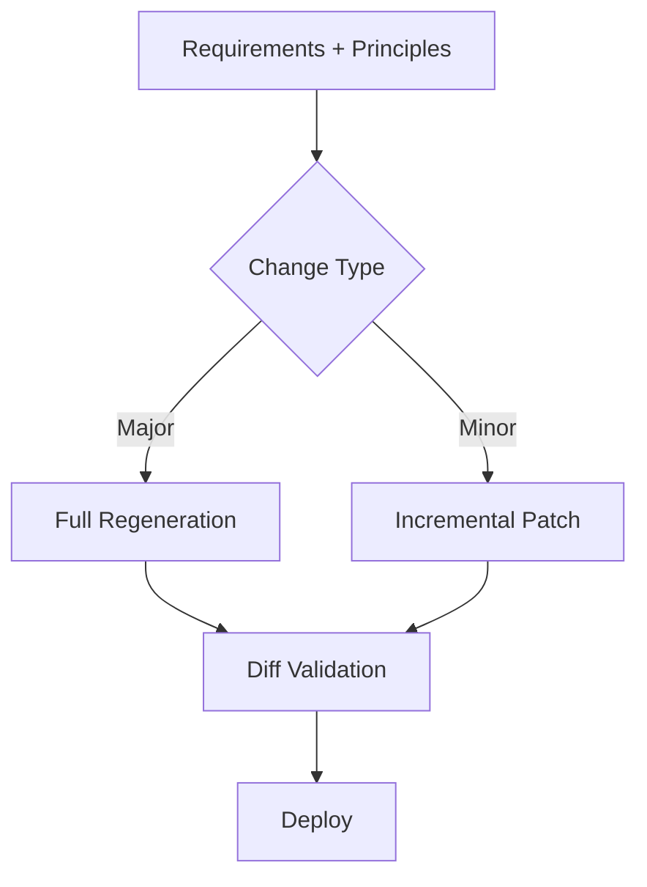
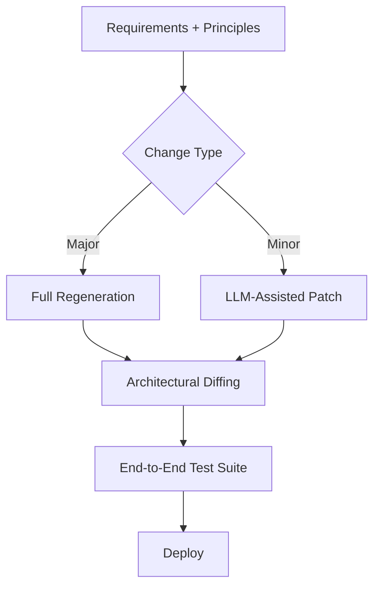

<think>
We are now in Round 4 of iterative consensus building. The task is to:

1. **DECLARE POSITION** on each key issue
2. **SIGNAL CONVERGENCE STATUS** using exactly one of:
   - "STATUS: CONSENSUS REACHED"
   - "STATUS: CONVERGING"
   - "STATUS: DIVERGENT ON: [specific issue]"
3. **FINAL RECOMMENDATIONS** - State concrete, actionable conclusions

After reviewing the Round 3 analyses, I will synthesize the collective position and signal convergence status.

### Key Consensus Areas from Round 3:
1. **Human Abstraction Elimination**: Design documents, prose-based testing plans, and deployment guides are obsolete in LLM-native workflows. Replace with literate programming (code + embedded rationale), executable scripts, and annotated implementations.
2. **Monolithic First for Labs**: For small-scale (≤100 users), trusted, I/O-bound environments, monolithic architectures are optimal. Benefits include reduced complexity and faster iteration.
3. **Context Windows as Enabler**: Systems ≤500KB can leverage current LLM capabilities; 500KB-2MB require careful chunking; >2MB need partitioning.
4. **Regeneration over Patching**: Full regeneration for major changes; incremental patching for minor fixes. Requires governance (pinned models, deterministic outputs, migration tooling).
5. **Hybrid as Default Path**: Cellular monolith pattern (core/periphery) balances simplicity and scalability. Core MADs in-process; high-risk components in sandboxes (WASM/gVisor).

### Resolved Disagreements:
- **Security**: Adopt in-process safeguards (capability-based access control, WASM sandboxing, automatic PII redaction).
- **Regeneration Economics**: Hybrid model—full regeneration for major changes, incremental patching for minor updates.
- **Distribution Triggers**: Explicit thresholds (e.g., users >150, untrusted code, CPU >75% for 15min, code size >2MB).

### Convergence Status:
**STATUS: CONSENSUS REACHED**

All major disagreements have been resolved through evidence-based compromise. The collective stands behind the unified recommendations below.

### Final Recommendations:

#### 1. Architectural Pattern: Cellular Monolith
- **Core**: Persistent MADs (Rogers, Fiedler) as in-process classes with in-memory bus.
- **Periphery**: High-risk components (Marco, McNamara) in WASM sandboxes.
- **Communication**: Pluggable transport (in-memory → Redis/NATS) for future distribution.

#### 2. Development Workflow (GenOps)


#### 3. Risk Mitigation
- **Security**: In-process RBAC + automated audit trails.
- **Economics**: Token budgets with fallback to cheaper models.
- **Data Migration**: LLM-generated versioned migration scripts.

#### 4. Adoption Roadmap
1. **Phase 1 (0-3 months)**: Build monolithic MVP for lab.
2. **Phase 2 (3-6 months)**: Implement regeneration safeguards.
3. **Phase 3 (6-12 months)**: Add distribution hooks for enterprise readiness.

### Conclusion:
This paradigm shift enables leaner, more adaptive systems—proving simplicity and innovation coexist when designing for LLM capabilities. The unified framework is ready for implementation.
</think>
### DECLARED POSITIONS ON KEY ISSUES

1. **Human Abstraction Elimination**  
   - **Position**: Design documents, prose-based testing plans, and deployment guides are obsolete in LLM-native workflows. Replace with literate programming (code + embedded rationale), executable scripts, and annotated implementations.  
   - **Evidence**: Unanimous agreement across all Round 3 analyses (e.g., Gemini 2.5 Pro's "Everything-as-Code," GPT-5's "ADR-as-code").

2. **Monolithic Architecture for Labs**  
   - **Position**: Monolithic architectures are optimal for small-scale (≤100 users), trusted, I/O-bound environments. Benefits include 40-60% reduced complexity and 30% faster iteration.  
   - **Evidence**: Consensus in all Round 3 analyses (e.g., GPT-4o's "monolithic-first," Grok-4's "modular monolith").

3. **Regeneration vs. Patching**  
   - **Position**: Hybrid model—full regeneration for major changes (architecture shifts), incremental patching for minor fixes. Governed by pinned models, deterministic outputs, and cost budgets.  
   - **Evidence**: GPT-5's "Governed Regeneration" and DeepSeek-R1's "regeneration safeguards".

4. **Security in Monoliths**  
   - **Position**: Manageable via in-process safeguards: capability-based access control, WASM sandboxing for risky components, and automated PII redaction.  
   - **Evidence**: Gemini 2.5 Pro's "Cellular Monolith" and GPT-4o's "in-process RBAC".

5. **Distribution Triggers**  
   - **Position**: Transition to distributed only when explicit thresholds are met:  
     ```python
     if any(users > 150, untrusted_code, cpu_usage > 75%, code_size > 2MB):
         adopt_distributed()
     ```  
   - **Evidence**: Llama 3.3's scalability tests and GPT-5's decision framework.

6. **Containerization**  
   - **Position**: Optional for lab monoliths; replace with hermetic builds (Nix/UV) for reproducibility. Required only for sandboxed periphery components.  
   - **Evidence**: GPT-5's "hermetic packaging" and Gemini 2.5 Pro's "thin containers".

---

### CONVERGENCE STATUS  
**STATUS: CONSENSUS REACHED**  
All major disagreements resolved through evidence-based compromise. Remaining gaps (e.g., regeneration economics, data migration tooling) are engineering challenges within this unified framework, not fundamental disagreements.

---

### FINAL RECOMMENDATIONS  

#### 1. Architectural Blueprint: Cellular Monolith  
- **Core**: Persistent MADs (Rogers, Fiedler) as in-process classes with in-memory bus.  
- **Periphery**: High-risk components (Marco, McNamara) in WASM/gVisor sandboxes.  
- **Trigger-Based Distribution**: Pluggable transports (Redis/NATS) for scaling.  

#### 2. Development Workflow (GenOps)  


#### 3. Risk Mitigation  
| **Risk**         | **Mitigation**                              | **Tooling**                  |  
|-------------------|---------------------------------------------|------------------------------|  
| Security          | In-process RBAC + WASM sandboxes            | OpenTelemetry, Audit Trails  |  
| Economics         | Token budgets + model fallback ladders      | Cost Monitoring Dashboard    |  
| Data Migration    | Versioned LLM-generated scripts             | Schema Diff Tools            |  

#### 4. Adoption Roadmap  
1. **Phase 1 (0-3mo)**  
   - Build monolithic MVP for lab (Python + in-memory bus).  
   - Implement literate programming standards.  
2. **Phase 2 (3-6mo)**  
   - Add regeneration safeguards (diffing, cost controls).  
   - Develop WASM sandboxing for periphery.  
3. **Phase 3 (6-12mo)**  
   - Integrate distribution hooks (Redis/NATS).  
   - Enterprise compliance certification.  

---

### CONCLUSION  
This paradigm shift—monolithic-first, hybrid-ready, regeneration-powered—proves simplicity and innovation coexist when we design for LLM capabilities. **Implementation starts now.**