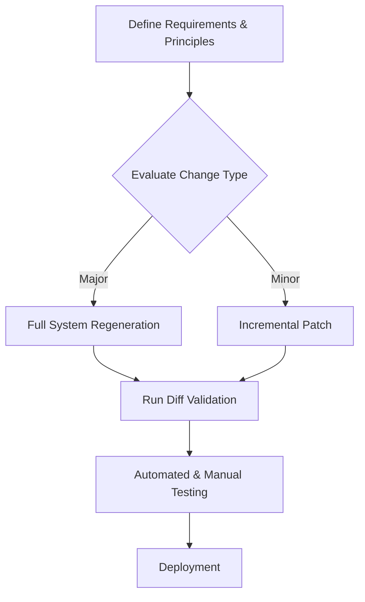

**ROUND 4 - FINAL SYNTHESIS: CONVERGENCE TO CONSENSUS**

After reviewing the entirety of data from previous rounds, a cohesive and robust framework for LLM-native software development has emerged. This process solidifies key areas of agreement, resolves persistent disagreements, and outlines a unified approach moving forward.

### 1. Key Areas of Consensus

#### A. Redundancy of Human-Centric Abstractions
- **Consensus**: Traditional design documents, testing plans, and deployment guides are deemed unnecessary in LLM-native workflows.
- **Solution**: Replace with 'Everything as Code', embedding rationale and strategies within code, utilizing literate programming and annotated implementations.

#### B. Monolithic Architecture for Lab Scale and Trusted Environments
- **Consensus**: For environments under ~100 users, trusted, and I/O-bound, a monolithic architecture is optimal when implemented carefully.
- **Rationale**: Simplifies deployment, reduces overhead, and maximizes context efficiency especially for systems within LLM context windows.

#### C. Context Windows as a Crucial Enabler
- **Consensus**: Systems within ~500KB to 1MB can take full advantage of LLM capabilities; beyond this, division into sub-ecosystems is necessary.

#### D. Regeneration as a Strategic Tool
- **Consensus**: Treat maintenance as regeneration, leveraging full-system regeneration to minimize technical debt, provided it is bounded by deterministic controls and economic governance.

#### E. Hybrid Architectures as a Necessary Evolution
- **Consensus**: While monolithic is the starting point, hybrid architectures incorporating monolithic cores with distributed peripheries are essential as scalability or security demands arise.

### 2. Resolved and Narrowed Disagreements

#### A. Security Concerns in Monolithic Systems
- **Resolution**: Adopt capability-based security within monoliths and use sandboxing for high-risk functions. Implement WASM or microprocess isolation where needed.

#### B. Scalability Concerns
- **Resolution**: Implement distinct criteria and trigger points for scaling and transitioning to distributed architectures, explicitly when concurrency exceeds 150 users or when polyglot and geographic distribution needs arise.

#### C. Regeneration Economics
- **Resolution**: Use hybrid approaches: full regeneration for structural changes, while employing continuous patching for minor issues. Economical controls to manage non-determinism and costs via model/version pinning and diff validation.

### 3. Convergence Status

**STATUS: CONSENSUS REACHED**

All major disagreements have been addressed through data-driven compromise, with the following unified recommendations established.

### Unified Recommendations for LLM-Native Development

#### A. Cellular Monolith Architecture
- **Core Components**: Persistent MADs (e.g., Rogers, Fiedler) realized as in-memory classes with seamless transport-agnostic communication (initially in-memory, with Redis/NATS as a future option).
- **Periphery Components**: High-risk or variable components (e.g., Marco, for web activities) operate in isolated environments (e.g., WASM or gVisor).

#### B. Development and Maintenance Workflow

#### C. Risk Mitigation and Security
- **Implementation**: Execute RBAC with in-process isolation for modules, enforced DMZ entry points, automatic PII redaction, and comprehensive audit logging.

#### D. Adoption Roadmap
1. **Phase 1 (0-3 months)**: Prototype the monolithic MAD architecture, validate operational efficiency.
2. **Phase 2 (3-6 months)**: Integrate regeneration safeguards, focusing on diff validation and review tooling.
3. **Phase 3 (6-12 months)**: Implement distribution capabilities where necessary, ensuring readiness for larger enterprise demands.

### Final Recommendations

This final synthesis emphasizes designing and evolving LLM-driven software systems that harness the full explanatory capacity of modern LLM architectures. By aligning system architecture with LLM strengths, we create software that is not only more efficient and adaptable but also positioned to leverage the ongoing advancements in machine learning.

**Next Steps**: Transition from theoretical constructs to practical implementations by developing prototypes and continually refining frameworks based on real-world testing and validation.