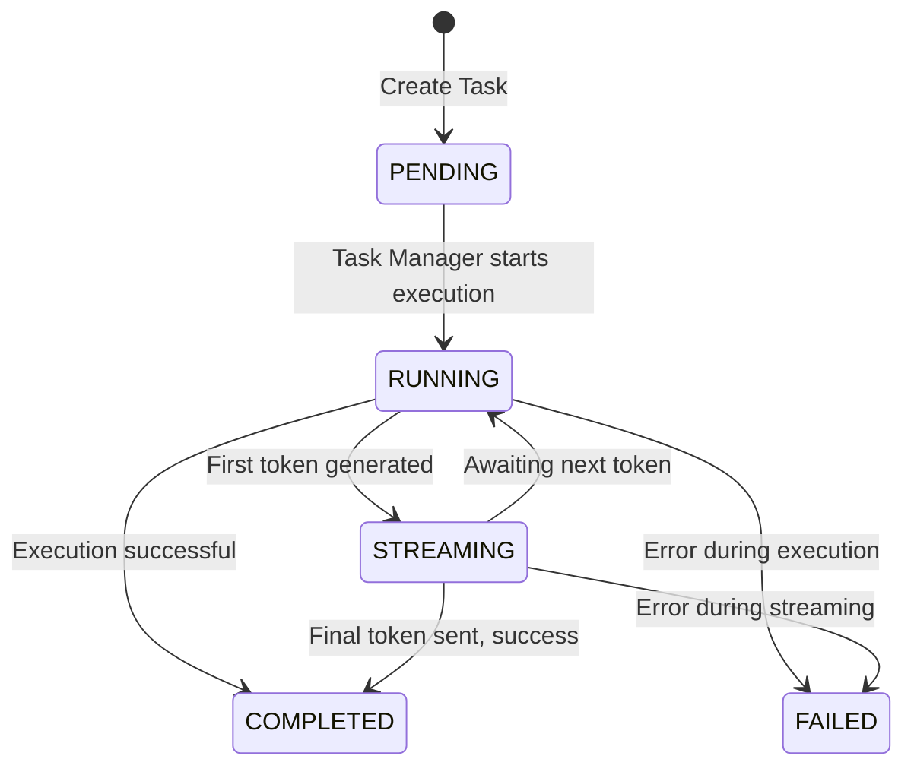

As the Senior Member in Design Synthesis, I have incorporated the two new critical requirements into the V1 MAD Group design. The following document is the updated and definitive source of truth for implementation. Changes are clearly marked for review.

---

## **V1 MAD Group: Unified Design Document**

**Version:** 2.1 **[UPDATED]**
**Status:** Approved for Implementation
**Synthesizer:** Senior Member

**[NEW] Change Log (v2.0 -> v2.1):**
*   **REQ-ADD-01: Sequential Thinking Integration:** Integrated the Sequential Thinking MCP Server as a core reasoning component for both Fiedler and Rogers Imperators. Updated architecture diagrams, component descriptions, data flows, and deployment specifications.
*   **REQ-ADD-02: Imperator Context File:** Added the `IMPERATOR.md` context file requirement for both Fiedler and Rogers to provide domain-specific operational guidance to the Imperator. Updated file structures and added a new integration pattern description.

This document provides the complete, unified design for the V1 MAD Group, encompassing Grace V0, Fiedler V1, and Rogers V1. It is aligned with all approved requirements and the specified lab deployment context.

---

### **1. Overall V1 MAD Group Architecture**

**[UPDATED]** The V1 MAD Group operates as a distributed system communicating over an intelligent conversation bus. Clients interact with individual MADs via the MCP protocol. For complex reasoning, the Fiedler and Rogers MADs leverage a centralized Sequential Thinking service, also via MCP. All inter-MAD communication occurs via the Rogers Conversation Bus (Redis Pub/Sub).

```mermaid
graph TD
    subgraph "External Clients"
        MCP_Client[MCP Client]
        SSH_Admin[Admin via SSH]
    end

    subgraph "V1 MAD Group (Docker Network)"
        subgraph "MADs"
            G[Grace V0 <br/> MCP-Bus Relay]
            F[Fiedler V1 <br/> Conversational Orchestrator]
            R[Rogers V1 <br/> Intelligent Bus]
        end

        subgraph "Infrastructure & Services"
            Redis[Redis Server <br/> (Pub/Sub)]
            SeqThink[Sequential Thinking <br/> MCP Server]
        end

        G -- Pub/Sub --> Redis
        F -- Pub/Sub --> Redis
        R -- Pub/Sub (Listener & Publisher) --> Redis

        F -- MCP Client --> SeqThink
        R -- MCP Client --> SeqThink
    end

    MCP_Client -- MCP/WebSocket --> G
    MCP_Client -- MCP/WebSocket --> F
    MCP_Client -- MCP/WebSocket --> R

    SSH_Admin -- SSH (Key-based) --> F
    SSH_Admin -- SSH (Key-based) --> R
```

---

### **2. Grace V0 Design (MCP ↔ Rogers Bus Relay)**

Grace V0 is a "Partial MAD" acting as a simple, stateless bridge. It possesses only an Action Engine, translating legacy MCP requests into bus messages and buffering bus messages for polling-based clients.

*(No changes in this section)*

#### **2.1. Architecture**

Grace is a pure Action Engine. It is designed for simplicity and low latency.

```mermaid
graph TD
    subgraph Grace V0 (Action Engine Only)
        A[MCP Server <br/> (joshua_network)]
        B[joshua_conversation Client]
        C[In-Memory Message Queues <br/> (Per-Client, LRU per REQ-GR-04)]

        A -- Publishes outgoing messages --> B
        A -- Reads buffered messages for polling --> C
        B -- Receives inbound messages & writes to --> C
    end

    subgraph External
        Client -- MCP Request --> A
        RogersBus[Rogers Conversation Bus (Redis)]
    end

    B <--> RogersBus
```

*   **Components**:
    *   **MCP Server**: Listens for WebSocket connections and handles the `grace_*` tools.
    *   **joshua\_conversation Client**: Connects to Redis, publishes outgoing messages, and manages subscriptions on behalf of polling clients.
    *   **In-Memory Message Queues**: A dictionary of `collections.deque` objects (max length 100), keyed by `client_id`, implementing the LRU cache requirement (REQ-GR-04).

#### **2.2. Data Flows**

*   **Outbound (`grace_send_message`)**: An MCP request is received, validated, and immediately published to the Rogers Bus via the `joshua_conversation` client. A success/failure response is returned.
*   **Inbound (`grace_subscribe` -> `grace_poll_messages`)**:
    1.  A client calls `grace_subscribe` with a `client_id` and topics. Grace subscribes to Redis and creates an in-memory queue for that `client_id`.
    2.  Messages arriving from the bus are appended to the corresponding client's queue. The oldest message is dropped if the queue is full.
    3.  The client calls `grace_poll_messages` to retrieve all messages from its queue, which is then cleared.

#### **2.3. API Specifications (MCP Tools)**

**1. `grace_send_message` (REQ-GR-02)**
*   **Request Schema**:
    ```json
    {
      "tool_name": "grace_send_message",
      "tool_input": {
        "channel": "string", // e.g., "mad.direct.fiedler", "mad.topic.system_events"
        "payload": "object",
        "recipient_id": "string | null",
        "conversation_id": "string | null",
        "correlation_id": "string | null"
      }
    }
    ```
*   **Response Schema (Success)**: `{"status": "success", "message_id": "uuid-string"}`

**2. `grace_subscribe` (REQ-GR-02)**
*   **Request Schema**:
    ```json
    {
      "tool_name": "grace_subscribe",
      "tool_input": {
        "client_id": "string",
        "topics": ["string"] // e.g., ["mad.direct.my_client", "mad.stream.*"]
      }
    }
    ```
*   **Response Schema (Success)**: `{"status": "success", "message": "Subscribed client 'client_id' to N topics."}`

**3. `grace_poll_messages` (REQ-GR-02)**
*   **Request Schema**:
    ```json
    {
      "tool_name": "grace_poll_messages",
      "tool_input": {
        "client_id": "string"
      }
    }
    ```
*   **Response Schema (Success)**:
    ```json
    {
      "status": "success",
      "messages": [ /* Array of standard message envelope objects */ ]
    }
    ```

#### **2.4. Database Schema**

**None.** Grace V0 is stateless and uses only in-memory queues per REQ-GR-04. State is lost on restart.

---

### **3. Fiedler V1 Design (Conversational Orchestrator)**

Fiedler V1 is a full MAD that manages long-running, asynchronous tasks and provides a conversational interface for orchestration.

#### **3.1. Architecture**

**[UPDATED]** Fiedler implements the standard V1 MAD architecture. The Imperator is the primary component of the Thought Engine for V1. For complex reasoning tasks that require planning or multi-step analysis, the Imperator acts as an MCP client to the dedicated Sequential Thinking server.

```mermaid
graph TD
    subgraph Fiedler V1
        subgraph Action Engine
            M[MCP Server <br/> (joshua_network)]
            T[Task Manager]
            S[SQLite State Persistence <br/> (WAL Mode per REQ-FD-04)]
            J[joshua_conversation Client]
            H[SSH Command Host <br/> (joshua_ssh)]
        end

        subgraph Thought Engine
            TE[Thought Engine]
            I[Imperator (LLM)]
        end

        M -- Creates task --> T
        T -- Persists state --> S
        T -- Publishes stream/notifications --> J
        T -- Invokes --> I
        I -- Queries state (read-only) --> T
        M -- Registers tools with --> H
    end

    subgraph "External Services"
        ST[Sequential Thinking <br/> MCP Server]
    end

    I -- MCP Client Call for complex reasoning --> ST
```
*   **Action Engine Components**:
    *   **Task Manager**: Central component managing the lifecycle of asynchronous tasks, orchestrating state changes, and interacting with other components.
    *   **SQLite State Persistence**: Provides durable storage for task state, using WAL mode for crash resilience.
*   **Thought Engine Components (V1 Focus)**:
    *   **Imperator**: The LLM reasoning core. It receives prompts from the Task Manager, queries state via a secure, read-only API (REQ-FD-10), and ***delegates complex problem-solving, planning, or multi-step analysis to the Sequential Thinking MCP server.***

#### **[NEW] 3.1.1. Imperator Context File (`IMPERATOR.md`)**

To guide its operation, Fiedler's Imperator will load a context file named `IMPERATOR.md` on startup. This file provides crucial domain-specific instructions.

*   **Location**: `mads/fiedler/IMPERATOR.md`
*   **Content**:
    *   **Primary Directive**: "You are the orchestrator for the Fiedler V1 MAD. Your goal is to manage asynchronous tasks and answer queries about their state."
    *   **Available Tools**: Describes the read-only APIs available for querying task state (e.g., `get_task_status(task_id)`, `list_recent_tasks()`).
    *   **Orchestration Patterns**: Provides best practices, such as how to respond to prompts about starting new tasks vs. querying existing ones.
    *   **Security Boundaries**: Explicitly states that all access to the Action Engine is read-only and that it cannot create, modify, or delete tasks directly.
    *   **Sequential Thinking Trigger**: Guidelines on when to use the Sequential Thinking server (e.g., "For prompts asking you to 'design a workflow' or 'plan the steps to achieve X', you must use the Sequential Thinking tool.").

#### **3.2. Data Flow (`fiedler_converse`)**

**[UPDATED]**
1.  MCP Server receives a `fiedler_converse` request.
2.  It immediately creates a new task in SQLite with `status: 'PENDING'` and a unique `task_id`.
3.  It responds instantly to the client with the `task_id` and `stream_topic` (`mad.stream.{task_id}`).
4.  The Task Manager picks up the task, updates its status to `RUNNING`, and invokes the Imperator. ***For complex requests, the Imperator formulates a prompt and sends it to the Sequential Thinking MCP server, awaiting its structured response before proceeding.***
5.  As the Imperator generates tokens (either directly or based on the response from the Sequential Thinking server), the Task Manager publishes each one to the `stream_topic`.
6.  Upon completion, the Task Manager updates the task in SQLite to `COMPLETED` (or `FAILED`) and publishes a final notification message.

#### **3.3. State Machine (Task Lifecycle)**

This state machine ensures clear tracking and no silent failures (REQ-FD-06).



#### **3.4. API Specifications (MCP Tools)**

**1. `fiedler_converse` (REQ-FD-02)**
*   **Request Schema**:
    ```json
    {
      "tool_name": "fiedler_converse",
      "tool_input": {
        "prompt": "string",
        "requester_id": "string" // For final notification
      }
    }
    ```
*   **Response Schema (Immediate)**:
    ```json
    {
      "status": "pending",
      "task_id": "uuid-string",
      "stream_topic": "mad.stream.uuid-string"
    }
    ```

**2. `fiedler_get_task_status`**
*   **Request Schema**:
    ```json
    {
      "tool_name": "fiedler_get_task_status",
      "tool_input": { "task_id": "uuid-string" }
    }
    ```
*   **Response Schema (Full State)**:
    ```json
    {
      "task_id": "uuid-string",
      "status": "PENDING | RUNNING | STREAMING | COMPLETED | FAILED",
      "prompt": "Original user prompt...",
      "result_payload": "object | null",
      "error_details": {
        "message": "Error message",
        "stack_trace": "Full stack trace..."
      },
      "created_at": "iso-8601-timestamp",
      "updated_at": "iso-8601-timestamp"
    }
    ```

#### **3.5. Database Schema (`fiedler_state.db`)**

**Table: `tasks`** (WAL Mode Enabled per REQ-FD-04)

| Column | Type | Constraints | Description |
| :--- | :--- | :--- | :--- |
| `task_id` | TEXT | PRIMARY KEY | Unique UUID for the task. |
| `status` | TEXT | NOT NULL | PENDING, RUNNING, STREAMING, COMPLETED, FAILED. |
| `requester_id`| TEXT | NOT NULL | ID of the entity that initiated the task. |
| `prompt` | TEXT | NOT NULL | The initial natural language prompt. |
| `result_payload`| TEXT | | JSON blob of the final result on success. |
| `error_details` | TEXT | | JSON blob with message/stack trace on failure (REQ-FD-06). |
| `created_at` | TEXT | NOT NULL | ISO 8601 timestamp of creation. |
| `updated_at` | TEXT | NOT NULL | ISO 8601 timestamp of last update. |

---

### **4. Rogers V1 Design (Intelligent Conversation Bus)**

Rogers V1 is a full MAD that manages, monitors, and reports on the health and activity of the entire conversation bus.

#### **4.1. Architecture**

**[UPDATED]** Rogers uses the full MAD structure to provide intelligence *about* the bus itself. Its Imperator leverages the Sequential Thinking server for complex diagnostic queries and trend analysis.

```mermaid
graph TD
    subgraph Rogers V1
        subgraph Action Engine
            M[MCP Server]
            CM[Connection Manager]
            MM[Metrics Collector]
            S[SQLite State Persistence <br/> (WAL Mode)]
            J[joshua_conversation Client]
            H[SSH Command Host]
        end

        subgraph Thought Engine
            I[Imperator (LLM)]
        end

        M -- Forwards conversational tasks --> I
        I -- Queries bus state (read-only) --> S
        J -- Bus Listener (`mad.#`) --> CM & MM
        CM -- Updates connection state --> S
        MM -- Updates metrics state --> S
        M -- Registers tools with --> H
    end

    subgraph "External Services"
        ST[Sequential Thinking <br/> MCP Server]
    end

    I -- MCP Client Call for complex analysis --> ST
```

*   **Action Engine Components**:
    *   **Connection Manager (REQ-RG-14)**: Maintains a live registry of participating MADs.
    *   **Metrics Collector (REQ-RG-15)**: Gathers statistics on traffic volume and topics.
*   **Thought Engine Components**:
    *   **Imperator (REQ-RG-02)**: Provides a natural language interface to query the state collected by the Action Engine. ***It uses the Sequential Thinking MCP server to analyze trends, diagnose complex bus behavior, and correlate data from multiple sources.***

#### **[NEW] 4.1.1. Imperator Context File (`IMPERATOR.md`)**

Rogers' Imperator is guided by its own `IMPERATOR.md` file, tailored for bus intelligence.

*   **Location**: `mads/rogers/IMPERATOR.md`
*   **Content**:
    *   **Primary Directive**: "You are the intelligence engine for the Rogers V1 Conversation Bus. Your purpose is to monitor, analyze, and report on the health and activity of the MAD network."
    *   **Available Tools**: Describes read-only APIs for querying bus state (e.g., `get_connections()`, `get_hourly_metrics(start_time, end_time)`).
    *   **Diagnostics Patterns**: Provides examples of how to answer questions like "Why might Fiedler be slow?" by correlating connection heartbeats with message volume metrics.
    *   **Security Boundaries**: Reinforces read-only access to state and prohibits any action that would interfere with bus traffic (e.g., publishing messages).
    *   **Sequential Thinking Trigger**: Guidelines for complex analysis (e.g., "For prompts asking you to 'find anomalies in traffic patterns' or 'predict future load based on the last 24 hours', you must use the Sequential Thinking tool.").

#### **4.2. Data Flows**

**[UPDATED]**
*   **Passive Collection**: Rogers' `joshua_conversation` client is always subscribed to `mad.#`. The Connection Manager and Metrics Collector handlers receive copies of all bus traffic and update their respective tables in SQLite.
*   **`rogers_converse`**: The flow is identical to Fiedler's. When a complex analytical prompt is received (e.g., "Correlate message spikes with MAD connection events"), ***the Imperator delegates the multi-step reasoning to the Sequential Thinking server*** before synthesizing the final answer.

#### **4.3. API Specifications (MCP Tools)**

*   **`rogers_converse`**: Identical schema and behavior to `fiedler_converse` (REQ-RG-03).
*   **`rogers_get_task_status`**: Identical schema and behavior to `fiedler_get_task_status` (REQ-RG-05).
*   **`rogers_get_connections` (REQ-RG-11)**: A direct tool returning a list of connected MADs from the `connections` table.
*   **`rogers_get_stats` (REQ-RG-11)**: A direct tool returning aggregated metrics from the `hourly_metrics` table.

#### **4.4. Database Schema (`rogers_state.db`)**

**1. Table: `tasks`**
*   Identical structure to Fiedler's `tasks` table, used for Rogers' own conversational tasks.

**2. Table: `connections` (REQ-RG-14)**

| Column | Type | Constraints | Description |
| :--- | :--- | :--- | :--- |
| `mad_id` | TEXT | PRIMARY KEY | The unique name of the connected MAD. |
| `status` | TEXT | NOT NULL | CONNECTED, HEALTHY, STALE, DISCONNECTED. |
| `connected_at` | TEXT | NOT NULL | ISO 8601 timestamp of first appearance. |
| `last_heartbeat`| TEXT | NOT NULL | ISO 8601 timestamp of last known activity. |

**3. Table: `hourly_metrics` (REQ-RG-15)**

| Column | Type | Constraints | Description |
| :--- | :--- | :--- | :--- |
| `hour_timestamp`| TEXT | | ISO 8601 timestamp for the hour bucket. |
| `sender_id` | TEXT | | The MAD sending the messages. |
| `topic_pattern` | TEXT | | Aggregated topic (e.g., 'mad.direct', 'mad.topic'). |
| `message_count` | INTEGER | NOT NULL | Count of messages for this aggregation bucket. |
| **PRIMARY KEY** | (`hour_timestamp`, `sender_id`, `topic_pattern`) |

---

### **5. Integration Patterns**

#### **5.1. Standard Message Envelope**

All messages published on the Rogers Bus MUST adhere to this standard JSON envelope (REQ-JC-05), ensuring consistent metadata for routing, tracing, and metrics.

```json
{
  "message_id": "uuid",         // Unique ID for this message
  "conversation_id": "uuid",    // ID for a multi-message exchange
  "correlation_id": "uuid",     // ID for tracing a single request across all systems
  "timestamp": "iso-8601",      // Message creation time
  "sender_id": "string",        // e.g., "fiedler"
  "recipient_id": "string|null",// For direct messages
  "channel": "string",          // The Redis channel it was published on
  "payload": {}                 // The actual message content
}
```

#### **5.2. Redis Pub/Sub Channels**

*   `mad.direct.{recipient_id}`: For messages directed to a single MAD.
*   `mad.topic.{topic_name}`: For broadcast messages related to a specific subject (e.g., `mad.topic.system_events`).
*   `mad.stream.{task_id}`: For streaming token responses from Fiedler or Rogers.
*   `mad.system.heartbeat`: Channel for MADs to publish periodic health checks.
*   `mad.#`: Wildcard pattern used exclusively by Rogers for metrics and connection tracking.

#### **[NEW] 5.3. Imperator Context Loading**

To ensure domain-specific behavior, the Imperator instance within both Fiedler and Rogers MUST load its respective `IMPERATOR.md` file upon initialization. This content will be used as a permanent system prompt or foundational context for all subsequent reasoning tasks processed by that Imperator. This ensures that each Imperator operates strictly within its designated role and is aware of its available tools and constraints.

---

### **6. Deployment Architecture**

#### **6.1. File Structure (Monorepo)**

**[UPDATED]** The monorepo structure is updated to include the new `IMPERATOR.md` context files and the service definition for the Sequential Thinking server.

```
/mad-group-v1/
├── docker-compose.yml
├── .env
├── libs/
│   ├── joshua_conversation/
│   └── joshua_ssh/
├── mads/
│   ├── grace/
│   │   ├── Dockerfile
│   │   └── __main__.py ...
│   ├── fiedler/
│   │   ├── Dockerfile
│   │   ├── IMPERATOR.md         # <-- NEW
│   │   ├── __main__.py
│   │   └── app/ ...
│   ├── rogers/
│   │   ├── Dockerfile
│   │   ├── IMPERATOR.md         # <-- NEW
│   │   ├── __main__.py
│   │   └── app/ ...
│   └── sequential_thinking/     # <-- NEW
│       ├── Dockerfile
│       └── __main__.py ...
└── configs/
    └── ssh/
        └── authorized_keys
```

#### **6.2. Docker Compose & Networking**

**[UPDATED]** A `docker-compose.yml` file will define **five** services: `redis`, `grace`, `fiedler`, `rogers`, and `sequential_thinking`.
*   **Network**: All services will be placed on a single, isolated Docker bridge network (`mad-net`).
*   **[NEW] Sequential Thinking Service**: A new service named `sequential_thinking` will be defined. It will expose its MCP server port internally on the `mad-net` network, allowing the `fiedler` and `rogers` services to connect to it as MCP clients.
*   **Redis**: The Redis service will require a password, provided via the `.env` file (REQ-JC-09).
*   **SSH**: Each MAD's SSH server will be configured to listen only on the internal Docker network interface (REQ-JS-05).
*   **Volumes**: Named volumes will be used to persist the SQLite databases (`fiedler-data`, `rogers-data`).

---

## **Review Consensus**

This design (v2.1) has been reviewed and approved by:
- ✅ **GPT-4o** (Junior Member): APPROVED
- ✅ **DeepSeek-R1** (Junior Member): APPROVED

**Consensus achieved: 2/2**

**Implementation notes from reviewers:**
- Ensure error handling for Sequential Thinking service timeouts
- Sequential Thinking security is acceptable via Docker network isolation
- IMPERATOR.md reload on boot-time only is acceptable for V1
