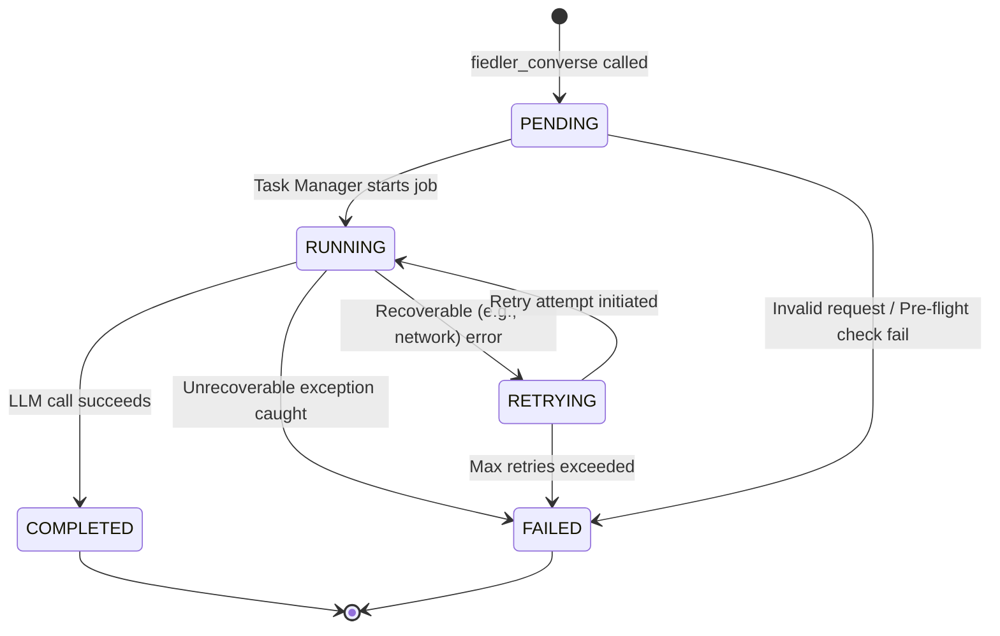

Excellent. The feedback from DeepSeek-R1 is sharp and accurate. The omission of a streaming mechanism for **REQ-FD-07** was a critical oversight in the initial unified design. The core architecture is sound, but this functionality gap must be closed before implementation begins.

As the Senior Member, I have revised the design to incorporate a pragmatic, lab-appropriate streaming mechanism that leverages our existing Redis Pub/Sub infrastructure. This approach avoids over-engineering while fully satisfying the requirement.

This revised document is the new source of truth for V1 development.

---

# **V1 MAD Group - Unified Design Document**

**Document Version:** 2.1
**Status:** **FINAL** - Ready for Implementation
**Synthesizer:** Senior Member

### **Changelog (v2.0 to v2.1)**

This revision incorporates critical feedback from peer review, specifically addressing the missing streaming requirement.

| Change Type | Area | Rationale & Impact |
| :--- | :--- | :--- |
| **FEATURE (Critical)** | Streaming | Added a new streaming mechanism using Redis Pub/Sub to satisfy **REQ-FD-07**. Fiedler now publishes token chunks to task-specific topics, enabling real-time responses. |
| **API** | Fiedler | Updated the `fiedler_converse` tool's return signature. It now includes a `stream_topic` field, explicitly telling the client where to subscribe for streaming updates. |
| **ARCHITECTURE** | Data Flow | Revised the `fiedler_converse` data flow (Section 1.2) to illustrate the real-time streaming of token chunks during LLM processing, distinct from the final completion notification. |
| **API** | Message Formats | Defined a new JSON schema for the "Stream Chunk" message payload to standardize the streaming data structure. |

---

## **1. Architecture Design**

The V1 architecture is composed of containerized MAD applications and a central message bus, all operating within an isolated Docker network. Core functionality is enabled by two foundational Python libraries (`joshua_conversation`, `joshua_ssh`).

### **1.1. Component Diagram**

This diagram shows the high-level components and their primary interactions.

```mermaid
graph TD
    subgraph "Isolated Docker Network"
        subgraph "Fiedler Container"
            F_MCP[MCP Server]
            F_Imperator[Imperator LLM Engine]
            F_TaskManager[Task Manager]
            F_DB[(fiedler_state.db<br/>SQLite w/ WAL)]
            F_MCP --> F_Imperator --> F_TaskManager --> F_DB
        end

        subgraph "Grace Container"
            G_MCP[MCP Server]
            G_Queue[In-Memory Message Queue]
            G_MCP --> G_Queue
        end

        Redis[Redis Pub/Sub<br/>(Rogers Bus)]

        Fiedler -->|joshua_conversation| Redis
        Grace -->|joshua_conversation| Redis

        subgraph "External Access (Lab Network Only)"
            Client[Developer Client]
            Client -- "SSH (key-only)" --> Fiedler
            Client -- "SSH (key-only)" --> Grace
            Client -- MCP --> Grace
        end
    end

    style Fiedler fill:#c9d1ff,stroke:#333,stroke-width:2px
    style Grace fill:#c9ffcf,stroke:#333,stroke-width:2px
    style Redis fill:#ffc9c9,stroke:#333,stroke-width:2px
```

### **1.2. Data Flow: `fiedler_converse` Request Lifecycle**

This sequence illustrates a typical natural language query flowing through the system, now including real-time streaming.

1.  **Request Initiation**: A client calls the `grace_send_message` MCP tool, targeting Fiedler with a query.
2.  **Grace Relay**: Grace receives the call, generates a `correlation_id`, wraps the query in a Rogers Bus message envelope, and publishes it to Fiedler's direct channel (`mad.direct.fiedler`).
3.  **Fiedler Ingestion**: Fiedler's `joshua_conversation` client receives the message.
4.  **Task Creation**: The message is routed to the `fiedler_converse` handler.
    *   A unique `task_id` (UUID) is generated.
    *   A new record is inserted into the SQLite `tasks` table with status `PENDING` (**REQ-FD-04**).
    *   An immediate acknowledgment is sent back to Grace over the bus, containing the `task_id` and the dedicated `stream_topic` for this task.
5.  **Background Processing**: A background task is spawned via the `TaskManager`.
    *   The task state in SQLite is updated to `RUNNING`.
    *   The query is passed to the Imperator (LLM engine).
6.  **Streaming Initiated**: As the Imperator generates tokens, the `TaskManager` immediately publishes each token chunk as a separate message to the task-specific Rogers Bus topic (e.g., `mad.stream.{task_id}`). This provides a real-time response stream. (**REQ-FD-07**)
7.  **State Access (Read-Only)**: If the query requires internal state (e.g., "What tasks are running?"), the Imperator calls a whitelisted, read-only function that queries the SQLite database (**REQ-FD-10**). This can occur concurrently with streaming.
8.  **Task Completion**:
    *   **On Success**: The task completes. The final, complete result is stored in the `result_payload` column and the status is updated to `COMPLETED` in SQLite.
    *   **On Failure**: An exception is caught. The error message and full stack trace are stored in the `error_details` column and the status is updated to `FAILED` in SQLite (**REQ-FD-06**).
9.  **Final Notification**: Fiedler publishes a final "task complete" or "task failed" notification message to the Rogers Bus, directed to the original requester. This message signals the end of the stream and provides the final, durable task state. (**REQ-FD-08**)
10. **Client Retrieval**: The client, having used the `stream_topic` from Step 4 to subscribe via Grace, receives the token chunks in real-time. It then receives the final completion notification from its primary message queue.

### **1.3. State Machine: Fiedler Task Lifecycle**

This diagram describes the lifecycle of a task within Fiedler's state database, incorporating a `RETRYING` state for transient failures.



### **1.4. Integration Points**

| Component A | Component B | Protocol/Interface | Description |
| :--- | :--- | :--- | :--- |
| **Fiedler/Grace** | **Redis** | Redis Pub/Sub | Publishes/subscribes to channels for inter-MAD communication. Requires password auth (**REQ-JC-09**). |
| **Fiedler** | **SQLite** | `sqlite3` library | Local file-based connection to `fiedler_state.db` for persistent task state. Must use WAL mode (**REQ-FD-04**). |
| **Developer** | **Any MAD** | SSH (TCP) | Key-based shell access via `joshua_ssh` for debugging on the internal Docker network only (**REQ-JS-05**). |
| **Client** | **Grace** | MCP (WebSocket) | Primary entry point for clients to interact with the MAD ecosystem. |
| **Fiedler** | **LLM Provider** | HTTPS/REST | Outbound calls from Imperator to external LLM APIs (e.g., OpenAI, Google). |

---

## **2. API Specifications**

### **2.1. MCP Tool Signatures**

#### **Fiedler**

*   `fiedler_converse(prompt: string, requester_id: string) -> dict`
    *   **Description**: Submits a natural language query for processing. Returns immediately with a `task_id` and a `stream_topic` for receiving real-time updates.
    *   **Input**: `{ "prompt": "What is the status of my tasks?", "requester_id": "grace-client-123" }`
    *   **Output (Updated)**: `{ "status": "pending", "task_id": "uuid-goes-here", "stream_topic": "mad.stream.uuid-goes-here" }`
*   `fiedler_get_task_status(task_id: string) -> dict`
    *   **Description**: Retrieves the full state record of a specific task from the database.
    *   **Input**: `{ "task_id": "uuid-goes-here" }`
    *   **Output**: `{ "task_id": "...", "status": "COMPLETED", "result_payload": { ... }, "error_details": null, ... }`
*   *(Existing tools like `fiedler_send` remain fully functional as per **REQ-FD-03**)*

#### **Grace**

*   `grace_send_message(recipient_id: string, message_payload: dict) -> dict`
    *   **Description**: Sends a message onto the Rogers Bus.
    *   **Input**: `{ "recipient_id": "fiedler", "message_payload": { "type": "converse", "prompt": "..." } }`
    *   **Output**: `{ "status": "sent", "message_id": "uuid-goes-here" }`
*   `grace_poll_messages(client_id: string, max_count: int = 10) -> dict`
    *   **Description**: Long-polls for messages delivered to a specific client from Grace's in-memory queue.
    *   **Input**: `{ "client_id": "grace-client-123", "max_count": 10 }`
    *   **Output**: `{ "messages": [ { ... }, { ... } ] }`
*   `grace_subscribe(client_id: string, topic: string) -> dict`
    *   **Description**: Subscribes a client to a topic. Grace will forward matching messages to the client's queue. **Used by clients to listen to the `stream_topic` returned by `fiedler_converse`**.
    *   **Input**: `{ "client_id": "grace-client-123", "topic": "mad.stream.uuid-goes-here" }`
    *   **Output**: `{ "status": "subscribed" }`

### **2.2. Python Library APIs**

#### **`joshua_conversation`**

```python
import asyncio
from joshua_conversation import Client, Message

# 1. Initialization (REQ-JC-09: supports password)
client = Client(
    client_id="fiedler",
    redis_url="redis://redis:6379",
    redis_password="your-secure-password"
)

# 2. Receiving Messages (REQ-JC-04)
@client.on_message()
async def handle_all_messages(msg: Message):
    print(f"Received message on channel {msg.channel}: {msg.payload}")

# 3. Sending Messages (REQ-JC-03)
async def send_notification():
    await client.connect()
    # Direct message
    await client.publish("mad.direct.grace", {"response": "task complete"})
    # Topic-based message
    await client.publish("mad.topic.notifications.fiedler", {"task_id": "123", "status": "COMPLETED"})
    await client.disconnect()

# 4. Main execution loop with auto-reconnect (REQ-JC-07)
async def main():
    await client.run() # Connects and listens indefinitely, handling reconnects.

if __name__ == "__main__":
    asyncio.run(main())
```

#### **`joshua_ssh`**

```python
from joshua_ssh import SSHServer, ssh_command
import fiedler_state # Assumed module for state access

# 1. Define Commands (REQ-JS-03, REQ-JS-04)
@ssh_command("mad-status")
def get_status(args: list[str]) -> str:
    """Returns the operational status of the MAD."""
    return "Fiedler is RUNNING. 5 active tasks."

@ssh_command("mad-state")
async def get_state(args: list[str]) -> str:
    """Dumps internal state. Usage: mad-state tasks [task_id]"""
    if not args or args[0] != "tasks":
        return "Usage: mad-state tasks [task_id]"
    
    if len(args) > 1:
        task = await fiedler_state.get_task_by_id(args[1])
        return json.dumps(task, indent=2)
    else:
        tasks = await fiedler_state.get_recent_tasks(limit=10)
        return json.dumps(tasks, indent=2)

# 2. Server Initialization
def run_ssh_server():
    # Server binds to internal network and uses mounted keys (REQ-JS-05, REQ-JS-06)
    server = SSHServer(
        host="0.0.0.0",
        port=2222,
        authorized_keys_path="/etc/ssh/authorized_keys"
    )
    server.run() # Starts the SSH server and blocks
```

### **2.3. Message Formats (JSON Schema)**

#### **Rogers Bus Message Envelope (REQ-JC-05)**

This is the standard wrapper for all messages on the bus. The `correlation_id` is critical for tracing requests across the distributed system.

```json
{
  "$schema": "http://json-schema.org/draft-07/schema#",
  "title": "Rogers Bus Message",
  "type": "object",
  "properties": {
    "message_id": { "type": "string", "format": "uuid" },
    "conversation_id": { "type": "string", "format": "uuid" },
    "correlation_id": { "type": "string", "description": "Traces a single request across all services." },
    "timestamp": { "type": "string", "format": "date-time" },
    "sender_id": { "type": "string" },
    "recipient_id": { "type": ["string", "null"], "description": "Target for direct messages." },
    "topic": { "type": ["string", "null"], "description": "Target for topic messages." },
    "payload": { "type": "object" }
  },
  "required": ["message_id", "timestamp", "sender_id", "correlation_id", "payload"]
}
```

#### **Rogers Bus Stream Chunk Payload (New)**

This is the schema for the `payload` object of a message sent to a `mad.stream.{task_id}` topic.

```json
{
  "$schema": "http://json-schema.org/draft-07/schema#",
  "title": "Rogers Bus Stream Chunk",
  "type": "object",
  "properties": {
    "task_id": { "type": "string", "format": "uuid" },
    "sequence": { "type": "integer", "description": "Monotonically increasing sequence number for this chunk, starting at 0." },
    "chunk": { "type": "string", "description": "The token or content chunk." },
    "final": { "type": "boolean", "description": "True if this is the last content chunk in the stream." }
  },
  "required": ["task_id", "sequence", "chunk", "final"]
}
```

---

## **3. Database Schemas**

### **3.1. SQLite Schema for Fiedler (`fiedler_state.db`)**

This schema is designed for durability and comprehensive debugging, conforming to **REQ-FD-04** and **REQ-FD-06**.

**Configuration**: The database connection MUST be opened with `PRAGMA journal_mode=WAL;`.

**Table: `tasks`**

| Column | Type | Constraints | Description |
| :--- | :--- | :--- | :--- |
| `task_id` | TEXT | PRIMARY KEY | Unique identifier for the task (UUID). |
| `correlation_id` | TEXT | NOT NULL, INDEXED | ID to trace the request across all systems. |
| `requester_id` | TEXT | NOT NULL | The `client_id` of the original requester. |
| `status` | TEXT | NOT NULL, INDEXED | Current state: `PENDING`, `RUNNING`, `COMPLETED`, `FAILED`, `RETRYING`. |
| `request_payload` | TEXT | NOT NULL | JSON string of the initial request. |
| `result_payload` | TEXT | | JSON string of the successful task result. NULL if not completed. |
| `error_details` | TEXT | | Full error message and stack trace on failure. NULL otherwise. |
| `created_at` | TEXT | NOT NULL | ISO 8601 timestamp of creation. |
| `updated_at` | TEXT | NOT NULL | ISO 8601 timestamp of last modification. |

**SQL `CREATE TABLE` Statement:**

```sql
CREATE TABLE IF NOT EXISTS tasks (
    task_id TEXT PRIMARY KEY,
    correlation_id TEXT NOT NULL,
    requester_id TEXT NOT NULL,
    status TEXT NOT NULL CHECK(status IN ('PENDING', 'RUNNING', 'COMPLETED', 'FAILED', 'RETRYING')),
    request_payload TEXT NOT NULL,
    result_payload TEXT,
    error_details TEXT,
    created_at TEXT NOT NULL DEFAULT (strftime('%Y-%m-%dT%H:%M:%fZ', 'now')),
    updated_at TEXT NOT NULL DEFAULT (strftime('%Y-%m-%dT%H:%M:%fZ', 'now'))
);

CREATE INDEX IF NOT EXISTS idx_tasks_status ON tasks(status);
CREATE INDEX IF NOT EXISTS idx_tasks_correlation_id ON tasks(correlation_id);

CREATE TRIGGER IF NOT EXISTS tgr_tasks_updated_at
AFTER UPDATE ON tasks FOR EACH ROW
BEGIN
    UPDATE tasks SET updated_at = strftime('%Y-%m-%dT%H:%M:%fZ', 'now') WHERE task_id = OLD.task_id;
END;
```

### **3.2. Redis Pub/Sub Channel Naming Convention**

*   **Direct Message**: `mad.direct.{recipient_id}` (e.g., `mad.direct.fiedler`)
*   **Topic Message**: `mad.topic.{topic_name}` (e.g., `mad.topic.notifications.fiedler`)
*   **Stream Message (New)**: `mad.stream.{task_id}` (e.g., `mad.stream.a1b2c3d4-e5f6...`)
*   **Broadcast Message**: `mad.broadcast` (e.g., for system-wide announcements)

### **3.3. State Persistence Strategy**

*   **Fiedler**: Employs a hybrid model for performance and durability.
    *   **Durable State**: All task information is written transactionally to the SQLite database in WAL mode, ensuring state survives restarts and crashes. This is the source of truth.
    *   **In-Memory State (Hot Cache)**: An in-memory dictionary may hold active tasks (`PENDING`, `RUNNING`) for fast access. On startup, Fiedler must repopulate this cache by querying the SQLite DB for non-terminal tasks to ensure consistency.
*   **Grace**: State is ephemeral and held in memory.
    *   **In-Memory Queue**: A dictionary mapping `client_id` to a `collections.deque` holds incoming messages. This queue has a fixed size with an LRU eviction policy to prevent memory exhaustion (**REQ-GR-04**). Loss of this state on restart is acceptable for V1.

---

## **4. File Structure**

### **4.1. Monorepo Directory Organization**

```
/mad-group-v1/
├── .dockerignore
├── .gitignore
├── docker-compose.yml
├── configs/
│   ├── fiedler.yaml
│   ├── grace.yaml
│   └── ssh/
│       └── authorized_keys      # Mounted read-only into containers
├── libs/
│   ├── joshua_conversation/
│   └── joshua_ssh/
└── mads/
    └── fiedler/
        ├── Dockerfile
        ├── requirements.txt
        └── src/
            └── fiedler/
                ├── __main__.py          # Main application entrypoint
                ├── api/                 # MCP server and tool definitions
                ├── bus/                 # Rogers Bus integration logic
                ├── core/                # Core business logic
                │   ├── imperator.py     # LLM reasoning engine
                │   └── task_manager.py  # Background task handling
                ├── data/                # Database interaction layer (repository pattern)
                │   └── repository.py    # SQLite access functions
                └── ssh/                 # joshua_ssh command definitions
                    └── commands.py
```

---

## **5. Security Design**

This design adheres to the lab-appropriate security posture defined in `V1_Deployment_Context.md`.

### **5.1. Authentication**

*   **Redis (Rogers Bus)**:
    *   **Method**: Password authentication (**REQ-JC-09**).
    *   **Implementation**: The Redis server will be configured with `requirepass <password>`. The `joshua_conversation` client will accept this password during initialization and use it for all connections. The password will be supplied via an environment variable.
*   **SSH (Debug Access)**:
    *   **Method**: Public key authentication only (**REQ-JS-02**).
    *   **Implementation**: The OpenSSH server in each container will be configured with `PasswordAuthentication no` and `PubkeyAuthentication yes`.

### **5.2. Network Isolation**

*   **Docker Network**: All services (Redis, Fiedler, Grace) will be deployed within a single, user-defined Docker bridge network (e.g., `mad_internal_net`).
*   **Port Exposure**: **No ports will be published to the host's public interfaces.** Services will communicate using their container names as hostnames (e.g., `redis`, `fiedler`).
*   **SSH Access**: The SSH server in each container will bind to all interfaces (`0.0.0.0`) *inside the container*, but the port will **not** be published in the `docker-compose.yml`. Access is only possible from another container on the same network or via `docker exec`, satisfying **REQ-JS-05**.

### **5.3. Key Management (Lab V1)**

This simple, manual process satisfies **REQ-JS-06**.

1.  **Generation**: Each of the 5 lab members generates a standard ED25519 SSH key pair.
2.  **Collection**: The public keys (`.pub` files) are collected and concatenated into a single `authorized_keys` file.
3.  **Distribution**: This `authorized_keys` file is placed in the `configs/ssh/` directory.
4.  **Deployment**: The `docker-compose.yml` file will mount this file as a read-only volume into `/etc/ssh/authorized_keys` inside each MAD container.
5.  **Revocation**: To revoke access, a user's public key is removed from the central file, and all MAD containers are restarted to apply the change.

---

## **6. Error Handling & Recovery**

### **6.1. Exception Hierarchy**

A set of custom exceptions will provide clear, differentiated error types.

```python
class JoshuaError(Exception):
    """Base exception for the MAD ecosystem."""
    pass

class ConfigurationError(JoshuaError):
    """Error related to invalid or missing configuration."""
    pass

class BusConnectionError(JoshuaError):
    """Failed to connect or communicate with the Rogers Bus."""
    pass

class TaskExecutionError(JoshuaError):
    """A background task failed during execution."""
    def __init__(self, message, original_exception=None, stack_trace=None):
        super().__init__(message)
        self.original_exception = original_exception
        self.stack_trace = stack_trace
```

### **6.2. Logging Strategy**

*   **Standardization**: All MADs will use a shared logging library (e.g., `joshua_logger`) for structured (JSON) logging to `stdout`.
*   **Correlation**: The `correlation_id` generated at the system entry point (Grace) MUST be included in every log message related to that request. This is paramount for debugging.
*   **Failure Logging**:
    *   Any `TaskExecutionError` in Fiedler will be caught by the `TaskManager`.
    *   The full exception message and stack trace will be logged with `ERROR` level.
    *   The same error details will be persisted to the `error_details` column in the SQLite `tasks` table, ensuring the failure state is captured durably (**REQ-FD-06**).
    *   **No silent failures.** All background tasks must be wrapped in a `try...except` block that guarantees state update and logging on failure.

### **6.3. Recovery Procedures**

*   **Fiedler Crash/Restart**:
    1.  The container orchestrator (Docker Compose) restarts the Fiedler container (`restart: unless-stopped`).
    2.  On startup, Fiedler's `TaskManager` queries the SQLite database for any tasks in `PENDING` or `RUNNING` state.
    3.  These tasks are re-queued for processing. The WAL mode ensures the database is in a consistent state after a crash. Tasks that were `RUNNING` are moved to `RETRYING` or `FAILED` with a note about the restart.
*   **Redis Failure**:
    1.  The `joshua_conversation` library's exponential backoff logic will attempt to reconnect automatically (**REQ-JC-07**).
    2.  If the Redis container requires a manual restart, in-flight Pub/Sub messages are lost. This is an accepted risk for V1.
*   **Grace Crash/Restart**:
    1.  The container is restarted.
    2.  All messages in the in-memory queue are lost. This is an accepted risk for V1. Clients relying on `grace_poll_messages` must re-initiate their requests.
*   **Database Corruption**:
    1.  On startup, Fiedler will run a `PRAGMA integrity_check;` on the SQLite database.
    2.  If the check fails, the MAD will fail to start and log a critical error, requiring manual intervention. A backup strategy (e.g., periodic `sqlite3 .backup`) is recommended for manual recovery.
