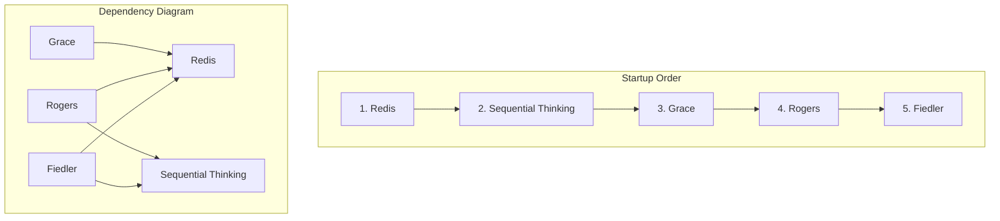

```markdown
This document provides the authoritative step-by-step implementation guide for deploying the V1 MAD Group system. It is designed to be executed sequentially by an operations team with no prior knowledge of the project. Follow each step in the exact order provided.

#########################################################################################
##                                                                                     ##
##  PART 1: PRE-DEPLOYMENT                                                             ##
##  Read this section carefully before you begin the deployment.                       ##
##                                                                                     ##
#########################################################################################

This section covers the necessary preparations, software checks, and high-level architectural overview. Do not skip these steps. A mistake here will cause the entire deployment to fail.

---

### **1.1. Prerequisites Verification**

**ACTION:** Before starting, you MUST verify that the target host machine has the required software installed. This step ensures the environment is ready for the deployment.

**COMMANDS:** Execute the following commands and ensure the output meets the minimum version requirements.

| Command | Minimum Version | Purpose |
| :--- | :--- | :--- |
| `git --version` | `2.25+` | Source code management (to download the code) |
| `docker --version` | `20.10+` | Container runtime (to run the software components) |
| `docker-compose --version` | `2.0+` | Container orchestration (to manage all components together) |

**TROUBLESHOOTING:**
*   **IF you see `command not found` for any of the above:** The required software is not installed or is not in your system's `PATH`. You must stop and install it. Consult your OS documentation for installation instructions.
*   **IF the version is lower than the minimum:** The deployment may fail in unpredictable ways. You must stop and upgrade the software before proceeding.

---

### **1.2. Repository Structure**

**OVERVIEW:** The entire system is contained within a single Git repository. This repository includes the source code for all components, configuration files, and the `docker-compose.yml` file used for deployment.

The key files and directories you will interact with are:
```plaintext
/mad-group-v1/
├── docker-compose.yml          # The main file defining all services. The "blueprint" for the system.
├── .env.example                # A template showing what configuration variables are needed.
├── .env                        # Your local configuration file (you will create this to store secrets).
├── mads/                       # Source code for all agents (MADs).
│   ├── grace/
│   ├── fiedler/
│   ├── rogers/
│   └── sequential_thinking/
└── configs/
    └── ssh/
        └── authorized_keys     # Public SSH keys for admin access (not used in this deployment).
```

---

### **1.3. Component Architecture Overview**

**TECHNICAL TERM ALERT:** The V1 MAD Group system is a microservice architecture. This means it is composed of several small, independent services that work together. Each service runs in its own **Docker Container** (an isolated, lightweight package containing everything the service needs to run). These containers communicate over a **private Docker network** (a virtual network that only they can access), ensuring secure communication.

The system consists of five distinct services:

1.  **Redis**: The central message bus.
    *   **In simple terms:** It's the post office for the system. All other services send messages here, and Redis delivers them to the correct recipients.
    *   **Technical Detail:** It uses a **Pub/Sub (Publish-Subscribe)** pattern, where services publish messages to channels without knowing who is listening. This decouples the services from each other.

2.  **Sequential Thinking**: A specialized reasoning service.
    *   **In simple terms:** It's a powerful calculator that other services can use for complex problems.
    *   **Technical Detail:** It acts as a stateless service, meaning it doesn't remember past requests. It communicates using **MCP (Model Context Protocol)**, a simple **JSON-based request/response protocol** defined for this project.

3.  **Grace**: A simple relay **MAD (Multi-Agent anD)**.
    *   **In simple terms:** The system's front door. It takes requests from the outside world and passes them into the internal system.

4.  **Rogers**: The "bus monitor" MAD.
    *   **In simple terms:** The security guard who watches all the messages going through the post office (Redis) to make sure everything is working correctly.

5.  **Fiedler**: The primary orchestrator MAD.
    *   **In simple terms:** The project manager. It receives major tasks, breaks them down, and uses other services (like Sequential Thinking) to get the job done.

*Note: For detailed definitions of technical terms, see the Glossary in Part 5.*

---

### **1.4. Dependency Chain & Startup Order**

**CRITICAL CONCEPT:** Components MUST be started in a specific order to ensure their dependencies are available. Starting all services at once will lead to a cascade of connection errors and race conditions. Think of it like building a house: you must lay the foundation (Redis) before putting up the walls (the other services).

The correct startup order is based on the following dependency chain:


We will follow this exact one-by-one startup order in Part 2. **Do not deviate from this order.**

#########################################################################################
##                                                                                     ##
##  ✅ PART 1 COMPLETE: PRE-DEPLOYMENT FINISHED                                        ##
##  ⏭️  NEXT: PART 2 - STEP-BY-STEP DEPLOYMENT                                         ##
##                                                                                     ##
##  You have now reviewed the system architecture and prerequisites. The next part     ##
##  involves executing commands to bring the system online, one piece at a time.       ##
##                                                                                     ##
#########################################################################################

## **PART 2: STEP-BY-STEP DEPLOYMENT**

> **CRITICAL:** Execute these steps sequentially. Do not proceed to the next step until the current step's verification passes. A failure in one step will cause all subsequent steps to fail.

---

### **STEP 1: Clone Repository and Configure Environment**

┏━━━━━━━━━━━━━━━━━━━━━━━━━━━━━━━━━━━━━━━━━━━━━━━━━━━━━━━━━━━━━━━━━━━━━┓
┃ ⚠️  This is the first step. Ensure you have completed the prerequisite checks in Part 1. ┃
┗━━━━━━━━━━━━━━━━━━━━━━━━━━━━━━━━━━━━━━━━━━━━━━━━━━━━━━━━━━━━━━━━━━━━━┛

**ACTION:** Get the source code from the repository and create the initial configuration file that will hold the system's secrets.

**COMMANDS:**
```bash
# 1. Clone the repository from its source and navigate into the new directory.
# This downloads all the necessary code and configuration templates.
git clone https://github.com/your-org/mad-group-v1.git
cd mad-group-v1

# 2. Create the local environment configuration file from the provided template.
# The .env file is ignored by Git and is where you store sensitive information.
cp .env.example .env

# 3. Generate a secure, random password for the Redis database and append it to the .env file.
# This prevents unauthorized access to the core message bus.
REDIS_PASS=$(openssl rand -base64 24)
echo "REDIS_PASSWORD=${REDIS_PASS}" >> .env
```

**WAIT CONDITION:** None. These commands complete instantly.

**VERIFICATION:**
```bash
# Display the contents of the .env file to ensure the password was written.
cat .env
```

**EXPECTED OUTPUT:**
> You should see a line like `REDIS_PASSWORD=` followed by a long, random string of characters.
> ```
> # .env
> REDIS_PASSWORD=aBcDeFgHiJkLmNoPqRsTuVwXyZ123456==
> ```

**COMMON FAILURE SCENARIOS:**
*   **IF `git clone` fails with `repository not found`:**
    *   **THEN:** Verify the repository URL is correct. Check your network connection and ensure you have permission to access the repository.
*   **IF the `.env` file is empty or missing the `REDIS_PASSWORD` line after running the commands:**
    *   **THEN:** Your shell might not have permission to write the file. Rerun the command with `sudo` if necessary, or manually run `openssl rand -base64 24`, copy the output, and paste it into the `.env` file like this: `REDIS_PASSWORD=YOUR_COPIED_PASSWORD`.

---

### **STEP 2: Deploy Redis (Foundation Layer)**

┏━━━━━━━━━━━━━━━━━━━━━━━━━━━━━━━━━━━━━━━━━━━━━━━━━━━━━━━━━━━━━━━━━━━━━┓
┃ ⚠️  CRITICAL: DO NOT PROCEED UNTIL STEP 1 VERIFICATION SHOWS SUCCESS. ┃
┗━━━━━━━━━━━━━━━━━━━━━━━━━━━━━━━━━━━━━━━━━━━━━━━━━━━━━━━━━━━━━━━━━━━━━┛

**ACTION:** Start the Redis container. It is the central message bus and **MUST** be running before any other component.

**COMMAND:**
```bash
docker-compose up -d redis
```

**WAIT CONDITION:** Wait approximately 10-15 seconds for the server to initialize. Check the logs for the ready signal.
```bash
docker-compose logs redis
```
> **Look for the line:** `Ready to accept connections` in the log output.

**VERIFICATION:** We will perform two checks. The first *must fail* and the second *must succeed* to prove security is active.
```bash
# 1. Ping the server WITHOUT a password. This MUST fail with an authentication error.
docker-compose exec redis redis-cli ping

# 2. Ping the server WITH the password. This MUST succeed with a "PONG".
# Note: This command dynamically reads the password from your .env file.
docker-compose exec redis redis-cli --pass $(grep REDIS_PASSWORD .env | cut -d '=' -f2) ping
```

**EXPECTED OUTPUT:**
> For command #1 (the failing one):
> ```
> (error) NOAUTH Authentication required.
> ```
> For command #2 (the successful one):
> ```
> PONG
> ```

**COMMON FAILURE SCENARIOS:**
*   **IF `docker-compose up` fails with a port conflict error:**
    *   **LOG OUTPUT:** `Error starting userland proxy: listen tcp4 0.0.0.0:6379: bind: address already in use`
    *   **THEN:** Another process on the host machine is using port 6379. Stop the other process or change the port mapping in `docker-compose.yml` (e.g., `"127.0.0.1:6380:6379"`).
*   **IF the first `ping` returns `PONG` instead of `NOAUTH`:**
    *   **THEN:** This is a **CRITICAL SECURITY FAILURE**. The Redis server is insecure. Stop everything immediately (`docker-compose down`), delete the `.env` file, and restart the entire process from **STEP 1**.
*   **IF the second `ping` fails with `(error) NOAUTH`:**
    *   **THEN:** The password in your `.env` file is likely incorrect or has a typo. Double-check the file. You may need to run `docker-compose down redis` and restart this step.
*   **IF the second `ping` fails with `Could not connect to Redis`:**
    *   **THEN:** The server is not ready or has crashed. Wait 10 more seconds and retry. If it persists, check the logs again with `docker-compose logs redis` for crash reports.

---

### **STEP 3: Deploy Sequential Thinking Service**

┏━━━━━━━━━━━━━━━━━━━━━━━━━━━━━━━━━━━━━━━━━━━━━━━━━━━━━━━━━━━━━━━━━━━━━┓
┃ ⚠️  CRITICAL: DO NOT PROCEED UNTIL STEP 2 VERIFICATION SHOWS SUCCESS. ┃
┗━━━━━━━━━━━━━━━━━━━━━━━━━━━━━━━━━━━━━━━━━━━━━━━━━━━━━━━━━━━━━━━━━━━━━┛

**ACTION:** Start the Sequential Thinking container. This service is a dependency for Fiedler and Rogers.

**COMMAND:**
```bash
# The --build flag tells Docker Compose to build the image from the Dockerfile if it doesn't exist.
docker-compose up -d --build sequential_thinking
```

**WAIT CONDITION:** Wait approximately 10 seconds for the service to build and start. Check the logs for the startup signal.
```bash
docker-compose logs sequential_thinking
```
> **Look for a log line** indicating the MCP server is running, such as `MCP Server started on port 8000`.

**VERIFICATION:**
```bash
# Check the status of all running containers, filtering for this specific one.
docker-compose ps sequential_thinking
```

**EXPECTED OUTPUT:**
> The `STATUS` should show `Up` or `running`. The `STATE` column (in newer versions) should be `running`.
> ```
> NAME                                COMMAND                  SERVICE                 STATUS              PORTS
> mad-group-v1-sequential_thinking-1  "python -m sequential…"  sequential_thinking     running (healthy)
> ```

**COMMON FAILURE SCENARIOS:**
*   **IF the build fails during the `docker-compose up` command:**
    *   **LOG OUTPUT:** You might see errors like `Could not resolve 'deb.debian.org'` or `failed to solve: process "..." did not complete successfully`.
    *   **THEN:** This indicates a network issue on the host or within Docker. Check your host's internet connection and DNS settings. You may need to configure Docker's networking.
*   **IF the container exits immediately after starting (check with `docker-compose ps`):**
    *   **LOG OUTPUT:** Check `docker-compose logs sequential_thinking`. You might see a Python traceback, like `ModuleNotFoundError: No module named 'some_package'`.
    *   **THEN:** A required dependency is likely missing from `mads/sequential_thinking/requirements.txt`. Escalate to the development team.

---

### **STEP 4: Deploy Grace MAD**

┏━━━━━━━━━━━━━━━━━━━━━━━━━━━━━━━━━━━━━━━━━━━━━━━━━━━━━━━━━━━━━━━━━━━━━┓
┃ ⚠️  CRITICAL: DO NOT PROCEED UNTIL STEP 3 VERIFICATION SHOWS SUCCESS. ┃
┗━━━━━━━━━━━━━━━━━━━━━━━━━━━━━━━━━━━━━━━━━━━━━━━━━━━━━━━━━━━━━┛

**ACTION:** Start the Grace container. It will connect to the already-running Redis service.

**COMMAND:**
```bash
docker-compose up -d --build grace
```

**WAIT CONDITION:** Wait 5-10 seconds. Check the logs for a successful connection to Redis.
```bash
docker-compose logs grace
```
> **Look for a log line like:** `Successfully connected to Rogers Conversation Bus (Redis)`.

**VERIFICATION:**
```bash
# Use the built-in status command for the MAD framework.
docker-compose exec grace mad-status
```

**EXPECTED OUTPUT:**
> ```
> [GraceV0 Status]
> - MAD Name: grace
> - Status: HEALTHY
> - Conversation Bus Connected: True
> ```

**COMMON FAILURE SCENARIOS:**
*   **IF logs show `redis.exceptions.AuthenticationError: Authentication required.`:**
    *   **THEN:** The `REDIS_PASSWORD` from the `.env` file is not being passed to the Grace container. Check your `docker-compose.yml` to ensure the `grace` service has an `env_file` section pointing to `.env`.
*   **IF logs show `redis.exceptions.ConnectionError: Error 111 connecting to redis:6379. Connection refused.`:**
    *   **THEN:** The Redis container is not running or is not accessible on the Docker network. Run `docker-compose ps redis` to verify it's up. If it is, there may be a Docker networking issue.
*   **IF the `mad-status` command fails with `Error: No such container: ...`:**
    *   **THEN:** The container failed to start. Check the logs with `docker-compose logs grace` to find the root cause.

---

### **STEP 5: Deploy Rogers MAD**

┏━━━━━━━━━━━━━━━━━━━━━━━━━━━━━━━━━━━━━━━━━━━━━━━━━━━━━━━━━━━━━━━━━━━━━┓
┃ ⚠️  CRITICAL: DO NOT PROCEED UNTIL STEP 4 VERIFICATION SHOWS SUCCESS. ┃
┗━━━━━━━━━━━━━━━━━━━━━━━━━━━━━━━━━━━━━━━━━━━━━━━━━━━━━━━━━━━━━━━━━━━━━┛

**ACTION:** Start the Rogers container. It connects to both Redis and the Sequential Thinking service.

**COMMAND:**
```bash
docker-compose up -d --build rogers
```

**WAIT CONDITION:** Wait 10-15 seconds. Check the logs for successful connections to **both** dependencies.
```bash
docker-compose logs rogers
```
> **Look for TWO lines:**
> 1. `Successfully connected to Rogers Conversation Bus (Redis)`
> 2. `Successfully connected to Sequential Thinking MCP server`

**VERIFICATION:**
```bash
docker-compose exec rogers mad-status
```

**EXPECTED OUTPUT:**
> ```
> [RogersV1 Status]
> - MAD Name: rogers
> - Status: HEALTHY
> - Conversation Bus Connected: True
> - Sequential Thinking Connected: True
> ```

**COMMON FAILURE SCENARIOS:**
*   **IF Redis connection fails:**
    *   **LOG OUTPUT:** `redis.exceptions.AuthenticationError: Authentication required.`
    *   **THEN:** See troubleshooting for Step 4.
*   **IF Sequential Thinking connection fails:**
    *   **LOG OUTPUT:** `ConnectionRefusedError: [Errno 111] Connection refused` when trying to connect to `sequential_thinking:8000`.
    *   **THEN:** Verify the `sequential_thinking` container is running with `docker-compose ps sequential_thinking`. If it is running, check that the service name in the Rogers configuration matches the service name in `docker-compose.yml`. A typo is a common cause.

---

### **STEP 6: Deploy Fiedler MAD**

┏━━━━━━━━━━━━━━━━━━━━━━━━━━━━━━━━━━━━━━━━━━━━━━━━━━━━━━━━━━━━━━━━━━━━━┓
┃ ⚠️  CRITICAL: DO NOT PROCEED UNTIL STEP 5 VERIFICATION SHOWS SUCCESS. ┃
┗━━━━━━━━━━━━━━━━━━━━━━━━━━━━━━━━━━━━━━━━━━━━━━━━━━━━━━━━━━━━━━━━━━━━━┛

**ACTION:** Start the Fiedler container. This is the final service and the main orchestrator.

**COMMAND:**
```bash
docker-compose up -d --build fiedler
```

**WAIT CONDITION:** Wait 10-15 seconds. Check the logs for successful connections and database initialization.
```bash
docker-compose logs fiedler
```
> **Look for THREE lines:**
> 1. `Successfully connected to Rogers Conversation Bus (Redis)`
> 2. `Successfully connected to Sequential Thinking MCP server`
> 3. `Initialized SQLite state database at /data/fiedler_state.db...`

**VERIFICATION:**
```bash
docker-compose exec fiedler mad-status
```

**EXPECTED OUTPUT:**
> ```
> [FiedlerV1 Status]
> - MAD Name: fiedler
> - Status: HEALTHY
> - Conversation Bus Connected: True
> - Sequential Thinking Connected: True
> - Database Status: OK
> ```

**COMMON FAILURE SCENARIOS:**
*   **IF any connection fails:**
    *   **THEN:** See troubleshooting for Step 5. The causes are identical.
*   **IF database initialization fails:**
    *   **LOG OUTPUT:** `sqlite3.OperationalError: unable to open database file` or `Permission denied`.
    *   **THEN:** This indicates a file system permission error with the volume mount defined in `docker-compose.yml`. Ensure the Docker daemon has permission to write to the host directory specified in the `volumes` section for the `fiedler` service.

#########################################################################################
##                                                                                     ##
##  ✅ PART 2 COMPLETE: DEPLOYMENT FINISHED                                            ##
##  ⏭️  NEXT: PART 3 - INTEGRATION TESTING                                             ##
##                                                                                     ##
##  You have now started all five system components in the correct order. The next     ##
##  part involves verifying that they can all communicate with each other correctly.   ##
##                                                                                     ##
#########################################################################################

## **PART 3: INTEGRATION TESTING**

This phase ensures that all the independently running services can communicate with each other over the central message bus.

---

### **STEP 7: Run System Integration Test**

┏━━━━━━━━━━━━━━━━━━━━━━━━━━━━━━━━━━━━━━━━━━━━━━━━━━━━━━━━━━━━━━━━━━━━━┓
┃ ⚠️  CRITICAL: DO NOT PROCEED UNTIL STEP 6 VERIFICATION SHOWS SUCCESS. ┃
┗━━━━━━━━━━━━━━━━━━━━━━━━━━━━━━━━━━━━━━━━━━━━━━━━━━━━━━━━━━━━━━━━━━━━━┛

**ACTION:** Use the Rogers service (the "bus monitor") to verify that it can see all other MADs connected to the Redis bus. This is the single most important test to confirm inter-agent communication is working.

**COMMAND:**
```bash
docker-compose exec rogers mad-cli rogers_get_connections
```

**WAIT CONDITION:** None. The command should return immediately.

**VERIFICATION:** Check the JSON output for the presence of both `grace` and `fiedler` in the `connections` list.

**EXPECTED OUTPUT:**
> The command should return a JSON object containing a list of connected MADs. The order of MADs in the list may vary.
> ```json
> {
>   "status": "success",
>   "connections": [
>     {
>       "mad_id": "grace",
>       "status": "HEALTHY",
>       "last_heartbeat": "..."
>     },
>     {
>       "mad_id": "fiedler",
>       "status": "HEALTHY",
>       "last_heartbeat": "..."
>     }
>   ]
> }
> ```

**COMMON FAILURE SCENARIOS:**
*   **IF the command fails with `Error response from daemon: container ... is not running`:**
    *   **THEN:** The Rogers container has stopped. Run `docker-compose ps rogers` to confirm and check its logs with `docker-compose logs rogers` to find out why it crashed.
*   **IF the `connections` list is empty (`[]`):**
    *   **THEN:** Heartbeats are not being received from other MADs. This points to a fundamental Redis connection issue. Check the logs for `grace` and `fiedler` to ensure they successfully connected to Redis in the previous steps.
*   **IF a MAD is missing from the list (e.g., you only see `grace`):**
    *   **THEN:** The specific missing MAD (`fiedler` in this example) is not correctly publishing its heartbeat. Restart the missing MAD's container (`docker-compose restart fiedler`), wait 30 seconds, and run the verification command again. If it remains missing, check its logs for Redis connection errors.

#########################################################################################
##                                                                                     ##
##  ✅ PART 3 COMPLETE: INTEGRATION TESTING FINISHED                                   ##
##  ⏭️  NEXT: PART 4 - PRODUCTION VALIDATION                                           ##
##                                                                                     ##
##  You have now confirmed that all services are online and communicating. The final   ##
##  step is to run a real-world test to validate end-to-end functionality.             ##
##                                                                                     ##
#########################################################################################

## **PART 4: PRODUCTION VALIDATION**

This final phase confirms the system is fully operational by performing a simple end-to-end (E2E) smoke test that mimics a real user request.

---

### **STEP 8: Execute End-to-End Smoke Test**

┏━━━━━━━━━━━━━━━━━━━━━━━━━━━━━━━━━━━━━━━━━━━━━━━━━━━━━━━━━━━━━━━━━━━━━┓
┃ ⚠️  CRITICAL: DO NOT PROCEED UNTIL STEP 7 VERIFICATION SHOWS SUCCESS. ┃
┗━━━━━━━━━━━━━━━━━━━━━━━━━━━━━━━━━━━━━━━━━━━━━━━━━━━━━━━━━━━━━━━━━━━━━┛

**ACTION:** Send a simple conversational request to Fiedler and verify that it creates a task, processes it, and returns a valid response. This tests the entire chain: `Fiedler -> Redis -> Fiedler (self-processing) -> Database`.

#### **Part A: Create the Task**

**COMMAND:**
```bash
docker-compose exec fiedler mad-cli fiedler_converse '{"prompt": "System check, please respond with OK.", "requester_id": "ops-team"}'
```

**VERIFICATION (Part A):**
> The command should immediately return a JSON object confirming task creation.
> **IMPORTANT: Copy the `task_id` value from this output. You will need it for Part B.**
> ```json
> {
>   "status": "pending",
>   "task_id": "a1b2c3d4-e5f6-7890-g1h2-i3j4k5l6m7n8",
>   "stream_topic": "mad.stream.a1b2c3d4-e5f6-7890-g1h2-i3j4k5l6m7n8"
> }
> ```

#### **Part B: Check the Task Status**

**ACTION:** Wait 5 seconds, then use the `task_id` from Part A to check the task's final status.

**COMMAND:**
```bash
# Replace <task_id> with the actual ID you copied from the previous command's output.
docker-compose exec fiedler mad-cli fiedler_get_task_status '{"task_id": "a1b2c3d4-e5f6-7890-g1h2-i3j4k5l6m7n8"}'
```

**VERIFICATION (Part B):**
> The task status should be `COMPLETED` and the `result_payload` should contain "OK".
> ```json
> {
>   "task_id": "a1b2c3d4-e5f6-7890-g1h2-i3j4k5l6m7n8",
>   "status": "COMPLETED",
>   "prompt": "System check, please respond with OK.",
>   "result_payload": "OK",
>   "error_details": null
> }
> ```

**COMMON FAILURE SCENARIOS:**
*   **IF the first command (Part A) fails or times out:**
    *   **THEN:** Fiedler is not running or responding. Check its status with `docker-compose ps fiedler` and logs with `docker-compose logs fiedler`.
*   **IF the task status in Part B is still `PENDING` after 30 seconds:**
    *   **THEN:** The task is stuck. This indicates an issue with Fiedler's internal processing loop. Check Fiedler's logs for errors that occurred *after* the task was created.
*   **IF the task status in Part B is `FAILED`:**
    *   **LOG OUTPUT (in the JSON response):** The `error_details` field will contain information.
        ```json
        {
          "task_id": "...",
          "status": "FAILED",
          ...
          "error_details": "Failed to connect to dependency: Sequential Thinking"
        }
        ```
    *   **THEN:** An internal error occurred during processing. The `error_details` field gives a clue. For a full traceback, check the Fiedler logs: `docker-compose logs fiedler`.

---

### **STEP 9: Final Log Verification**

┏━━━━━━━━━━━━━━━━━━━━━━━━━━━━━━━━━━━━━━━━━━━━━━━━━━━━━━━━━━━━━━━━━━━━━┓
┃ ⚠️  This is the final verification step. Ensure Step 8 completed successfully. ┃
┗━━━━━━━━━━━━━━━━━━━━━━━━━━━━━━━━━━━━━━━━━━━━━━━━━━━━━━━━━━━━━━━━━━━━━┛

**ACTION:** Check the logs of key components to ensure the smoke test was processed cleanly without any warnings or errors.

**COMMANDS:**
```bash
# Check Fiedler logs for task processing messages related to the smoke test.
docker-compose logs --tail=20 fiedler

# Check Rogers logs to see the message traffic generated by the smoke test.
docker-compose logs --tail=20 rogers
```

**VERIFICATION:**
*   **Fiedler Log:** Look for lines indicating the task was created and completed successfully.
    > **Expected Log Snippet:**
    > ```
    > INFO:fiedler:Received new task a1b2c3d4-e5f6-7890-g1h2-i3j4k5l6m7n8
    > INFO:fiedler:Task a1b2c3d4-e5f6-7890-g1h2-i3j4k5l6m7n8 status changed to RUNNING
    > INFO:fiedler:Task a1b2c3d4-e5f6-7890-g1h2-i3j4k5l6m7n8 status changed to COMPLETED
    > ```
*   **Rogers Log:** Look for lines showing messages being published by Fiedler.
    > **Expected Log Snippet:**
    > ```
    > INFO:rogers:[Metrics] Received message from sender: fiedler on channel: mad.fiedler.task.status
    > ```

#########################################################################################
##                                                                                     ##
##  🎉 CONGRATULATIONS! DEPLOYMENT IS COMPLETE AND VALIDATED. 🎉                       ##
##                                                                                     ##
##  The system is now fully operational. The following sections are for reference      ##
##  during ongoing operations, monitoring, and troubleshooting.                        ##
##                                                                                     ##
#########################################################################################

## **PART 5: REFERENCE SECTIONS**

### **5.1. Rollback Procedures**

If a critical failure occurs that cannot be resolved, follow this procedure to return to a clean state.

1.  **Trigger Conditions:** Critical E2E test failures (Step 8), persistent container crashing, or core functionality confirmed to be broken.
2.  **Execution (Non-destructive Restart):** Stops and removes all running containers and networks. Use this for simple restarts. This command will **not** delete persistent data volumes (like Fiedler's database).
    ```bash
    docker-compose down
    ```
3.  **Execution (Full Rollback - DESTRUCTIVE):** Stops and removes containers AND **deletes all data volumes**. Use this when you suspect data corruption or need a completely fresh start.
    ```bash
    # ┏━━━━━━━━━━━━━━━━━━━━━━━━━━━━━━━━━━━━━━━━━━━━━━━━━━━━━━━━━━━━━━━━━━━━━┓
    # ┃ ⚠️  WARNING: This is a destructive action and will delete all task  ┃
    # ┃ history and any other persistent data. There is no undo.            ┃
    # ┗━━━━━━━━━━━━━━━━━━━━━━━━━━━━━━━━━━━━━━━━━━━━━━━━━━━━━━━━━━━━━━━━━━━━━┛
    docker-compose down --volumes
    ```
4.  **Post-Rollback:** After rolling back, you can attempt the deployment again by starting from **PART 2, STEP 2**.

---

### **5.2. Monitoring and Maintenance**

This section covers best practices and provides copy-paste-ready scripts for monitoring the system after deployment.

#### **5.2.1. Routine Health Checks**
Perform these checks manually or via automation to ensure ongoing system health.

*   **Overall System Health:**
    ```bash
    docker-compose ps
    ```
    *Look for all services in a `running` or `healthy` state. Any service that is `restarting` or `exited` requires immediate investigation.*

*   **Individual MAD Health (Most Important Check):**
    ```bash
    # Check each MAD service individually
    docker-compose exec fiedler mad-status
    docker-compose exec rogers mad-status
    docker-compose exec grace mad-status
    ```
    *This verifies internal connectivity. If `Status` is not `HEALTHY` or a connection is `False`, the service is degraded.*

*   **Bus Activity:**
    ```bash
    docker-compose exec rogers mad-cli rogers_get_stats
    ```
    *Check the `total_messages` count. If you run this command twice, 30 seconds apart, the number should increase. If it is static, the system may be idle or frozen.*

#### **5.2.2. Automated Health Monitoring Script**
This is a complete, copy-paste-ready script to automate health checks.

**1. Create the health check script file:**
```bash
# Create and open the script file in a text editor
sudo nano /opt/mad_health_check.sh
```

**2. Copy and paste the entire content below into the file:**
```bash
#!/bin/bash
# A complete, copy-paste-ready script to check the health of all MAD services.

# Set the path to your deployment directory
PROJECT_DIR="/path/to/your/mad-group-v1/"

# Services to check
SERVICES=("grace" "rogers" "fiedler")

# Alerting configuration (customize this)
ALERT_EMAIL="your-alert-email@example.com"
SLACK_WEBHOOK_URL="<YOUR_SLACK_WEBHOOK_URL_HERE>"

# Flag to track if any service failed
FAILURES=0
FAILED_SERVICES=""

# Ensure we are in the project directory
cd "$PROJECT_DIR" || { echo "Could not cd to $PROJECT_DIR"; exit 1; }

# Loop through each service and check its status
for SERVICE in "${SERVICES[@]}"; do
    echo "Checking service: $SERVICE"
    # Execute mad-status and check for the "Status: HEALTHY" keyword
    # The timeout ensures the script doesn't hang on an unresponsive container
    if ! timeout 10s docker-compose exec "$SERVICE" mad-status | grep -q "Status: HEALTHY"; then
        echo "ALERT: Service $SERVICE is NOT HEALTHY!"
        FAILURES=$((FAILURES + 1))
        FAILED_SERVICES="$FAILED_SERVICES $SERVICE"
    else
        echo "Service $SERVICE is HEALTHY."
    fi
done

# If any failures were detected, send an alert
if [ "$FAILURES" -gt 0 ]; then
    TIMESTAMP=$(date)
    HOSTNAME=$(hostname)
    MESSAGE="ALERT on $HOSTNAME at $TIMESTAMP: The following MAD services are failing health checks: $FAILED_SERVICES"

    # Send email alert
    # echo "$MESSAGE" | mail -s "MAD System Health Alert" "$ALERT_EMAIL"

    # Send Slack alert via webhook
    # curl -X POST -H 'Content-type: application/json' --data "{\"text\":\"$MESSAGE\"}" "$SLACK_WEBHOOK_URL"

    echo "Alerts would be sent for failed services: $FAILED_SERVICES"
fi

# Exit with a status code indicating success or failure
exit $FAILURES
```

**3. Save the file, then make it executable:**
```bash
sudo chmod +x /opt/mad_health_check.sh
```

**4. Add a cron job to run it every 5 minutes:**
```bash
# Edit the system crontab
sudo crontab -e

# Add this line to the bottom of the file. It runs the script every 5 minutes
# and logs the output to /var/log/mad_health.log
*/5 * * * * /opt/mad_health_check.sh >> /var/log/mad_health.log 2>&1
```

#### **5.2.3. Log Management and Rotation**
By default, Docker's logs can consume all available disk space. It is **essential** to configure log rotation.

**ACTION:** Add the following `logging` configuration to **every** service (fiedler, rogers, grace, etc.) in your `docker-compose.yml` file.

**Example `docker-compose.yml` service entry:**
```yaml
services:
  fiedler:
    build: ./mads/fiedler
    # ... other service config ...
    logging:
      driver: "json-file"
      options:
        max-size: "10m"  # Max size of a single log file before it is rotated
        max-file: "3"    # Number of rotated log files to keep (total 30MB per service)
```
After updating the `docker-compose.yml` file, you must run `docker-compose up -d` for the changes to take effect on the running containers.

---

### **5.3. Operational Runbooks**

#### **Runbook 1: How to Restart a Single Service**
**SITUATION:** A single MAD is unresponsive or logging errors, but the rest of the system is fine.
1.  **Identify** the failing service using `docker-compose ps`. Look for `restarting` or `unhealthy` states.
2.  **Restart** the service gracefully: `docker-compose restart <service_name>` (e.g., `docker-compose restart fiedler`)
3.  **Wait** 30 seconds.
4.  **Verify** its status: `docker-compose exec <service_name> mad-status`. Ensure it returns `HEALTHY`.
5.  **Re-run** the integration test from Step 7 to ensure it has reconnected to the bus.

#### **Runbook 2: Escalation for Persistent Failures**
**SITUATION:** The automated health check (5.2.2) alerts that a service is failing repeatedly, and a simple restart (Runbook 1) does not fix it.
*   **Level 1 (Automated):** The cron job fails and sends an alert.
*   **Level 2 (Manual Investigation):**
    1.  Check the logs of the failing service for obvious errors: `docker-compose logs --tail=100 <service_name>`
    2.  Look for recurring tracebacks, `Connection refused`, or `AuthenticationError` messages.
    3.  Check the logs of its dependencies. If `fiedler` is failing to connect to `redis`, check the `redis` logs: `docker-compose logs redis`.
    4.  Check system resources on the host: `df -h` (disk space), `free -m` (memory), `top` (CPU).
*   **Level 3 (Full System Restart):**
    1.  If the cause is not obvious, perform a non-destructive restart of the entire stack: `docker-compose down && docker-compose up -d`
    2.  Wait 2 minutes, then re-run the full validation from **Part 3** and **Part 4**.
*   **Level 4 (Destructive Redeploy):**
    1.  If the system is still failing, data corruption may be the cause.
    2.  **Escalate to the development team for approval before proceeding.**
    3.  Perform a full, destructive rollback: `docker-compose down --volumes`.
    4.  Redeploy the entire system from **Part 2, Step 2**.
*   **Level 5 (Final Escalation):**
    1.  If a fresh, destructive redeploy still fails, the issue is with the code, environment, or underlying configuration.
    2.  Gather all logs: `docker-compose logs > all_logs.txt`.
    3.  Escalate to the development team with the log file and a summary of all steps taken.

---

### **5.4. Glossary of Terms**

*   **Docker Compose Service**: A single container definition within a `docker-compose.yml` file. In this project, each component (Redis, Fiedler, etc.) is a service.
*   **MAD (Multi-Agent anD)**: A standardized, containerized service component in this architecture. Fiedler, Rogers, and Grace are all MADs.
*   **MCP (Model Context Protocol)**: A simple, internal JSON-based protocol used for direct request/response communication between services (e.g., Fiedler calling Sequential Thinking).
*   **Pub/Sub (Publish-Subscribe)**: A messaging pattern where senders (publishers) do not send messages directly to specific receivers (subscribers), but instead publish messages to channels, without knowledge of what subscribers there may be. Redis implements this pattern for our system.
*   **Redis**: An in-memory data store used as the high-speed message bus for all Pub/Sub communication between MADs.
```
