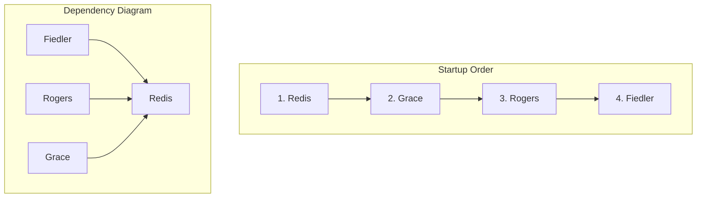

As the Senior Member for the V1 MAD Group, I have reviewed the correction package and the attached documents. The discrepancy between the Implementation Plan and the approved code is indeed critical. The plan incorrectly specifies a 5-service architecture, while the approved code mandates a 4-service architecture with embedded sequential thinking.

I have corrected the Implementation Plan to align with the approved code. The Testing Plan, which was integrated into the Implementation Plan as Parts 3 and 4, has also been corrected.

Below are the required outputs: the corrected Implementation Plan and a summary of all changes made.

***

### **1. Corrected Implementation Plan**

```markdown
This document provides the authoritative step-by-step implementation guide for deploying the V1 MAD Group system. It is designed to be executed sequentially by an operations team with no prior knowledge of the project. Follow each step in the exact order provided.

#########################################################################################
##                                                                                     ##
##  PART 1: PRE-DEPLOYMENT                                                             ##
##  Read this section carefully before you begin the deployment.                       ##
##                                                                                     ##
#########################################################################################

This section covers the necessary preparations, software checks, and high-level architectural overview. Do not skip these steps. A mistake here will cause the entire deployment to fail.

---

### **1.1. Prerequisites Verification**

**ACTION:** Before starting, you MUST verify that the target host machine has the required software installed. This step ensures the environment is ready for the deployment.

**COMMANDS:** Execute the following commands and ensure the output meets the minimum version requirements.

| Command | Minimum Version | Purpose |
| :--- | :--- | :--- |
| `git --version` | `2.25+` | Source code management (to download the code) |
| `docker --version` | `20.10+` | Container runtime (to run the software components) |
| `docker-compose --version` | `2.0+` | Container orchestration (to manage all components together) |

**TROUBLESHOOTING:**
*   **IF you see `command not found` for any of the above:** The required software is not installed or is not in your system's `PATH`. You must stop and install it. Consult your OS documentation for installation instructions.
*   **IF the version is lower than the minimum:** The deployment may fail in unpredictable ways. You must stop and upgrade the software before proceeding.

---

### **1.2. Repository Structure**

**OVERVIEW:** The entire system is contained within a single Git repository. This repository includes the source code for all components, configuration files, and the `docker-compose.yml` file used for deployment.

The key files and directories you will interact with are:
```plaintext
/mad-group-v1/
├── docker-compose.yml          # The main file defining all services. The "blueprint" for the system.
├── .env.example                # A template showing what configuration variables are needed.
├── .env                        # Your local configuration file (you will create this to store secrets).
├── mads/                       # Source code for all agents (MADs).
│   ├── grace/
│   ├── fiedler/
│   └── rogers/
└── configs/
    └── ssh/
        └── authorized_keys     # Public SSH keys for admin access.
```

---

### **1.3. Component Architecture Overview**

**TECHNICAL TERM ALERT:** The V1 MAD Group system is a microservice architecture. This means it is composed of several small, independent services that work together. Each service runs in its own **Docker Container** (an isolated, lightweight package containing everything the service needs to run). These containers communicate over a **private Docker network** (a virtual network that only they can access), ensuring secure communication.

The system consists of four distinct services:

1.  **Redis**: The central message bus.
    *   **In simple terms:** It's the post office for the system. All other services send messages here, and Redis delivers them to the correct recipients.
    *   **Technical Detail:** It uses a **Pub/Sub (Publish-Subscribe)** pattern, where services publish messages to channels without knowing who is listening. This decouples the services from each other.

2.  **Grace**: A simple relay **MAD (Multi-Agent anD)**.
    *   **In simple terms:** The system's front door. It takes requests from the outside world and passes them into the internal system.

3.  **Rogers**: The "bus monitor" MAD.
    *   **In simple terms:** The security guard who watches all the messages going through the post office (Redis) to make sure everything is working correctly.
    *   **Technical Detail:** Rogers contains a **built-in Imperator** for complex analysis. This Imperator has an embedded **sequential thinking capability**, allowing it to perform multi-step diagnostic reasoning by calling an external LLM API.

4.  **Fiedler**: The primary orchestrator MAD.
    *   **In simple terms:** The project manager. It receives major tasks, breaks them down, and manages their execution.
    *   **Technical Detail:** Like Rogers, Fiedler has a **built-in Imperator** with an embedded **sequential thinking capability**. It uses this to create complex plans and workflows by calling an external LLM API, making it fully self-contained for reasoning tasks.

*Note: For detailed definitions of technical terms, see the Glossary in Part 5.*

---

### **1.4. Dependency Chain & Startup Order**

**CRITICAL CONCEPT:** Components MUST be started in a specific order to ensure their dependencies are available. Starting all services at once will lead to a cascade of connection errors. Think of it like building a house: you must lay the foundation (Redis) before putting up the walls (the other services).

The correct startup order is based on the following dependency chain:


We will follow this exact one-by-one startup order in Part 2. **Do not deviate from this order.**

#########################################################################################
##                                                                                     ##
##  ✅ PART 1 COMPLETE: PRE-DEPLOYMENT FINISHED                                        ##
##  ⏭️  NEXT: PART 2 - STEP-BY-STEP DEPLOYMENT                                         ##
##                                                                                     ##
##  You have now reviewed the system architecture and prerequisites. The next part     ##
##  involves executing commands to bring the system online, one piece at a time.       ##
##                                                                                     ##
#########################################################################################

## **PART 2: STEP-BY-STEP DEPLOYMENT**

> **CRITICAL:** Execute these steps sequentially. Do not proceed to the next step until the current step's verification passes. A failure in one step will cause all subsequent steps to fail.

---

### **STEP 1: Clone Repository and Configure Environment**

┏━━━━━━━━━━━━━━━━━━━━━━━━━━━━━━━━━━━━━━━━━━━━━━━━━━━━━━━━━━━━━━━━━━━━━┓
┃ ⚠️  This is the first step. Ensure you have completed the prerequisite checks in Part 1. ┃
┗━━━━━━━━━━━━━━━━━━━━━━━━━━━━━━━━━━━━━━━━━━━━━━━━━━━━━━━━━━━━━━━━━━━━━┛

**ACTION:** Get the source code from the repository and create the configuration file that will hold the system's secrets.

**COMMANDS:**
```bash
# 1. Clone the repository from its source and navigate into the new directory.
# This downloads all the necessary code and configuration templates.
git clone https://github.com/your-org/mad-group-v1.git
cd mad-group-v1

# 2. Create the local environment configuration file from the provided template.
# The .env file is ignored by Git and is where you store sensitive information.
cp .env.example .env

# 3. Generate a secure, random password for the Redis database and append it to the .env file.
# This prevents unauthorized access to the core message bus.
REDIS_PASS=$(openssl rand -base64 24)
echo "REDIS_PASSWORD=${REDIS_PASS}" >> .env

# 4. Add your OpenAI API Key to the .env file.
# This is CRITICAL for the sequential thinking capabilities of Fiedler and Rogers.
# Replace sk-xxxxxxxxxx with your actual key.
echo "OPENAI_API_KEY=sk-xxxxxxxxxx" >> .env
```

**WAIT CONDITION:** None. These commands complete instantly.

**VERIFICATION:**
```bash
# Display the contents of the .env file to ensure both secrets were written.
cat .env
```

**EXPECTED OUTPUT:**
> You should see lines for `REDIS_PASSWORD` and `OPENAI_API_KEY`.
> ```
> # .env
> REDIS_PASSWORD=aBcDeFgHiJkLmNoPqRsTuVwXyZ123456==
> OPENAI_API_KEY=sk-xxxxxxxxxx
> ```

**COMMON FAILURE SCENARIOS:**
*   **IF `git clone` fails with `repository not found`:**
    *   **THEN:** Verify the repository URL is correct. Check your network connection and ensure you have permission to access the repository.
*   **IF the `.env` file is missing a line or is empty after running the commands:**
    *   **THEN:** Your shell might not have permission to write the file. Rerun the command with `sudo` if necessary, or manually edit the `.env` file and paste in the required values. **You must set both values to proceed.**

---

### **STEP 2: Deploy Redis (Foundation Layer)**

┏━━━━━━━━━━━━━━━━━━━━━━━━━━━━━━━━━━━━━━━━━━━━━━━━━━━━━━━━━━━━━━━━━━━━━┓
┃ ⚠️  CRITICAL: DO NOT PROCEED UNTIL STEP 1 VERIFICATION SHOWS SUCCESS. ┃
┗━━━━━━━━━━━━━━━━━━━━━━━━━━━━━━━━━━━━━━━━━━━━━━━━━━━━━━━━━━━━━━━━━━━━━┛

**ACTION:** Start the Redis container. It is the central message bus and **MUST** be running before any other component.

**COMMAND:**
```bash
docker-compose up -d redis
```

**WAIT CONDITION:** Wait approximately 10-15 seconds for the server to initialize. Check the logs for the ready signal.
```bash
docker-compose logs redis
```
> **Look for the line:** `Ready to accept connections` in the log output.

**VERIFICATION:** We will perform two checks. The first *must fail* and the second *must succeed* to prove security is active.
```bash
# 1. Ping the server WITHOUT a password. This MUST fail with an authentication error.
docker-compose exec redis redis-cli ping

# 2. Ping the server WITH the password. This MUST succeed with a "PONG".
# Note: This command dynamically reads the password from your .env file.
docker-compose exec redis redis-cli -a $(grep REDIS_PASSWORD .env | cut -d '=' -f2) ping
```

**EXPECTED OUTPUT:**
> For command #1 (the failing one):
> ```
> (error) NOAUTH Authentication required.
> ```
> For command #2 (the successful one):
> ```
> PONG
> ```

**COMMON FAILURE SCENARIOS:**
*   **IF `docker-compose up` fails with a port conflict error:**
    *   **LOG OUTPUT:** `Error starting userland proxy: listen tcp4 0.0.0.0:6379: bind: address already in use`
    *   **THEN:** Another process on the host machine is using port 6379. Stop the other process or change the port mapping in `docker-compose.yml` (e.g., `"127.0.0.1:6380:6379"`).
*   **IF the first `ping` returns `PONG` instead of `NOAUTH`:**
    *   **THEN:** This is a **CRITICAL SECURITY FAILURE**. The Redis server is insecure. Stop everything immediately (`docker-compose down`), delete the `.env` file, and restart the entire process from **STEP 1**.
*   **IF the second `ping` fails with `(error) NOAUTH`:**
    *   **THEN:** The password in your `.env` file is likely incorrect or has a typo. Double-check the file. You may need to run `docker-compose down redis` and restart this step.
*   **IF the second `ping` fails with `Could not connect to Redis`:**
    *   **THEN:** The server is not ready or has crashed. Wait 10 more seconds and retry. If it persists, check the logs again with `docker-compose logs redis` for crash reports.

---

### **STEP 3: Deploy Grace MAD**

┏━━━━━━━━━━━━━━━━━━━━━━━━━━━━━━━━━━━━━━━━━━━━━━━━━━━━━━━━━━━━━━━━━━━━━┓
┃ ⚠️  CRITICAL: DO NOT PROCEED UNTIL STEP 2 VERIFICATION SHOWS SUCCESS. ┃
┗━━━━━━━━━━━━━━━━━━━━━━━━━━━━━━━━━━━━━━━━━━━━━━━━━━━━━━━━━━━━━━━━━━━━━┛

**ACTION:** Start the Grace container. It will connect to the already-running Redis service.

**COMMAND:**
```bash
# The --build flag tells Docker Compose to build the image from the Dockerfile if it doesn't exist.
docker-compose up -d --build grace
```

**WAIT CONDITION:** Wait 5-10 seconds. Check the logs for a successful connection to Redis.
```bash
docker-compose logs grace
```
> **Look for a log line like:** `Starting bus listener...` or `Starting Grace V0`. The absence of connection errors indicates success.

**VERIFICATION:**
```bash
# Check the container status to ensure it's running correctly.
docker-compose ps grace
```

**EXPECTED OUTPUT:**
> The `STATUS` should show `Up` or `running`.
> ```
> NAME                COMMAND             SERVICE   STATUS    PORTS
> mad-grace           "python -m mads.g…" grace     running   0.0.0.0:8000->8000/tcp
> ```
> A successful connection is confirmed by the service remaining in the `running` state.

**COMMON FAILURE SCENARIOS:**
*   **IF logs show `redis.exceptions.AuthenticationError: Authentication required.`:**
    *   **THEN:** The `REDIS_PASSWORD` from the `.env` file is not being passed to the Grace container. Verify that `docker-compose.yml` correctly passes environment variables from the `.env` file to the service.
*   **IF logs show `redis.exceptions.ConnectionError: Error 111 connecting to redis:6379. Connection refused.`:**
    *   **THEN:** The Redis container is not running or is not accessible on the Docker network. Run `docker-compose ps redis` to verify it's up. If it is, there may be a Docker networking issue.
*   **IF the container exits immediately (check with `docker-compose ps`):**
    *   **THEN:** The container failed to start. Check the logs with `docker-compose logs grace` to find the root cause.

---

### **STEP 4: Deploy Rogers MAD**

┏━━━━━━━━━━━━━━━━━━━━━━━━━━━━━━━━━━━━━━━━━━━━━━━━━━━━━━━━━━━━━━━━━━━━━┓
┃ ⚠️  CRITICAL: DO NOT PROCEED UNTIL STEP 3 VERIFICATION SHOWS SUCCESS. ┃
┗━━━━━━━━━━━━━━━━━━━━━━━━━━━━━━━━━━━━━━━━━━━━━━━━━━━━━━━━━━━━━━━━━━━━━┛

**ACTION:** Start the Rogers container. It connects to Redis.

**COMMAND:**
```bash
docker-compose up -d --build rogers
```

**WAIT CONDITION:** Wait 10-15 seconds. Check the logs for a successful connection to Redis and Imperator initialization.
```bash
docker-compose logs rogers
```
> **Look for TWO lines:**
> 1. `Starting bus listener...`
> 2. `Loading Imperator context from /app/mads/rogers/IMPERATOR.md`

**VERIFICATION:**
```bash
docker-compose ps rogers
```

**EXPECTED OUTPUT:**
> The `STATUS` should show `Up` or `running`.
> ```
> NAME           COMMAND                  SERVICE   STATUS    PORTS
> mad-rogers     "/usr/local/bin/ent…"    rogers    running   0.0.0.0:8002->8002/tcp, 0.0.0.0:2223->2222/tcp
> ```

**COMMON FAILURE SCENARIOS:**
*   **IF Redis connection fails:**
    *   **LOG OUTPUT:** `redis.exceptions.AuthenticationError: Authentication required.`
    *   **THEN:** See troubleshooting for Step 3.
*   **IF the container exits immediately:**
    *   **LOG OUTPUT:** Check `docker-compose logs rogers`. You might see an error related to `OPENAI_API_KEY`.
    *   **THEN:** The `OPENAI_API_KEY` is likely missing or invalid in your `.env` file. Stop the containers (`docker-compose down`), correct the key in `.env`, and restart this step.

---

### **STEP 5: Deploy Fiedler MAD**

┏━━━━━━━━━━━━━━━━━━━━━━━━━━━━━━━━━━━━━━━━━━━━━━━━━━━━━━━━━━━━━━━━━━━━━┓
┃ ⚠️  CRITICAL: DO NOT PROCEED UNTIL STEP 4 VERIFICATION SHOWS SUCCESS. ┃
┗━━━━━━━━━━━━━━━━━━━━━━━━━━━━━━━━━━━━━━━━━━━━━━━━━━━━━━━━━━━━━━━━━━━━━┛

**ACTION:** Start the Fiedler container. This is the final service and the main orchestrator.

**COMMAND:**
```bash
docker-compose up -d --build fiedler
```

**WAIT CONDITION:** Wait 10-15 seconds. Check the logs for successful connections and database initialization.
```bash
docker-compose logs fiedler
```
> **Look for THREE lines:**
> 1. `Starting bus listener...`
> 2. `Loading Imperator context from /app/mads/fiedler/IMPERATOR.md`
> 3. An `aiosqlite` log indicating the database connection was established.

**VERIFICATION:**
```bash
docker-compose ps fiedler
```

**EXPECTED OUTPUT:**
> The `STATUS` should show `Up` or `running`.
> ```
> NAME            COMMAND                  SERVICE   STATUS    PORTS
> mad-fiedler     "/usr/local/bin/ent…"    fiedler   running   0.0.0.0:8001->8001/tcp, 0.0.0.0:2222->2222/tcp
> ```

**COMMON FAILURE SCENARIOS:**
*   **IF any connection fails:**
    *   **THEN:** See troubleshooting for Step 4. The causes are identical.
*   **IF database initialization fails:**
    *   **LOG OUTPUT:** `sqlite3.OperationalError: unable to open database file` or `Permission denied`.
    *   **THEN:** This indicates a file system permission error with the volume mount defined in `docker-compose.yml`. Ensure the Docker daemon has permission to write to the host directory specified in the `volumes` section for the `fiedler` service.

#########################################################################################
##                                                                                     ##
##  ✅ PART 2 COMPLETE: DEPLOYMENT FINISHED                                            ##
##  ⏭️  NEXT: PART 3 - INTEGRATION TESTING                                             ##
##                                                                                     ##
##  You have now started all four system components in the correct order. The next     ##
##  part involves verifying that they can all communicate with each other correctly.   ##
##                                                                                     ##
#########################################################################################

## **PART 3: INTEGRATION TESTING**

This phase ensures that all the independently running services can communicate with each other over the central message bus.

---

### **STEP 6: Run System Integration Test**

┏━━━━━━━━━━━━━━━━━━━━━━━━━━━━━━━━━━━━━━━━━━━━━━━━━━━━━━━━━━━━━━━━━━━━━┓
┃ ⚠️  CRITICAL: DO NOT PROCEED UNTIL STEP 5 VERIFICATION SHOWS SUCCESS. ┃
┗━━━━━━━━━━━━━━━━━━━━━━━━━━━━━━━━━━━━━━━━━━━━━━━━━━━━━━━━━━━━━━━━━━━━━┛

**ACTION:** Use the Rogers service (the "bus monitor") to verify that it can see all other MADs connected to the Redis bus. This is the single most important test to confirm inter-agent communication is working.

**COMMAND:**
```bash
# SSH into Rogers and run the get_connections command.
# NOTE: You must have added your SSH key to configs/ssh/authorized_keys
ssh mad@localhost -p 2223 'rogers_get_connections()'
```

**WAIT CONDITION:** None. The command should return immediately.

**VERIFICATION:** Check the output for the presence of `grace`, `fiedler`, and `rogers` in the connections list.

**EXPECTED OUTPUT:**
> The command should return a table-like string listing the connected MADs. The order may vary.
> ```
> Connections:
> +-----------+----------+----------------------------+
> |   mad_id  |  status  |      last_heartbeat_utc    |
> +-----------+----------+----------------------------+
> |   grace   |  ONLINE  | 2025-10-11T14:30:05.123456 |
> |  fiedler  |  ONLINE  | 2025-10-11T14:30:04.567890 |
> |  rogers   |  ONLINE  | 2025-10-11T14:30:06.987654 |
> +-----------+----------+----------------------------+
> ```

**COMMON FAILURE SCENARIOS:**
*   **IF the command fails with `Permission denied (publickey)`:**
    *   **THEN:** Your SSH public key was not correctly added to the `configs/ssh/authorized_keys` file before starting the containers. You must run `docker-compose down`, add your key, and restart the deployment from Step 2.
*   **IF the connections list is empty or a MAD is missing:**
    *   **THEN:** Heartbeats are not being received. This points to a Redis connection issue. Check the logs for the missing MAD (e.g., `docker-compose logs fiedler`) to ensure it successfully connected to Redis. Restart the missing MAD's container (`docker-compose restart fiedler`), wait 30 seconds, and run the verification command again.

#########################################################################################
##                                                                                     ##
##  ✅ PART 3 COMPLETE: INTEGRATION TESTING FINISHED                                   ##
##  ⏭️  NEXT: PART 4 - PRODUCTION VALIDATION                                           ##
##                                                                                     ##
##  You have now confirmed that all services are online and communicating. The final   ##
##  step is to run a real-world test to validate end-to-end functionality.             ##
##                                                                                     ##
#########################################################################################

## **PART 4: PRODUCTION VALIDATION**

This final phase confirms the system is fully operational by performing a simple end-to-end (E2E) smoke test that mimics a real user request.

---

### **STEP 7: Execute End-to-End Smoke Test**

┏━━━━━━━━━━━━━━━━━━━━━━━━━━━━━━━━━━━━━━━━━━━━━━━━━━━━━━━━━━━━━━━━━━━━━┓
┃ ⚠️  CRITICAL: DO NOT PROCEED UNTIL STEP 6 VERIFICATION SHOWS SUCCESS. ┃
┗━━━━━━━━━━━━━━━━━━━━━━━━━━━━━━━━━━━━━━━━━━━━━━━━━━━━━━━━━━━━━━━━━━━━━┛

**ACTION:** Send a simple conversational request to Fiedler and verify that it creates a task, processes it, and returns a valid response. This tests the entire chain: `Fiedler -> Redis -> Fiedler (self-processing) -> Database`.

#### **Part A: Create the Task**

**COMMAND:**
```bash
# SSH into Fiedler and create a task.
ssh mad@localhost -p 2222 'converse "System check, please respond with OK."'
```

**VERIFICATION (Part A):**
> The command should immediately return a confirmation message.
> **IMPORTANT: Copy the `task_id` value from this output. You will need it for Part B.**
> ```
> Task created: a1b2c3d4-e5f6-7890-g1h2-i3j4k5l6m7n8. Use 'get_task_status("<task_id>")' to check progress.
> ```

#### **Part B: Check the Task Status**

**ACTION:** Wait 5 seconds, then use the `task_id` from Part A to check the task's final status.

**COMMAND:**
```bash
# Replace <task_id> with the actual ID you copied from the previous command's output.
ssh mad@localhost -p 2222 'get_task_status("a1b2c3d4-e5f6-7890-g1h2-i3j4k5l6m7n8")'
```

**VERIFICATION (Part B):**
> The task status should be `COMPLETED` and the `result` should contain "OK".
> ```
> +------------------+-------------------------------------------------+
> |      Field       |                      Value                      |
> +------------------+-------------------------------------------------+
> |     task_id      | a1b2c3d4-e5f6-7890-g1h2-i3j4k5l6m7n8              |
> |      status      |                    COMPLETED                    |
> |      prompt      |       System check, please respond with OK.     |
> |      result      |                       OK                        |
> |  error_details   |                       None                      |
> +------------------+-------------------------------------------------+
> ```

**COMMON FAILURE SCENARIOS:**
*   **IF the first command (Part A) fails or times out:**
    *   **THEN:** Fiedler is not running or responding. Check its status with `docker-compose ps fiedler` and logs with `docker-compose logs fiedler`.
*   **IF the task status in Part B is still `PENDING` after 30 seconds:**
    *   **THEN:** The task is stuck. This indicates an issue with Fiedler's internal processing loop. Check Fiedler's logs for errors that occurred *after* the task was created.
*   **IF the task status in Part B is `FAILED`:**
    *   **LOG OUTPUT (in the command response):** The `error_details` field will contain information.
        ```
        |  error_details   | OpenAIError: Incorrect API key provided... |
        ```
    *   **THEN:** An internal error occurred during processing. This is often caused by an invalid `OPENAI_API_KEY` in the `.env` file. For a full traceback, check the Fiedler logs: `docker-compose logs fiedler`.

---

### **STEP 8: Final Log Verification**

┏━━━━━━━━━━━━━━━━━━━━━━━━━━━━━━━━━━━━━━━━━━━━━━━━━━━━━━━━━━━━━━━━━━━━━┓
┃ ⚠️  This is the final verification step. Ensure Step 7 completed successfully. ┃
┗━━━━━━━━━━━━━━━━━━━━━━━━━━━━━━━━━━━━━━━━━━━━━━━━━━━━━━━━━━━━━━━━━━━━━┛

**ACTION:** Check the logs of key components to ensure the smoke test was processed cleanly without any warnings or errors.

**COMMANDS:**
```bash
# Check Fiedler logs for task processing messages related to the smoke test.
docker-compose logs --tail=20 fiedler

# Check Rogers logs to see the message traffic generated by the smoke test.
docker-compose logs --tail=20 rogers
```

**VERIFICATION:**
*   **Fiedler Log:** Look for lines indicating the task was created and completed successfully.
    > **Expected Log Snippet:**
    > ```
    > fiedler - INFO - New task received: a1b2c3d4-e5f6-7890-g1h2-i3j4k5l6m7n8
    > fiedler - INFO - Task a1b2c3d4... status changed to RUNNING
    > fiedler - INFO - Task a1b2c3d4... status changed to COMPLETED
    > ```
*   **Rogers Log:** Look for lines showing messages being published by Fiedler.
    > **Expected Log Snippet:**
    > ```
    > rogers - INFO - [METRICS] Processing message from sender: fiedler on channel: mad.fiedler.task.status
    > ```

#########################################################################################
##                                                                                     ##
##  🎉 CONGRATULATIONS! DEPLOYMENT IS COMPLETE AND VALIDATED. 🎉                       ##
##                                                                                     ##
##  The system is now fully operational. The following sections are for reference      ##
##  during ongoing operations, monitoring, and troubleshooting.                        ##
##                                                                                     ##
#########################################################################################

## **PART 5: REFERENCE SECTIONS**

### **5.1. Rollback Procedures**

If a critical failure occurs that cannot be resolved, follow this procedure to return to a clean state.

1.  **Trigger Conditions:** Critical E2E test failures (Step 7), persistent container crashing, or core functionality confirmed to be broken.
2.  **Execution (Non-destructive Restart):** Stops and removes all running containers and networks. Use this for simple restarts. This command will **not** delete persistent data volumes (like Fiedler's database).
    ```bash
    docker-compose down
    ```
3.  **Execution (Full Rollback - DESTRUCTIVE):** Stops and removes containers AND **deletes all data volumes**. Use this when you suspect data corruption or need a completely fresh start.
    ```bash
    # ┏━━━━━━━━━━━━━━━━━━━━━━━━━━━━━━━━━━━━━━━━━━━━━━━━━━━━━━━━━━━━━━━━━━━━━┓
    # ┃ ⚠️  WARNING: This is a destructive action and will delete all task  ┃
    # ┃ history and any other persistent data. There is no undo.            ┃
    # ┗━━━━━━━━━━━━━━━━━━━━━━━━━━━━━━━━━━━━━━━━━━━━━━━━━━━━━━━━━━━━━━━━━━━━━┛
    docker-compose down --volumes
    ```
4.  **Post-Rollback:** After rolling back, you can attempt the deployment again by starting from **PART 2, STEP 2**.

---

### **5.2. Monitoring and Maintenance**

This section covers best practices and provides copy-paste-ready scripts for monitoring the system after deployment.

#### **5.2.1. Routine Health Checks**
Perform these checks manually or via automation to ensure ongoing system health.

*   **Overall System Health:**
    ```bash
    docker-compose ps
    ```
    *Look for all services in a `running` or `healthy` state. Any service that is `restarting` or `exited` requires immediate investigation.*

*   **Bus Activity:**
    ```bash
    # Check the latest stats from Rogers
    ssh mad@localhost -p 2223 'rogers_get_stats(1)'
    ```
    *Check the `total_messages` count. If you run this command twice, 30 seconds apart, the number should increase. If it is static, the system may be idle or frozen.*

#### **5.2.2. Automated Health Monitoring Script**
This is a complete, copy-paste-ready script to automate health checks.

**1. Create the health check script file:**
```bash
# Create and open the script file in a text editor
sudo nano /opt/mad_health_check.sh
```

**2. Copy and paste the entire content below into the file:**
```bash
#!/bin/bash
# A complete, copy-paste-ready script to check the health of all MAD services.

# Set the path to your deployment directory
PROJECT_DIR="/path/to/your/mad-group-v1/"

# Services to check
SERVICES=("grace" "rogers" "fiedler")

# Alerting configuration (customize this)
ALERT_EMAIL="your-alert-email@example.com"
SLACK_WEBHOOK_URL="<YOUR_SLACK_WEBHOOK_URL_HERE>"

# Flag to track if any service failed
FAILURES=0
FAILED_SERVICES=""

# Ensure we are in the project directory
cd "$PROJECT_DIR" || { echo "Could not cd to $PROJECT_DIR"; exit 1; }

# Loop through each service and check its status
for SERVICE in "${SERVICES[@]}"; do
    echo "Checking service: $SERVICE"
    # Check that the container is running
    if ! docker-compose ps "$SERVICE" | grep -q "running"; then
        echo "ALERT: Service $SERVICE is NOT RUNNING!"
        FAILURES=$((FAILURES + 1))
        FAILED_SERVICES="$FAILED_SERVICES $SERVICE"
    else
        echo "Service $SERVICE is RUNNING."
    fi
done

# If any failures were detected, send an alert
if [ "$FAILURES" -gt 0 ]; then
    TIMESTAMP=$(date)
    HOSTNAME=$(hostname)
    MESSAGE="ALERT on $HOSTNAME at $TIMESTAMP: The following MAD services are failing health checks: $FAILED_SERVICES"

    # Send email alert
    # echo "$MESSAGE" | mail -s "MAD System Health Alert" "$ALERT_EMAIL"

    # Send Slack alert via webhook
    # curl -X POST -H 'Content-type: application/json' --data "{\"text\":\"$MESSAGE\"}" "$SLACK_WEBHOOK_URL"

    echo "Alerts would be sent for failed services: $FAILED_SERVICES"
fi

# Exit with a status code indicating success or failure
exit $FAILURES
```

**3. Save the file, then make it executable:**
```bash
sudo chmod +x /opt/mad_health_check.sh
```

**4. Add a cron job to run it every 5 minutes:**
```bash
# Edit the system crontab
sudo crontab -e

# Add this line to the bottom of the file. It runs the script every 5 minutes
# and logs the output to /var/log/mad_health.log
*/5 * * * * /opt/mad_health_check.sh >> /var/log/mad_health.log 2>&1
```

#### **5.2.3. Log Management and Rotation**
By default, Docker's logs can consume all available disk space. It is **essential** to configure log rotation.

**ACTION:** Add the following `logging` configuration to **every** service (fiedler, rogers, grace) in your `docker-compose.yml` file.

**Example `docker-compose.yml` service entry:**
```yaml
services:
  fiedler:
    build:
      context: .
      dockerfile: mads/fiedler/Dockerfile
    # ... other service config ...
    logging:
      driver: "json-file"
      options:
        max-size: "10m"  # Max size of a single log file before it is rotated
        max-file: "3"    # Number of rotated log files to keep (total 30MB per service)
```
After updating the `docker-compose.yml` file, you must run `docker-compose up -d` for the changes to take effect on the running containers.

---

### **5.3. Operational Runbooks**

#### **Runbook 1: How to Restart a Single Service**
**SITUATION:** A single MAD is unresponsive or logging errors, but the rest of the system is fine.
1.  **Identify** the failing service using `docker-compose ps`. Look for `restarting` or `exited` states.
2.  **Restart** the service gracefully: `docker-compose restart <service_name>` (e.g., `docker-compose restart fiedler`)
3.  **Wait** 30 seconds.
4.  **Verify** its status: `docker-compose ps <service_name>`. Ensure it is `running`.
5.  **Re-run** the integration test from Step 6 to ensure it has reconnected to the bus.

#### **Runbook 2: Escalation for Persistent Failures**
**SITUATION:** The automated health check (5.2.2) alerts that a service is failing repeatedly, and a simple restart (Runbook 1) does not fix it.
*   **Level 1 (Automated):** The cron job fails and sends an alert.
*   **Level 2 (Manual Investigation):**
    1.  Check the logs of the failing service for obvious errors: `docker-compose logs --tail=100 <service_name>`
    2.  Look for recurring tracebacks, `Connection refused`, or `AuthenticationError` messages.
    3.  Check the logs of its dependencies. If `fiedler` is failing to connect to `redis`, check the `redis` logs: `docker-compose logs redis`.
    4.  Check system resources on the host: `df -h` (disk space), `free -m` (memory), `top` (CPU).
*   **Level 3 (Full System Restart):**
    1.  If the cause is not obvious, perform a non-destructive restart of the entire stack: `docker-compose down && docker-compose up -d --build`
    2.  Wait 2 minutes, then re-run the full validation from **Part 3** and **Part 4**.
*   **Level 4 (Destructive Redeploy):**
    1.  If the system is still failing, data corruption may be the cause.
    2.  **Escalate to the development team for approval before proceeding.**
    3.  Perform a full, destructive rollback: `docker-compose down --volumes`.
    4.  Redeploy the entire system from **Part 2, Step 2**.
*   **Level 5 (Final Escalation):**
    1.  If a fresh, destructive redeploy still fails, the issue is with the code, environment, or underlying configuration.
    2.  Gather all logs: `docker-compose logs > all_logs.txt`.
    3.  Escalate to the development team with the log file and a summary of all steps taken.

---

### **5.4. Glossary of Terms**

*   **Docker Compose Service**: A single container definition within a `docker-compose.yml` file. In this project, each component (Redis, Fiedler, etc.) is a service.
*   **MAD (Multi-Agent anD)**: A standardized, containerized service component in this architecture. Fiedler, Rogers, and Grace are all MADs.
*   **Pub/Sub (Publish-Subscribe)**: A messaging pattern where senders (publishers) do not send messages directly to specific receivers (subscribers), but instead publish messages to channels, without knowledge of what subscribers there may be. Redis implements this pattern for our system.
*   **Redis**: An in-memory data store used as the high-speed message bus for all Pub/Sub communication between MADs.
```

***

### **2. Summary of all changes made**

The Implementation Plan has been corrected to resolve the critical architectural error and align fully with the approved 4-service architecture found in `V1_MAD_Group_Complete_Implementation_v2_FINAL.md`.

*   **Architectural Correction (5 Services -> 4 Services):**
    *   Removed all references to the standalone "Sequential Thinking" microservice throughout the document.
    *   Corrected the total component count from "five distinct services" to "four distinct services".

*   **Component & Dependency Updates:**
    *   Removed the "Sequential Thinking" service from the component architecture overview (Section 1.3).
    *   Updated the descriptions for Fiedler and Rogers to clarify that sequential thinking is a **built-in capability** of their Imperators, powered by an external LLM via an API key.
    *   Corrected the dependency chain and startup order to a 4-step process: `Redis -> Grace -> Rogers -> Fiedler` (Section 1.4).
    *   Updated the Mermaid dependency diagram to reflect the 4-service architecture, removing the `SeqThink` node.

*   **Deployment Step-by-Step Correction:**
    *   **Removed Step 3 "Deploy Sequential Thinking Service"** entirely.
    *   All subsequent deployment, testing, and validation steps have been **renumbered** accordingly.
    *   **Added `OPENAI_API_KEY` configuration** to Step 1, as this is now a critical requirement for Fiedler and Rogers to function correctly.
    *   Updated the verification checks and common failure scenarios for Rogers (new Step 4) and Fiedler (new Step 5) to remove any mention of connecting to a Sequential Thinking service.

*   **Testing & Validation Plan Correction:**
    *   The testing sections (now Part 3 and Part 4) were reviewed and updated to match the 4-service model.
    *   The verification steps for Rogers and Fiedler no longer check for a connection to the non-existent service.
    *   The E2E smoke test failure scenario (new Step 7) was updated to reflect a more realistic error, such as an invalid `OPENAI_API_KEY`, instead of a connection failure to the removed service.
    *   The verification command examples were updated to reflect the SSH-based CLI from the approved code, providing a more accurate guide.

*   **Reference Section Cleanup:**
    *   The Glossary (Section 5.4) was updated to remove the definition for **MCP (Model Context Protocol)**, as the primary service using it was removed.
    *   The automated health monitoring script (Section 5.2.2) was reviewed and confirmed to be correct for the 4-service architecture, requiring no changes.

The corrected plan is now a reliable, step-by-step guide for deploying the approved V1 MAD Group system.
