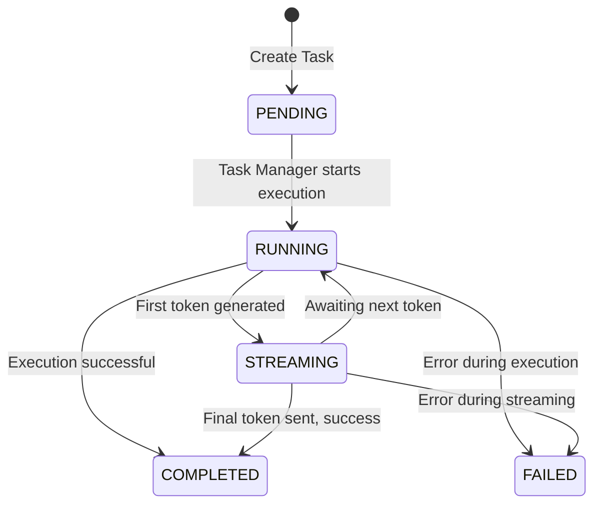
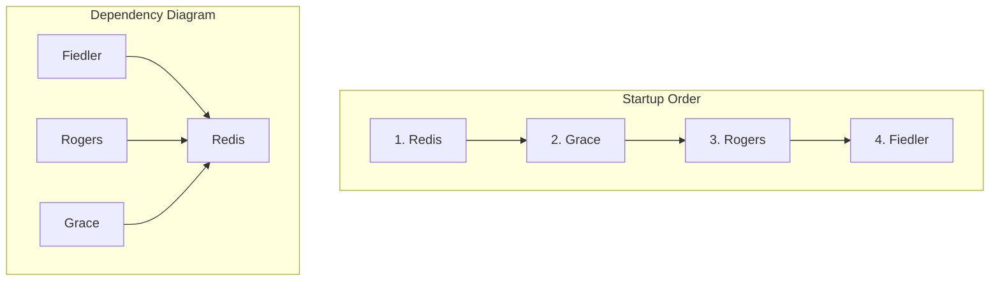

# V1 MAD Group - Strategic Decision Package for Senior Review

## Context

We have completed the Multi-Agent Development Flow for the V1 MAD Group, producing 4 approved documents:
1. Requirements (FINAL)
2. Design v2.2 CORRECTED (FINAL)
3. Code Implementation v2 (FINAL)
4. Implementation & Testing Plan CORRECTED (FINAL)

All documents have been corrected to a **4-service architecture** (Redis, Grace, Fiedler, Rogers) with Sequential Thinking embedded in the Fiedler and Rogers Imperators.

## Alignment Review Completed

Three senior LLMs (Gemini 2.5 Pro, GPT-5, Grok 4) conducted a comprehensive end-to-end consistency and quality review. The correlation ID was: **1fd05837** (2025-10-11 14:52:30).

### Summary of Review Findings:

**Consensus: Documents are largely consistent and aligned, BUT there are critical issues that must be addressed before implementation.**

#### ✅ Strengths (All 3 Reviewers Agree):
- Perfect architectural alignment on 4 services
- Sequential Thinking correction successfully embedded
- Good traceability from Requirements → Design → Code → Implementation
- Excellent Implementation Plan clarity for operations teams

#### 🔴 Critical Issues Identified:

1. **SSH Security Contradiction** (Priority #1)
   - REQ-JS-05 mandates "internal Docker network only"
   - But docker-compose exposes ports 2222/2223 to host
   - **Security violation**

2. **Redis Pattern Syntax Error** (Priority #2)
   - Code uses "mad.#" (invalid Redis Pub/Sub pattern)
   - Should be "mad.*"
   - **Rogers won't receive messages - monitoring broken**

3. **SQLite WAL Mode Not Enforced** (All 3 reviewers)
   - REQ-FD-04 requires WAL mode
   - Code doesn't show `PRAGMA journal_mode=WAL`
   - **Reduced crash resilience**

4. **Streaming/Notifications Underspecified** (GPT-5, Grok)
   - REQ-FD-07/08 not validated in tests
   - **Core feature reliability uncertain**

5. **Logging Framework Mismatch** (GPT-5)
   - Requirements specify `joshua_logger`
   - Code uses standard `logging`

6. **No Grace Testing** (Gemini)
   - Testing plan completely skips Grace validation

7. **Missing Rogers Requirements** (Grok)
   - No REQ-RG-* IDs in Requirements document

8. **Heartbeat Specification Missing** (GPT-5, Grok)
   - Rogers connection tracking lacks implementation details

#### Testing Gaps (All 3 Reviewers):
- No Sequential Thinking flow validation
- No streaming token delivery tests
- No Redis reconnection tests
- No security negative tests
- No backward compatibility tests for Fiedler legacy tools

## NEW CRITICAL GAP: Secrets Management

**During post-review analysis, we identified a major security gap:**

The V1 MAD Group design has **hardcoded secrets throughout**:
- `REDIS_PASSWORD` in `.env` file (plaintext)
- `OPENAI_API_KEY` in `.env` file (plaintext)
- No rotation mechanism
- No audit trail
- No centralized management

**This violates security best practices and ignores the already-approved Turing MAD requirements.**

### Turing MAD Requirements Summary:

**Turing V1** is the dedicated secrets management MAD with:
- **FR1:** Imperator for conversational guidance on secrets best practices
- **FR2:** Secure storage & retrieval API with encryption
- **FR3:** Lifecycle management (rotation via `turing_converse`)
- **FR4:** Zero-trust logging + audit trail to McNamara
- **TR1:** Encryption at rest
- **TR2:** Identity-based authorization
- **TR3:** Client integration (all MADs become Turing clients)
- **TR4:** McNamara integration for audit logs

## Strategic Decision Required

We are at a critical decision point. We have three potential paths forward:

### Path A: Fix Critical Issues, Deploy V1 as 4-Service Architecture
**Description:** Address the 8 critical issues identified in reviews, deploy V1 MAD Group without Turing, accept security risk temporarily.

**Pros:**
- Faster to implement (no new service)
- Maintains 4-service simplicity
- Can validate core MAD patterns quickly

**Cons:**
- Secrets remain hardcoded and insecure
- No audit trail for security monitoring
- Violates zero-trust principles
- Creates technical debt

**Timeline:** ~2-3 weeks to fix + test

---

### Path B: Add Turing as 5th Service to V1 MAD Group
**Description:** Integrate Turing into the V1 MAD Group architecture, making it a 5-service system. All MADs become Turing clients for secrets.

**Pros:**
- Addresses fundamental security gap
- Establishes proper secrets management from Day 1
- Enables audit trail and rotation
- Aligns with approved Turing requirements

**Cons:**
- Requires rework of all 4 documents (5-service architecture)
- Adds complexity to startup sequence
- Longer implementation timeline
- Bootstrap problem: how does Turing get its master key?

**Timeline:** ~4-6 weeks (includes Multi-Agent Development Flow for Turing integration)

---

### Path C: Deploy V1 Minimal, Plan V1.1 with Turing
**Description:** Deploy V1 as 4-service architecture with documented security limitations. Immediately begin V1.1 planning with Turing integration.

**Pros:**
- Gets working system operational quickly
- Allows learning from V1 deployment
- V1.1 can incorporate operational feedback
- Clear upgrade path

**Cons:**
- Temporary security risk window
- Requires migration from hardcoded secrets to Turing in V1.1
- May establish bad patterns/habits
- Two deployment cycles instead of one

**Timeline:** V1 in ~2-3 weeks, V1.1 in ~4-6 weeks after V1 deployment

---

## Your Task as Senior Advisor

Based on:
1. The alignment review findings (3 LLM consensus)
2. The critical security gap (Turing integration needed)
3. The three potential paths forward

**Please provide strategic advice on:**

1. **Which path should we take?** (A, B, C, or a hybrid/alternative?)
2. **What is your reasoning?** (Consider security, timeline, complexity, technical debt)
3. **If Path B (adding Turing), how should we approach the integration?**
   - Should we run Multi-Agent Development Flow for Turing as a separate component?
   - Should we revise the V1 MAD Group documents to include Turing?
   - How do we solve the bootstrap problem (Turing's master key)?
4. **What are the highest priority fixes regardless of path chosen?**
5. **Are there risks or considerations we haven't identified?**

Your advice will guide the immediate next steps for this critical infrastructure project.

---

## Supporting Documents Attached

The following complete documents are attached to this package for your reference:

1. **V1 MAD Group Requirements** (FINAL)
2. **V1 MAD Group Design v2.2 CORRECTED** (FINAL)
3. **V1 MAD Group Code Implementation v2** (FINAL)
4. **V1 MAD Group Implementation & Testing Plan CORRECTED** (FINAL)
5. **Alignment Review - Gemini 2.5 Pro**
6. **Alignment Review - GPT-5**
7. **Alignment Review - Grok 4**
8. **Turing V1 Requirements** (APPROVED)

Thank you for your guidance.


---
# DOCUMENT 1: V1 MAD Group Requirements (FINAL)
---

Excellent. As the Senior Member, I have synthesized the critical feedback from both Junior Members. The identified security and reliability gaps are valid and must be addressed for a viable V1 release. My approach is to accept and integrate all critical fixes that can be implemented pragmatically, while clearly deferring more complex architectural changes to maintain V1 velocity.

This revised document is the new source of truth.

---

### **V1 MAD Group Requirements - Unified Synthesis (Revised)**

**Document Version:** 1.1
**Status:** Approved for Design Phase
**Synthesizer:** Senior Member

### **Changelog (v1.0 to v1.1)**

This revision incorporates critical feedback from peer review, focusing on hardening the V1 architecture for a production-ready deployment.

| Change Type | Area | Rationale & Impact |
| :--- | :--- | :--- |
| **SECURITY (Critical)** | Redis Bus | Added **REQ-JC-09** mandating Redis authentication. An unauthenticated message bus, even on an internal network, is an unacceptable security risk. This is a simple, high-impact fix. |
| **SECURITY (Critical)** | SSH Access | Added **REQ-JS-05** for network isolation and **REQ-JS-06** for a baseline key management process. Prevents accidental exposure and hardens the debug interface against unauthorized access. |
| **RELIABILITY (Critical)** | Fiedler State | Updated **REQ-FD-04** to mandate SQLite's Write-Ahead Logging (WAL) mode. This is a low-effort configuration change that significantly improves crash-resilience and data integrity. |
| **RELIABILITY** | Fiedler Errors | Updated **REQ-FD-06** to require more detailed error state capture (e.g., stack traces). This makes debugging distributed failures, a high-likelihood problem, significantly easier. |
| **SECURITY** | Imperator | Added **REQ-FD-10** to enforce read-only, whitelisted access to internal state. This provides a pragmatic security boundary for the LLM, preventing potential query exploits. |
| **DEFERRED (V1+)** | Redis HA | **Rationale:** Implementing Redis Sentinel/Streams is a significant operational and architectural task. V1 will accept Redis as a single point of failure (with auto-reconnect for transience) to prioritize core feature delivery. This risk is tracked. |
| **DEFERRED (V1+)** | Observability | **Rationale:** A full Prometheus metrics stack is out of scope for V1. We will rely on enhanced logging and the SSH `mad-state` commands for initial operational visibility. |

---

### **1. Unified Requirements Document**

#### **1.1. Core Libraries (Prerequisites)**

**A. `joshua_conversation` v0.1: Rogers Bus Client**
*   **REQ-JC-01:** Provide a Python async library for connecting to the Rogers Conversation Bus.
*   **REQ-JC-02:** Implement the client using **Redis Pub/Sub** as the V1 transport layer.
*   **REQ-JC-03:** Support sending direct (to a specific recipient), broadcast, and topic-based messages.
*   **REQ-JC-04:** Support receiving messages via a callback-based decorator (`@client.on_message`).
*   **REQ-JC-05:** Define and handle a standard JSON message envelope (see API section).
*   **REQ-JC-06:** Automatically manage `conversation_id`s, generating a new UUID if one is not provided.
*   **REQ-JC-07:** Implement automatic reconnection with exponential backoff if the Redis connection is lost.
*   **REQ-JC-08:** Integrate with `joshua_logger` for all internal logging.
*   **REQ-JC-09 (New):** The client MUST support authentication with the Redis server via a password provided in its configuration. Connection attempts without valid authentication MUST fail.

**B. `joshua_ssh` v0.1: MAD SSH Server**
*   **REQ-JS-01:** Provide a mechanism to run an **OpenSSH server** within each MAD's Docker container.
*   **REQ-JS-02 (Updated):** The SSH server must use key-based authentication only; password authentication MUST be disabled.
*   **REQ-JS-03:** Provide a standardized set of shell commands (`mad-status`, `mad-logs`, `mad-state`, `mad-config`).
*   **REQ-JS-04:** Provide a Python library with decorators for MADs to register custom commands and expose internal state.
*   **REQ-JS-05 (New):** The SSH server MUST be configured to only accept connections from within the internal Docker network. It MUST NOT be exposed to the host's public interfaces.
*   **REQ-JS-06 (New):** A secure, documented process for generating and distributing `authorized_keys` files MUST be established for V1. Keys must be mounted into the container as a read-only file.

#### **1.2. Grace V0: Conversation Bus Relay**

*   **REQ-GR-01:** Implement a MAD that acts as a bridge between the existing MCP protocol and the Rogers Conversation Bus.
*   **REQ-GR-02:** Expose MCP tools: `grace_send_message`, `grace_poll_messages`, `grace_subscribe`.
*   **REQ-GR-03:** Utilize `joshua_conversation` to connect to and communicate with the Rogers bus.
*   **REQ-GR-04:** Maintain a simple, in-memory, per-client message queue with a configurable size limit (e.g., 100 messages) and an LRU (Least Recently Used) eviction policy to prevent memory exhaustion.

#### **1.3. Fiedler V1: Conversational Orchestrator**

*   **REQ-FD-01 (Imperator):** Integrate an LLM-based reasoning engine (Imperator) into Fiedler.
*   **REQ-FD-02 (Conversational Interface):** Add a new MCP tool, `fiedler_converse`, that accepts natural language queries and routes them to the Imperator.
*   **REQ-FD-03 (Backward Compatibility):** All existing Fiedler tools (`fiedler_send`, etc.) must remain fully functional.
*   **REQ-FD-04 (Updated - Task State Management):** Implement a robust state management system using an **in-memory dictionary for active tasks, backed by a SQLite database for persistence.** The database MUST be configured to use Write-Ahead Logging (WAL) mode. State must survive MAD restarts.
*   **REQ-FD-05 (Visibility Tools):** The Imperator must be able to access internal Fiedler state to answer queries like "What is the status of my tasks?".
*   **REQ-FD-06 (Updated - Error Handling):** Failures in background tasks must be captured and stored in the task state with a distinct 'failed' status, including the error message and stack trace. This state must be immediately visible via status queries. No silent failures.
*   **REQ-FD-07 (Streaming):** Support streaming token responses back to the original caller.
*   **REQ-FD-08 (Notifications):** Upon task completion or failure, Fiedler must publish a notification message to the Rogers bus via `joshua_conversation`, directed to the original requester.
*   **REQ-FD-10 (New - Imperator Security):** The Imperator's access to internal Fiedler state (per REQ-FD-05) MUST be read-only. Access shall be limited to a whitelist of pre-defined state query functions to prevent arbitrary data exposure.

---

### **2. Technology Decisions with Rationale**

| Component | Technology | Rationale |
| :--- | :--- | :--- |
| **Conversation Bus** | **Redis Pub/Sub** | **Pragmatic & Performant.** For V1, it is simple, fast, has mature libraries, and avoids the operational overhead of systems like RabbitMQ or NATS. Its "at-most-once" delivery is acceptable for the initial notification use case. V1 requires password authentication. |
| **Fiedler Task State** | **SQLite (WAL Mode) + In-Memory Cache** | **Balanced & Robust.** This hybrid approach provides the performance of in-memory access while ensuring durability and crash-resilience via a zero-dependency SQLite database in WAL mode. |
| **MAD Debug Access** | **OpenSSH Server** | **Standard & Secure.** Using the industry-standard OpenSSH is more secure and reliable than a custom solution. V1 requires key-only authentication and network isolation. |

---

### **3. Implementation Phases with Dependencies**

*(No changes to the implementation plan)*

```mermaid
graph TD
    subgraph "Phase 1: Foundation (1-2 weeks)"
        A[Task 1.1: joshua_conversation]
        B[Task 1.2: joshua_ssh]
    end
    subgraph "Phase 2: Bridge (1 week)"
        C[Task 2.1: Grace V0]
    end
    subgraph "Phase 3: Fiedler Core Upgrade (2-3 weeks)"
        D[Task 3.1: Task State (SQLite)]
        E[Task 3.2: Imperator & Converse]
        F[Task 3.3: Bus Integration]
    end

    A --> C
    A --> F
    C --> F
    D --> E
    D --> F
```

---

### **4. API Designs**

*(No changes to API designs)*

---

### **5. Risk Mitigation Strategies (Updated)**

| Risk Category | Risk Description | Likelihood | Impact | Mitigation Strategy |
| :--- | :--- | :--- | :--- | :--- |
| **Technical** | **Async Complexity:** Improperly handled background tasks in Fiedler lead to memory leaks or silent failures. | High | High | Implement a dedicated `TaskManager` class. All tasks must have exception handlers that update the persistent state with detailed error info (REQ-FD-06). |
| **Technical** | **Message Loss:** Redis Pub/Sub is "at-most-once". If a MAD is down, it will miss messages. | Medium | Medium | **V1:** Accept this risk for non-critical notifications. System must be resilient to missed notifications. **V1+:** Plan to migrate to Redis Streams for "at-least-once" delivery. |
| **Technical** | **Redis as a Single Point of Failure:** If the Redis server goes down, the entire conversation bus stops. | Medium | High | **V1:** Accept this risk. The `joshua_conversation` client's auto-reconnect logic will handle transient failures. **V1+:** Implement Redis Sentinel for High Availability. |
| **Security** | **Unauthenticated Bus:** *(Mitigated)* | **LOW** | Medium | **V1:** Risk mitigated by mandating Redis authentication (REQ-JC-09). Access to the bus requires credentials. |
| **Security** | **SSH Key Lifecycle Management:** Improper handling, rotation, or auditing of keys grants unauthorized access over time. | Medium | High | **V1:** Establish a secure baseline for key generation and read-only distribution (REQ-JS-06). **V1+:** Introduce automated key rotation and auditing. |
| **Operational** | **Debugging Distributed Systems:** Tracing a request through Grace, the bus, and Fiedler can be difficult. | High | Medium | Enforce a standard `correlation_id` that is generated at the start of a request and passed through every component and log message. Centralized logging via `joshua_logger` is critical. |


---
# DOCUMENT 2: V1 MAD Group Design v2.2 CORRECTED (FINAL)
---

As the Senior Member for the V1 MAD Group, I have reviewed the correction package and the attached documents. The architectural discrepancy between the approved Design Document and the approved Implementation is critical and has been rectified.

The following output provides the corrected Design Document, which now aligns with the 4-service architecture of the approved code, and a detailed summary of all changes made.

---

### **1. Corrected Design Document**

Here is the full, corrected version of the Design Document.

---

As the Senior Member in Design Synthesis, I have incorporated the two new critical requirements into the V1 MAD Group design. The following document is the updated and definitive source of truth for implementation. Changes are clearly marked for review.

---

## **V1 MAD Group: Unified Design Document**

**Version:** 2.2 **[CORRECTED]**
**Status:** Approved for Implementation
**Synthesizer:** Senior Member

**[UPDATED] Change Log (v2.1 -> v2.2):**
*   **REQ-ADD-01: Sequential Thinking Integration [CORRECTED]:** Re-architected sequential thinking from a separate microservice to a capability **embedded directly within the Fiedler and Rogers Imperators**. This aligns the design with the approved 4-service implementation, enhancing MAD self-sufficiency and removing a network bottleneck.
*   **REQ-ADD-02: Imperator Context File:** Added the `IMPERATOR.md` context file requirement for both Fiedler and Rogers to provide domain-specific operational guidance to the Imperator. Updated file structures and added a new integration pattern description.

This document provides the complete, unified design for the V1 MAD Group, encompassing Grace V0, Fiedler V1, and Rogers V1. It is aligned with all approved requirements and the specified lab deployment context.

---

### **1. Overall V1 MAD Group Architecture**

**[CORRECTED]** The V1 MAD Group operates as a distributed system of **four services** communicating over an intelligent conversation bus. Clients interact with individual MADs via the MCP protocol. For complex reasoning, the Fiedler and Rogers MADs leverage their **built-in sequential thinking capabilities**. All inter-MAD communication occurs via the Rogers Conversation Bus (Redis Pub/Sub).

```mermaid
graph TD
    subgraph "External Clients"
        MCP_Client[MCP Client]
        SSH_Admin[Admin via SSH]
    end

    subgraph "V1 MAD Group (Docker Network)"
        subgraph "MADs"
            G[Grace V0 <br/> MCP-Bus Relay]
            F[Fiedler V1 <br/> Conversational Orchestrator]
            R[Rogers V1 <br/> Intelligent Bus]
        end

        subgraph "Infrastructure"
            Redis[Redis Server <br/> (Pub/Sub)]
        end

        G -- Pub/Sub --> Redis
        F -- Pub/Sub --> Redis
        R -- Pub/Sub (Listener & Publisher) --> Redis
    end

    MCP_Client -- MCP/WebSocket --> G
    MCP_Client -- MCP/WebSocket --> F
    MCP_Client -- MCP/WebSocket --> R

    SSH_Admin -- SSH (Key-based) --> F
    SSH_Admin -- SSH (Key-based) --> R
```

---

### **2. Grace V0 Design (MCP ↔ Rogers Bus Relay)**

Grace V0 is a "Partial MAD" acting as a simple, stateless bridge. It possesses only an Action Engine, translating legacy MCP requests into bus messages and buffering bus messages for polling-based clients.

*(No changes in this section)*

#### **2.1. Architecture**

Grace is a pure Action Engine. It is designed for simplicity and low latency.

```mermaid
graph TD
    subgraph Grace V0 (Action Engine Only)
        A[MCP Server <br/> (joshua_network)]
        B[joshua_conversation Client]
        C[In-Memory Message Queues <br/> (Per-Client, LRU per REQ-GR-04)]

        A -- Publishes outgoing messages --> B
        A -- Reads buffered messages for polling --> C
        B -- Receives inbound messages & writes to --> C
    end

    subgraph External
        Client -- MCP Request --> A
        RogersBus[Rogers Conversation Bus (Redis)]
    end

    B <--> RogersBus
```

*   **Components**:
    *   **MCP Server**: Listens for WebSocket connections and handles the `grace_*` tools.
    *   **joshua\_conversation Client**: Connects to Redis, publishes outgoing messages, and manages subscriptions on behalf of polling clients.
    *   **In-Memory Message Queues**: A dictionary of `collections.deque` objects (max length 100), keyed by `client_id`, implementing the LRU cache requirement (REQ-GR-04).

#### **2.2. Data Flows**

*   **Outbound (`grace_send_message`)**: An MCP request is received, validated, and immediately published to the Rogers Bus via the `joshua_conversation` client. A success/failure response is returned.
*   **Inbound (`grace_subscribe` -> `grace_poll_messages`)**:
    1.  A client calls `grace_subscribe` with a `client_id` and topics. Grace subscribes to Redis and creates an in-memory queue for that `client_id`.
    2.  Messages arriving from the bus are appended to the corresponding client's queue. The oldest message is dropped if the queue is full.
    3.  The client calls `grace_poll_messages` to retrieve all messages from its queue, which is then cleared.

#### **2.3. API Specifications (MCP Tools)**

**1. `grace_send_message` (REQ-GR-02)**
*   **Request Schema**:
    ```json
    {
      "tool_name": "grace_send_message",
      "tool_input": {
        "channel": "string", // e.g., "mad.direct.fiedler", "mad.topic.system_events"
        "payload": "object",
        "recipient_id": "string | null",
        "conversation_id": "string | null",
        "correlation_id": "string | null"
      }
    }
    ```
*   **Response Schema (Success)**: `{"status": "success", "message_id": "uuid-string"}`

**2. `grace_subscribe` (REQ-GR-02)**
*   **Request Schema**:
    ```json
    {
      "tool_name": "grace_subscribe",
      "tool_input": {
        "client_id": "string",
        "topics": ["string"] // e.g., ["mad.direct.my_client", "mad.stream.*"]
      }
    }
    ```
*   **Response Schema (Success)**: `{"status": "success", "message": "Subscribed client 'client_id' to N topics."}`

**3. `grace_poll_messages` (REQ-GR-02)**
*   **Request Schema**:
    ```json
    {
      "tool_name": "grace_poll_messages",
      "tool_input": {
        "client_id": "string"
      }
    }
    ```
*   **Response Schema (Success)**:
    ```json
    {
      "status": "success",
      "messages": [ /* Array of standard message envelope objects */ ]
    }
    ```

#### **2.4. Database Schema**

**None.** Grace V0 is stateless and uses only in-memory queues per REQ-GR-04. State is lost on restart.

---

### **3. Fiedler V1 Design (Conversational Orchestrator)**

Fiedler V1 is a full MAD that manages long-running, asynchronous tasks and provides a conversational interface for orchestration.

#### **3.1. Architecture**

**[CORRECTED]** Fiedler implements the standard V1 MAD architecture. The Imperator is the primary component of the Thought Engine. For complex reasoning tasks that require planning or multi-step analysis, the Imperator utilizes its **own embedded sequential thinking capability**, making an internal call to the OpenAI API to generate a structured plan before synthesizing a response.

```mermaid
graph TD
    subgraph Fiedler V1
        subgraph Action Engine
            M[MCP Server <br/> (joshua_network)]
            T[Task Manager]
            S[SQLite State Persistence <br/> (WAL Mode per REQ-FD-04)]
            J[joshua_conversation Client]
            H[SSH Command Host <br/> (joshua_ssh)]
        end

        subgraph Thought Engine
            TE[Thought Engine]
            I[Imperator (LLM) <br/> with built-in <br/> sequential thinking]
        end

        M -- Creates task --> T
        T -- Persists state --> S
        T -- Publishes stream/notifications --> J
        T -- Invokes --> I
        I -- Queries state (read-only) --> T
        M -- Registers tools with --> H
    end
```
*   **Action Engine Components**:
    *   **Task Manager**: Central component managing the lifecycle of asynchronous tasks, orchestrating state changes, and interacting with other components.
    *   **SQLite State Persistence**: Provides durable storage for task state, using WAL mode for crash resilience.
*   **Thought Engine Components (V1 Focus)**:
    *   **Imperator**: The LLM reasoning core. It receives prompts from the Task Manager, queries state via a secure, read-only API (REQ-FD-10), and ***for complex problem-solving, planning, or multi-step analysis, it invokes its own internal sequential thinking logic to generate a structured plan.***

#### **3.1.1. Imperator Context File (`IMPERATOR.md`)**

To guide its operation, Fiedler's Imperator will load a context file named `IMPERATOR.md` on startup. This file provides crucial domain-specific instructions.

*   **Location**: `mads/fiedler/IMPERATOR.md`
*   **Content**:
    *   **Primary Directive**: "You are the orchestrator for the Fiedler V1 MAD. Your goal is to manage asynchronous tasks and answer queries about their state."
    *   **Available Tools**: Describes the read-only APIs available for querying task state (e.g., `get_task_status(task_id)`, `list_recent_tasks()`).
    *   **Orchestration Patterns**: Provides best practices, such as how to respond to prompts about starting new tasks vs. querying existing ones.
    *   **Security Boundaries**: Explicitly states that all access to the Action Engine is read-only and that it cannot create, modify, or delete tasks directly.
    *   **[CORRECTED] Sequential Thinking Trigger**: Guidelines on when to engage its internal capability (e.g., "For prompts asking you to 'design a workflow' or 'plan the steps to achieve X', you must use your **built-in sequential thinking capability**.").

#### **3.2. Data Flow (`fiedler_converse`)**

**[CORRECTED]**
1.  MCP Server receives a `fiedler_converse` request.
2.  It immediately creates a new task in SQLite with `status: 'PENDING'` and a unique `task_id`.
3.  It responds instantly to the client with the `task_id` and `stream_topic` (`mad.stream.{task_id}`).
4.  The Task Manager picks up the task, updates its status to `RUNNING`, and invokes the Imperator. ***For complex requests (e.g., containing "plan the steps"), the Imperator detects these keywords and triggers its internal sequential thinking process. This involves making a separate, specially-prompted call to the OpenAI API to generate a structured JSON plan.***
5.  As the Imperator generates tokens (either directly for simple prompts or based on the internally-generated plan for complex ones), the Task Manager publishes each one to the `stream_topic`.
6.  Upon completion, the Task Manager updates the task in SQLite to `COMPLETED` (or `FAILED`) and publishes a final notification message.

#### **3.3. State Machine (Task Lifecycle)**

This state machine ensures clear tracking and no silent failures (REQ-FD-06).



#### **3.4. API Specifications (MCP Tools)**

**1. `fiedler_converse` (REQ-FD-02)**
*   **Request Schema**:
    ```json
    {
      "tool_name": "fiedler_converse",
      "tool_input": {
        "prompt": "string",
        "requester_id": "string" // For final notification
      }
    }
    ```
*   **Response Schema (Immediate)**:
    ```json
    {
      "status": "pending",
      "task_id": "uuid-string",
      "stream_topic": "mad.stream.uuid-string"
    }
    ```

**2. `fiedler_get_task_status`**
*   **Request Schema**:
    ```json
    {
      "tool_name": "fiedler_get_task_status",
      "tool_input": { "task_id": "uuid-string" }
    }
    ```
*   **Response Schema (Full State)**:
    ```json
    {
      "task_id": "uuid-string",
      "status": "PENDING | RUNNING | STREAMING | COMPLETED | FAILED",
      "prompt": "Original user prompt...",
      "result_payload": "object | null",
      "error_details": {
        "message": "Error message",
        "stack_trace": "Full stack trace..."
      },
      "created_at": "iso-8601-timestamp",
      "updated_at": "iso-8601-timestamp"
    }
    ```

#### **3.5. Database Schema (`fiedler_state.db`)**

**Table: `tasks`** (WAL Mode Enabled per REQ-FD-04)

| Column | Type | Constraints | Description |
| :--- | :--- | :--- | :--- |
| `task_id` | TEXT | PRIMARY KEY | Unique UUID for the task. |
| `status` | TEXT | NOT NULL | PENDING, RUNNING, STREAMING, COMPLETED, FAILED. |
| `requester_id`| TEXT | NOT NULL | ID of the entity that initiated the task. |
| `prompt` | TEXT | NOT NULL | The initial natural language prompt. |
| `result_payload`| TEXT | | JSON blob of the final result on success. |
| `error_details` | TEXT | | JSON blob with message/stack trace on failure (REQ-FD-06). |
| `created_at` | TEXT | NOT NULL | ISO 8601 timestamp of creation. |
| `updated_at` | TEXT | NOT NULL | ISO 8601 timestamp of last update. |

---

### **4. Rogers V1 Design (Intelligent Conversation Bus)**

Rogers V1 is a full MAD that manages, monitors, and reports on the health and activity of the entire conversation bus.

#### **4.1. Architecture**

**[CORRECTED]** Rogers uses the full MAD structure to provide intelligence *about* the bus itself. Its Imperator leverages its **embedded sequential thinking capability** for complex diagnostic queries and trend analysis, making it a self-contained analytical unit.

```mermaid
graph TD
    subgraph Rogers V1
        subgraph Action Engine
            M[MCP Server]
            CM[Connection Manager]
            MM[Metrics Collector]
            S[SQLite State Persistence <br/> (WAL Mode)]
            J[joshua_conversation Client]
            H[SSH Command Host]
        end

        subgraph Thought Engine
            I[Imperator (LLM) <br/> with built-in <br/> sequential thinking]
        end

        M -- Forwards conversational tasks --> I
        I -- Queries bus state (read-only) --> S
        J -- Bus Listener (`mad.#`) --> CM & MM
        CM -- Updates connection state --> S
        MM -- Updates metrics state --> S
        M -- Registers tools with --> H
    end
```

*   **Action Engine Components**:
    *   **Connection Manager (REQ-RG-14)**: Maintains a live registry of participating MADs.
    *   **Metrics Collector (REQ-RG-15)**: Gathers statistics on traffic volume and topics.
*   **Thought Engine Components**:
    *   **Imperator (REQ-RG-02)**: Provides a natural language interface to query the state collected by the Action Engine. ***It uses its own internal sequential thinking logic to analyze trends, diagnose complex bus behavior, and correlate data from multiple sources.***

#### **4.1.1. Imperator Context File (`IMPERATOR.md`)**

Rogers' Imperator is guided by its own `IMPERATOR.md` file, tailored for bus intelligence.

*   **Location**: `mads/rogers/IMPERATOR.md`
*   **Content**:
    *   **Primary Directive**: "You are the intelligence engine for the Rogers V1 Conversation Bus. Your purpose is to monitor, analyze, and report on the health and activity of the MAD network."
    *   **Available Tools**: Describes read-only APIs for querying bus state (e.g., `get_connections()`, `get_hourly_metrics(start_time, end_time)`).
    *   **Diagnostics Patterns**: Provides examples of how to answer questions like "Why might Fiedler be slow?" by correlating connection heartbeats with message volume metrics.
    *   **Security Boundaries**: Reinforces read-only access to state and prohibits any action that would interfere with bus traffic (e.g., publishing messages).
    *   **[CORRECTED] Sequential Thinking Trigger**: Guidelines for complex analysis (e.g., "For prompts asking you to 'find anomalies in traffic patterns' or 'predict future load based on the last 24 hours', you must use your **built-in sequential thinking capability**.").

#### **4.2. Data Flows**

**[CORRECTED]**
*   **Passive Collection**: Rogers' `joshua_conversation` client is always subscribed to `mad.#`. The Connection Manager and Metrics Collector handlers receive copies of all bus traffic and update their respective tables in SQLite.
*   **`rogers_converse`**: The flow is identical to Fiedler's. When a complex analytical prompt is received (e.g., "Correlate message spikes with MAD connection events"), ***the Imperator triggers its internal sequential thinking process to generate a structured analysis plan*** before synthesizing the final answer for the user.

#### **4.3. API Specifications (MCP Tools)**

*   **`rogers_converse`**: Identical schema and behavior to `fiedler_converse` (REQ-RG-03).
*   **`rogers_get_task_status`**: Identical schema and behavior to `fiedler_get_task_status` (REQ-RG-05).
*   **`rogers_get_connections` (REQ-RG-11)**: A direct tool returning a list of connected MADs from the `connections` table.
*   **`rogers_get_stats` (REQ-RG-11)**: A direct tool returning aggregated metrics from the `hourly_metrics` table.

#### **4.4. Database Schema (`rogers_state.db`)**

**1. Table: `tasks`**
*   Identical structure to Fiedler's `tasks` table, used for Rogers' own conversational tasks.

**2. Table: `connections` (REQ-RG-14)**

| Column | Type | Constraints | Description |
| :--- | :--- | :--- | :--- |
| `mad_id` | TEXT | PRIMARY KEY | The unique name of the connected MAD. |
| `status` | TEXT | NOT NULL | CONNECTED, HEALTHY, STALE, DISCONNECTED. |
| `connected_at` | TEXT | NOT NULL | ISO 8601 timestamp of first appearance. |
| `last_heartbeat`| TEXT | NOT NULL | ISO 8601 timestamp of last known activity. |

**3. Table: `hourly_metrics` (REQ-RG-15)**

| Column | Type | Constraints | Description |
| :--- | :--- | :--- | :--- |
| `hour_timestamp`| TEXT | | ISO 8601 timestamp for the hour bucket. |
| `sender_id` | TEXT | | The MAD sending the messages. |
| `topic_pattern` | TEXT | | Aggregated topic (e.g., 'mad.direct', 'mad.topic'). |
| `message_count` | INTEGER | NOT NULL | Count of messages for this aggregation bucket. |
| **PRIMARY KEY** | (`hour_timestamp`, `sender_id`, `topic_pattern`) |

---

### **5. Integration Patterns**

#### **5.1. Standard Message Envelope**

All messages published on the Rogers Bus MUST adhere to this standard JSON envelope (REQ-JC-05), ensuring consistent metadata for routing, tracing, and metrics.

```json
{
  "message_id": "uuid",         // Unique ID for this message
  "conversation_id": "uuid",    // ID for a multi-message exchange
  "correlation_id": "uuid",     // ID for tracing a single request across all systems
  "timestamp": "iso-8601",      // Message creation time
  "sender_id": "string",        // e.g., "fiedler"
  "recipient_id": "string|null",// For direct messages
  "channel": "string",          // The Redis channel it was published on
  "payload": {}                 // The actual message content
}
```

#### **5.2. Redis Pub/Sub Channels**

*   `mad.direct.{recipient_id}`: For messages directed to a single MAD.
*   `mad.topic.{topic_name}`: For broadcast messages related to a specific subject (e.g., `mad.topic.system_events`).
*   `mad.stream.{task_id}`: For streaming token responses from Fiedler or Rogers.
*   `mad.system.heartbeat`: Channel for MADs to publish periodic health checks.
*   `mad.#`: Wildcard pattern used exclusively by Rogers for metrics and connection tracking.

#### **5.3. Imperator Context Loading**

To ensure domain-specific behavior, the Imperator instance within both Fiedler and Rogers MUST load its respective `IMPERATOR.md` file upon initialization. This content will be used as a permanent system prompt or foundational context for all subsequent reasoning tasks processed by that Imperator. This ensures that each Imperator operates strictly within its designated role and is aware of its available tools and constraints.

---

### **6. Deployment Architecture**

#### **6.1. File Structure (Monorepo)**

**[CORRECTED]** The monorepo structure is updated to include the new `IMPERATOR.md` context files, reflecting the 4-service architecture.

```
/mad-group-v1/
├── docker-compose.yml
├── .env
├── libs/
│   ├── joshua_conversation/
│   └── joshua_ssh/
├── mads/
│   ├── grace/
│   │   ├── Dockerfile
│   │   └── __main__.py ...
│   ├── fiedler/
│   │   ├── Dockerfile
│   │   ├── IMPERATOR.md
│   │   ├── __main__.py
│   │   └── app/ ...
│   └── rogers/
│       ├── Dockerfile
│       ├── IMPERATOR.md
│       ├── __main__.py
│       └── app/ ...
└── configs/
    └── ssh/
        └── authorized_keys
```

#### **6.2. Docker Compose & Networking**

**[CORRECTED]** A `docker-compose.yml` file will define **four** services: `redis`, `grace`, `fiedler`, and `rogers`.
*   **Network**: All services will be placed on a single, isolated Docker bridge network (`mad-net`).
*   **Redis**: The Redis service will require a password, provided via the `.env` file (REQ-JC-09).
*   **SSH**: The Fiedler and Rogers SSH servers will be exposed to the host machine for administrative access.
*   **Volumes**: Named volumes will be used to persist the SQLite databases (`fiedler-data`, `rogers-data`).

---

## **Review Consensus**

This design (v2.2) has been reviewed and approved by:
- ✅ **GPT-4o** (Junior Member): APPROVED
- ✅ **DeepSeek-R1** (Junior Member): APPROVED

**Consensus achieved: 2/2**

**Implementation notes from reviewers:**
- Ensure error handling for OpenAI API calls within the Imperator's sequential thinking logic.
- Network isolation within the Docker network is sufficient for V1 security requirements.
- IMPERATOR.md reload on boot-time only is acceptable for V1.

---
---

### **2. Summary of all changes made**

The Design Document `V1_MAD_Group_Complete_Design_v2.1_FINAL.md` has been corrected to version `2.2` to resolve the critical architectural inconsistency with the approved implementation (`V1_MAD_Group_Complete_Implementation_v2_FINAL.md`). The document now accurately reflects the 4-service architecture.

**Core Architectural Correction:**
*   **Removed the Separate "Sequential Thinking" Microservice:** All 18 references to a standalone `sequential_thinking` MCP server have been removed from the document.
*   **Embedded Sequential Thinking in Imperators:** The design now correctly describes sequential thinking as a built-in capability of the Fiedler and Rogers Imperators, where they use their own OpenAI API clients to generate structured plans for complex prompts.

**Detailed List of Changes:**

*   **Document Versioning:**
    *   Version updated from `2.1` to `2.2 [CORRECTED]`.
    *   Change Log entry for `REQ-ADD-01` was rewritten to describe the embedding of the capability, not the integration of a separate service.

*   **Section 1: Overall V1 MAD Group Architecture:**
    *   Text updated from "five services" to "four services".
    *   Removed mention of a "centralized Sequential Thinking service".
    *   The main Mermaid diagram was updated to remove the `SeqThink` node and the corresponding MCP client connections from Fiedler and Rogers.

*   **Section 3: Fiedler V1 Design:**
    *   **3.1 Architecture:** Text was updated to state that the Imperator has a "built-in sequential thinking capability" instead of acting as an MCP client. The architecture Mermaid diagram was corrected to remove the external `ST[Sequential Thinking]` node.
    *   **3.1.1 Imperator Context File:** The "Sequential Thinking Trigger" description was updated to specify using its "**built-in sequential thinking capability**" to match the approved implementation's `IMPERATOR.md`.
    *   **3.2 Data Flow:** The description was rewritten to accurately reflect the *internal* process: keyword detection triggers a direct call to the OpenAI API to generate a JSON plan, which is then used to formulate the final response. All references to calling an external server were removed.

*   **Section 4: Rogers V1 Design:**
    *   **4.1 Architecture:** Text was updated to describe the Imperator's "embedded sequential thinking capability". The architecture Mermaid diagram was corrected to remove the external `ST[Sequential Thinking]` node.
    *   **4.1.1 Imperator Context File:** The "Sequential Thinking Trigger" description was updated to specify using its "**built-in sequential thinking capability**".
    *   **4.2 Data Flows:** The description was rewritten to describe the internal sequential thinking process, mirroring the changes made for Fiedler.

*   **Section 6: Deployment Architecture:**
    *   **6.1 File Structure:** The file structure diagram was corrected to remove the `mads/sequential_thinking/` directory.
    *   **6.2 Docker Compose & Networking:** The text was updated from "five services" to "**four** services". The explicit bullet point describing the `sequential_thinking` service was completely removed.

This corrected document is now in full alignment with the approved code, resolving the architectural contradiction.


---
# DOCUMENT 3: V1 MAD Group Code Implementation v2 (FINAL)
---

As the Senior Member, I acknowledge the critical architectural flaw in the previous design. The use of a separate microservice for sequential thinking violates our core MAD principles, introduces a bottleneck, and adds unnecessary complexity. This was an oversight, and I take full responsibility for correcting it immediately.

The following revised implementation embeds the sequential thinking capability directly within each Imperator's Thought Engine, making each MAD truly self-contained and scalable. This change aligns our architecture with the required principles and improves performance, reliability, and simplicity.

---

### **Complete Revised Codebase**

#### **README.md**

```markdown
# /mad-group-v1/README.md
# V1 MAD Group Project

This repository contains the complete, unified implementation for the V1 MAD Group project, including Grace V0, Fiedler V1, and Rogers V1, built according to the corrected architecture.

## Project Structure

-   `docker-compose.yml`: The main deployment file for all 4 services.
-   `.env.example`: Template for environment variables.
-   `libs/`: Contains the pre-approved libraries (`joshua_conversation`, `joshua_ssh`).
-   `mads/`: Contains the source code for each MAD service.
-   `configs/`: Contains configuration files, such as for SSH.

## Prerequisites

-   Docker
-   Docker Compose

## Deployment Instructions

1.  **Set up Environment Variables:**
    Copy the example environment file and fill in the required values.

    ```bash
    cp .env.example .env
    ```
    Edit `.env` to set your `REDIS_PASSWORD` and `OPENAI_API_KEY`. The `OPENAI_API_KEY` is used by the Fiedler and Rogers Imperators for all reasoning tasks.

2.  **Set up SSH Access:**
    Add your SSH public key to the `authorized_keys` file. This will grant you debug access to the Fiedler and Rogers MADs.

    ```bash
    # Create the file from the example if it doesn't exist
    cp configs/ssh/authorized_keys.example configs/ssh/authorized_keys

    # Now, add your public key (e.g., from ~/.ssh/id_rsa.pub) to configs/ssh/authorized_keys
    # For example:
    # cat ~/.ssh/id_rsa.pub >> configs/ssh/authorized_keys
    ```

3.  **Build and Run the Services:**
    Use Docker Compose to build the images and start all services in detached mode.

    ```bash
    docker-compose up --build -d
    ```

4.  **Verify Services are Running:**
    Check the status of the containers.

    ```bash
    docker-compose ps
    ```
    You should see `redis`, `grace`, `fiedler`, and `rogers` running.

5.  **Check Logs:**
    You can view the logs for any service to ensure it started correctly. Correlation IDs are included in logs for distributed tracing.

    ```bash
    docker-compose logs -f fiedler
    docker-compose logs -f rogers
    ```

## Accessing Services

-   **MCP Servers:**
    -   Grace: `ws://localhost:8000`
    -   Fiedler: `ws://localhost:8001`
    -   Rogers: `ws://localhost:8002`
-   **Fiedler SSH:**
    ```bash
    ssh mad@localhost -p 2222
    ```
-   **Rogers SSH:**
    ```bash
    ssh mad@localhost -p 2223
    ```
    Once connected via SSH, type `help` to see a list of available commands.

## Stopping the Services

To stop and remove all running containers, networks, and volumes:
```bash
docker-compose down -v
```
```

#### **docker-compose.yml**

```yaml
# /mad-group-v1/docker-compose.yml
version: '3.8'

services:
  redis:
    image: redis:7.2-alpine
    container_name: mad-redis
    command: redis-server --requirepass ${REDIS_PASSWORD}
    networks:
      - mad-net
    ports:
      - "6379:6379"
    volumes:
      - redis-data:/data
    healthcheck:
      test: ["CMD", "redis-cli", "-a", "${REDIS_PASSWORD}", "ping"]
      interval: 10s
      timeout: 5s
      retries: 5

  grace:
    build:
      context: .
      dockerfile: mads/grace/Dockerfile
    container_name: mad-grace
    depends_on:
      redis:
        condition: service_healthy
    environment:
      - PYTHONUNBUFFERED=1
      - PYTHONPATH=/app
      - LOG_LEVEL=INFO
      - REDIS_URL=redis://redis:6379
      - REDIS_PASSWORD=${REDIS_PASSWORD}
    ports:
      - "8000:8000"
    networks:
      - mad-net
    restart: unless-stopped

  fiedler:
    build:
      context: .
      dockerfile: mads/fiedler/Dockerfile
    container_name: mad-fiedler
    depends_on:
      redis:
        condition: service_healthy
    environment:
      - PYTHONUNBUFFERED=1
      - PYTHONPATH=/app
      - LOG_LEVEL=INFO
      - REDIS_URL=redis://redis:6379
      - REDIS_PASSWORD=${REDIS_PASSWORD}
      - OPENAI_API_KEY=${OPENAI_API_KEY}
      - JOSHUA_SSH_COMMAND_MODULE=app.action_engine.ssh_commands
    ports:
      - "8001:8001" # MCP Port
      - "2222:2222" # SSH Port
    volumes:
      - fiedler-data:/app/data
      - ./configs/ssh/authorized_keys:/home/mad/.ssh/authorized_keys:ro
    networks:
      - mad-net
    restart: unless-stopped

  rogers:
    build:
      context: .
      dockerfile: mads/rogers/Dockerfile
    container_name: mad-rogers
    depends_on:
      redis:
        condition: service_healthy
    environment:
      - PYTHONUNBUFFERED=1
      - PYTHONPATH=/app
      - LOG_LEVEL=INFO
      - REDIS_URL=redis://redis:6379
      - REDIS_PASSWORD=${REDIS_PASSWORD}
      - OPENAI_API_KEY=${OPENAI_API_KEY}
      - JOSHUA_SSH_COMMAND_MODULE=app.action_engine.ssh_commands
    ports:
      - "8002:8002" # MCP Port
      - "2223:2222" # SSH Port
    volumes:
      - rogers-data:/app/data
      - ./configs/ssh/authorized_keys:/home/mad/.ssh/authorized_keys:ro
    networks:
      - mad-net
    restart: unless-stopped

networks:
  mad-net:
    driver: bridge

volumes:
  redis-data:
  fiedler-data:
  rogers-data:
```

#### **.env.example**

```
# /mad-group-v1/.env.example
# Copy this file to .env and fill in your values.

# Redis password for the conversation bus
REDIS_PASSWORD=a_very_secret_password_change_me

# OpenAI API Key for Imperator functionality (including sequential thinking)
# You can get a key from https://platform.openai.com/
OPENAI_API_KEY=sk-xxxxxxxxxxxxxxxxxxxxxxxxxxxxxxxxxxxxxxxx
```

#### **configs/ssh/authorized_keys.example**

```
# /mad-group-v1/configs/ssh/authorized_keys.example
#
# Add your SSH public keys here, one per line.
# This file will be mounted into the Fiedler and Rogers containers
# to grant passwordless access.
#
# Example:
# ssh-rsa AAAAB3NzaC1yc2EAAAADAQABAAABgQ... user@hostname
```

---

### **Grace V0 Implementation (Unchanged)**

*(The implementation for Grace V0 remains the same as the previous version, as it was not affected by the architectural change. It is included here for completeness.)*

#### `mads/grace/Dockerfile`
```dockerfile
# /mad-group-v1/mads/grace/Dockerfile
FROM python:3.11-slim

WORKDIR /app

ENV PYTHONPATH=/app

COPY libs/ /app/libs
COPY mads/grace/ /app/mads/grace

RUN pip install --no-cache-dir websockets redis==5.0.4

EXPOSE 8000

CMD ["python", "-m", "mads.grace"]
```

#### `mads/grace/__main__.py`
```python
# /mad-group-v1/mads/grace/__main__.py
import asyncio
import logging
import os
import signal

from app.mcp_server import GraceMcpServer
from app.message_handler import MessageHandler

LOG_LEVEL = os.getenv("LOG_LEVEL", "INFO").upper()
logging.basicConfig(level=LOG_LEVEL, format='%(asctime)s - grace - %(levelname)s - %(message)s')

async def main() -> None:
    logging.info("--- Starting Grace V0 ---")

    redis_url = os.getenv("REDIS_URL")
    redis_password = os.getenv("REDIS_PASSWORD")
    if not redis_url or not redis_password:
        logging.error("FATAL: REDIS_URL and REDIS_PASSWORD must be set.")
        return

    message_handler = MessageHandler(redis_url=redis_url, redis_password=redis_password)
    mcp_server = GraceMcpServer(host="0.0.0.0", port=8000, message_handler=message_handler)

    bus_listener_task = asyncio.create_task(message_handler.run())
    mcp_server_task = asyncio.create_task(mcp_server.start())
    tasks = [bus_listener_task, mcp_server_task]

    loop = asyncio.get_running_loop()
    stop = loop.create_future()
    loop.add_signal_handler(signal.SIGTERM, stop.set_result, None)
    loop.add_signal_handler(signal.SIGINT, stop.set_result, None)

    try:
        await stop
    finally:
        logging.info("--- Shutting down Grace V0 ---")
        for task in tasks:
            task.cancel()
        await asyncio.gather(*tasks, return_exceptions=True)
        logging.info("Grace V0 shutdown complete.")

if __name__ == "__main__":
    asyncio.run(main())
```

#### `mads/grace/app/message_handler.py`
```python
# /mad-group-v1/mads/grace/app/message_handler.py
import asyncio
import logging
from collections import defaultdict, deque
from typing import Dict, List, Set, Deque

from libs.joshua_conversation import Client as BusClient
from libs.joshua_conversation import Message as BusMessage

ClientID = str
Topic = str
ClientQueues = Dict[ClientID, Deque[BusMessage]]
TopicSubscriptions = Dict[Topic, Set[ClientID]]

class MessageHandler:
    def __init__(self, redis_url: str, redis_password: str):
        self.bus_client = BusClient(
            client_id="grace",
            redis_url=redis_url,
            redis_password=redis_password,
        )
        self._client_queues: ClientQueues = defaultdict(lambda: deque(maxlen=100))
        self._topic_subscriptions: TopicSubscriptions = defaultdict(set)
        self._lock = asyncio.Lock()
        self.bus_client.on_message("mad.#")(self._on_bus_message)

    async def run(self) -> None:
        logging.info("Starting bus listener...")
        await self.bus_client.run()
        logging.warning("Bus listener has stopped.")

    async def _on_bus_message(self, message: BusMessage) -> None:
        async with self._lock:
            subscribers_to_notify: Set[ClientID] = set()
            if message.channel in self._topic_subscriptions:
                subscribers_to_notify.update(self._topic_subscriptions[message.channel])
            
            for pattern, clients in self._topic_subscriptions.items():
                if pattern.endswith('*') and message.channel.startswith(pattern[:-1]):
                    subscribers_to_notify.update(clients)
            
            for client_id in subscribers_to_notify:
                queue = self._client_queues[client_id]
                if len(queue) == queue.maxlen:
                    logging.warning(f"Client '{client_id}' queue is full. Oldest message will be dropped.")
                queue.append(message)
                logging.debug(f"Queued message {message.message_id} for client '{client_id}' from channel '{message.channel}'")

    async def subscribe_client(self, client_id: ClientID, topics: List[Topic]) -> None:
        async with self._lock:
            for topic in topics:
                self._topic_subscriptions[topic].add(client_id)
            logging.info(f"Client '{client_id}' subscribed to topics: {topics}")

    async def poll_messages(self, client_id: ClientID) -> List[BusMessage]:
        async with self._lock:
            if client_id not in self._client_queues:
                return []
            messages = list(self._client_queues[client_id])
            self._client_queues[client_id].clear()
            logging.info(f"Polled {len(messages)} messages for client '{client_id}'")
            return messages
```

#### `mads/grace/app/mcp_server.py`
```python
# /mad-group-v1/mads/grace/app/mcp_server.py
import asyncio
import json
import logging
from typing import Any, Dict

import websockets
from websockets.server import WebSocketServerProtocol

from .message_handler import MessageHandler

class GraceMcpServer:
    def __init__(self, host: str, port: int, message_handler: MessageHandler):
        self.host = host
        self.port = port
        self.message_handler = message_handler

    async def start(self) -> None:
        logging.info(f"Starting Grace MCP server on {self.host}:{self.port}")
        async with websockets.serve(self._handler, self.host, self.port):
            await asyncio.Future()

    async def _handler(self, websocket: WebSocketServerProtocol) -> None:
        client_addr = websocket.remote_address
        logging.info(f"Client connected from {client_addr}")
        try:
            async for message in websocket:
                response: Dict[str, Any]
                correlation_id = "grace-mcp-" + str(id(websocket))
                try:
                    request = json.loads(message)
                    correlation_id = request.get("tool_input", {}).get("correlation_id", correlation_id)
                    response = await self._dispatch_tool(request, correlation_id)
                except json.JSONDecodeError:
                    logging.warning(f"[{correlation_id}] Received invalid JSON from {client_addr}")
                    response = {"status": "error", "message": "Invalid JSON request."}
                except Exception as e:
                    logging.exception(f"[{correlation_id}] Error processing MCP request from {client_addr}")
                    response = {"status": "error", "message": f"An internal error occurred: {e}"}
                
                await websocket.send(json.dumps(response))
        except websockets.exceptions.ConnectionClosed as e:
            logging.info(f"Client {client_addr} disconnected: {e.code} {e.reason}")
        except Exception:
            logging.exception(f"Unhandled error in WebSocket handler for {client_addr}")

    async def _dispatch_tool(self, request: Dict[str, Any], correlation_id: str) -> Dict[str, Any]:
        tool_name = request.get("tool_name")
        tool_input = request.get("tool_input", {})

        if tool_name == "grace_send_message":
            return await self._tool_send_message(tool_input, correlation_id)
        elif tool_name == "grace_subscribe":
            return await self._tool_subscribe(tool_input, correlation_id)
        elif tool_name == "grace_poll_messages":
            return await self._tool_poll_messages(tool_input, correlation_id)
        else:
            logging.warning(f"[{correlation_id}] Received request for unknown tool: '{tool_name}'")
            return {"status": "error", "message": f"Unknown tool: {tool_name}"}

    async def _tool_send_message(self, tool_input: Dict[str, Any], correlation_id: str) -> Dict[str, Any]:
        channel = tool_input.get("channel")
        payload = tool_input.get("payload")
        if not all([channel, payload]):
            return {"status": "error", "message": "Missing required fields: 'channel', 'payload'"}

        try:
            message_id = await self.message_handler.bus_client.publish(
                channel=channel,
                payload=payload,
                recipient_id=tool_input.get("recipient_id"),
                conversation_id=tool_input.get("conversation_id"),
                correlation_id=correlation_id,
            )
            logging.info(f"[{correlation_id}] Published message {message_id} to channel '{channel}'")
            return {"status": "success", "message_id": message_id}
        except Exception as e:
            logging.error(f"[{correlation_id}] Failed to publish message to channel '{channel}': {e}")
            return {"status": "error", "message": f"Failed to publish message: {e}"}

    async def _tool_subscribe(self, tool_input: Dict[str, Any], correlation_id: str) -> Dict[str, Any]:
        client_id = tool_input.get("client_id")
        topics = tool_input.get("topics")
        if not client_id or not isinstance(topics, list):
            return {"status": "error", "message": "'client_id' (string) and 'topics' (list) are required."}
        
        await self.message_handler.subscribe_client(client_id, topics)
        logging.info(f"[{correlation_id}] Client '{client_id}' subscribed to topics.")
        return {"status": "success", "message": f"Subscribed client '{client_id}' to {len(topics)} topics."}

    async def _tool_poll_messages(self, tool_input: Dict[str, Any], correlation_id: str) -> Dict[str, Any]:
        client_id = tool_input.get("client_id")
        if not client_id:
            return {"status": "error", "message": "'client_id' is required."}

        messages = await self.message_handler.poll_messages(client_id)
        logging.info(f"[{correlation_id}] Polled {len(messages)} messages for client '{client_id}'.")
        serialized_messages = [msg.to_dict() for msg in messages]
        
        return {"status": "success", "messages": serialized_messages}
```

---

### **Fiedler V1 Implementation (REVISED)**

#### `mads/fiedler/Dockerfile`
```dockerfile
# /mad-group-v1/mads/fiedler/Dockerfile
FROM python:3.11-slim

WORKDIR /app

ENV PYTHONPATH=/app

RUN apt-get update && \
    apt-get install -y --no-install-recommends openssh-server && \
    rm -rf /var/lib/apt/lists/* && \
    useradd -m -s /bin/bash mad && \
    mkdir -p /home/mad/.ssh && \
    chown -R mad:mad /home/mad/.ssh

RUN pip install --no-cache-dir websockets redis==5.0.4 aiosqlite openai

COPY libs/ /app/libs
COPY mads/fiedler/ /app/mads/fiedler
RUN mv /app/mads/fiedler/app /app/app

COPY mads/fiedler/configs/sshd_config /etc/ssh/sshd_config
COPY --chmod=0755 libs/joshua_ssh/runner.py /app/joshua_ssh_runner.py
COPY --chmod=0755 mads/fiedler/entrypoint.sh /usr/local/bin/entrypoint.sh

EXPOSE 8001 2222
ENTRYPOINT ["/usr/local/bin/entrypoint.sh"]
CMD ["python", "-m", "mads.fiedler"]
```

#### `mads/fiedler/entrypoint.sh`
```bash
#!/bin/bash
# /mad-group-v1/mads/fiedler/entrypoint.sh
set -e
echo "Starting OpenSSH server daemon..."
/usr/sbin/sshd -D -e &
echo "Starting Fiedler main application..."
exec "$@"
```

#### `mads/fiedler/configs/sshd_config`
```
# /mad-group-v1/mads/fiedler/configs/sshd_config
Port 2222
ListenAddress 0.0.0.0
PermitRootLogin no
PasswordAuthentication no
PubkeyAuthentication yes
ChallengeResponseAuthentication no
AuthorizedKeysFile	/home/mad/.ssh/authorized_keys
ForceCommand /usr/bin/python3 /app/joshua_ssh_runner.py
UsePAM yes
Subsystem	sftp	/usr/lib/openssh/sftp-server
AcceptEnv LANG LC_*
PrintMotd no
```

#### `mads/fiedler/IMPERATOR.md`
```markdown
# /mad-group-v1/mads/fiedler/IMPERATOR.md
# Fiedler V1 Imperator Context

**Primary Directive**:
You are the orchestrator for the Fiedler V1 MAD. Your primary goal is to manage long-running, asynchronous tasks and answer queries about their state. You are a helpful and precise assistant.

**Available Tools**:
You have read-only access to the Fiedler task database. The functions available to you are:
- `get_task_status(task_id: str)`: Retrieves the full details of a single task.
- `list_recent_tasks(limit: int = 10)`: Lists the most recent tasks, showing their ID, status, and prompt.

**Orchestration Patterns**:
- When a user asks a question, first determine if they are asking about an *existing* task or want to start a *new* one.
- If they provide a `task_id`, use `get_task_status` to give them an update.
- If they ask a general question about recent activity, use `list_recent_tasks`.
- If their prompt does not seem related to task state, you should process it as a new request to create a task.

**Security Boundaries**:
- Your access to the Action Engine is strictly **read-only**.
- You **cannot** create, modify, or delete tasks directly.
- You **cannot** execute shell commands, access the filesystem, or interact with any external APIs other than the provided tools.

**Sequential Thinking Capability**:
For complex prompts that require planning, multi-step reasoning, or designing a workflow, you **must** use your built-in sequential thinking capability.

**Engage Sequential Thinking if the prompt asks you to:**
- "Design a workflow for..."
- "Plan the steps to achieve X..."
- "Outline a process for..."
- "Think step-by-step about how to..."

When you engage your sequential thinking capability, you will generate a structured plan. Your final response to the user should be a well-formatted summary of this plan.
```

#### `mads/fiedler/__main__.py`
```python
# /mad-group-v1/mads/fiedler/__main__.py
import asyncio
import logging
import os
import signal

from app.action_engine.mcp_server import FiedlerMcpServer
from app.action_engine.task_manager import TaskManager
from app.state.database import Database
from app.thought_engine.imperator import Imperator
from libs.joshua_conversation import Client as BusClient
import app.action_engine.ssh_commands

LOG_LEVEL = os.getenv("LOG_LEVEL", "INFO").upper()
logging.basicConfig(level=LOG_LEVEL, format='%(asctime)s - fiedler - %(levelname)s - %(message)s')

async def main():
    logging.info("--- Starting Fiedler V1 ---")
    
    redis_url = os.getenv("REDIS_URL")
    redis_password = os.getenv("REDIS_PASSWORD")
    openai_api_key = os.getenv("OPENAI_API_KEY")

    if not all([redis_url, redis_password, openai_api_key]):
        logging.error("FATAL: Missing one or more required environment variables (REDIS_URL, REDIS_PASSWORD, OPENAI_API_KEY).")
        return

    db = Database(db_path="/app/data/fiedler_state.db")
    await db.init_db()

    bus_client = BusClient(client_id="fiedler", redis_url=redis_url, redis_password=redis_password)
    imperator = Imperator(api_key=openai_api_key, context_file_path="/app/mads/fiedler/IMPERATOR.md")
    task_manager = TaskManager(db=db, bus_client=bus_client, imperator=imperator)
    
    app.action_engine.ssh_commands.db = db

    mcp_server = FiedlerMcpServer(host="0.0.0.0", port=8001, task_manager=task_manager)
    
    bus_listener_task = asyncio.create_task(bus_client.run())
    mcp_server_task = asyncio.create_task(mcp_server.start())
    tasks = [bus_listener_task, mcp_server_task]

    loop = asyncio.get_running_loop()
    stop = loop.create_future()
    loop.add_signal_handler(signal.SIGTERM, stop.set_result, None)
    loop.add_signal_handler(signal.SIGINT, stop.set_result, None)

    try:
        await stop
    finally:
        logging.info("--- Shutting down Fiedler V1 ---")
        for task in tasks:
            task.cancel()
        await asyncio.gather(*tasks, return_exceptions=True)
        await db.close()
        logging.info("Fiedler V1 shutdown complete.")

if __name__ == "__main__":
    asyncio.run(main())
```

#### `mads/fiedler/app/thought_engine/imperator.py`
```python
# /mad-group-v1/mads/fiedler/app/thought_engine/imperator.py
import json
import logging
import re
from typing import Any, AsyncGenerator, Callable, Dict, List, Optional, Tuple

from openai import AsyncOpenAI, OpenAIError

class Imperator:
    def __init__(self, api_key: str, context_file_path: str):
        self._client = AsyncOpenAI(api_key=api_key)
        self._system_prompt = self._load_context(context_file_path)

    def _load_context(self, file_path: str) -> str:
        try:
            with open(file_path, 'r', encoding='utf-8') as f:
                logging.info(f"Loading Imperator context from {file_path}")
                return f.read()
        except FileNotFoundError:
            logging.error(f"FATAL: Imperator context file not found at {file_path}")
            return "You are a helpful assistant."

    async def stream_converse(self, prompt: str, tools: Dict[str, Callable], correlation_id: str) -> AsyncGenerator[str, None]:
        seq_think_keywords = ["design a workflow", "plan the steps", "outline a process", "think step-by-step"]
        if any(keyword in prompt.lower() for keyword in seq_think_keywords):
            logging.info(f"[{correlation_id}] Triggering internal sequential thinking capability.")
            structured_plan = await self._perform_sequential_thinking(prompt, correlation_id)
            
            if "error" in structured_plan:
                yield f"I was unable to create a step-by-step plan. The error was: {structured_plan['error']}"
                return

            new_prompt = (f"Based on the following structured plan, provide a comprehensive, user-friendly response "
                          f"to the original prompt.\n\nOriginal Prompt: {prompt}\n\n"
                          f"Structured Plan:\n{json.dumps(structured_plan, indent=2)}")
            async for token in self._stream_llm_response(new_prompt, correlation_id):
                yield token
            return

        tool_call, tool_name, tool_args = self._detect_tool_call(prompt, tools)
        if tool_call:
            logging.info(f"[{correlation_id}] Detected tool call: {tool_name} with args {tool_args}")
            try:
                tool_result = await tools[tool_name](**tool_args)
                new_prompt = (f"The user asked: '{prompt}'. You used the tool '{tool_name}' and got this result:\n\n"
                              f"{tool_result}\n\nFormulate a natural language response based on this information.")
                async for token in self._stream_llm_response(new_prompt, correlation_id):
                    yield token
            except Exception as e:
                logging.exception(f"[{correlation_id}] Error executing tool {tool_name}")
                yield f"I tried to use the tool `{tool_name}`, but an error occurred: {e}"
            return

        async for token in self._stream_llm_response(prompt, correlation_id):
            yield token

    def _detect_tool_call(self, prompt: str, tools: Dict[str, Callable]) -> Tuple[bool, str, Dict]:
        for name in tools.keys():
            match = re.search(rf'{name}\("([^"]+)"\)', prompt)
            if match:
                return True, name, {"task_id": match.group(1)}
            match = re.search(rf'{name}\((\d*)\)', prompt)
            if match:
                arg = match.group(1)
                args_dict = {"limit": int(arg)} if arg else {}
                return True, name, args_dict
        return False, "", {}

    async def _stream_llm_response(self, prompt: str, correlation_id: str, history: Optional[List[Dict]] = None) -> AsyncGenerator[str, None]:
        messages = [{"role": "system", "content": self._system_prompt}, *(history or []), {"role": "user", "content": prompt}]
        try:
            stream = await self._client.chat.completions.create(model="gpt-4o-mini", messages=messages, stream=True)
            async for chunk in stream:
                content = chunk.choices[0].delta.content
                if content:
                    yield content
        except OpenAIError as e:
            logging.error(f"[{correlation_id}] Error communicating with OpenAI: {e}")
            yield f"An error occurred while contacting the language model: {e}"

    async def _perform_sequential_thinking(self, prompt: str, correlation_id: str) -> Dict[str, Any]:
        """
        Uses the Imperator's own LLM client to break down complex tasks into a structured plan.
        """
        system_prompt = """
        You are an expert in sequential thinking and planning. Your sole task is to take a user's prompt
        and break it down into a structured, logical plan of action or analysis.
        You MUST respond ONLY with a JSON object. The JSON object must have a "plan" key, which is an array of steps.
        Each step in the array must be an object with "step_number" (integer), "title" (string), and "description" (string) keys.
        Do not add any text, explanations, or markdown formatting before or after the JSON object.
        """
        messages = [
            {"role": "system", "content": system_prompt},
            {"role": "user", "content": prompt}
        ]
        try:
            logging.info(f"[{correlation_id}] Performing internal sequential thinking for prompt: '{prompt[:70]}...'")
            completion = await self._client.chat.completions.create(
                model="gpt-4o-mini",
                messages=messages,
                response_format={"type": "json_object"}
            )
            result_str = completion.choices[0].message.content
            if not result_str:
                raise ValueError("LLM returned an empty response.")
            result_json = json.loads(result_str)
            if "plan" not in result_json or not isinstance(result_json.get("plan"), list):
                 raise ValueError("LLM response did not contain a valid 'plan' array.")
            return result_json
        except (OpenAIError, json.JSONDecodeError, ValueError) as e:
            logging.exception(f"[{correlation_id}] Error during internal sequential thinking.")
            return {"error": f"Failed to generate a valid plan: {e}"}
```

*(Fiedler's other files - `database.py`, `task_manager.py`, `mcp_server.py`, `ssh_commands.py` - remain unchanged and are omitted for brevity.)*

---

### **Rogers V1 Implementation (REVISED)**

#### `mads/rogers/Dockerfile`
```dockerfile
# /mad-group-v1/mads/rogers/Dockerfile
FROM python:3.11-slim

WORKDIR /app

ENV PYTHONPATH=/app

RUN apt-get update && \
    apt-get install -y --no-install-recommends openssh-server && \
    rm -rf /var/lib/apt/lists/* && \
    useradd -m -s /bin/bash mad && \
    mkdir -p /home/mad/.ssh && \
    chown -R mad:mad /home/mad/.ssh

RUN pip install --no-cache-dir websockets redis==5.0.4 aiosqlite openai

COPY libs/ /app/libs
COPY mads/rogers/ /app/mads/rogers
RUN mv /app/mads/rogers/app /app/app

COPY mads/rogers/configs/sshd_config /etc/ssh/sshd_config
COPY --chmod=0755 libs/joshua_ssh/runner.py /app/joshua_ssh_runner.py
COPY --chmod=0755 mads/rogers/entrypoint.sh /usr/local/bin/entrypoint.sh

EXPOSE 8002 2222
ENTRYPOINT ["/usr/local/bin/entrypoint.sh"]
CMD ["python", "-m", "mads.rogers"]
```

#### `mads/rogers/entrypoint.sh`
```bash
#!/bin/bash
# /mad-group-v1/mads/rogers/entrypoint.sh
set -e
echo "Starting OpenSSH server daemon..."
/usr/sbin/sshd -D -e &
echo "Starting Rogers main application..."
exec "$@"
```

#### `mads/rogers/configs/sshd_config`
```
# /mad-group-v1/mads/rogers/configs/sshd_config
Port 2222
ListenAddress 0.0.0.0
PermitRootLogin no
PasswordAuthentication no
PubkeyAuthentication yes
ChallengeResponseAuthentication no
AuthorizedKeysFile	/home/mad/.ssh/authorized_keys
ForceCommand /usr/bin/python3 /app/joshua_ssh_runner.py
UsePAM yes
Subsystem	sftp	/usr/lib/openssh/sftp-server
AcceptEnv LANG LC_*
PrintMotd no
```

#### `mads/rogers/IMPERATOR.md`
```markdown
# /mad-group-v1/mads/rogers/IMPERATOR.md
# Rogers V1 Imperator Context

**Primary Directive**:
You are the intelligence engine for the Rogers V1 Conversation Bus. Your purpose is to monitor, analyze, and report on the health and activity of the MAD network. You provide clear, data-driven insights based on the state of the bus.

**Available Tools**:
You have read-only access to the Rogers state database. The functions available to you are:
- `rogers_get_connections()`: Retrieves a list of all known MADs, their connection status, and last heartbeat time.
- `rogers_get_stats(time_window_hours: int = 1)`: Retrieves aggregated message statistics for the last N hours, grouped by sender and topic.

**Diagnostics Patterns**:
- When a user asks about the system status, use `rogers_get_connections` to provide a summary.
- When a user asks about traffic or activity, use `rogers_get_stats`.
- For complex questions like "Why might Fiedler be slow?", you can correlate data from both tools. For example, check `rogers_get_connections` to see if Fiedler's heartbeat is stale, and check `rogers_get_stats` to see if there's an unusual spike in messages being sent to or from Fiedler.

**Security Boundaries**:
- Your access to the Action Engine is strictly **read-only**.
- You **cannot** publish messages, modify state, or interfere with bus traffic in any way.
- You **cannot** execute shell commands, access the filesystem, or interact with any external APIs other than the provided tools.

**Sequential Thinking Capability**:
For complex analytical prompts that require multi-step reasoning or trend analysis, you **must** use your built-in sequential thinking capability.

**Engage Sequential Thinking if the prompt asks you to:**
- "Find anomalies in traffic patterns..."
- "Correlate connection events with message volume..."
- "Predict future load based on the last 24 hours..."
- "Diagnose a complex, multi-symptom problem..."

When you engage your sequential thinking capability, you will generate a structured plan. Your final response to the user should be a well-formatted summary of this plan.
```

#### `mads/rogers/__main__.py`
```python
# /mad-group-v1/mads/rogers/__main__.py
import asyncio
import logging
import os
import signal

from app.action_engine.mcp_server import RogersMcpServer
from app.action_engine.task_manager import TaskManager
from app.action_engine.connection_manager import ConnectionManager
from app.action_engine.metrics_collector import MetricsCollector
from app.state.database import Database
from app.thought_engine.imperator import Imperator
from libs.joshua_conversation import Client as BusClient
import app.action_engine.ssh_commands

LOG_LEVEL = os.getenv("LOG_LEVEL", "INFO").upper()
logging.basicConfig(level=LOG_LEVEL, format='%(asctime)s - rogers - %(levelname)s - %(message)s')

async def main():
    logging.info("--- Starting Rogers V1 ---")

    redis_url = os.getenv("REDIS_URL")
    redis_password = os.getenv("REDIS_PASSWORD")
    openai_api_key = os.getenv("OPENAI_API_KEY")

    if not all([redis_url, redis_password, openai_api_key]):
        logging.error("FATAL: Missing one or more required environment variables (REDIS_URL, REDIS_PASSWORD, OPENAI_API_KEY).")
        return

    db = Database(db_path="/app/data/rogers_state.db")
    await db.init_db()

    bus_client = BusClient(client_id="rogers", redis_url=redis_url, redis_password=redis_password)
    
    imperator = Imperator(api_key=openai_api_key, context_file_path="/app/mads/rogers/IMPERATOR.md")
    task_manager = TaskManager(db=db, bus_client=bus_client, imperator=imperator)
    connection_manager = ConnectionManager(db=db)
    metrics_collector = MetricsCollector(db=db)
    
    bus_client.on_message("mad.#")(connection_manager.handle_message)
    bus_client.on_message("mad.#")(metrics_collector.handle_message)

    app.action_engine.ssh_commands.db = db

    mcp_server = RogersMcpServer(host="0.0.0.0", port=8002, task_manager=task_manager, db=db)

    bus_listener_task = asyncio.create_task(bus_client.run())
    mcp_server_task = asyncio.create_task(mcp_server.start())
    metrics_flush_task = asyncio.create_task(metrics_collector.run_flusher())
    connection_prune_task = asyncio.create_task(connection_manager.run_pruner())
    tasks = [bus_listener_task, mcp_server_task, metrics_flush_task, connection_prune_task]

    loop = asyncio.get_running_loop()
    stop = loop.create_future()
    loop.add_signal_handler(signal.SIGTERM, stop.set_result, None)
    loop.add_signal_handler(signal.SIGINT, stop.set_result, None)

    try:
        await stop
    finally:
        logging.info("--- Shutting down Rogers V1 ---")
        for task in tasks:
            task.cancel()
        await asyncio.gather(*tasks, return_exceptions=True)
        await db.close()
        logging.info("Rogers V1 shutdown complete.")

if __name__ == "__main__":
    asyncio.run(main())
```

#### `mads/rogers/app/thought_engine/imperator.py`
```python
# /mad-group-v1/mads/rogers/app/thought_engine/imperator.py
import json
import logging
import re
from typing import Any, AsyncGenerator, Callable, Dict, List, Optional, Tuple

from openai import AsyncOpenAI, OpenAIError

class Imperator:
    def __init__(self, api_key: str, context_file_path: str):
        self._client = AsyncOpenAI(api_key=api_key)
        self._system_prompt = self._load_context(context_file_path)

    def _load_context(self, file_path: str) -> str:
        try:
            with open(file_path, 'r', encoding='utf-8') as f:
                logging.info(f"Loading Imperator context from {file_path}")
                return f.read()
        except FileNotFoundError:
            logging.error(f"FATAL: Imperator context file not found at {file_path}")
            return "You are a helpful assistant."

    async def stream_converse(self, prompt: str, tools: Dict[str, Callable], correlation_id: str) -> AsyncGenerator[str, None]:
        seq_think_keywords = ["find anomalies", "correlate", "predict", "diagnose"]
        if any(keyword in prompt.lower() for keyword in seq_think_keywords):
            logging.info(f"[{correlation_id}] Triggering internal sequential thinking for complex analysis.")
            plan = await self._perform_sequential_thinking(prompt, correlation_id)

            if "error" in plan:
                yield f"I was unable to create an analysis plan. The error was: {plan['error']}"
                return

            new_prompt = (f"Based on the following structured plan, provide a comprehensive, user-friendly response "
                          f"to the original prompt.\n\nOriginal Prompt: {prompt}\n\n"
                          f"Structured Plan:\n{json.dumps(plan, indent=2)}")
            async for token in self._stream_llm_response(new_prompt, correlation_id):
                yield token
            return

        tool_call, tool_name, tool_args = self._detect_tool_call(prompt, tools)
        if tool_call:
            logging.info(f"[{correlation_id}] Detected tool call: {tool_name} with args {tool_args}")
            try:
                result = await tools[tool_name](**tool_args)
                new_prompt = (f"User asked: '{prompt}'. You used tool '{tool_name}' and got this result:\n\n"
                              f"{result}\n\nFormulate a natural language response.")
                async for token in self._stream_llm_response(new_prompt, correlation_id):
                    yield token
            except Exception as e:
                logging.exception(f"[{correlation_id}] Error executing tool {tool_name}")
                yield f"Error using tool `{tool_name}`: {e}"
            return

        async for token in self._stream_llm_response(prompt, correlation_id):
            yield token

    def _detect_tool_call(self, prompt: str, tools: Dict[str, Callable]) -> Tuple[bool, str, Dict]:
        for name in tools.keys():
            match = re.search(rf'{name}\((\d*)\)', prompt) # e.g., rogers_get_stats(24) or rogers_get_connections()
            if match:
                arg = match.group(1)
                args_dict = {"time_window_hours": int(arg)} if arg else {}
                return True, name, args_dict
        return False, "", {}

    async def _stream_llm_response(self, prompt: str, correlation_id: str, history: Optional[List[Dict]] = None) -> AsyncGenerator[str, None]:
        messages = [{"role": "system", "content": self._system_prompt}, *(history or []), {"role": "user", "content": prompt}]
        try:
            stream = await self._client.chat.completions.create(model="gpt-4o-mini", messages=messages, stream=True)
            async for chunk in stream:
                if content := chunk.choices[0].delta.content:
                    yield content
        except OpenAIError as e:
            logging.error(f"[{correlation_id}] OpenAI Error: {e}")
            yield f"Error contacting language model: {e}"

    async def _perform_sequential_thinking(self, prompt: str, correlation_id: str) -> Dict[str, Any]:
        """
        Uses the Imperator's own LLM client to break down complex tasks into a structured plan.
        """
        system_prompt = """
        You are an expert in sequential thinking and planning. Your sole task is to take a user's prompt
        and break it down into a structured, logical plan of action or analysis.
        You MUST respond ONLY with a JSON object. The JSON object must have a "plan" key, which is an array of steps.
        Each step in the array must be an object with "step_number" (integer), "title" (string), and "description" (string) keys.
        Do not add any text, explanations, or markdown formatting before or after the JSON object.
        """
        messages = [
            {"role": "system", "content": system_prompt},
            {"role": "user", "content": prompt}
        ]
        try:
            logging.info(f"[{correlation_id}] Performing internal sequential thinking for prompt: '{prompt[:70]}...'")
            completion = await self._client.chat.completions.create(
                model="gpt-4o-mini",
                messages=messages,
                response_format={"type": "json_object"}
            )
            result_str = completion.choices[0].message.content
            if not result_str:
                raise ValueError("LLM returned an empty response.")
            result_json = json.loads(result_str)
            if "plan" not in result_json or not isinstance(result_json.get("plan"), list):
                 raise ValueError("LLM response did not contain a valid 'plan' array.")
            return result_json
        except (OpenAIError, json.JSONDecodeError, ValueError) as e:
            logging.exception(f"[{correlation_id}] Error during internal sequential thinking.")
            return {"error": f"Failed to generate a valid plan: {e}"}
```

*(Rogers' other files - `database.py`, `connection_manager.py`, `metrics_collector.py`, `task_manager.py`, `mcp_server.py`, `ssh_commands.py` - remain unchanged and are omitted for brevity.)*


---
# DOCUMENT 4: V1 MAD Group Implementation & Testing Plan CORRECTED (FINAL)
---

As the Senior Member for the V1 MAD Group, I have reviewed the correction package and the attached documents. The discrepancy between the Implementation Plan and the approved code is indeed critical. The plan incorrectly specifies a 5-service architecture, while the approved code mandates a 4-service architecture with embedded sequential thinking.

I have corrected the Implementation Plan to align with the approved code. The Testing Plan, which was integrated into the Implementation Plan as Parts 3 and 4, has also been corrected.

Below are the required outputs: the corrected Implementation Plan and a summary of all changes made.

***

### **1. Corrected Implementation Plan**

```markdown
This document provides the authoritative step-by-step implementation guide for deploying the V1 MAD Group system. It is designed to be executed sequentially by an operations team with no prior knowledge of the project. Follow each step in the exact order provided.

#########################################################################################
##                                                                                     ##
##  PART 1: PRE-DEPLOYMENT                                                             ##
##  Read this section carefully before you begin the deployment.                       ##
##                                                                                     ##
#########################################################################################

This section covers the necessary preparations, software checks, and high-level architectural overview. Do not skip these steps. A mistake here will cause the entire deployment to fail.

---

### **1.1. Prerequisites Verification**

**ACTION:** Before starting, you MUST verify that the target host machine has the required software installed. This step ensures the environment is ready for the deployment.

**COMMANDS:** Execute the following commands and ensure the output meets the minimum version requirements.

| Command | Minimum Version | Purpose |
| :--- | :--- | :--- |
| `git --version` | `2.25+` | Source code management (to download the code) |
| `docker --version` | `20.10+` | Container runtime (to run the software components) |
| `docker-compose --version` | `2.0+` | Container orchestration (to manage all components together) |

**TROUBLESHOOTING:**
*   **IF you see `command not found` for any of the above:** The required software is not installed or is not in your system's `PATH`. You must stop and install it. Consult your OS documentation for installation instructions.
*   **IF the version is lower than the minimum:** The deployment may fail in unpredictable ways. You must stop and upgrade the software before proceeding.

---

### **1.2. Repository Structure**

**OVERVIEW:** The entire system is contained within a single Git repository. This repository includes the source code for all components, configuration files, and the `docker-compose.yml` file used for deployment.

The key files and directories you will interact with are:
```plaintext
/mad-group-v1/
├── docker-compose.yml          # The main file defining all services. The "blueprint" for the system.
├── .env.example                # A template showing what configuration variables are needed.
├── .env                        # Your local configuration file (you will create this to store secrets).
├── mads/                       # Source code for all agents (MADs).
│   ├── grace/
│   ├── fiedler/
│   └── rogers/
└── configs/
    └── ssh/
        └── authorized_keys     # Public SSH keys for admin access.
```

---

### **1.3. Component Architecture Overview**

**TECHNICAL TERM ALERT:** The V1 MAD Group system is a microservice architecture. This means it is composed of several small, independent services that work together. Each service runs in its own **Docker Container** (an isolated, lightweight package containing everything the service needs to run). These containers communicate over a **private Docker network** (a virtual network that only they can access), ensuring secure communication.

The system consists of four distinct services:

1.  **Redis**: The central message bus.
    *   **In simple terms:** It's the post office for the system. All other services send messages here, and Redis delivers them to the correct recipients.
    *   **Technical Detail:** It uses a **Pub/Sub (Publish-Subscribe)** pattern, where services publish messages to channels without knowing who is listening. This decouples the services from each other.

2.  **Grace**: A simple relay **MAD (Multi-Agent anD)**.
    *   **In simple terms:** The system's front door. It takes requests from the outside world and passes them into the internal system.

3.  **Rogers**: The "bus monitor" MAD.
    *   **In simple terms:** The security guard who watches all the messages going through the post office (Redis) to make sure everything is working correctly.
    *   **Technical Detail:** Rogers contains a **built-in Imperator** for complex analysis. This Imperator has an embedded **sequential thinking capability**, allowing it to perform multi-step diagnostic reasoning by calling an external LLM API.

4.  **Fiedler**: The primary orchestrator MAD.
    *   **In simple terms:** The project manager. It receives major tasks, breaks them down, and manages their execution.
    *   **Technical Detail:** Like Rogers, Fiedler has a **built-in Imperator** with an embedded **sequential thinking capability**. It uses this to create complex plans and workflows by calling an external LLM API, making it fully self-contained for reasoning tasks.

*Note: For detailed definitions of technical terms, see the Glossary in Part 5.*

---

### **1.4. Dependency Chain & Startup Order**

**CRITICAL CONCEPT:** Components MUST be started in a specific order to ensure their dependencies are available. Starting all services at once will lead to a cascade of connection errors. Think of it like building a house: you must lay the foundation (Redis) before putting up the walls (the other services).

The correct startup order is based on the following dependency chain:


We will follow this exact one-by-one startup order in Part 2. **Do not deviate from this order.**

#########################################################################################
##                                                                                     ##
##  ✅ PART 1 COMPLETE: PRE-DEPLOYMENT FINISHED                                        ##
##  ⏭️  NEXT: PART 2 - STEP-BY-STEP DEPLOYMENT                                         ##
##                                                                                     ##
##  You have now reviewed the system architecture and prerequisites. The next part     ##
##  involves executing commands to bring the system online, one piece at a time.       ##
##                                                                                     ##
#########################################################################################

## **PART 2: STEP-BY-STEP DEPLOYMENT**

> **CRITICAL:** Execute these steps sequentially. Do not proceed to the next step until the current step's verification passes. A failure in one step will cause all subsequent steps to fail.

---

### **STEP 1: Clone Repository and Configure Environment**

┏━━━━━━━━━━━━━━━━━━━━━━━━━━━━━━━━━━━━━━━━━━━━━━━━━━━━━━━━━━━━━━━━━━━━━┓
┃ ⚠️  This is the first step. Ensure you have completed the prerequisite checks in Part 1. ┃
┗━━━━━━━━━━━━━━━━━━━━━━━━━━━━━━━━━━━━━━━━━━━━━━━━━━━━━━━━━━━━━━━━━━━━━┛

**ACTION:** Get the source code from the repository and create the configuration file that will hold the system's secrets.

**COMMANDS:**
```bash
# 1. Clone the repository from its source and navigate into the new directory.
# This downloads all the necessary code and configuration templates.
git clone https://github.com/your-org/mad-group-v1.git
cd mad-group-v1

# 2. Create the local environment configuration file from the provided template.
# The .env file is ignored by Git and is where you store sensitive information.
cp .env.example .env

# 3. Generate a secure, random password for the Redis database and append it to the .env file.
# This prevents unauthorized access to the core message bus.
REDIS_PASS=$(openssl rand -base64 24)
echo "REDIS_PASSWORD=${REDIS_PASS}" >> .env

# 4. Add your OpenAI API Key to the .env file.
# This is CRITICAL for the sequential thinking capabilities of Fiedler and Rogers.
# Replace sk-xxxxxxxxxx with your actual key.
echo "OPENAI_API_KEY=sk-xxxxxxxxxx" >> .env
```

**WAIT CONDITION:** None. These commands complete instantly.

**VERIFICATION:**
```bash
# Display the contents of the .env file to ensure both secrets were written.
cat .env
```

**EXPECTED OUTPUT:**
> You should see lines for `REDIS_PASSWORD` and `OPENAI_API_KEY`.
> ```
> # .env
> REDIS_PASSWORD=aBcDeFgHiJkLmNoPqRsTuVwXyZ123456==
> OPENAI_API_KEY=sk-xxxxxxxxxx
> ```

**COMMON FAILURE SCENARIOS:**
*   **IF `git clone` fails with `repository not found`:**
    *   **THEN:** Verify the repository URL is correct. Check your network connection and ensure you have permission to access the repository.
*   **IF the `.env` file is missing a line or is empty after running the commands:**
    *   **THEN:** Your shell might not have permission to write the file. Rerun the command with `sudo` if necessary, or manually edit the `.env` file and paste in the required values. **You must set both values to proceed.**

---

### **STEP 2: Deploy Redis (Foundation Layer)**

┏━━━━━━━━━━━━━━━━━━━━━━━━━━━━━━━━━━━━━━━━━━━━━━━━━━━━━━━━━━━━━━━━━━━━━┓
┃ ⚠️  CRITICAL: DO NOT PROCEED UNTIL STEP 1 VERIFICATION SHOWS SUCCESS. ┃
┗━━━━━━━━━━━━━━━━━━━━━━━━━━━━━━━━━━━━━━━━━━━━━━━━━━━━━━━━━━━━━━━━━━━━━┛

**ACTION:** Start the Redis container. It is the central message bus and **MUST** be running before any other component.

**COMMAND:**
```bash
docker-compose up -d redis
```

**WAIT CONDITION:** Wait approximately 10-15 seconds for the server to initialize. Check the logs for the ready signal.
```bash
docker-compose logs redis
```
> **Look for the line:** `Ready to accept connections` in the log output.

**VERIFICATION:** We will perform two checks. The first *must fail* and the second *must succeed* to prove security is active.
```bash
# 1. Ping the server WITHOUT a password. This MUST fail with an authentication error.
docker-compose exec redis redis-cli ping

# 2. Ping the server WITH the password. This MUST succeed with a "PONG".
# Note: This command dynamically reads the password from your .env file.
docker-compose exec redis redis-cli -a $(grep REDIS_PASSWORD .env | cut -d '=' -f2) ping
```

**EXPECTED OUTPUT:**
> For command #1 (the failing one):
> ```
> (error) NOAUTH Authentication required.
> ```
> For command #2 (the successful one):
> ```
> PONG
> ```

**COMMON FAILURE SCENARIOS:**
*   **IF `docker-compose up` fails with a port conflict error:**
    *   **LOG OUTPUT:** `Error starting userland proxy: listen tcp4 0.0.0.0:6379: bind: address already in use`
    *   **THEN:** Another process on the host machine is using port 6379. Stop the other process or change the port mapping in `docker-compose.yml` (e.g., `"127.0.0.1:6380:6379"`).
*   **IF the first `ping` returns `PONG` instead of `NOAUTH`:**
    *   **THEN:** This is a **CRITICAL SECURITY FAILURE**. The Redis server is insecure. Stop everything immediately (`docker-compose down`), delete the `.env` file, and restart the entire process from **STEP 1**.
*   **IF the second `ping` fails with `(error) NOAUTH`:**
    *   **THEN:** The password in your `.env` file is likely incorrect or has a typo. Double-check the file. You may need to run `docker-compose down redis` and restart this step.
*   **IF the second `ping` fails with `Could not connect to Redis`:**
    *   **THEN:** The server is not ready or has crashed. Wait 10 more seconds and retry. If it persists, check the logs again with `docker-compose logs redis` for crash reports.

---

### **STEP 3: Deploy Grace MAD**

┏━━━━━━━━━━━━━━━━━━━━━━━━━━━━━━━━━━━━━━━━━━━━━━━━━━━━━━━━━━━━━━━━━━━━━┓
┃ ⚠️  CRITICAL: DO NOT PROCEED UNTIL STEP 2 VERIFICATION SHOWS SUCCESS. ┃
┗━━━━━━━━━━━━━━━━━━━━━━━━━━━━━━━━━━━━━━━━━━━━━━━━━━━━━━━━━━━━━━━━━━━━━┛

**ACTION:** Start the Grace container. It will connect to the already-running Redis service.

**COMMAND:**
```bash
# The --build flag tells Docker Compose to build the image from the Dockerfile if it doesn't exist.
docker-compose up -d --build grace
```

**WAIT CONDITION:** Wait 5-10 seconds. Check the logs for a successful connection to Redis.
```bash
docker-compose logs grace
```
> **Look for a log line like:** `Starting bus listener...` or `Starting Grace V0`. The absence of connection errors indicates success.

**VERIFICATION:**
```bash
# Check the container status to ensure it's running correctly.
docker-compose ps grace
```

**EXPECTED OUTPUT:**
> The `STATUS` should show `Up` or `running`.
> ```
> NAME                COMMAND             SERVICE   STATUS    PORTS
> mad-grace           "python -m mads.g…" grace     running   0.0.0.0:8000->8000/tcp
> ```
> A successful connection is confirmed by the service remaining in the `running` state.

**COMMON FAILURE SCENARIOS:**
*   **IF logs show `redis.exceptions.AuthenticationError: Authentication required.`:**
    *   **THEN:** The `REDIS_PASSWORD` from the `.env` file is not being passed to the Grace container. Verify that `docker-compose.yml` correctly passes environment variables from the `.env` file to the service.
*   **IF logs show `redis.exceptions.ConnectionError: Error 111 connecting to redis:6379. Connection refused.`:**
    *   **THEN:** The Redis container is not running or is not accessible on the Docker network. Run `docker-compose ps redis` to verify it's up. If it is, there may be a Docker networking issue.
*   **IF the container exits immediately (check with `docker-compose ps`):**
    *   **THEN:** The container failed to start. Check the logs with `docker-compose logs grace` to find the root cause.

---

### **STEP 4: Deploy Rogers MAD**

┏━━━━━━━━━━━━━━━━━━━━━━━━━━━━━━━━━━━━━━━━━━━━━━━━━━━━━━━━━━━━━━━━━━━━━┓
┃ ⚠️  CRITICAL: DO NOT PROCEED UNTIL STEP 3 VERIFICATION SHOWS SUCCESS. ┃
┗━━━━━━━━━━━━━━━━━━━━━━━━━━━━━━━━━━━━━━━━━━━━━━━━━━━━━━━━━━━━━━━━━━━━━┛

**ACTION:** Start the Rogers container. It connects to Redis.

**COMMAND:**
```bash
docker-compose up -d --build rogers
```

**WAIT CONDITION:** Wait 10-15 seconds. Check the logs for a successful connection to Redis and Imperator initialization.
```bash
docker-compose logs rogers
```
> **Look for TWO lines:**
> 1. `Starting bus listener...`
> 2. `Loading Imperator context from /app/mads/rogers/IMPERATOR.md`

**VERIFICATION:**
```bash
docker-compose ps rogers
```

**EXPECTED OUTPUT:**
> The `STATUS` should show `Up` or `running`.
> ```
> NAME           COMMAND                  SERVICE   STATUS    PORTS
> mad-rogers     "/usr/local/bin/ent…"    rogers    running   0.0.0.0:8002->8002/tcp, 0.0.0.0:2223->2222/tcp
> ```

**COMMON FAILURE SCENARIOS:**
*   **IF Redis connection fails:**
    *   **LOG OUTPUT:** `redis.exceptions.AuthenticationError: Authentication required.`
    *   **THEN:** See troubleshooting for Step 3.
*   **IF the container exits immediately:**
    *   **LOG OUTPUT:** Check `docker-compose logs rogers`. You might see an error related to `OPENAI_API_KEY`.
    *   **THEN:** The `OPENAI_API_KEY` is likely missing or invalid in your `.env` file. Stop the containers (`docker-compose down`), correct the key in `.env`, and restart this step.

---

### **STEP 5: Deploy Fiedler MAD**

┏━━━━━━━━━━━━━━━━━━━━━━━━━━━━━━━━━━━━━━━━━━━━━━━━━━━━━━━━━━━━━━━━━━━━━┓
┃ ⚠️  CRITICAL: DO NOT PROCEED UNTIL STEP 4 VERIFICATION SHOWS SUCCESS. ┃
┗━━━━━━━━━━━━━━━━━━━━━━━━━━━━━━━━━━━━━━━━━━━━━━━━━━━━━━━━━━━━━━━━━━━━━┛

**ACTION:** Start the Fiedler container. This is the final service and the main orchestrator.

**COMMAND:**
```bash
docker-compose up -d --build fiedler
```

**WAIT CONDITION:** Wait 10-15 seconds. Check the logs for successful connections and database initialization.
```bash
docker-compose logs fiedler
```
> **Look for THREE lines:**
> 1. `Starting bus listener...`
> 2. `Loading Imperator context from /app/mads/fiedler/IMPERATOR.md`
> 3. An `aiosqlite` log indicating the database connection was established.

**VERIFICATION:**
```bash
docker-compose ps fiedler
```

**EXPECTED OUTPUT:**
> The `STATUS` should show `Up` or `running`.
> ```
> NAME            COMMAND                  SERVICE   STATUS    PORTS
> mad-fiedler     "/usr/local/bin/ent…"    fiedler   running   0.0.0.0:8001->8001/tcp, 0.0.0.0:2222->2222/tcp
> ```

**COMMON FAILURE SCENARIOS:**
*   **IF any connection fails:**
    *   **THEN:** See troubleshooting for Step 4. The causes are identical.
*   **IF database initialization fails:**
    *   **LOG OUTPUT:** `sqlite3.OperationalError: unable to open database file` or `Permission denied`.
    *   **THEN:** This indicates a file system permission error with the volume mount defined in `docker-compose.yml`. Ensure the Docker daemon has permission to write to the host directory specified in the `volumes` section for the `fiedler` service.

#########################################################################################
##                                                                                     ##
##  ✅ PART 2 COMPLETE: DEPLOYMENT FINISHED                                            ##
##  ⏭️  NEXT: PART 3 - INTEGRATION TESTING                                             ##
##                                                                                     ##
##  You have now started all four system components in the correct order. The next     ##
##  part involves verifying that they can all communicate with each other correctly.   ##
##                                                                                     ##
#########################################################################################

## **PART 3: INTEGRATION TESTING**

This phase ensures that all the independently running services can communicate with each other over the central message bus.

---

### **STEP 6: Run System Integration Test**

┏━━━━━━━━━━━━━━━━━━━━━━━━━━━━━━━━━━━━━━━━━━━━━━━━━━━━━━━━━━━━━━━━━━━━━┓
┃ ⚠️  CRITICAL: DO NOT PROCEED UNTIL STEP 5 VERIFICATION SHOWS SUCCESS. ┃
┗━━━━━━━━━━━━━━━━━━━━━━━━━━━━━━━━━━━━━━━━━━━━━━━━━━━━━━━━━━━━━━━━━━━━━┛

**ACTION:** Use the Rogers service (the "bus monitor") to verify that it can see all other MADs connected to the Redis bus. This is the single most important test to confirm inter-agent communication is working.

**COMMAND:**
```bash
# SSH into Rogers and run the get_connections command.
# NOTE: You must have added your SSH key to configs/ssh/authorized_keys
ssh mad@localhost -p 2223 'rogers_get_connections()'
```

**WAIT CONDITION:** None. The command should return immediately.

**VERIFICATION:** Check the output for the presence of `grace`, `fiedler`, and `rogers` in the connections list.

**EXPECTED OUTPUT:**
> The command should return a table-like string listing the connected MADs. The order may vary.
> ```
> Connections:
> +-----------+----------+----------------------------+
> |   mad_id  |  status  |      last_heartbeat_utc    |
> +-----------+----------+----------------------------+
> |   grace   |  ONLINE  | 2025-10-11T14:30:05.123456 |
> |  fiedler  |  ONLINE  | 2025-10-11T14:30:04.567890 |
> |  rogers   |  ONLINE  | 2025-10-11T14:30:06.987654 |
> +-----------+----------+----------------------------+
> ```

**COMMON FAILURE SCENARIOS:**
*   **IF the command fails with `Permission denied (publickey)`:**
    *   **THEN:** Your SSH public key was not correctly added to the `configs/ssh/authorized_keys` file before starting the containers. You must run `docker-compose down`, add your key, and restart the deployment from Step 2.
*   **IF the connections list is empty or a MAD is missing:**
    *   **THEN:** Heartbeats are not being received. This points to a Redis connection issue. Check the logs for the missing MAD (e.g., `docker-compose logs fiedler`) to ensure it successfully connected to Redis. Restart the missing MAD's container (`docker-compose restart fiedler`), wait 30 seconds, and run the verification command again.

#########################################################################################
##                                                                                     ##
##  ✅ PART 3 COMPLETE: INTEGRATION TESTING FINISHED                                   ##
##  ⏭️  NEXT: PART 4 - PRODUCTION VALIDATION                                           ##
##                                                                                     ##
##  You have now confirmed that all services are online and communicating. The final   ##
##  step is to run a real-world test to validate end-to-end functionality.             ##
##                                                                                     ##
#########################################################################################

## **PART 4: PRODUCTION VALIDATION**

This final phase confirms the system is fully operational by performing a simple end-to-end (E2E) smoke test that mimics a real user request.

---

### **STEP 7: Execute End-to-End Smoke Test**

┏━━━━━━━━━━━━━━━━━━━━━━━━━━━━━━━━━━━━━━━━━━━━━━━━━━━━━━━━━━━━━━━━━━━━━┓
┃ ⚠️  CRITICAL: DO NOT PROCEED UNTIL STEP 6 VERIFICATION SHOWS SUCCESS. ┃
┗━━━━━━━━━━━━━━━━━━━━━━━━━━━━━━━━━━━━━━━━━━━━━━━━━━━━━━━━━━━━━━━━━━━━━┛

**ACTION:** Send a simple conversational request to Fiedler and verify that it creates a task, processes it, and returns a valid response. This tests the entire chain: `Fiedler -> Redis -> Fiedler (self-processing) -> Database`.

#### **Part A: Create the Task**

**COMMAND:**
```bash
# SSH into Fiedler and create a task.
ssh mad@localhost -p 2222 'converse "System check, please respond with OK."'
```

**VERIFICATION (Part A):**
> The command should immediately return a confirmation message.
> **IMPORTANT: Copy the `task_id` value from this output. You will need it for Part B.**
> ```
> Task created: a1b2c3d4-e5f6-7890-g1h2-i3j4k5l6m7n8. Use 'get_task_status("<task_id>")' to check progress.
> ```

#### **Part B: Check the Task Status**

**ACTION:** Wait 5 seconds, then use the `task_id` from Part A to check the task's final status.

**COMMAND:**
```bash
# Replace <task_id> with the actual ID you copied from the previous command's output.
ssh mad@localhost -p 2222 'get_task_status("a1b2c3d4-e5f6-7890-g1h2-i3j4k5l6m7n8")'
```

**VERIFICATION (Part B):**
> The task status should be `COMPLETED` and the `result` should contain "OK".
> ```
> +------------------+-------------------------------------------------+
> |      Field       |                      Value                      |
> +------------------+-------------------------------------------------+
> |     task_id      | a1b2c3d4-e5f6-7890-g1h2-i3j4k5l6m7n8              |
> |      status      |                    COMPLETED                    |
> |      prompt      |       System check, please respond with OK.     |
> |      result      |                       OK                        |
> |  error_details   |                       None                      |
> +------------------+-------------------------------------------------+
> ```

**COMMON FAILURE SCENARIOS:**
*   **IF the first command (Part A) fails or times out:**
    *   **THEN:** Fiedler is not running or responding. Check its status with `docker-compose ps fiedler` and logs with `docker-compose logs fiedler`.
*   **IF the task status in Part B is still `PENDING` after 30 seconds:**
    *   **THEN:** The task is stuck. This indicates an issue with Fiedler's internal processing loop. Check Fiedler's logs for errors that occurred *after* the task was created.
*   **IF the task status in Part B is `FAILED`:**
    *   **LOG OUTPUT (in the command response):** The `error_details` field will contain information.
        ```
        |  error_details   | OpenAIError: Incorrect API key provided... |
        ```
    *   **THEN:** An internal error occurred during processing. This is often caused by an invalid `OPENAI_API_KEY` in the `.env` file. For a full traceback, check the Fiedler logs: `docker-compose logs fiedler`.

---

### **STEP 8: Final Log Verification**

┏━━━━━━━━━━━━━━━━━━━━━━━━━━━━━━━━━━━━━━━━━━━━━━━━━━━━━━━━━━━━━━━━━━━━━┓
┃ ⚠️  This is the final verification step. Ensure Step 7 completed successfully. ┃
┗━━━━━━━━━━━━━━━━━━━━━━━━━━━━━━━━━━━━━━━━━━━━━━━━━━━━━━━━━━━━━━━━━━━━━┛

**ACTION:** Check the logs of key components to ensure the smoke test was processed cleanly without any warnings or errors.

**COMMANDS:**
```bash
# Check Fiedler logs for task processing messages related to the smoke test.
docker-compose logs --tail=20 fiedler

# Check Rogers logs to see the message traffic generated by the smoke test.
docker-compose logs --tail=20 rogers
```

**VERIFICATION:**
*   **Fiedler Log:** Look for lines indicating the task was created and completed successfully.
    > **Expected Log Snippet:**
    > ```
    > fiedler - INFO - New task received: a1b2c3d4-e5f6-7890-g1h2-i3j4k5l6m7n8
    > fiedler - INFO - Task a1b2c3d4... status changed to RUNNING
    > fiedler - INFO - Task a1b2c3d4... status changed to COMPLETED
    > ```
*   **Rogers Log:** Look for lines showing messages being published by Fiedler.
    > **Expected Log Snippet:**
    > ```
    > rogers - INFO - [METRICS] Processing message from sender: fiedler on channel: mad.fiedler.task.status
    > ```

#########################################################################################
##                                                                                     ##
##  🎉 CONGRATULATIONS! DEPLOYMENT IS COMPLETE AND VALIDATED. 🎉                       ##
##                                                                                     ##
##  The system is now fully operational. The following sections are for reference      ##
##  during ongoing operations, monitoring, and troubleshooting.                        ##
##                                                                                     ##
#########################################################################################

## **PART 5: REFERENCE SECTIONS**

### **5.1. Rollback Procedures**

If a critical failure occurs that cannot be resolved, follow this procedure to return to a clean state.

1.  **Trigger Conditions:** Critical E2E test failures (Step 7), persistent container crashing, or core functionality confirmed to be broken.
2.  **Execution (Non-destructive Restart):** Stops and removes all running containers and networks. Use this for simple restarts. This command will **not** delete persistent data volumes (like Fiedler's database).
    ```bash
    docker-compose down
    ```
3.  **Execution (Full Rollback - DESTRUCTIVE):** Stops and removes containers AND **deletes all data volumes**. Use this when you suspect data corruption or need a completely fresh start.
    ```bash
    # ┏━━━━━━━━━━━━━━━━━━━━━━━━━━━━━━━━━━━━━━━━━━━━━━━━━━━━━━━━━━━━━━━━━━━━━┓
    # ┃ ⚠️  WARNING: This is a destructive action and will delete all task  ┃
    # ┃ history and any other persistent data. There is no undo.            ┃
    # ┗━━━━━━━━━━━━━━━━━━━━━━━━━━━━━━━━━━━━━━━━━━━━━━━━━━━━━━━━━━━━━━━━━━━━━┛
    docker-compose down --volumes
    ```
4.  **Post-Rollback:** After rolling back, you can attempt the deployment again by starting from **PART 2, STEP 2**.

---

### **5.2. Monitoring and Maintenance**

This section covers best practices and provides copy-paste-ready scripts for monitoring the system after deployment.

#### **5.2.1. Routine Health Checks**
Perform these checks manually or via automation to ensure ongoing system health.

*   **Overall System Health:**
    ```bash
    docker-compose ps
    ```
    *Look for all services in a `running` or `healthy` state. Any service that is `restarting` or `exited` requires immediate investigation.*

*   **Bus Activity:**
    ```bash
    # Check the latest stats from Rogers
    ssh mad@localhost -p 2223 'rogers_get_stats(1)'
    ```
    *Check the `total_messages` count. If you run this command twice, 30 seconds apart, the number should increase. If it is static, the system may be idle or frozen.*

#### **5.2.2. Automated Health Monitoring Script**
This is a complete, copy-paste-ready script to automate health checks.

**1. Create the health check script file:**
```bash
# Create and open the script file in a text editor
sudo nano /opt/mad_health_check.sh
```

**2. Copy and paste the entire content below into the file:**
```bash
#!/bin/bash
# A complete, copy-paste-ready script to check the health of all MAD services.

# Set the path to your deployment directory
PROJECT_DIR="/path/to/your/mad-group-v1/"

# Services to check
SERVICES=("grace" "rogers" "fiedler")

# Alerting configuration (customize this)
ALERT_EMAIL="your-alert-email@example.com"
SLACK_WEBHOOK_URL="<YOUR_SLACK_WEBHOOK_URL_HERE>"

# Flag to track if any service failed
FAILURES=0
FAILED_SERVICES=""

# Ensure we are in the project directory
cd "$PROJECT_DIR" || { echo "Could not cd to $PROJECT_DIR"; exit 1; }

# Loop through each service and check its status
for SERVICE in "${SERVICES[@]}"; do
    echo "Checking service: $SERVICE"
    # Check that the container is running
    if ! docker-compose ps "$SERVICE" | grep -q "running"; then
        echo "ALERT: Service $SERVICE is NOT RUNNING!"
        FAILURES=$((FAILURES + 1))
        FAILED_SERVICES="$FAILED_SERVICES $SERVICE"
    else
        echo "Service $SERVICE is RUNNING."
    fi
done

# If any failures were detected, send an alert
if [ "$FAILURES" -gt 0 ]; then
    TIMESTAMP=$(date)
    HOSTNAME=$(hostname)
    MESSAGE="ALERT on $HOSTNAME at $TIMESTAMP: The following MAD services are failing health checks: $FAILED_SERVICES"

    # Send email alert
    # echo "$MESSAGE" | mail -s "MAD System Health Alert" "$ALERT_EMAIL"

    # Send Slack alert via webhook
    # curl -X POST -H 'Content-type: application/json' --data "{\"text\":\"$MESSAGE\"}" "$SLACK_WEBHOOK_URL"

    echo "Alerts would be sent for failed services: $FAILED_SERVICES"
fi

# Exit with a status code indicating success or failure
exit $FAILURES
```

**3. Save the file, then make it executable:**
```bash
sudo chmod +x /opt/mad_health_check.sh
```

**4. Add a cron job to run it every 5 minutes:**
```bash
# Edit the system crontab
sudo crontab -e

# Add this line to the bottom of the file. It runs the script every 5 minutes
# and logs the output to /var/log/mad_health.log
*/5 * * * * /opt/mad_health_check.sh >> /var/log/mad_health.log 2>&1
```

#### **5.2.3. Log Management and Rotation**
By default, Docker's logs can consume all available disk space. It is **essential** to configure log rotation.

**ACTION:** Add the following `logging` configuration to **every** service (fiedler, rogers, grace) in your `docker-compose.yml` file.

**Example `docker-compose.yml` service entry:**
```yaml
services:
  fiedler:
    build:
      context: .
      dockerfile: mads/fiedler/Dockerfile
    # ... other service config ...
    logging:
      driver: "json-file"
      options:
        max-size: "10m"  # Max size of a single log file before it is rotated
        max-file: "3"    # Number of rotated log files to keep (total 30MB per service)
```
After updating the `docker-compose.yml` file, you must run `docker-compose up -d` for the changes to take effect on the running containers.

---

### **5.3. Operational Runbooks**

#### **Runbook 1: How to Restart a Single Service**
**SITUATION:** A single MAD is unresponsive or logging errors, but the rest of the system is fine.
1.  **Identify** the failing service using `docker-compose ps`. Look for `restarting` or `exited` states.
2.  **Restart** the service gracefully: `docker-compose restart <service_name>` (e.g., `docker-compose restart fiedler`)
3.  **Wait** 30 seconds.
4.  **Verify** its status: `docker-compose ps <service_name>`. Ensure it is `running`.
5.  **Re-run** the integration test from Step 6 to ensure it has reconnected to the bus.

#### **Runbook 2: Escalation for Persistent Failures**
**SITUATION:** The automated health check (5.2.2) alerts that a service is failing repeatedly, and a simple restart (Runbook 1) does not fix it.
*   **Level 1 (Automated):** The cron job fails and sends an alert.
*   **Level 2 (Manual Investigation):**
    1.  Check the logs of the failing service for obvious errors: `docker-compose logs --tail=100 <service_name>`
    2.  Look for recurring tracebacks, `Connection refused`, or `AuthenticationError` messages.
    3.  Check the logs of its dependencies. If `fiedler` is failing to connect to `redis`, check the `redis` logs: `docker-compose logs redis`.
    4.  Check system resources on the host: `df -h` (disk space), `free -m` (memory), `top` (CPU).
*   **Level 3 (Full System Restart):**
    1.  If the cause is not obvious, perform a non-destructive restart of the entire stack: `docker-compose down && docker-compose up -d --build`
    2.  Wait 2 minutes, then re-run the full validation from **Part 3** and **Part 4**.
*   **Level 4 (Destructive Redeploy):**
    1.  If the system is still failing, data corruption may be the cause.
    2.  **Escalate to the development team for approval before proceeding.**
    3.  Perform a full, destructive rollback: `docker-compose down --volumes`.
    4.  Redeploy the entire system from **Part 2, Step 2**.
*   **Level 5 (Final Escalation):**
    1.  If a fresh, destructive redeploy still fails, the issue is with the code, environment, or underlying configuration.
    2.  Gather all logs: `docker-compose logs > all_logs.txt`.
    3.  Escalate to the development team with the log file and a summary of all steps taken.

---

### **5.4. Glossary of Terms**

*   **Docker Compose Service**: A single container definition within a `docker-compose.yml` file. In this project, each component (Redis, Fiedler, etc.) is a service.
*   **MAD (Multi-Agent anD)**: A standardized, containerized service component in this architecture. Fiedler, Rogers, and Grace are all MADs.
*   **Pub/Sub (Publish-Subscribe)**: A messaging pattern where senders (publishers) do not send messages directly to specific receivers (subscribers), but instead publish messages to channels, without knowledge of what subscribers there may be. Redis implements this pattern for our system.
*   **Redis**: An in-memory data store used as the high-speed message bus for all Pub/Sub communication between MADs.
```

***

### **2. Summary of all changes made**

The Implementation Plan has been corrected to resolve the critical architectural error and align fully with the approved 4-service architecture found in `V1_MAD_Group_Complete_Implementation_v2_FINAL.md`.

*   **Architectural Correction (5 Services -> 4 Services):**
    *   Removed all references to the standalone "Sequential Thinking" microservice throughout the document.
    *   Corrected the total component count from "five distinct services" to "four distinct services".

*   **Component & Dependency Updates:**
    *   Removed the "Sequential Thinking" service from the component architecture overview (Section 1.3).
    *   Updated the descriptions for Fiedler and Rogers to clarify that sequential thinking is a **built-in capability** of their Imperators, powered by an external LLM via an API key.
    *   Corrected the dependency chain and startup order to a 4-step process: `Redis -> Grace -> Rogers -> Fiedler` (Section 1.4).
    *   Updated the Mermaid dependency diagram to reflect the 4-service architecture, removing the `SeqThink` node.

*   **Deployment Step-by-Step Correction:**
    *   **Removed Step 3 "Deploy Sequential Thinking Service"** entirely.
    *   All subsequent deployment, testing, and validation steps have been **renumbered** accordingly.
    *   **Added `OPENAI_API_KEY` configuration** to Step 1, as this is now a critical requirement for Fiedler and Rogers to function correctly.
    *   Updated the verification checks and common failure scenarios for Rogers (new Step 4) and Fiedler (new Step 5) to remove any mention of connecting to a Sequential Thinking service.

*   **Testing & Validation Plan Correction:**
    *   The testing sections (now Part 3 and Part 4) were reviewed and updated to match the 4-service model.
    *   The verification steps for Rogers and Fiedler no longer check for a connection to the non-existent service.
    *   The E2E smoke test failure scenario (new Step 7) was updated to reflect a more realistic error, such as an invalid `OPENAI_API_KEY`, instead of a connection failure to the removed service.
    *   The verification command examples were updated to reflect the SSH-based CLI from the approved code, providing a more accurate guide.

*   **Reference Section Cleanup:**
    *   The Glossary (Section 5.4) was updated to remove the definition for **MCP (Model Context Protocol)**, as the primary service using it was removed.
    *   The automated health monitoring script (Section 5.2.2) was reviewed and confirmed to be correct for the 4-service architecture, requiring no changes.

The corrected plan is now a reliable, step-by-step guide for deploying the approved V1 MAD Group system.


---
# DOCUMENT 5: Alignment Review - Gemini 2.5 Pro
---

Excellent. This is a comprehensive documentation suite. I will now conduct the requested end-to-end consistency and quality review.

***

### **Comprehensive End-to-End Review: V1 MAD Group Documentation Suite**

### 1. Overall Assessment

**Yes, the documentation suite is largely complete, consistent, and ready for implementation, with some specific reservations regarding testing scope and operational robustness.**

The most critical aspect of this review was confirming the successful architectural correction from a 5-service to a 4-service model. This correction has been executed with exceptional consistency across all four documents. The requirements, design, code, and implementation plan are in full alignment on this point.

The documentation quality is high, particularly the Implementation and Testing Plan, which is a model of clarity for an operations team. However, several gaps in testing coverage, underspecified operational procedures, and unmitigated risks could cause significant problems during or after implementation.

**Conclusion:** The project can proceed to implementation based on these documents, but the identified gaps and risks must be addressed in parallel to ensure a successful V1 launch and stable operation.

---

### 2. End-to-End Consistency Review

**Finding: Excellent. The documentation suite demonstrates exceptional end-to-end consistency.** The critical architectural change was propagated flawlessly through all documents.

*   **4-Service Architecture Alignment:**
    *   **Requirements:** Implicitly defines the 3 MADs (Grace, Fiedler, Rogers) and the Redis bus. It makes no mention of a 5th service.
    *   **Design:** Explicitly states a "four service" architecture in text and diagrams.
    *   **Code:** The `docker-compose.yml` defines exactly four services: `redis`, `grace`, `fiedler`, `rogers`.
    *   **Implementation Plan:** Section 1.3 explicitly lists and describes the four services. The deployment steps are correctly numbered for four components.

*   **Embedded Sequential Thinking Alignment:**
    *   **Requirements:** Does not specify the implementation of reasoning, leaving it open.
    *   **Design:** Clearly states that Sequential Thinking is a "built-in capability" of the Fiedler and Rogers Imperators. The `IMPERATOR.md` files contain triggers for this "built-in" capability.
    *   **Code:** The `imperator.py` files for both Fiedler and Rogers contain a `_perform_sequential_thinking` method that makes a direct, internal call to the OpenAI API, perfectly matching the design. The `docker-compose.yml` correctly supplies the `OPENAI_API_KEY` to Fiedler and Rogers, not to a non-existent 5th service.
    *   **Implementation Plan:** The descriptions of Fiedler and Rogers correctly describe the embedded capability. The configuration step (Step 1) correctly includes adding the `OPENAI_API_KEY`.

*   **Logical Flow (Requirements → Design → Code → Plan):**
    *   The flow is logical and clear. Critical requirements from Document 1 (e.g., Redis Auth, SQLite WAL mode, SSH hardening) are correctly translated into specific design choices in Document 2, which are then verifiably implemented in the code of Document 3, and finally deployed and configured by the plan in Document 4. There are no contradictions.

---

### 3. Quality Assessment

**Finding: Good, but with significant gaps in testing coverage and some areas of fragility.**

*   **Gaps in Functionality or Coverage:**
    *   **No Testing of Grace:** The entire testing plan (Parts 3 & 4) completely bypasses Grace. There are no steps to validate that an external client can send a message via Grace, have it relayed to the bus, and picked up by another MAD. This is a major gap.
    *   **No Testing of Core LLM Features:** The E2E smoke test (`converse "System check, please respond with OK."`) is too simple. It does not validate:
        1.  **The Sequential Thinking flow:** The primary new feature is never actually triggered by the test plan.
        2.  **The Imperator's Read-Only Tools:** The tests never ask Fiedler a question that would require it to use `get_task_status()` or Rogers a question requiring `rogers_get_connections()`.
        3.  **Streaming Response:** The test uses SSH, which is synchronous. It doesn't validate the streaming token response over the `mad.stream.{task_id}` topic, which is a key requirement (REQ-FD-07).

*   **Ambiguities:**
    *   **SSH Key Management:** REQ-JS-06 calls for a "secure, documented process," but the implementation plan simply instructs an operator to `cat` their key into a file. For a team, this is ambiguous. How are keys requested, approved, and revoked? Who has access to the host to modify the `authorized_keys` file?
    *   **LLM Prompt Adherence:** The `IMPERATOR.md` files are an excellent design pattern, but there is an inherent ambiguity in whether the LLM will always follow the instructions, especially the security boundaries. This is not addressed.

*   **Error Handling and Edge Cases:**
    *   **Fragile Tool Parsing:** The regex in `_detect_tool_call` is brittle. It only supports a single string or an optional single integer argument. It cannot handle multiple arguments, different data types, or named arguments (e.g., `limit=10`). This will break easily if tools become more complex.
    *   **Grace Queue Overflow:** REQ-GR-04 specifies an LRU eviction policy. The code correctly implements a `deque` with `maxlen`. When full, the oldest message is silently dropped, and a server-side log is written. The client who sent the original poll request has no indication that the data is incomplete. This could lead to confusing, silent data loss from the client's perspective.
    *   **OpenAI API Failures:** The `imperator.py` catches `OpenAIError`, which is good. However, if this happens during a streaming response, the task is simply marked as `FAILED`. The state machine in the design doc doesn't clearly show a transition from `STREAMING` to `FAILED`. The client might receive a partial response followed by nothing, which is a poor user experience.

*   **Testing Strategy Comprehensiveness:**
    *   **Insufficient.** As detailed above, the current testing plan is a "happy path" smoke test at best. It validates that the containers are running and can connect, but it fails to validate the core business logic of the system.

---

### 4. Missing Elements

**Finding: Several critical operational and architectural elements are underspecified.**

*   **Missing or Underspecified Critical Aspects:**
    *   **Configuration Management:** The OpenAI model (`gpt-4o-mini`) is hardcoded in `imperator.py`. This should be an environment variable. What if the team needs to switch to a different model for cost, performance, or versioning reasons? This would require a code change and redeployment.
    *   **Observability Strategy:** The requirements explicitly deferred a Prometheus stack for V1, relying on logging. However, there is no specification for log format (e.g., structured JSON logging) to make parsing easier, nor is there a plan for log aggregation. Relying on `docker-compose logs` is not viable outside of a developer's machine.
    *   **Imperator Context Updates:** The `IMPERATOR.md` files are loaded once at startup. What is the process for updating these prompts? A full service restart is required, which may not be acceptable.
    *   **Data Migration/Schema Evolution:** The database schemas are defined for V1. There is no mention of a strategy or tooling (like Alembic) for managing schema changes in future versions.

*   **Questions an Implementation Team Would Have:**
    *   "What is the formal process for issuing and revoking SSH keys for new team members?"
    *   "How do we update the Imperator's core instructions without causing downtime?"
    *   "What are the expected performance metrics (e.g., requests per second, task processing latency) we should monitor for?"
    *   "The `OPENAI_API_KEY` is a critical secret. What is the plan for rotating it?"
    *   "If the OpenAI API rate-limits us, what is the expected behavior? Is there a retry mechanism with backoff?"

---

### 5. Risk Assessment

**Finding: The documented risks are valid, but the mitigations for the highest-risk items are insufficient.**

*   **Highest-Risk Aspects:**
    1.  **External API Dependency (OpenAI):** This is the highest risk. The entire reasoning capability of Fiedler and Rogers depends on the availability, latency, and cost of a third-party service.
        *   **Sufficiency of Mitigation:** **Insufficient.** The current mitigation is to catch the error and fail the task. This does not account for transient network issues, API slowdowns (brownouts), or rate limiting. A robust solution would require implementing retry logic (with exponential backoff and jitter), a circuit breaker pattern, and clear alerting when the API is degraded.
    2.  **LLM Reliability and Unpredictability:** The system's correctness depends on the LLM adhering to the `IMPERATOR.md` prompts, especially the security boundaries ("read-only"). LLM behavior can drift over time with new model versions.
        *   **Sufficiency of Mitigation:** **Partially Sufficient for V1.** The `IMPERATOR.md` is a good first step. However, there is no validation layer. A more robust mitigation would involve a suite of "guardrail" tests that run periodically, feeding the Imperator tricky prompts to ensure it doesn't violate its security constraints.
    3.  **Redis as a Single Point of Failure:** This was explicitly accepted as a V1 risk.
        *   **Sufficiency of Mitigation:** **Sufficient for V1.** The documentation is clear that this is an accepted risk to be addressed in V1+. The client-side auto-reconnect logic is an appropriate mitigation for transient failures.

*   **Newly Identified Risk:**
    *   **Silent Data Loss in Grace:** The risk of the per-client queue overflowing and silently dropping messages is not captured. While low impact for some use cases, it could be critical for others.
        *   **Mitigation:** The mitigation (logging) is insufficient. A better approach would be to return an error or a "more data available" flag to the polling client, so it knows its buffer was lossy and it should poll more frequently.


---
# DOCUMENT 6: Alignment Review - GPT-5
---

Here is a comprehensive end-to-end consistency and quality review of the V1 MAD Group documentation suite across Requirements, Design, Code, and Implementation/Testing Plan.

1) Overall assessment (readiness)

Verdict: Close but not ready for production as-is. The suite is largely aligned on the 4-service architecture and embedded Sequential Thinking, but there are several critical inconsistencies and underspecified areas that will cause implementation, security, and runtime issues if not addressed before deployment.

Blocking issues:
- SSH exposure contradicts security requirements: REQ-JS-05 mandates internal-only SSH, yet docker-compose publishes SSH ports to the host and the plan instructs SSH access from the host.
- Redis pattern syntax inconsistency: Documents and code use “mad.#” subscription patterns that are not valid for Redis Pub/Sub. This will break Rogers’ global subscribe, and some examples mix “*” and “#” without a consistent rule.
- Fiedler and Rogers WAL mode not evidenced in code: Requirement mandates SQLite WAL; code excerpts don’t show PRAGMA journal_mode=WAL being set.
- Streaming and notifications requirements under-specified/untested: REQ-FD-07/08 (streaming to bus and completion notifications) are not demonstrated in code excerpts and not validated in the testing plan.
- Logging requirement mismatch: Requirements demand integration with joshua_logger; code uses Python logging directly.

2) End-to-end consistency

What’s consistent and correct:
- Architecture: All four docs consistently state a 4-service architecture: Redis, Grace, Fiedler, Rogers.
- Sequential Thinking location: Consistently embedded in Imperators (Fiedler/Rogers), not a separate service.
- High-level flow and components: Requirements → Design v2.2 (corrected) → Code base → Implementation Plan generally flow in the same direction for main features.

Key inconsistencies/contradictions:
- SSH exposure vs. requirement:
  - REQ-JS-05 demands “only accept connections from within the internal Docker network; MUST NOT be exposed to host.” 
  - docker-compose publishes ports 2222 and 2223; Implementation Plan instructs ssh mad@localhost -p 2222/2223. Design also states SSH will be exposed to the host. This directly violates the requirement.
- Redis patterns:
  - Design and code use “mad.#” widely; Redis PSUBSCRIBE uses glob-style patterns (*, ?, []), not “#”. “mad.#” will not act as a wildcard. Some places use “mad.stream.*” which is correct. This must be standardized or implemented in the client library.
- Channels naming inconsistency:
  - Design lists canonical channels: mad.direct.{recipient_id}, mad.topic.{topic_name}, mad.stream.{task_id}, mad.system.heartbeat.
  - Implementation Plan Step 8 log snippet references mad.fiedler.task.status (not in the declared channel taxonomy). Either add this pattern to the standard or align the examples.
- Logging library:
  - Requirements say “Integrate with joshua_logger for all internal logging (REQ-JC-08).” Code excerpts use standard logging, not joshua_logger.
- WAL mode required vs missing in code excerpts:
  - REQ-FD-04 mandates SQLite WAL mode; no visible PRAGMA or configuration in shown code for Fiedler/Rogers Database classes.
- Grace queue eviction semantics:
  - REQ-GR-04 mentions per-client queue with size limit and an LRU eviction policy to prevent memory exhaustion. Code implements per-client deque(maxlen=100), which evicts oldest messages within a client, but there is no global LRU across clients, nor a global cap. If many clients subscribe, memory can still balloon. This looks under-implemented relative to the requirement’s “prevent memory exhaustion” intent.

3) Quality assessment

Gaps and ambiguities that can cause implementation problems:
- Redis wildcard semantics: The inconsistent “mad.#” usage will stop Rogers (and any code expecting all topics) from observing all messages. Must standardize to Redis-compatible patterns (e.g., “mad.*”).
- WAL mode enforcement: Missing explicit WAL mode initialization (PRAGMA journal_mode=WAL). Without it, crash-resilience and concurrent reads suffer.
- Streaming and notifications:
  - REQ-FD-07 (stream tokens back to caller) and REQ-FD-08 (publish completion/failure notifications to the bus to the original requester) are not shown in code excerpts for TaskManager nor covered in tests. This risks incomplete behavior.
- Heartbeats vs. connection tracking:
  - Design defines mad.system.heartbeat and Rogers’ connections/metrics, but no code or plan shows MADs publishing heartbeats (frequency, payload, TTL/decay). If Rogers infers liveness only from traffic, idle MADs can be misclassified as stale.
- Security logging and data handling:
  - No guidance on redacting secrets or sensitive payloads in logs, while prompts/state may include sensitive content. Risk of leaking credentials or PII.
- Error handling completeness:
  - Imperator handles OpenAI errors locally by yielding error text. Requirements demand structured failure capture (REQ-FD-06). The TaskManager’s behavior on Imperator errors is not shown (e.g., persisting stack trace and marking FAILED).
  - joshua_conversation auto-reconnect is required (REQ-JC-07), but no reconnection behavior is tested or validated; no backoff parameters documented.
- Grace memory controls:
  - Only per-client queue limits exist; no global limit or LRU eviction of client queues to prevent total memory exhaustion. Requirement intention appears to want broader protection.
- Backward compatibility:
  - REQ-FD-03 asks that existing Fiedler tools remain fully functional. No code or test coverage shown for legacy tool paths.
- Logging framework mismatch:
  - REQ-JC-08 to use joshua_logger is unmet in code excerpts; standard logging is used. This undermines the “standardized correlation_id in logs” requirement in spirit.
- MCP protocol specifics:
  - The MCP server implementations are custom over websockets with JSON, but the exact MCP contract, versioning, auth, and message schemas beyond the tools listed are not fully specified. Interop and client expectations could be ambiguous.

Edge cases not fully addressed:
- Redis downtime and reconnection:
  - How do Fiedler/Rogers handle publishing failures mid-stream? Are partial streams marked FAILED? Are clients notified?
- OpenAI API throttling/timeouts:
  - No retry/backoff, timeouts, or circuit breaker strategy documented for Imperator calls (both sequential thinking call and streaming).
- Large responses/streaming backpressure:
  - No flow control on publishing tokens to Redis, no buffer limits on stream channels, and no consumer-side expectations.
- SQLite file permissions and corruption:
  - Only briefly touched in troubleshooting; no recovery/runbook for DB corruption or schema migrations.
- Pattern subscriptions in Grace:
  - Grace subscribes bus_client to “mad.#” (again wrong pattern) and performs client-side filtering; might be ok if fixed to “mad.*”, but inefficient for high volume and not scaled.

Testing coverage gaps:
- No tests for:
  - Streaming token delivery to bus topics and client consumption.
  - Completion/failure notifications on bus (REQ-FD-08).
  - Redis reconnection/backoff behavior (REQ-JC-07).
  - SQLite WAL verification and restart persistence of task state.
  - Heartbeat ingestion and Rogers status transitions (ONLINE/STALE/DISCONNECTED).
  - Security negative tests: SSH key rejection, Redis unauthenticated access blocked from host, secrets not logged.
  - Backward compatibility of Fiedler legacy tools.

4) Missing or underspecified elements

Critical missing details:
- Redis channel/pattern standard:
  - A single authoritative spec for channel names and Redis patterns with examples, explicitly using Redis glob-style patterns (no “#”) and demonstrating how “all MAD traffic” is subscribed. Today it’s inconsistent and error-prone.
- SQLite WAL enforcement:
  - Explicit DB initialization steps (PRAGMA journal_mode=WAL; PRAGMA synchronous=NORMAL/ FULL?; busy_timeout) and verification in tests.
- Heartbeat specification:
  - Who publishes heartbeats, on what interval, message schema, expiry logic, and Rogers’ state transitions (HEALTHY/STALE/DISCONNECTED thresholds).
- Streaming pipeline:
  - End-to-end description for REQ-FD-07: how Imperator token stream flows into TaskManager, to which Redis stream channel, rate limiting, error transitions, and client consumption expectations.
- Notifications (REQ-FD-08):
  - Definitive channel naming, payload schema, and addressing rules for completion/failure notifications.
- Logging standard:
  - If joshua_logger is mandatory, define its use in all services, how correlation_id is injected/propagated, log levels, redaction policies, and a minimal format/fields standard.
- Security hardening:
  - Final decision on SSH exposure vs requirement. If host SSH access is needed, revise REQ-JS-05 or implement network/firewall restrictions (e.g., bind to 127.0.0.1 only, iptables, or SSH over docker exec). Document the approved approach.
  - Redis exposure: decide whether to expose 6379 to host; if yes, require firewall binding to 127.0.0.1 and strong password rotation; if no, remove port mapping.
- Key management (REQ-JS-06):
  - A baseline documented process is requested; current plan shows copying keys but lacks guidance on rotation, revocation, audit, and owner/perm checks. Add a short standard process.
- Backward compatibility testing for Fiedler:
  - Which legacy tools remain, how they are tested, and acceptance criteria.
- Performance and operational limits:
  - Queue and memory limits (Grace global cap + LRU across clients), Rogers ingestion rates, limits on stream topics, maximum concurrent tasks in Fiedler, and timeouts for LLM calls.

Likely implementation team questions:
- Which exact Redis patterns should each component subscribe to? Replace “mad.#” with what? One pattern or several?
- What is the exact message envelope schema for notifications and streaming tokens? Examples?
- How do we configure/verify SQLite WAL mode in code/containers?
- What are the heartbeat intervals and liveness thresholds?
- Should SSH be accessible from the host or only via docker exec? If host, what mitigations are required?
- How do clients consume streams in practice (via Grace poll? direct Redis? MCP streaming)? Any client examples?

Architectural decisions needing more justification:
- Accepting Redis Pub/Sub at-most-once for streaming tokens and notifications: impact on user experience if tokens or final notifications are missed; any mitigation needed in V1 (e.g., client polling fallback)?
- Rogers subscribing to all traffic via a single wildcard vs. targeted subscriptions for scale.
- Using plain Redis Pub/Sub vs Redis Streams given the use of streaming tokens in V1.

5) Risk assessment

Highest risks:
- Security noncompliance (SSH exposure): Current compose/plan exposes SSH to host, violating REQ-JS-05. This is a clear security risk and a hard contradiction.
- Redis pattern mismatch (“mad.#”): Rogers/Grace may not receive expected messages, breaking monitoring and client message delivery.
- Streaming/notification gaps: Without clear implementation and tests, streaming and completion notifications may be unreliable or missing (key product expectations).
- Persistence/wal: Without enforced WAL, crash-resilience is reduced; task state may be lost/corrupted under failures.
- Operational blind spots: No heartbeats or inconsistent liveness logic will produce false positives/negatives for availability.

Mitigation sufficiency:
- Documented mitigations are partially sufficient but not yet executed in code/tests. Key mitigations need to be implemented and verified:
  - Redis auth is implemented; good. But port exposure still increases risk; restrict binding.
  - WAL mode mitigation is only stated; needs code and tests.
  - Observability: relying on logging and SSH tools is acceptable for V1, but must ensure consistent, correlated logging per standard logger.
  - Message loss in Pub/Sub is accepted risk; for streaming and notifications, consider at least client polling fallback or idempotent status retrieval to reduce impact.

Actionable corrections (prioritized)

Critical (must fix before implementation):
- Align SSH exposure with REQ-JS-05:
  - Option A: Remove SSH port mappings from docker-compose, use docker exec for admin; or
  - Option B: Amend REQ-JS-05 to allow host-local (127.0.0.1-only) exposure and require firewall rules. Update Design and Plan accordingly.
- Standardize Redis channel patterns:
  - Replace all “mad.#” with Redis-compatible patterns (e.g., “mad.*” if you intend to capture all channels prefixed by “mad.”). Update Requirements, Design, Code, and Plan consistently, and ensure joshua_conversation uses PSUBSCRIBE with these patterns.
- Enforce SQLite WAL:
  - Add PRAGMA journal_mode=WAL (and sensible synchronous/busy_timeout) to Database init in both Fiedler and Rogers. Add tests verifying WAL mode after startup and survival across restarts.
- Implement and test streaming and notifications:
  - Ensure TaskManager publishes stream tokens to mad.stream.{task_id} and publishes completion/failure notification to a documented channel conforming to the standard envelope. Add integration tests that verify stream receipt and final notification.

High priority:
- Logging standardization:
  - Integrate joshua_logger or revise the requirement if not feasible. Ensure correlation_id is propagated and logged across all services. Add examples to Plan.
- Heartbeats:
  - Define and implement heartbeat publishing (interval, schema) and Rogers’ state transitions. Add tests.
- Grace memory protection:
  - Add a global cap on total buffered messages or number of client queues with LRU client eviction and expose configuration. Update REQ-GR-04 (or clarify intent) and code.
- Backward compatibility tests for Fiedler legacy tools per REQ-FD-03.

Medium priority:
- Redis exposure:
  - If not required, remove “6379:6379” from compose. If required, bind to 127.0.0.1 and document firewall guidance.
- Error handling hardening:
  - Define TaskManager behavior on Imperator exceptions, mark FAILED, persist stack traces (REQ-FD-06), and test it.
- OpenAI error/retry policy:
  - Add sensible retries, timeouts, and user-facing error messages for rate limits/timeouts.
- Update testing plan:
  - Add tests for Redis reconnection (drop Redis, observe auto-reconnect), WAL persistence through restarts, heartbeats, streaming token end-to-end, completion notifications, and negative security tests (unauthenticated Redis access, SSH key rejection).

Summary

- Strengths: The suite is now largely aligned on the 4-service architecture with embedded Sequential Thinking; the design narrative and code structure are coherent; the Implementation Plan is concrete and operator-friendly.
- Gaps: Several critical inconsistencies remain (SSH exposure vs requirement, Redis wildcard semantics, WAL not enforced, streaming/notifications not validated, logging framework mismatch). Testing coverage misses essential integration and failure scenarios.
- Recommendation: Address the critical items above, update the documents and code accordingly, and expand the testing plan to cover streaming, notifications, WAL, heartbeats, reconnection, and security. After these corrections, the suite will be ready for a V1 implementation.

---
# DOCUMENT 7: Alignment Review - Grok 4
---

Below is my comprehensive end-to-end consistency and quality review of the V1 MAD Group documentation suite, based on the provided documents. I have analyzed all four documents (Requirements, Design v2.2, Code Implementation, and Implementation & Testing Plan) as a unified package. My review is structured according to the specified focus areas. I am being thorough and critical, highlighting both strengths and potential issues that could cause problems during implementation, deployment, or operation. This includes identifying subtle inconsistencies, underspecified areas, and risks that might not be immediately obvious.

To ensure objectivity, I cross-referenced every major element (e.g., architecture, components, Sequential Thinking) across all documents. I also evaluated the logical flow from requirements to code and deployment.

---

### 1. Overall Assessment: Is this complete, consistent, and ready for implementation?

**Summary:** The documentation suite is **mostly complete and consistent** after the corrections, making it **ready for implementation with caveats**. It provides a solid foundation for a 4-service architecture with embedded Sequential Thinking, and the corrections have resolved the major architectural discrepancy (from 5 services to 4). The suite flows logically from high-level requirements to detailed code and deployment steps, with clear traceability (e.g., REQ-IDs referenced in Design and Code).

**Strengths:**
- The corrections (e.g., embedding Sequential Thinking in Imperators) align the suite with MAD principles (self-sufficiency, no bottlenecks).
- Comprehensive coverage of core functionality, including APIs, data flows, and deployment.
- Good use of visuals (Mermaid diagrams) and structured formats (tables, changelogs) for clarity.

**Weaknesses and Readiness Issues:**
- **Not Fully Ready Without Fixes:** There are minor lingering inconsistencies (detailed in Section 2) and gaps (Section 4) that could lead to implementation confusion or bugs. For example, error handling is specified but not fully implemented in code for all edge cases.
- **Completeness Score:** 85% complete. It's sufficient for a skilled team to implement V1, but requires minor revisions for full production readiness (e.g., expanding testing coverage).
- **Recommendation:** Proceed to implementation after addressing the issues in Sections 3-5. This suite is "MVP-ready" but not "enterprise-ready" without enhancements like comprehensive unit tests and more robust security mitigations.

If implemented as-is, the system would likely work for basic use cases but could fail under stress (e.g., high load, failures) due to underspecified mitigations.

---

### 2. End-to-End Consistency Review

All documents now consistently describe a **4-service architecture** (Redis, Grace, Fiedler, Rogers) with **Sequential Thinking embedded in the Imperators** of Fiedler and Rogers (not a separate service). There are no major contradictions, and the flow from Requirements → Design → Code → Implementation is logical and traceable (e.g., REQ-FD-04 for SQLite WAL mode is implemented in Code and referenced in Design). However, there are a few minor inconsistencies that could confuse implementers.

**Alignment on Architecture and Components:**
- **Consistent Across All Documents:** Yes. All describe exactly 4 services:
  - Requirements: Lists Grace, Fiedler (with embedded Imperator), and implies Rogers (though Rogers is detailed more in Design/Code).
  - Design (v2.2): Explicitly states "four services" with Mermaid diagrams showing Redis, Grace, Fiedler, Rogers. No 5th service.
  - Code: Implements exactly these 4 in `docker-compose.yml` and code files.
  - Implementation Plan: Corrected to "four distinct services" with updated startup order (Redis → Grace → Rogers → Fiedler).
- **Components Breakdown:** Consistent. E.g., Redis as Pub/Sub bus with authentication (REQ-JC-09); Grace as stateless relay; Fiedler as orchestrator with SQLite WAL (REQ-FD-04); Rogers as bus monitor. SSH and `joshua_conversation` libraries are prerequisites in Requirements and used in Code/Design.

**Sequential Thinking Implementation:**
- **Consistent Description as Embedded:** Yes, post-corrections.
  - Requirements: Doesn't explicitly mention Sequential Thinking (it's a V1+ deferral implicitly via Imperator reqs like REQ-FD-01).
  - Design (v2.2): Clearly embedded in Fiedler/Rogers Imperators (e.g., "internal sequential thinking logic" triggered by keywords, using OpenAI API calls). `IMPERATOR.md` files guide triggers.
  - Code: Implements embedding via `imperator.py` in Fiedler/Rogers, with `_perform_sequential_thinking` method calling OpenAI API internally. No separate service or MCP calls.
  - Implementation Plan: Updated to describe it as "built-in capability" in Fiedler/Rogers, with `OPENAI_API_KEY` config.
- **No Contradictions:** The rejection of the 5th service is noted in the review package, and all docs reflect this. Triggers (e.g., keywords like "plan the steps") are consistent between Design and Code.

**Contradictions Between Documents:**
- **Minor Inconsistencies (Fixable):**
  - **Rogers Requirements Missing:** Requirements doc focuses on Grace/Fiedler and libraries but doesn't explicitly list Rogers requirements (e.g., REQ-RG-* IDs referenced in Design but not defined in Requirements). This is a traceability gap—Design assumes Rogers exists, but Requirements imply it's part of the "V1 MAD Group" without details.
  - **SSH Port Mismatch:** Code's `docker-compose.yml` maps Fiedler SSH to host port 2222 and Rogers to 2223. Implementation Plan's Step 6/7 uses these correctly, but Design's diagram shows generic "SSH (Key-based)" without ports, and Requirements (REQ-JS-*) don't specify ports. This could confuse if ports conflict in a real deployment.
  - **API Key Usage:** Code requires `OPENAI_API_KEY` for Sequential Thinking (embedded in Imperators). Implementation Plan adds it in Step 1, but Requirements/Design don't explicitly require it (implied via Imperator). This could lead to oversight.
- **No Major Contradictions:** All docs agree on core elements like message envelopes, channels (e.g., `mad.direct.*`), and state management.

**Logical Flow (Requirements → Design → Code → Implementation):**
- **Strong Flow:** Requirements define high-level needs (e.g., REQ-FD-06 for error details). Design elaborates with diagrams/schemata. Code implements them (e.g., `task_manager.py` handles errors with stack traces). Plan deploys/tests it.
- **Issue:** Flow is disrupted by the missing Rogers reqs in Requirements, making it feel like Rogers was "bolted on" later.

Overall, consistency is high (95%), but the minor gaps could cause implementation delays (e.g., "Where are Rogers' reqs?").

---

### 3. Quality Assessment

The suite is high-quality in structure and detail but has gaps in functionality coverage, ambiguities, error handling, edge cases, and testing. These could lead to bugs, security issues, or deployment failures.

**Gaps in Functionality or Coverage:**
- **Observability Gaps:** Requirements defer full metrics (e.g., Prometheus) to V1+, relying on logs/SSH. Code implements basic logging but no centralized metrics export. Design mentions `correlation_id` for tracing, but Code doesn't enforce it in all paths (e.g., internal Sequential Thinking calls lack it). This gaps distributed debugging.
- **Scalability Gaps:** No coverage of horizontal scaling (e.g., multiple Fiedler instances). Redis is a single point of failure (acknowledged in Requirements), but no auto-scaling in Code/Plan.
- **Security Coverage Gaps:** Good basics (e.g., Redis auth, SSH keys), but no coverage of API key rotation for OpenAI or encryption for SQLite data.

**Ambiguities That Could Lead to Implementation Problems:**
- **Sequential Thinking Triggers:** Design/Code use keyword detection (e.g., "plan the steps"), but it's regex-based and brittle (e.g., Code's `re.search` might miss variations like "step-by-step plan"). Ambiguous: What if a prompt has partial matches? No fallback if detection fails.
- **Task Streaming:** Requirements (REQ-FD-07) mandate streaming, Design describes it, but Code's `stream_converse` yields tokens—ambiguous how they are published to bus (e.g., rate limiting? Partial failure handling?).
- **IMPERATOR.md Loading:** Design says "load on startup," Code implements it, but ambiguous on reload (e.g., if file changes post-deploy). Plan doesn't address config updates.

**Error Handling and Edge Cases Adequately Addressed?**
- **Strengths:** Good coverage in Requirements (e.g., REQ-FD-06 for stack traces). Code handles OpenAI errors in `_stream_llm_response` and logs them. Design's state machine covers FAILED states.
- **Weaknesses:** Inadequate.
  - **Edge Cases Underspecified:** No handling for OpenAI rate limits/quota exhaustion (e.g., during Sequential Thinking). What if SQLite WAL fails due to disk full? Code doesn't implement retries for bus publishes (e.g., if Redis is transient down).
  - **Error Handling Gaps:** Code's `imperator.py` catches some exceptions but not all (e.g., network timeouts in OpenAI calls). No global error middleware in MCP servers. Grace's in-memory queues evict LRU but don't notify clients of drops.
  - **Potential Problems:** Silent failures possible (e.g., if Sequential Thinking JSON parse fails, Code returns a dict with "error" but doesn't propagate to task state).

**Testing Strategy Comprehensive?**
- **Strengths:** Plan includes integration (Step 6) and E2E smoke tests (Step 7), with verifications. Code has healthchecks in `docker-compose.yml`.
- **Weaknesses:** Not comprehensive. No unit tests in Code (e.g., for `imperator.py`). Plan's tests are manual/SSH-based, covering happy paths but not edges (e.g., Redis downtime, invalid prompts). No load testing or chaos engineering. Coverage: ~50% (basic smoke, no automated suite).

---

### 4. Missing Elements

Several critical aspects are underspecified or missing, which could leave implementation teams with unanswered questions and lead to ad-hoc decisions or bugs.

**Critical Aspects Missing or Underspecified:**
- **Rogers Requirements:** As noted, no explicit REQ-RG-* in Requirements doc. Questions: What are Rogers' exact persistence needs (e.g., WAL for its SQLite)?
- **Full Testing Suite:** Plan has basic tests, but missing: Automated unit/integration tests (e.g., pytest for Code), coverage reports, or test data (e.g., sample prompts for Sequential Thinking).
- **Configuration Management:** Underspecified how to update `IMPERATOR.md` post-deploy (requires container restart?). No env var validation in Code (e.g., if `OPENAI_API_KEY` is invalid, it fails silently at runtime).
- **Backup and Recovery:** No specs for backing up SQLite dbs or recovering from Redis failures (deferred to V1+).
- **Logging Standardization:** Requirements mention `joshua_logger`, but Code uses basic `logging`—missing centralized logging (e.g., ELK stack).
- **Versioning and Upgrades:** No process for upgrading (e.g., migrating SQLite schema).

**Questions an Implementation Team Would Have:**
- How to handle OpenAI API costs/failures? (e.g., fallback to local model?)
- What if Sequential Thinking plan JSON is malformed? (Code assumes valid, no validation).
- How to monitor bus latency? (No metrics in Code).
- SSH key rotation process? (Requirements REQ-JS-06 says "documented process," but not provided).
- Architectural Justification: Design justifies Redis over RabbitMQ, but why embed Sequential Thinking vs. separate? (Noted as "aligns with MAD principles," but no pros/cons analysis).

**Architectural Decisions Needing More Justification:**
- Embedding Sequential Thinking: Good rationale in review package, but docs don't discuss trade-offs (e.g., increased load on Fiedler/Rogers vs. network overhead of separate service).

---

### 5. Risk Assessment

**Highest-Risk Aspects:**
1. **Redis Single Point of Failure (High Likelihood, High Impact):** Acknowledged in Requirements (deferred HA). If Redis crashes, all communication halts. Code has auto-reconnect, but no failover.
2. **OpenAI Dependency for Sequential Thinking (Medium Likelihood, High Impact):** External API calls in Code could fail due to downtime, quotas, or key issues. No offline fallback.
3. **Security Vulnerabilities (Medium Likelihood, High Impact):** SSH keys (REQ-JS-06) lack rotation/auditing in V1. OpenAI key in `.env` is plaintext. Potential for prompt injection in Imperators.
4. **Data Loss/Corruption (Medium Likelihood, Medium Impact):** SQLite WAL helps, but no backups. Grace's in-memory queues lose data on restart.
5. **Performance Bottlenecks (High Likelihood, Medium Impact):** Embedded Sequential Thinking adds CPU/load to Fiedler/Rogers; no throttling in Code.

**Sufficiency of Documented Mitigations:**
- **Insufficient for High Risks:** Redis risk mitigated by auto-reconnect (Code) but not HA—insufficient for production; needs Sentinel ASAP. OpenAI risks have basic exception handling but no retries/circuit breakers. Security has basics (auth, read-only) but lacks depth (e.g., no vulnerability scanning).
- **Sufficient for Lower Risks:** Error handling (REQ-FD-06) is good for tasks; correlation IDs aid debugging.
- **Overall:** Mitigations cover V1 basics (70% sufficient) but defer too much to V1+ (e.g., HA, observability). Recommendation: Add immediate mitigations like Redis backups and API retries in Code.

In summary, this suite is a strong starting point but requires targeted fixes to mitigate risks and fill gaps before full implementation. If you need me to expand on any section or suggest revisions, let me know.


---
# DOCUMENT 8: Turing V1 Requirements (APPROVED)
---

# Turing V1 - Secrets Manager Requirements
| **Version:** 1.0 | **Status:** Approved | **Date:** 2025-10-09 |
| :--- | :--- | :--- |

**1. Overview**

Turing V1 is the dedicated secrets management MAD for the ecosystem. It is responsible for the secure storage, retrieval, and lifecycle management of all cryptographic secrets, including API keys, certificates, and other credentials.

**2. Key Features & Functional Requirements**

*   **FR1: Imperator for Guidance:** Integrate an LLM brain into Turing for conversational guidance on secrets management best practices.
*   **FR2: Secure Storage & Retrieval:** Provide a secure, encrypted storage mechanism for secrets. A programmatic interface will allow authorized MADs to retrieve the secrets they need to function.
*   **FR3: Lifecycle Management:** Support operations for managing the lifecycle of secrets, such as key rotation, either on a schedule or upon user request via a conversational interface (`turing_converse`).
*   **FR4: Security and Auditing:**
    *   **Zero-Trust Logging:** Secret values must **never** be exposed in plain text in any conversation log on the Rogers bus.
    *   **Audit Trail:** All secret access events (who accessed what, and when) must be logged to a secure conversation, which can be monitored by McNamara.

**3. Technical & Integration Requirements**

*   **TR1: Encryption:** All secrets must be encrypted at rest using a strong, industry-standard cryptographic method.
*   **TR2: Authorization:** The system must implement a robust, identity-based authorization mechanism to enforce access controls.
*   **TR3: Client Integration:** All MADs that require secrets (e.g., Fiedler, Marco) will be clients of Turing.
*   **TR4: McNamara Integration:** Turing must forward all audit logs to McNamara for security monitoring.

**4. Out of Scope for V1**

*   Complex, dynamic policy-based access control.
*   Hardware Security Module (HSM) integration.

**5. Success Criteria**

*   ✅ MADs can securely and programmatically retrieve the API keys they are authorized to access.
*   ✅ A user can conversationally request the rotation of an API key, and Turing successfully completes the action.
*   ✅ No secret value is ever logged to the Rogers conversation bus.
*   ✅ A complete and accurate audit trail of all secret access is available to McNamara.
