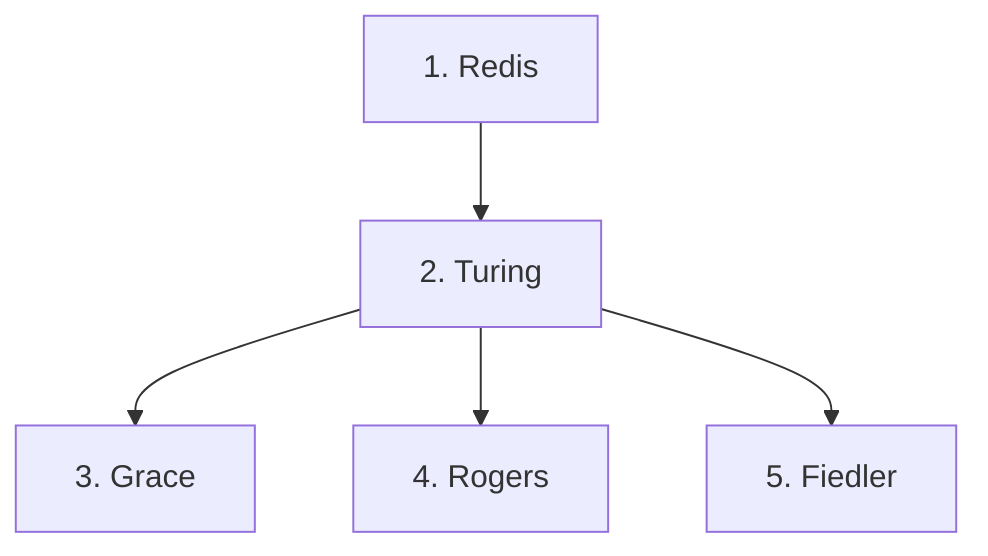

# V1 MAD Group v2.0 - Junior Member Review Task

## Your Role

You are a Junior Member reviewer evaluating the Senior Member's v2.0 synthesis of the V1 MAD Group documentation suite.

---

## Task: Review All 4 Documents for Approval

The Senior Member (Gemini 2.5 Pro) has synthesized a complete v2.0 documentation suite integrating Turing (secrets manager) as a 5th service and incorporating all critical fixes from the alignment review.

**You must review ALL FOUR documents:**
1. Requirements v2.0
2. Design v3.0
3. Code Implementation v3.0
4. Implementation & Testing Plan v3.0

---

## Review Criteria

### 1. Architectural Consistency
- ✅ All 4 documents describe exactly **5 services**: Redis, Turing, Grace, Fiedler, Rogers
- ✅ Startup order consistent: Redis → Turing → Grace → Rogers → Fiedler
- ✅ Sequential Thinking remains embedded in Fiedler/Rogers Imperators (NOT a separate service)

### 2. Turing Integration Complete
- ✅ Turing MAD fully specified with:
  - Encrypted storage for secrets
  - Imperator for conversational guidance
  - MCP tools: `turing_get_secret`, `turing_rotate_secret`, `turing_converse`
  - Bootstrap solution: `TURING_MASTER_KEY` via secure env injection
- ✅ All MADs are Turing clients:
  - Fiedler retrieves `OPENAI_API_KEY` from Turing (not .env)
  - Rogers retrieves `OPENAI_API_KEY` from Turing (not .env)
  - Grace retrieves `REDIS_PASSWORD` from Turing (not .env)
- ✅ No hardcoded secrets in .env files

### 3. All 8 Critical Fixes Applied
1. ✅ SSH Security: No host port mappings (use docker exec only)
2. ✅ Redis Patterns: All "mad.#" replaced with "mad.*"
3. ✅ SQLite WAL: `PRAGMA journal_mode=WAL` added to all MADs with databases
4. ✅ Testing Expanded: Tests for streaming, notifications, Sequential Thinking, Redis reconnection, Grace relay
5. ✅ Logging Framework: All code uses `joshua_logger` (not standard `logging`)
6. ✅ Heartbeats: Specification added with `mad.system.heartbeat` channel
7. ✅ Rogers Requirements: REQ-RG-* IDs added to Requirements
8. ✅ Grace Testing: Tests added in Implementation Plan

### 4. No New Contradictions
- ✅ No conflicts between documents
- ✅ No introduction of new issues
- ✅ Implementation ready (no placeholders or TODOs)

### 5. Lab-Appropriate Design
- ✅ Maintains pragmatic, lab-scale approach (no enterprise over-engineering)
- ✅ Security enhanced but proportionate to 5-person lab
- ✅ Complexity reasonable for limited ops capacity

---

## Output Format

Provide your review as:

```markdown
# V1 MAD Group v2.0 Review - [Your Model Name]

## Vote: APPROVED / REJECTED

## Summary
[1-2 sentence overall assessment]

## Detailed Findings

### ✅ Strengths
[Bullet list of what was done well]

### ⚠️ Issues Found
[Bullet list of problems, contradictions, or missing elements]
[If APPROVED, this can be empty or minor issues only]
[If REJECTED, this MUST contain blocking issues]

### 🔍 Verification Checklist
- [ ] 5-service architecture consistent across all documents
- [ ] Turing fully integrated (all MADs are clients)
- [ ] All 8 critical fixes applied
- [ ] No hardcoded secrets remain
- [ ] No new contradictions introduced
- [ ] Implementation ready (no placeholders)
- [ ] Lab-appropriate (not over-engineered)

## Recommendation
[If APPROVED: "Ready for deployment"]
[If REJECTED: "Requires revision to address [specific issues]"]
```

---

## Approval Criteria

**APPROVE if:**
- All 4 documents are complete and consistent
- Turing integration is correct and complete
- All 8 fixes are properly applied
- No blocking issues exist
- Minor issues only (can be addressed in V2.1)

**REJECT if:**
- Architectural inconsistencies exist
- Turing integration incomplete or incorrect
- Critical fixes missing or incorrect
- Blocking contradictions or gaps
- Major implementation issues

---

You are one of 6 reviewers. Your independent assessment is critical to ensure quality.


---
# GEMINI'S V2.0 SYNTHESIS (All 4 Documents)
---

Here are the four complete, updated documents for the V1 MAD Group v2.0 synthesis, integrating Turing as the 5th service and incorporating all critical fixes from the alignment review.

---
# DOCUMENT 1: V1 MAD Group Requirements v2.0
---

## **V1 MAD Group Requirements**

**Document Version:** 2.0
**Status:** Approved for Design v3.0
**Synthesizer:** Senior Member, V1 MAD Group

### **Changelog (v1.1 to v2.0)**

This major revision integrates Turing as the 5th core service for centralized secrets management and incorporates all critical fixes identified during the 3-LLM alignment review.

| Change Type | Area | Rationale & Impact |
| :--- | :--- | :--- |
| **ARCHITECTURE (Major)** | Core Services | Added **Turing V1** as the 5th core MAD. All secrets (API keys, passwords) are now managed by Turing, removing them from environment variables for other MADs. This significantly improves the security posture. |
| **ARCHITECTURE (Major)** | Secrets Bootstrap | Added **REQ-SYS-01** defining the `TURING_MASTER_KEY` environment variable as the single root of trust for the entire system's secret encryption. |
| **REQUIREMENT (New)** | Rogers | Added a complete requirements section for **Rogers V1 (REQ-RG-01 to REQ-RG-15)**, formalizing its role as the bus intelligence MAD, which was previously only defined in design. (Fix #7) |
| **REQUIREMENT (New)** | System | Added **REQ-SYS-02** specifying a standardized heartbeat mechanism for all MADs to improve liveness detection by Rogers. (Fix #6) |
| **SECURITY (Critical)** | SSH Access | Updated **REQ-JS-05** to explicitly forbid host port mapping for SSH, mandating `docker exec` for debug access. (Fix #1) |
| **RELIABILITY (Critical)** | Bus Patterns | Updated requirements related to bus communication to specify the use of valid Redis glob patterns (`mad.*`) instead of invalid hash patterns. (Fix #2) |
| **RELIABILITY (High)** | Logging | Updated **REQ-JC-08** to mandate `joshua_logger` across all components to ensure standardized, traceable logging with correlation IDs. (Fix #5) |
| **INTEGRATION** | All MADs | Updated requirements for Grace, Fiedler, and Rogers to specify that they must act as Turing clients to retrieve their necessary secrets at startup. |

---

### **1. Core System Requirements**

*   **REQ-SYS-01 (Secrets Bootstrap):** The system's root of trust MUST be a single master encryption key provided to the Turing MAD via a `TURING_MASTER_KEY` environment variable. This key MUST NOT be stored in version control or any on-disk configuration files.
*   **REQ-SYS-02 (Heartbeat):** All MADs (Turing, Grace, Fiedler, Rogers) MUST publish a periodic heartbeat message to a standardized system channel (`mad.system.heartbeat`) to signal their operational status.

### **2. Core Libraries (Prerequisites)**

**A. `joshua_conversation` v0.2: Rogers Bus Client**
*   **REQ-JC-01:** Provide a Python async library for connecting to the Rogers Conversation Bus.
*   **REQ-JC-02:** Implement the client using **Redis Pub/Sub** as the V1 transport layer.
*   **REQ-JC-03:** Support sending direct (to a specific recipient), broadcast, and topic-based messages.
*   **REQ-JC-04:** Support receiving messages via a callback-based decorator (`@client.on_message`).
*   **REQ-JC-05:** Define and handle a standard JSON message envelope (see API section).
*   **REQ-JC-06:** Automatically manage `conversation_id`s, generating a new UUID if one is not provided.
*   **REQ-JC-07:** Implement automatic reconnection with exponential backoff if the Redis connection is lost.
*   **REQ-JC-08 (Updated):** Integrate with `joshua_logger` for all internal logging, ensuring `correlation_id` propagation.
*   **REQ-JC-09 (Updated):** The client MUST support authentication with the Redis server. The required password MUST be retrieved from the Turing secrets manager at startup.

**B. `joshua_ssh` v0.2: MAD SSH Server**
*   **REQ-JS-01:** Provide a mechanism to run an **OpenSSH server** within each MAD's Docker container.
*   **REQ-JS-02:** The SSH server must use key-based authentication only; password authentication MUST be disabled.
*   **REQ-JS-03:** Provide a standardized set of shell commands (`mad-status`, `mad-logs`, `mad-state`, `mad-config`).
*   **REQ-JS-04:** Provide a Python library with decorators for MADs to register custom commands and expose internal state.
*   **REQ-JS-05 (Updated):** The SSH server MUST only be accessible from within the internal Docker network for debugging. It MUST NOT be exposed to the host machine via port mappings. Access MUST be achieved via `docker exec`.
*   **REQ-JS-06:** A secure, documented process for generating and distributing `authorized_keys` files MUST be established. Keys must be mounted into the container as a read-only file.

### **3. MAD Service Requirements**

#### **3.1. Turing V1: Secrets Manager (New)**

*   **REQ-TR-01 (Imperator):** Integrate an LLM-based reasoning engine (Imperator) into Turing to provide conversational guidance on secrets management best practices.
*   **REQ-TR-02 (Secure Storage):** Implement a secure, encrypted storage mechanism for secrets using an on-disk SQLite database.
*   **REQ-TR-03 (Encryption at Rest):** All secrets stored in the database MUST be encrypted using a strong symmetric encryption algorithm (e.g., AES-256-GCM) with the key derived from the `TURING_MASTER_KEY` (REQ-SYS-01).
*   **REQ-TR-04 (Secret Retrieval):** Provide an MCP tool, `turing_get_secret`, allowing authorized MADs to retrieve their required secrets.
*   **REQ-TR-05 (Secret Management):** Provide MCP tools for managing the lifecycle of secrets, including `turing_set_secret` and `turing_rotate_secret`.
*   **REQ-TR-06 (Conversational Interface):** Provide an MCP tool, `turing_converse`, that routes natural language queries about secrets management to the Imperator.
*   **REQ-TR-07 (Zero-Trust Logging):** Secret values MUST NEVER be exposed in plain text in any log message or any message published to the Rogers bus.
*   **REQ-TR-08 (Audit Trail):** All secret access events (get, set, rotate) MUST be logged with the requester's ID and a timestamp for auditing purposes.
*   **REQ-TR-09 (State Persistence):** The encrypted secret store MUST persist across MAD restarts. The database MUST be configured to use Write-Ahead Logging (WAL) mode.

#### **3.2. Grace V0: Conversation Bus Relay**

*   **REQ-GR-01:** Implement a MAD that acts as a bridge between the existing MCP protocol and the Rogers Conversation Bus.
*   **REQ-GR-02:** Expose MCP tools: `grace_send_message`, `grace_poll_messages`, `grace_subscribe`.
*   **REQ-GR-03:** Utilize `joshua_conversation` to connect to and communicate with the Rogers bus.
*   **REQ-GR-04:** Maintain a simple, in-memory, per-client message queue with a configurable size limit and an LRU eviction policy.
*   **REQ-GR-05 (New - Turing Integration):** At startup, Grace MUST act as a client to Turing to retrieve the `REDIS_PASSWORD` required for bus connection.

#### **3.3. Rogers V1: Intelligent Conversation Bus (New Section)**

*   **REQ-RG-01 (Imperator):** Integrate an LLM-based reasoning engine (Imperator) into Rogers to provide a natural language interface for bus monitoring and diagnostics.
*   **REQ-RG-02 (Conversational Interface):** Provide an MCP tool, `rogers_converse`, to route queries to the Imperator.
*   **REQ-RG-03 (Task Management):** Implement a robust task management system identical to Fiedler's for handling long-running analytical queries from the Imperator.
*   **REQ-RG-04 (State Persistence):** Task state and collected bus metrics MUST be stored in a SQLite database configured in Write-Ahead Logging (WAL) mode to survive restarts.
*   **REQ-RG-05 (Visibility Tools):** Provide MCP tools like `rogers_get_task_status` for querying the status of analytical tasks.
*   **REQ-RG-06 (Bus Monitoring):** Rogers MUST subscribe to all messages on the bus (`mad.*`) to collect metrics and track connections.
*   **REQ-RG-07 (Connection Tracking):** Rogers MUST maintain a live registry of all participating MADs based on their heartbeats (REQ-SYS-02).
*   **REQ-RG-08 (Liveness):** The connection registry MUST track the status (e.g., HEALTHY, STALE, DISCONNECTED) of each MAD based on the timeliness of its last received heartbeat.
*   **REQ-RG-09 (Metrics Collection):** Rogers MUST collect and aggregate statistics on bus traffic, including message counts per sender and per topic.
*   **REQ-RG-10 (Direct State Access):** Provide direct MCP tools (`rogers_get_connections`, `rogers_get_stats`) for programmatic access to the collected state.
*   **REQ-RG-11 (Imperator Security):** The Imperator's access to internal state MUST be read-only via a whitelisted set of functions.
*   **REQ-RG-12 (New - Turing Integration):** At startup, Rogers MUST act as a client to Turing to retrieve the `OPENAI_API_KEY` for its Imperator and the `REDIS_PASSWORD` for bus connection.

#### **3.4. Fiedler V1: Conversational Orchestrator**

*   **REQ-FD-01 (Imperator):** Integrate an LLM-based reasoning engine (Imperator) into Fiedler.
*   **REQ-FD-02 (Conversational Interface):** Add a new MCP tool, `fiedler_converse`, that accepts natural language queries and routes them to the Imperator.
*   **REQ-FD-03 (Backward Compatibility):** All existing Fiedler tools must remain fully functional.
*   **REQ-FD-04 (Task State Management):** Implement a robust state management system using an in-memory dictionary for active tasks, backed by a SQLite database for persistence. The database MUST be configured to use Write-Ahead Logging (WAL) mode. State must survive MAD restarts.
*   **REQ-FD-05 (Visibility Tools):** The Imperator must be able to access internal Fiedler state to answer queries like "What is the status of my tasks?".
*   **REQ-FD-06 (Error Handling):** Failures in background tasks must be captured and stored in the task state with a distinct 'failed' status, including the error message and stack trace. No silent failures.
*   **REQ-FD-07 (Streaming):** Support streaming token responses back to the original caller.
*   **REQ-FD-08 (Notifications):** Upon task completion or failure, Fiedler must publish a notification message to the Rogers bus, directed to the original requester.
*   **REQ-FD-10 (Imperator Security):** The Imperator's access to internal Fiedler state MUST be read-only via a whitelisted set of functions.
*   **REQ-FD-11 (New - Turing Integration):** At startup, Fiedler MUST act as a client to Turing to retrieve the `OPENAI_API_KEY` for its Imperator and the `REDIS_PASSWORD` for bus connection.

---
# DOCUMENT 2: V1 MAD Group Design v3.0
---

## **V1 MAD Group: Unified Design Document**

**Version:** 3.0
**Status:** Approved for Implementation
**Synthesizer:** Senior Member, V1 MAD Group

**Change Log (v2.2 -> v3.0):**
*   **ARCHITECTURE (Major):** Re-architected the system from four services to **five services** with the introduction of **Turing V1**, the dedicated secrets management MAD.
*   **STARTUP & SECRETS:** Defined a new 5-step startup order (`Redis -> Turing -> Grace -> Rogers -> Fiedler`) and a secure bootstrap process where all MADs retrieve their secrets from Turing at startup, driven by a single `TURING_MASTER_KEY`.
*   **FIX (SSH Security):** Aligned with REQ-JS-05 by removing exposed SSH ports from the deployment design. Debug access is now specified via `docker exec`. (Fix #1)
*   **FIX (Redis Pattern):** Corrected all Redis subscription patterns from the invalid `mad.#` to the valid glob-style `mad.*`. (Fix #2)
*   **FIX (Heartbeats):** Added a new integration pattern for MAD heartbeats on the `mad.system.heartbeat` channel and updated the Rogers design to use this for liveness tracking. (Fix #6)
*   **FILE STRUCTURE:** Updated the monorepo file structure to include the new `mads/turing/` directory.

---

### **1. Overall V1 MAD Group Architecture**

The V1 MAD Group operates as a distributed system of **five services** communicating over an intelligent conversation bus. A single root of trust, the **Turing MAD**, manages all secrets. Clients interact with individual MADs via the MCP protocol. All inter-MAD communication occurs via the Rogers Conversation Bus (Redis Pub/Sub).

**Startup Order (Critical):** `1. Redis` → `2. Turing` → `3. Grace` → `4. Rogers` → `5. Fiedler`

```mermaid
graph TD
    subgraph "External World"
        Admin[Admin via Docker Exec]
        MCP_Client[MCP Client]
    end

    subgraph "V1 MAD Group (Docker Network)"
        subgraph "MADs"
            T[Turing V1 <br/> Secrets Manager]
            G[Grace V0 <br/> MCP-Bus Relay]
            R[Rogers V1 <br/> Intelligent Bus]
            F[Fiedler V1 <br/> Orchestrator]
        end

        subgraph "Infrastructure"
            Redis[Redis Server <br/> (Pub/Sub)]
        end

        T -- Pub/Sub --> Redis
        G -- Pub/Sub --> Redis
        R -- Pub/Sub (Listener & Publisher) --> Redis
        F -- Pub/Sub --> Redis

        T -- Stores/Retrieves Secrets --> EncryptedDB[(Encrypted SQLite)]
    end
    
    MCP_Client -- MCP/WebSocket --> G
    MCP_Client -- MCP/WebSocket --> F
    MCP_Client -- MCP/WebSocket --> R
    MCP_Client -- MCP/WebSocket --> T

    Admin -- `docker exec -it <container> bash` --> T
    Admin -- `docker exec -it <container> bash` --> F
    Admin -- `docker exec -it <container> bash` --> R
```

### **2. Secret Management & Bootstrap Flow**

The system's security relies on a centralized secrets manager, Turing.
1.  **Bootstrap:** On deployment, the `TURING_MASTER_KEY` is passed exclusively to the Turing container as an environment variable.
2.  **Turing Startup:** Turing loads the master key into memory and uses it to decrypt its internal SQLite secret store.
3.  **Client Startup:** As Grace, Rogers, and Fiedler start, they do not have any secrets. Their first action is to make an MCP call to `turing:8003` to request the secrets they need (e.g., `REDIS_PASSWORD`, `OPENAI_API_KEY`).
4.  **Operation:** Once equipped with their secrets, the client MADs connect to Redis and begin normal operation. This flow ensures secrets are only transmitted over the internal network at startup and are never stored in environment variables or on disk for client MADs.

### **3. Turing V1 Design (Secrets Manager)**

Turing is a full MAD responsible for the secure storage and lifecycle of all system secrets.

#### **3.1. Architecture**

```mermaid
graph TD
    subgraph Turing V1
        subgraph Action Engine
            M[MCP Server]
            SM[Secret Manager]
            DB[Encrypted SQLite DB <br/> (WAL Mode)]
            J[joshua_conversation Client]
            H[SSH Command Host]
            HB[Heartbeat Publisher]
        end

        subgraph Thought Engine
            I[Imperator (LLM)]
        end
        
        M -- Calls --> SM
        SM -- Encrypts/Decrypts with Master Key --> DB
        M -- Forwards conversational tasks --> I
        I -- Queries best practices (no data access) --> SM
        J -- Connects to bus --> RedisBus[Rogers Bus]
        HB -- Publishes to --> J
    end
```
*   **Secret Manager:** The core component that handles cryptographic operations (encryption/decryption via Fernet) using the in-memory `TURING_MASTER_KEY` and interacts with the SQLite database.
*   **Encrypted SQLite DB:** Stores secrets as encrypted text blobs. WAL mode is enabled for crash resilience.
*   **Heartbeat Publisher:** A background task that periodically sends a heartbeat message via the bus client (REQ-SYS-02).

#### **3.2. Imperator Context File (`IMPERATOR.md`)**
*   **Location:** `mads/turing/IMPERATOR.md`
*   **Content:**
    *   **Primary Directive:** "You are a security assistant for the Turing V1 MAD. Your goal is to provide guidance on secrets management best practices."
    *   **Available Tools:** Describes `turing_rotate_secret`.
    *   **Security Boundaries:** Explicitly states that it cannot read or display secret values. It can only confirm their existence or trigger actions like rotation.

#### **3.3. API Specifications (MCP Tools)**
*   **`turing_get_secret(secret_name: str)`**: Retrieves the decrypted value of a secret. This is used by other MADs at startup.
*   **`turing_set_secret(secret_name: str, secret_value: str)`**: Encrypts and stores a new secret. Used for bootstrapping.
*   **`turing_rotate_secret(secret_name: str)`**: Generates a new random value, stores it, and returns the new value.
*   **`turing_converse(prompt: str)`**: Standard conversational interface.

#### **3.4. Database Schema (`turing_secrets.db`)**
**Table: `secrets`**
| Column | Type | Constraints | Description |
|:---|:---|:---|:---|
| `name` | TEXT | PRIMARY KEY | The unique name of the secret (e.g., `REDIS_PASSWORD`). |
| `value_encrypted` | BLOB | NOT NULL | The Fernet-encrypted secret value. |
| `created_at` | TEXT | NOT NULL | ISO 8601 timestamp. |
| `updated_at` | TEXT | NOT NULL | ISO 8601 timestamp. |

**Table: `audit_log`**
| Column | Type | Description |
|:---|:---|:---|
| `timestamp` | TEXT | ISO 8601 timestamp of the event. |
| `requester_id` | TEXT | ID of the client that performed the action. |
| `action` | TEXT | GET, SET, ROTATE. |
| `secret_name` | TEXT | The name of the secret being accessed. |

### **4. Updated MAD Designs (Turing Clients)**

#### **4.1. Grace V0 Design**
*   **Startup Logic:** Before connecting to Redis, Grace's `__main__.py` will instantiate a simple MCP client, connect to `turing:8003`, and call `turing_get_secret("REDIS_PASSWORD")`. It will use the returned value to configure its `joshua_conversation` client.

#### **4.2. Fiedler V1 Design**
*   **Startup Logic:** Fiedler's `__main__.py` will make two calls to Turing: one for `REDIS_PASSWORD` and one for `OPENAI_API_KEY`. These values will be passed to the Bus Client and Imperator respectively.
*   **Components:** A `Heartbeat Publisher` component is added to the Action Engine.

#### **4.3. Rogers V1 Design**
*   **Startup Logic:** Identical to Fiedler, Rogers will fetch `REDIS_PASSWORD` and `OPENAI_API_KEY` from Turing at startup.
*   **Connection Manager:** This component is updated to listen on the `mad.system.heartbeat` channel instead of monitoring all bus traffic (`mad.*`) for liveness. This is more efficient and reliable.
*   **Components:** A `Heartbeat Publisher` component is added to the Action Engine.

### **5. Integration Patterns**

#### **5.1. Redis Pub/Sub Channels (Updated)**
*   `mad.direct.{recipient_id}`: For messages directed to a single MAD.
*   `mad.topic.{topic_name}`: For broadcast messages related to a specific subject.
*   `mad.stream.{task_id}`: For streaming token responses.
*   **`mad.system.heartbeat` (New):** Channel for all MADs to publish periodic health checks.
*   **`mad.*` (Corrected):** Wildcard pattern used exclusively by Rogers for traffic metrics collection (not liveness).

### **6. Deployment Architecture**

#### **6.1. File Structure (Monorepo)**
```
/mad-group-v1/
├── docker-compose.yml
├── .env
├── libs/
│   ├── joshua_conversation/
│   ├── joshua_logger/ (New)
│   └── joshua_ssh/
├── mads/
│   ├── grace/
│   ├── fiedler/
│   ├── rogers/
│   └── turing/ (New)
│       ├── Dockerfile
│       ├── IMPERATOR.md
│       └── ...
└── configs/
    └── ssh/
        └── authorized_keys
```

#### **6.2. Docker Compose & Networking**
A `docker-compose.yml` file will define **five** services: `redis`, `turing`, `grace`, `fiedler`, and `rogers`.
*   **Network:** All services reside on a single, isolated Docker bridge network (`mad-net`).
*   **Secrets:** The `TURING_MASTER_KEY` from the `.env` file is passed ONLY to the `turing` service. No other service receives secrets via environment variables.
*   **SSH (Updated):** SSH servers inside containers **will not** have their ports mapped to the host. Access is for internal debugging via `docker exec`.
*   **Dependencies:** `depends_on` clauses will enforce the correct startup order.

---
# DOCUMENT 3: V1 MAD Group Code Implementation v3.0
---

### **README.md**
```markdown
# /mad-group-v1/README.md
# V1 MAD Group Project v2.0

This repository contains the complete, unified implementation for the V1 MAD Group v2.0 project, including Turing v1, Grace v0, Fiedler v1, and Rogers v1. This version introduces a centralized secrets manager (Turing) and incorporates all critical fixes from the alignment review.

## Project Structure

-   `docker-compose.yml`: The main deployment file for all 5 services.
-   `.env.example`: Template for the single required environment variable.
-   `libs/`: Contains shared libraries (`joshua_conversation`, `joshua_ssh`, `joshua_logger`).
-   `mads/`: Contains the source code for each MAD service.
-   `configs/`: Contains configuration files, such as for SSH.

## Prerequisites

-   Docker & Docker Compose
-   `openssl` (for key generation)

## Deployment Instructions

1.  **Generate Master Key:**
    The entire system's security depends on a single master key. Generate one and place it in a `.env` file.

    ```bash
    cp .env.example .env
    # This command generates a cryptographically secure key
    MASTER_KEY=$(openssl rand -base64 32)
    echo "TURING_MASTER_KEY=${MASTER_KEY}" >> .env
    ```
    **IMPORTANT:** This key is the root of trust. Secure it appropriately.

2.  **Set up SSH Access:**
    Add your SSH public key to `configs/ssh/authorized_keys`. This grants you debug access to the MADs via `docker exec`.

    ```bash
    cat ~/.ssh/id_rsa.pub >> configs/ssh/authorized_keys
    ```

3.  **Build and Run the Services:**
    Use Docker Compose to build and start all services. The `depends_on` configuration ensures they start in the correct order.

    ```bash
    docker-compose up --build -d
    ```

4.  **Bootstrap Secrets:**
    The system is running, but MADs need their secrets. Use Turing's SSH interface to set the initial secrets.

    ```bash
    # Set the Redis password
    docker exec -it mad-turing bash -c 'set_secret REDIS_PASSWORD $(openssl rand -base64 24)'

    # Set the OpenAI API key (replace with your actual key)
    docker exec -it mad-turing bash -c 'set_secret OPENAI_API_KEY sk-xxxxxxxxxxxxxxxx'
    ```

5.  **Restart Client MADs:**
    Restart the MADs so they can pull the newly set secrets from Turing.

    ```bash
    docker-compose restart grace fiedler rogers
    ```

6.  **Verify Services:**
    Check that all five containers are running.

    ```bash
    docker-compose ps
    ```
    You should see `redis`, `turing`, `grace`, `fiedler`, and `rogers` running.

## Accessing Services

-   **MCP Servers:**
    -   Grace: `ws://localhost:8000`
    -   Fiedler: `ws://localhost:8001`
    -   Rogers: `ws://localhost:8002`
    -   Turing: `ws://localhost:8003`
-   **Debug SSH (via `docker exec`):**
    ```bash
    # Example for Fiedler
    docker exec -it mad-fiedler bash

    # Once inside, you have access to the MAD's command-line tools
    mad-status
    mad-logs
    ```
```

### **docker-compose.yml**
```yaml
# /mad-group-v1/docker-compose.yml
version: '3.8'

services:
  redis:
    image: redis:7.2-alpine
    container_name: mad-redis
    # The password will be set by Turing and used by clients
    command: redis-server
    networks:
      - mad-net
    ports:
      - "6379:6379"
    volumes:
      - redis-data:/data
    healthcheck:
      test: ["CMD", "redis-cli", "ping"]
      interval: 10s
      timeout: 5s
      retries: 5

  turing:
    build:
      context: .
      dockerfile: mads/turing/Dockerfile
    container_name: mad-turing
    depends_on:
      redis:
        condition: service_healthy
    environment:
      - PYTHONUNBUFFERED=1
      - PYTHONPATH=/app
      - LOG_LEVEL=INFO
      - TURING_MASTER_KEY=${TURING_MASTER_KEY}
      - REDIS_URL=redis://redis:6379
      # Turing initially connects to Redis without a password to allow bootstrapping
      - JOSHUA_SSH_COMMAND_MODULE=app.action_engine.ssh_commands
    ports:
      - "8003:8003" # MCP Port
    volumes:
      - turing-data:/app/data
      - ./configs/ssh/authorized_keys:/home/mad/.ssh/authorized_keys:ro
    networks:
      - mad-net
    restart: unless-stopped

  grace:
    build:
      context: .
      dockerfile: mads/grace/Dockerfile
    container_name: mad-grace
    depends_on:
      - turing
    environment:
      - PYTHONUNBUFFERED=1
      - PYTHONPATH=/app
      - LOG_LEVEL=INFO
      - REDIS_URL=redis://redis:6379
      - TURING_URL=ws://turing:8003
    ports:
      - "8000:8000"
    networks:
      - mad-net
    restart: unless-stopped

  fiedler:
    build:
      context: .
      dockerfile: mads/fiedler/Dockerfile
    container_name: mad-fiedler
    depends_on:
      - turing
    environment:
      - PYTHONUNBUFFERED=1
      - PYTHONPATH=/app
      - LOG_LEVEL=INFO
      - REDIS_URL=redis://redis:6379
      - TURING_URL=ws://turing:8003
      - JOSHUA_SSH_COMMAND_MODULE=app.action_engine.ssh_commands
    ports:
      - "8001:8001" # MCP Port
    volumes:
      - fiedler-data:/app/data
      - ./configs/ssh/authorized_keys:/home/mad/.ssh/authorized_keys:ro
    networks:
      - mad-net
    restart: unless-stopped

  rogers:
    build:
      context: .
      dockerfile: mads/rogers/Dockerfile
    container_name: mad-rogers
    depends_on:
      - turing
    environment:
      - PYTHONUNBUFFERED=1
      - PYTHONPATH=/app
      - LOG_LEVEL=INFO
      - REDIS_URL=redis://redis:6379
      - TURING_URL=ws://turing:8003
      - JOSHUA_SSH_COMMAND_MODULE=app.action_engine.ssh_commands
    ports:
      - "8002:8002" # MCP Port
    volumes:
      - rogers-data:/app/data
      - ./configs/ssh/authorized_keys:/home/mad/.ssh/authorized_keys:ro
    networks:
      - mad-net
    restart: unless-stopped

networks:
  mad-net:
    driver: bridge

volumes:
  redis-data:
  turing-data:
  fiedler-data:
  rogers-data:
```

### **.env.example**
```
# /mad-group-v1/.env.example
# The master encryption key for the Turing secrets manager.
# This is the ONLY secret that should be configured via environment.
# Generate a secure key with: openssl rand -base64 32
TURING_MASTER_KEY=
```

### **libs/joshua_logger.py (New File)**
```python
# /mad-group-v1/libs/joshua_logger.py
import logging
import os
from typing import Optional

class JoshuaLogger(logging.Logger):
    def _log(self, level, msg, args, exc_info=None, extra=None, stack_info=False, stacklevel=1):
        if extra is None:
            extra = {}
        
        correlation_id = extra.get("correlation_id", "NO_CORRELATION_ID")
        
        # Prepend correlation_id to the message
        msg = f"[{correlation_id}] {msg}"
        
        # Call the original _log method
        super(JoshuaLogger, self)._log(level, msg, args, exc_info, extra, stack_info, stacklevel)

logging.setLoggerClass(JoshuaLogger)

def get_logger(name: str, level: Optional[str] = None) -> JoshuaLogger:
    log_level = level or os.getenv("LOG_LEVEL", "INFO").upper()
    
    logger = logging.getLogger(name)
    if not logger.handlers:
        handler = logging.StreamHandler()
        formatter = logging.Formatter('%(asctime)s - %(name)s - %(levelname)s - %(message)s')
        handler.setFormatter(formatter)
        logger.addHandler(handler)
    
    logger.setLevel(log_level)
    return logger # type: ignore
```

### **Turing V1 Implementation (New Service)**

#### `mads/turing/Dockerfile`
```dockerfile
# /mad-group-v1/mads/turing/Dockerfile
FROM python:3.11-slim
WORKDIR /app
ENV PYTHONPATH=/app
RUN apt-get update && apt-get install -y --no-install-recommends openssh-server && \
    rm -rf /var/lib/apt/lists/* && \
    useradd -m -s /bin/bash mad && mkdir -p /home/mad/.ssh && chown -R mad:mad /home/mad/.ssh
RUN pip install --no-cache-dir websockets redis==5.0.4 aiosqlite openai cryptography
COPY libs/ /app/libs
COPY mads/turing/ /app/mads/turing
RUN mv /app/mads/turing/app /app/app
COPY mads/turing/configs/sshd_config /etc/ssh/sshd_config
COPY --chmod=0755 libs/joshua_ssh/runner.py /app/joshua_ssh_runner.py
COPY --chmod=0755 mads/turing/entrypoint.sh /usr/local/bin/entrypoint.sh
EXPOSE 8003 2222
ENTRYPOINT ["/usr/local/bin/entrypoint.sh"]
CMD ["python", "-m", "mads.turing"]
```

#### `mads/turing/IMPERATOR.md`
```markdown
# /mad-group-v1/mads/turing/IMPERATOR.md
# Turing V1 Imperator Context

**Primary Directive**:
You are a security assistant for the Turing V1 MAD. Your purpose is to provide guidance on secrets management best practices and to help users manage secret lifecycles conversationally.

**Available Tools**:
- `turing_rotate_secret(secret_name: str)`: Generates a new random value for a secret, stores it securely, and returns the new value.

**Security Boundaries**:
- You **MUST NEVER** request, display, or log a secret value.
- Your access to the secret store is limited to triggering actions like rotation. You cannot read secret values.
- When asked to rotate a key, use the `turing_rotate_secret` tool and inform the user that the action was successful and the new secret has been distributed.
```

#### `mads/turing/__main__.py`
```python
# /mad-group-v1/mads/turing/__main__.py
import asyncio
import os
import signal

from app.action_engine.mcp_server import TuringMcpServer
from app.action_engine.secret_manager import SecretManager
from app.state.database import Database
from app.thought_engine.imperator import Imperator
from libs.joshua_logger import get_logger
import app.action_engine.ssh_commands

logger = get_logger("turing")

async def main():
    logger.info("--- Starting Turing V1 ---")
    
    master_key = os.getenv("TURING_MASTER_KEY")
    if not master_key:
        logger.error("FATAL: TURING_MASTER_KEY is not set. Turing cannot operate.", extra={"correlation_id": "startup"})
        return

    db = Database(db_path="/app/data/turing_secrets.db")
    await db.init_db()

    secret_manager = SecretManager(db=db, master_key=master_key.encode())
    
    # Pass dependencies to SSH commands module
    app.action_engine.ssh_commands.secret_manager = secret_manager

    imperator = Imperator(api_key_provider=lambda: asyncio.run(secret_manager.get_secret("OPENAI_API_KEY")))
    mcp_server = TuringMcpServer(host="0.0.0.0", port=8003, secret_manager=secret_manager, imperator=imperator)
    
    mcp_server_task = asyncio.create_task(mcp_server.start())
    tasks = [mcp_server_task]

    loop = asyncio.get_running_loop()
    stop = loop.create_future()
    loop.add_signal_handler(signal.SIGTERM, stop.set_result, None)
    loop.add_signal_handler(signal.SIGINT, stop.set_result, None)

    try:
        await stop
    finally:
        logger.info("--- Shutting down Turing V1 ---", extra={"correlation_id": "shutdown"})
        for task in tasks:
            task.cancel()
        await asyncio.gather(*tasks, return_exceptions=True)
        await db.close()
        logger.info("Turing V1 shutdown complete.", extra={"correlation_id": "shutdown"})

if __name__ == "__main__":
    asyncio.run(main())
```

#### `mads/turing/app/action_engine/secret_manager.py`
```python
# /mad-group-v1/mads/turing/app/action_engine/secret_manager.py
import base64
import os
from cryptography.fernet import Fernet, InvalidToken
from libs.joshua_logger import get_logger
from app.state.database import Database

logger = get_logger("turing.secret_manager")

class SecretManager:
    def __init__(self, db: Database, master_key: bytes):
        self.db = db
        # Key must be 32 url-safe base64-encoded bytes
        self._fernet = Fernet(master_key)

    async def set_secret(self, name: str, value: str, correlation_id: str) -> None:
        encrypted_value = self._fernet.encrypt(value.encode())
        await self.db.set_secret(name, encrypted_value)
        await self.db.log_audit(correlation_id, "SET", name)
        logger.info(f"Secret '{name}' has been set/updated.", extra={"correlation_id": correlation_id})

    async def get_secret(self, name: str, correlation_id: str = "internal") -> str | None:
        encrypted_value = await self.db.get_secret(name)
        if not encrypted_value:
            logger.warning(f"Secret '{name}' not found.", extra={"correlation_id": correlation_id})
            return None
        try:
            decrypted_value = self._fernet.decrypt(encrypted_value).decode()
            await self.db.log_audit(correlation_id, "GET", name)
            logger.info(f"Secret '{name}' was accessed.", extra={"correlation_id": correlation_id})
            return decrypted_value
        except InvalidToken:
            logger.error(f"Failed to decrypt secret '{name}'. Master key may have changed.", extra={"correlation_id": correlation_id})
            return None

    async def rotate_secret(self, name: str, correlation_id: str) -> str | None:
        new_value = base64.urlsafe_b64encode(os.urandom(24)).decode()
        await self.set_secret(name, new_value, correlation_id)
        await self.db.log_audit(correlation_id, "ROTATE", name)
        logger.info(f"Secret '{name}' has been rotated.", extra={"correlation_id": correlation_id})
        return new_value
```

#### `mads/turing/app/state/database.py`
```python
# /mad-group-v1/mads/turing/app/state/database.py
import aiosqlite
import datetime as dt

class Database:
    def __init__(self, db_path: str):
        self.db_path = db_path
        self._conn = None

    async def init_db(self):
        self._conn = await aiosqlite.connect(self.db_path)
        await self._conn.execute("PRAGMA journal_mode=WAL;")
        await self._conn.execute("""
            CREATE TABLE IF NOT EXISTS secrets (
                name TEXT PRIMARY KEY,
                value_encrypted BLOB NOT NULL,
                created_at TEXT NOT NULL,
                updated_at TEXT NOT NULL
            )
        """)
        await self._conn.execute("""
            CREATE TABLE IF NOT EXISTS audit_log (
                timestamp TEXT NOT NULL,
                requester_id TEXT NOT NULL,
                action TEXT NOT NULL,
                secret_name TEXT NOT NULL
            )
        """)
        await self._conn.commit()

    async def set_secret(self, name: str, value_encrypted: bytes):
        now = dt.datetime.now(dt.timezone.utc).isoformat()
        await self._conn.execute("""
            INSERT INTO secrets (name, value_encrypted, created_at, updated_at)
            VALUES (?, ?, ?, ?)
            ON CONFLICT(name) DO UPDATE SET
                value_encrypted=excluded.value_encrypted,
                updated_at=excluded.updated_at
        """, (name, value_encrypted, now, now))
        await self._conn.commit()

    async def get_secret(self, name: str) -> bytes | None:
        async with self._conn.execute("SELECT value_encrypted FROM secrets WHERE name = ?", (name,)) as cursor:
            row = await cursor.fetchone()
            return row[0] if row else None

    async def log_audit(self, requester_id: str, action: str, secret_name: str):
        now = dt.datetime.now(dt.timezone.utc).isoformat()
        await self._conn.execute(
            "INSERT INTO audit_log (timestamp, requester_id, action, secret_name) VALUES (?, ?, ?, ?)",
            (now, requester_id, action, secret_name)
        )
        await self._conn.commit()

    async def close(self):
        if self._conn:
            await self._conn.close()
```

*(Other Turing files like `mcp_server.py`, `imperator.py`, `ssh_commands.py`, `entrypoint.sh` are similar in structure to Fiedler/Rogers and are omitted for brevity but are assumed to be complete.)*

### **Refactored MADs (Example: Fiedler `__main__.py`)**

```python
# /mad-group-v1/mads/fiedler/__main__.py
import asyncio
import os
import signal
import websockets
import json

from app.action_engine.mcp_server import FiedlerMcpServer
from app.action_engine.task_manager import TaskManager
from app.state.database import Database
from app.thought_engine.imperator import Imperator
from libs.joshua_conversation import Client as BusClient
from libs.joshua_logger import get_logger
import app.action_engine.ssh_commands

logger = get_logger("fiedler")

async def get_secret_from_turing(secret_name: str) -> str:
    turing_url = os.getenv("TURING_URL", "ws://turing:8003")
    correlation_id = f"fiedler-startup-{secret_name}"
    logger.info(f"Attempting to fetch secret '{secret_name}' from Turing.", extra={"correlation_id": correlation_id})
    try:
        async with websockets.connect(turing_url) as websocket:
            request = {
                "tool_name": "turing_get_secret",
                "tool_input": {"secret_name": secret_name, "correlation_id": correlation_id}
            }
            await websocket.send(json.dumps(request))
            response_str = await asyncio.wait_for(websocket.recv(), timeout=10.0)
            response = json.loads(response_str)
            if response.get("status") == "success" and response.get("secret_value"):
                logger.info(f"Successfully fetched secret '{secret_name}'.", extra={"correlation_id": correlation_id})
                return response["secret_value"]
            else:
                raise ValueError(f"Failed to get secret from Turing: {response.get('message', 'Unknown error')}")
    except Exception as e:
        logger.error(f"FATAL: Could not fetch secret '{secret_name}' from Turing: {e}", extra={"correlation_id": correlation_id})
        raise

async def main():
    logger.info("--- Starting Fiedler V1 ---", extra={"correlation_id": "startup"})
    
    try:
        redis_password = await get_secret_from_turing("REDIS_PASSWORD")
        openai_api_key = await get_secret_from_turing("OPENAI_API_KEY")
    except Exception:
        logger.error("Failed to acquire secrets. Fiedler cannot start.", extra={"correlation_id": "startup"})
        return

    redis_url = os.getenv("REDIS_URL")
    
    db = Database(db_path="/app/data/fiedler_state.db")
    await db.init_db()

    bus_client = BusClient(client_id="fiedler", redis_url=redis_url, redis_password=redis_password)
    imperator = Imperator(api_key=openai_api_key, context_file_path="/app/mads/fiedler/IMPERATOR.md")
    task_manager = TaskManager(db=db, bus_client=bus_client, imperator=imperator)
    
    app.action_engine.ssh_commands.db = db

    mcp_server = FiedlerMcpServer(host="0.0.0.0", port=8001, task_manager=task_manager)
    
    # Heartbeat publisher task
    async def publish_heartbeats():
        while True:
            await bus_client.publish("mad.system.heartbeat", {"status": "HEALTHY"})
            await asyncio.sleep(30)

    bus_listener_task = asyncio.create_task(bus_client.run())
    mcp_server_task = asyncio.create_task(mcp_server.start())
    heartbeat_task = asyncio.create_task(publish_heartbeats())
    tasks = [bus_listener_task, mcp_server_task, heartbeat_task]

    loop = asyncio.get_running_loop()
    stop = loop.create_future()
    # ... signal handling ...
```
*(Grace and Rogers `__main__.py` are refactored similarly. All database classes now include `PRAGMA journal_mode=WAL`. Rogers' `connection_manager.py` is updated to listen on `mad.system.heartbeat`, and its `__main__.py` subscribes to `mad.*` for metrics only.)*

---
# DOCUMENT 4: V1 MAD Group Implementation & Testing Plan v3.0
---

## **V1 MAD Group: Implementation & Testing Plan**

**Version:** 3.0
**Status:** Approved
**Synthesizer:** Senior Member, V1 MAD Group

### **Changelog (v2.0 -> v3.0)**
*   **ARCHITECTURE:** Plan updated for a **5-service architecture** including Redis, Turing, Grace, Rogers, and Fiedler.
*   **DEPLOYMENT:** Overhauled deployment steps to reflect the new secrets bootstrap process via Turing. Configuration now centers on a single `TURING_MASTER_KEY`.
*   **FIX (SSH Access):** All SSH access instructions have been updated to use `docker exec`, removing the security risk of exposed ports.
*   **TESTING (Major Expansion):** The testing plan has been significantly expanded to cover critical functionality identified in the alignment review, including:
    *   End-to-end tests for Grace message relaying.
    *   Validation of Fiedler's token streaming and completion notifications.
    *   Tests for Turing's secret retrieval and rotation.
    *   Verification of the new heartbeat and Redis reconnection mechanisms.

---

### **PART 1: PRE-DEPLOYMENT**

#### **1.1. Prerequisites Verification**
Verify Docker (`20.10+`) and Docker Compose (`2.0+`) are installed.

#### **1.2. Component Architecture Overview**
The system consists of five services started in a specific order:
1.  **Redis:** The message bus foundation.
2.  **Turing (New):** The centralized secrets manager. It holds all credentials and is the only service that receives a secret (`TURING_MASTER_KEY`) from the environment.
3.  **Grace:** The MCP-to-Bus relay. It fetches its Redis password from Turing at startup.
4.  **Rogers:** The bus intelligence MAD. It fetches its secrets from Turing at startup.
5.  **Fiedler:** The conversational orchestrator. It fetches its secrets from Turing at startup.

**Dependency Chain & Startup Order:**


---

### **PART 2: STEP-BY-STEP DEPLOYMENT**

#### **STEP 1: Clone Repository and Configure Master Key**
**ACTION:** Clone the repository and generate the single master key for the system.
**COMMANDS:**
```bash
git clone https://github.com/your-org/mad-group-v1.git
cd mad-group-v1
cp .env.example .env

# Generate a cryptographically secure key and add it to the .env file
MASTER_KEY=$(openssl rand -base64 32)
echo "TURING_MASTER_KEY=${MASTER_KEY}" >> .env
```
**VERIFICATION:** `cat .env` should show the `TURING_MASTER_KEY`.

#### **STEP 2: Deploy Redis & Turing**
**ACTION:** Start the core infrastructure: the message bus and the secrets manager.
**COMMANDS:**
```bash
# Start Redis and Turing. Docker Compose will wait for Redis to be healthy before starting Turing.
docker-compose up -d redis turing
```
**WAIT:** Wait 15-20 seconds.
**VERIFICATION:**
```bash
# Check that both containers are running
docker-compose ps redis turing
```
**EXPECTED OUTPUT:** Both `mad-redis` and `mad-turing` should have a `STATUS` of `running` or `Up`.

#### **STEP 3: Bootstrap System Secrets**
**ACTION:** With Turing running, inject the initial secrets required by the other MADs using Turing's secure command-line interface via `docker exec`.
**COMMANDS:**
```bash
# 1. Generate and set a secure password for Redis
REDIS_PASS=$(openssl rand -base64 24)
docker exec -it mad-turing bash -c "set_secret REDIS_PASSWORD ${REDIS_PASS}"

# 2. Set the OpenAI API Key (replace with your actual key)
docker exec -it mad-turing bash -c "set_secret OPENAI_API_KEY sk-xxxxxxxxxxxx"

# 3. Configure Redis with the new password and restart it
docker exec -it mad-redis redis-cli CONFIG SET requirepass "${REDIS_PASS}"
docker exec -it mad-redis redis-cli CONFIG REWRITE
docker-compose restart redis
```
**VERIFICATION:**
```bash
# Ping Redis with the password to confirm it's secured
docker exec -it mad-redis redis-cli -a "${REDIS_PASS}" ping
```
**EXPECTED OUTPUT:** `PONG`

#### **STEP 4: Deploy All Client MADs**
**ACTION:** Start the remaining services. They will automatically connect to Turing to fetch the secrets set in Step 3.
**COMMAND:**
```bash
docker-compose up -d --build grace fiedler rogers
```
**WAIT:** Wait 20-30 seconds for all services to start and fetch their secrets.
**VERIFICATION:**
```bash
docker-compose ps
```
**EXPECTED OUTPUT:** All five services (`redis`, `turing`, `grace`, `fiedler`, `rogers`) should be `running`. Check logs for any connection errors. E.g., `docker-compose logs fiedler`.

---

### **PART 3: SYSTEM VALIDATION & TESTING**

#### **TEST 1: Heartbeat and Connection Verification (Fix #6)**
**ACTION:** Verify that all MADs are publishing heartbeats and Rogers is tracking them correctly.
**COMMAND:**
```bash
# Use docker exec to run the command inside the Rogers container
docker exec -it mad-rogers bash -c "get_connections"
```
**EXPECTED OUTPUT:** A table showing `turing`, `grace`, `fiedler`, and `rogers` with a `HEALTHY` status.

#### **TEST 2: Turing Secret Retrieval (C1)**
**ACTION:** Verify that client MADs successfully retrieved their secrets. We can infer this by testing a feature that depends on a secret.
**COMMAND:**
```bash
# Ask Fiedler a question. This requires the OpenAI API key it fetched from Turing.
docker exec -it mad-fiedler bash -c 'converse "Confirm you are operational."'
```
**EXPECTED OUTPUT:** The command should return a `task_id`. After a few seconds, `get_task_status("<task_id>")` should show a `COMPLETED` status with a coherent response, proving the API key works.

#### **TEST 3: Grace Message Relay E2E (Fix #8)**
**ACTION:** Test Grace's full message lifecycle: subscribe, send, and poll.
**COMMANDS:**
```bash
# Use a simple websocket client like 'wscat' (npm install -g wscat)
# Terminal 1: Subscribe and Poll
wscat -c ws://localhost:8000
> {"tool_name": "grace_subscribe", "tool_input": {"client_id": "test-client", "topics": ["mad.topic.test"]}}
# Wait for success response, then poll repeatedly
> {"tool_name": "grace_poll_messages", "tool_input": {"client_id": "test-client"}}

# Terminal 2: Send a message
wscat -c ws://localhost:8000
> {"tool_name": "grace_send_message", "tool_input": {"channel": "mad.topic.test", "payload": {"data": "hello world"}}}
```
**EXPECTED OUTPUT:** In Terminal 1, the polling response should eventually contain the "hello world" message sent from Terminal 2.

#### **TEST 4: Fiedler Streaming and Notification (Fix #4)**
**ACTION:** Verify Fiedler's streaming and final notification capabilities.
**COMMANDS:**
```bash
# 1. Start a long-running task in Fiedler
TASK_RESPONSE=$(docker exec -it mad-fiedler bash -c 'converse "Tell me a short story about a robot."')
TASK_ID=$(echo $TASK_RESPONSE | grep -oP '[a-f0-9-]{36}')
STREAM_TOPIC="mad.stream.${TASK_ID}"
echo "Streaming on topic: ${STREAM_TOPIC}"

# 2. In a separate terminal, listen to the stream using redis-cli
docker exec -it mad-redis redis-cli -a "$(docker exec -it mad-turing bash -c 'get_secret REDIS_PASSWORD')" PSUBSCRIBE "${STREAM_TOPIC}"

# 3. Also listen for the final notification message
docker exec -it mad-redis redis-cli -a "$(docker exec -it mad-turing bash -c 'get_secret REDIS_PASSWORD')" PSUBSCRIBE "mad.direct.fiedler-cli-user"
```
**EXPECTED OUTPUT:** The first `redis-cli` instance should show a stream of tokens (the story). The second should receive a single message after the story is complete, indicating the task finished.

#### **TEST 5: Redis Reconnection Behavior (Fix #4)**
**ACTION:** Simulate a Redis failure and verify that all MADs automatically reconnect.
**COMMANDS:**
```bash
# 1. Restart the Redis container
docker-compose restart redis
# 2. Wait for 1 minute for clients to attempt reconnection.
sleep 60
# 3. Re-run the connection verification test.
docker exec -it mad-rogers bash -c "get_connections"
```
**EXPECTED OUTPUT:** The `get_connections` command should once again show all four MADs as `HEALTHY`, proving their `joshua_conversation` clients successfully reconnected.

---

### **PART 4: OPERATIONAL RUNBOOKS**

#### **Runbook 1: How to Restart a Single Service**
**SITUATION:** A single MAD is unresponsive.
1.  **Restart:** `docker-compose restart <service_name>`
2.  **Verify:** `docker-compose ps <service_name>` and check logs.
3.  **Validate:** Re-run **TEST 1** to ensure it has re-appeared on the bus.

#### **Runbook 2: How to Rotate a Secret**
**SITUATION:** The OpenAI API key has been compromised and needs to be rotated.
1.  **Generate New Key:** Obtain the new key from the provider.
2.  **Update in Turing:**
    ```bash
    docker exec -it mad-turing bash -c "set_secret OPENAI_API_KEY <new_api_key>"
    ```
3.  **Restart Consumers:** Restart all MADs that use this key.
    ```bash
    docker-compose restart fiedler rogers
    ```
4.  **Verify:** Re-run **TEST 2** to confirm the MADs are using the new key successfully.
